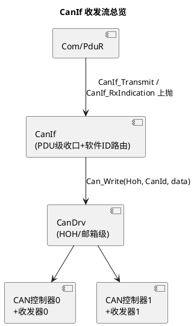
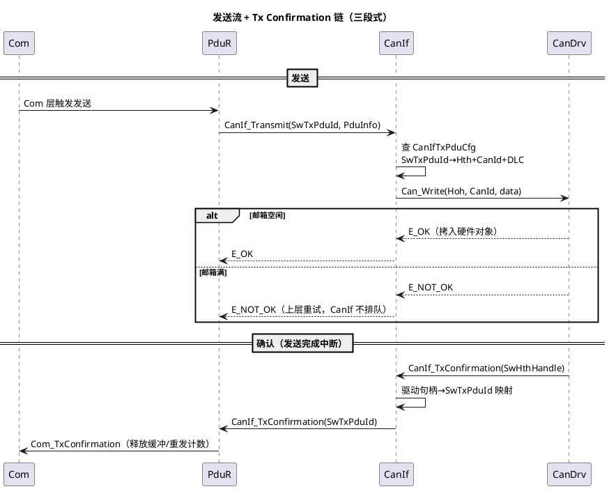

# 06-CanIf-LinIf

> 一句话定位：通讯栈的"硬件抽象收口层"——把 CanDrv/LinDrv 的多控制器、多硬件对象差异抹平，向上提供统一的 PDU 收发与确认接口；Hoh/Hth 映射、Tx Confirmation 断链这类"配置即死活"的问题都发生在这一层。
> 等级：L2 ｜ 前置：[01-Com](01-Com.md)、[CanDrv 接口契约](../../../04-MCAL与外设驱动/2-L2进阶/CanDrv与LinDrv/01-CanDrv接口契约.md)

## 原理

### CanIf 在栈中的位置与收发流

接收流是镜像：CanDrv 收到帧（中断）→ `CanIf_RxIndication(Hrh, CanId, data)` → CanIf 按 CanId 查 CanIfRxPduCfg 得 RxPduId → `PduR_LoIfRxIndication` → `Com_RxIndication`。

### HOH / Hth / Hrh：与 CanDrv 契约的衔接

CanDrv 暴露的是**硬件对象**（HOH，对应硬件邮箱组），CanIf 用 Hth（发送句柄）/Hrh（接收句柄）引用它们——这正是 [CanDrv 接口契约](../../../04-MCAL与外设驱动/2-L2进阶/CanDrv与LinDrv/01-CanDrv接口契约.md) 里"驱动层认句柄不认语义"的落点。CanIf 维护两级映射：

- **发送**：`SwTxPduId（Com/PduR 视角）→ Hth + CanId + DLC`（CanIfTxPduCfg）
- **接收**：`CanId（+Hrh）→ SwRxPduId`（CanIfRxPduCfg），软件过滤在 HOH 硬件滤波之后再兜一层

### CanIf 与控制器/收发器的对应

每个 CanIfCtrlCfg 条目把一个"逻辑控制器"钉死三方：CanDrv 的 CtrlId（驱动实例）、可选的 CanTrcv 通道（经 CanTrcvRef，详见 [07-CanTrcv](07-CanTrcv.md)）、以及该控制器上的 HOH 集合。CanSM 的模式操作（SetControllerMode/SetPduMode）经 CanIf 落到对应驱动；唤醒事件由 CanDrv → CanIf_CheckWakeup → EcuM 走验证流程。

### LinIf：同一岗位在 LIN 侧的形态

LinIf 收口 LinDrv，但多了**主机侧调度职责**：按 LinSM 请求的调度表逐槽发帧头、收集从机应答上抛（详见 [04-LinSM](04-LinSM.md)）；从机节点上 LinIf 则只做"应答帧头"。发送/确认/指示三段式与 CanIf 同构（LinIf_Transmit/LinIf_TxConfirmation/LinIf_RxIndication），上层同样经 PduR 对接 Com/LinTp。

## 详解

**CanIf 不排队**：SWS 语义下 CanIf 是"直通门"——Can_Write 返回 E_NOT_OK（邮箱满）就直接把失败还给上层；重试策略属于 Com（MDT/重发）或 CanTp（STmin 节流）。把"发送失败=CanIf 有 bug"的直觉丢掉，先查上层有没有处理 E_NOT_OK。

**Confirmation 是资源释放信号**：Com 的发送缓冲要等 Com_TxConfirmation 才认为"这帧真出去了"——确认链断（CanDrv 中断没挂、CanIf 映射缺）表现为：第一帧能发、之后永远发不出（Com 缓冲占死），这是经典排障指纹。

**PduMode 是闸门**：CanIf_SetPduMode(TX_OFFLINE) 时 CanIf_Transmit 直接拒绝，控制器可能完全正常——"控制器好的但就是发不出"先查 CanSM 有没有把 Pdu 模式放开。

**软件 ID 与驱动 ID 是两个世界**：SwTxPduId 是 ECU 配置内的全局编号（生成工具保证 Com/PduR/CanIf 三处一致）；Hoh/Hth 是驱动内部的句柄。两层 ID 任一处错位，现象分别是"数据源错帧"（上层错位）与"写不进邮箱"（驱动错位）。

## 配置层

| 配置项 | 含义 | 典型值 | 易错点 |
|---|---|---|---|
| CanIfCtrlCfg | 控制器三元绑定：CtrlId↔CanDrv 实例↔CanTrcvRef | 每路 CAN 一条 | 三方任一错位→操作落空、指示不来 |
| CanIfHthCfg（HOH 引用+优先级） | 发送硬件对象选择 | 每 HOH 一条 | 引用不存在的驱动 HOH→链接期/运行期错误 |
| CanIfTxPduCfg | SwTxPduId→(CanId, DLC, Hth) | 每发送 PDU 一条 | CanId/DLC 与矩阵不符→总线上帧错 |
| CanIfRxPduCfg | CanId(+Hrh)→SwRxPduId | 每接收 PDU 一条 | CanId 打错一位→静默丢帧 |
| 接收 DLC 检查（长度校验开关） | 实收 DLC<配置是否丢弃 | 按 OEM（常 true） | 关掉→Com 读到未初始化尾字节 |
| CanIfPublicTxConfirmation（确认使能） | 是否上抛 TxConfirmation | true | 误关→Com 缓冲占死只发一帧 |
| CanIfWakeupCfg | 唤醒事件验证路由 | 有唤醒需求必配 | 漏配→唤醒了但 EcuM 不启动验证 |
| LinIfScheduleTable / LinIfFrame | LIN 调度表与帧定义 | 与 LDF 一致 | 与 LDF 不同步→帧头/槽位错乱 |

## 易错点与陷阱

1. **Tx Confirmation 链断，只发得出第一帧**：现象是首帧正常、后续 Com 不再发；原因是 CanDrv 发送完成中断未挂或 CanIfPublicTxConfirmation 没开；对策：示波/计数确认驱动层完成事件，逐级核对 CanIf→PduR→Com 确认回调挂接。
2. **Hth 引用与驱动 HOH 配置漂移**：现象是 Can_Write 返回错误或帧从另一路 CAN 发出；原因是 CanDrv 侧重配 HOH 后 CanIf 引用没同步；对策：CanIf 与 CanDrv 配置一次生成、diff 必查 HOH 清单（契约细节见 [CanDrv 接口契约](../../../04-MCAL与外设驱动/2-L2进阶/CanDrv与LinDrv/01-CanDrv接口契约.md)）。
3. **接收静默丢帧**：现象是某 CanId 永远收不到、其他正常；原因是硬件滤波（HOH 范围）没盖住该 ID 或 CanIfRxPduCfg 的 CanId 写错；对策：用回环/调试钩子在 CanIf_RxIndication 入口计数，先判"驱动没收到"还是"CanIf 没路由"。
4. **PduMode 闸门当硬件故障修**：现象是控制器 STARTED、总线正常、就是发不出；原因是 CanSM 序列里 SetPduMode(TX_ONLINE) 没执行或被 NOCOM 又压回去；对策：查 CanSM 状态机日志，确认 PDU 模式与控制器模式都到位。
5. **DLC 尾巴脏数据**：现象是接收信号偶发跳变到非法值；原因是实收帧比配置短而长度检查关闭，Com 读了未初始化字节；对策：开启接收 DLC 检查，信号层加范围校验（见 [01-Com](01-Com.md) 失效值机制）。
6. **多控制器 ID 体系混用**：把 SwTxPduId 当 Hoh 句柄、或反之，现象是随机帧内容错乱；对策：认死两层命名——上层 PDU ID 配置态全局唯一，驱动句柄只在 CanIf↔CanDrv 边界出现。

## 面试高频题

- **Q：完整描述一次 CAN 发送链路。**
  A：Com 触发 → PduR 路由 → CanIf_Transmit(SwTxPduId)：查 CanIfTxPduCfg 得 Hth/CanId/DLC → Can_Write 写硬件对象（满则 E_NOT_OK 直返）→ 总线发送成功后驱动发完成中断 → CanIf_TxConfirmation（驱动句柄→SwTxPduId）→ PduR → Com_TxConfirmation 释放缓冲。
- **Q：CanIf 为什么不做发送排队？**
  A：它是抽象收口层不是策略层——排队会隐藏上层流量控制语义（Com 的 MDT/重发、CanTp 的 STmin），且每 PDU 一缓冲会放大 RAM 占用。失败直返让上层用自己的节流策略重试。
- **Q：Tx Confirmation 断了会怎样？为什么第一帧能发？**
  A：第一帧写入邮箱时 Com 缓冲还没被"确认占用"，发送本身不经确认链；之后 Com 等 Com_TxConfirmation 释放/推进缓冲，确认不来则状态机卡死，表现为只发一帧。排障从驱动完成中断往上层逐级查。
- **Q：CanIf 和 LinIf 的同与不同？**
  A：同：收发确认三段式、PDU 级抽象、经 PduR 对接上层；不同：LinIf 在主机侧还要执行调度表（逐槽发帧头、管理从机应答），CanIf 则面对多控制器/收发器绑定与硬件滤波路由。

## 延伸

- [CanDrv 接口契约](../../../04-MCAL与外设驱动/2-L2进阶/CanDrv与LinDrv/01-CanDrv接口契约.md)：HOH/Hth 的驱动侧定义；
- [与 CanIf-LinIf 集成](../../../04-MCAL与外设驱动/2-L2进阶/CanDrv与LinDrv/03-与CanIf-LinIf集成.md)：驱动与抽象层的集成走查；
- [07-CanTrcv](07-CanTrcv.md)：CtrlCfg 三方绑定中收发器那一环；
- [03-CanSM](03-CanSM.md)：谁在拨 CanIf 的模式闸门；
- [02-PduR](02-PduR.md)：CanIf 之上、Com 之下的路由层。
