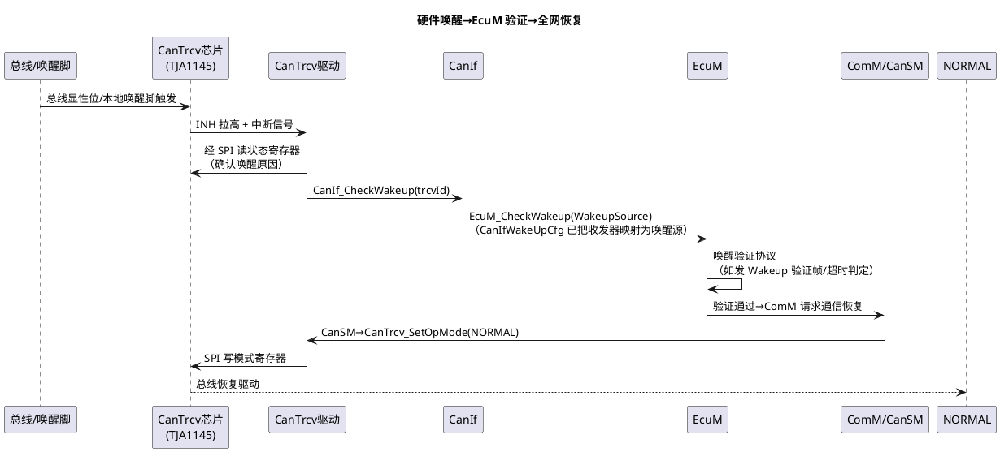

# 07-CanTrcv

> 一句话定位：CAN 收发器芯片的管理层——把 TJA1145 这类"带 SPI 控制接口和状态机的外设"抽象成 Normal/Standby/Sleep 三档模式与一条唤醒事件上报链；睡眠电流超标、整机唤不醒这两类故障的最后一环通常在这里。
> 等级：L2 ｜ 前置：[06-CanIf-LinIf](06-CanIf-LinIf.md)

## 原理

### 收发器模式状态（CanTrcv 视角）

```plantuml
@startuml
title CanTrcv 三档模式与切换触发者
skinparam defaultFontName "Microsoft YaHei"
[*] --> NORMAL : 上电默认\n（CanSM 编排 SetOpMode）
state NORMAL {
  [*] : 总线收发全通\n功耗最高
}
NORMAL --> STANDBY : SetOpMode(STANDBY)\n（控制器停、收发器守候）
STANDBY : 唤醒检测开\n不驱动总线
NORMAL --> SLEEP : SetOpMode(SLEEP)\n（NOCOM 序列，经 SPI 下命令）
SLEEP : 晶振停、INH 释放\n仅监听唤醒源\n电流 µA 级
STANDBY --> NORMAL : 唤醒后恢复
SLEEP --> NORMAL : 唤醒事件\n（总线显性/本地唤醒脚）\n+ SetOpMode(NORMAL)
note right of SLEEP
  TJA1145 类芯片 sleep 下
  晶振停摆，唤醒后需
  ~1.5ms 内部起振才能
  响应 SPI——切换后
  别立刻读写寄存器
end note
@enduml
```

谁在拨模式：CanSM 在 NOCOM/下电序列里调 `CanTrcv_SetOpMode(SLEEP)`，唤醒后回 NORMAL——收发器自己只被动执行，模式编排权在 CanSM（见 [03-CanSM](03-CanSM.md)）。

### 唤醒事件传播 sequence



关键点：**驱动只上报，验证归 EcuM**——CanTrcv 收到物理唤醒事件后经 CanIf 转成 EcuM 唤醒源事件，由 EcuM 决定"这次唤醒算不算数"（假醒过滤），验证通过才让 ComM/CanSM 拉起通信。整条链在 [EcuM 上下电时序](../系统服务栈/EcuM/02-上下电时序.md) 的唤醒段有完整位置。

### TJA1145 硬件对照

TJA1145 是典型的"SPI 可控 + 唤醒管理"收发器（硬件细节见 [收发器选型 TJA1145](../../../05-汽车网络通讯/1-L1基础/CAN/收发器与物理层/01-收发器选型TJA1145.md)）：模式经 SPI 寄存器切换；Sleep 态释放 INH 脚（可顺带关外部稳压）、保留总线唤醒与本地唤醒脚；**支持按 CAN ID 过滤的帧唤醒（PN 硬件基础）**。CanTrcv 层的工作就是把这些芯片差异藏进统一的三档模式 API 与唤醒上报回调。

### PN 支持一句

部分网络场景下，CanTrcv（配 TJA1145/1146 类芯片）可在 Sleep 态按 CAN ID/PNN 硬件过滤唤醒帧——不匹配的报文不产生唤醒事件，只匹配的才拉醒 ECU；过滤表的配置与 PN 协议栈联动，详见 [部分网络](../../../05-汽车网络通讯/2-L2进阶/网络管理/04-部分网络.md)。

## 详解

**为什么收发器要单独一层抽象**：收发器种类多（Dio 使能脚的 1051、SPI 全控制的 1145、带 PN 的 1146），但 CanSM 只想问三件事：切模式、查唤醒原因、（PN 场景）配过滤。CanTrcv 把 SPI 序列、寄存器布局、起振等待这些芯片方言翻译成统一接口，CanSM/CanIf 不感知芯片型号。

**Standby 与 Sleep 的电流/唤醒代价差**：Standby 收发器振荡器还在跑，唤醒快、电流 mA 级；Sleep 晶振停，电流 µA 级但唤醒后要等起振（约 1.5ms 才能响应 SPI），首帧发送天然有延迟。整车睡眠电流目标定了，选哪档就不是自由的。

**上下电时序中的位置**：下电段在 CanSM NOCOM 序列末尾（控制器 STOP 之后收发器才 SLEEP——顺序反了会有一段时间总线被收发器拖在显性位）；上电段相反：先 NORMAL 再起控制器。完整序位见 [EcuM 上下电时序](../系统服务栈/EcuM/02-上下电时序.md)。

**唤醒原因要读不要猜**：总线上任何显性位都会触发唤醒事件（包括别的 ECU 干活），EcuM 唤醒验证就是为此存在；驱动侧应把"远程唤醒/本地唤醒/状态异常"从芯片状态寄存器读全再上报，别一律当真唤醒。

## 配置层

| 配置项 | 含义 | 典型值 | 易错点 |
|---|---|---|---|
| CanTrcvChannel↔CanIfCtrlTrcvRef | 收发器与控制器绑定 | 每路 CAN 一条 | 绑错→CanSM 操作打到别的收发器 |
| 收发器型号/驱动绑定（CanTrcvDrvName） | 指向具体芯片驱动（含 Spi 序列） | TJA1145 等 | 型号与实际芯片不符→寄存器操作全错 |
| CanTrcvWakeupSourceRef | 注册为 EcuM 唤醒源 | 每收发器一个 ID | 漏配→唤醒了但 EcuM 验证流程不启动 |
| CanTrcvWakeupMode / PN 过滤使能 | 唤醒判定方式（总线/按 ID） | 无 PN：by bus | PN 过滤表配错→该醒不醒或乱醒 |
| CAN FD 支持 | 数据相位收发能力 | FD 网络选支持 | 不支持 FD 的收发器混入 FD 网络→数据段错误帧 |
| CanTrcvDevErrorDetect | 开发错误追踪 | Debug 版 true | 量产忘关→CPU 开销 |
| CanTrcvMainFunctionPeriod | 模式推进/SPI 轮询粒度 | 10~20ms | 太长→模式切换确认慢 |
| Sleep 进入前的 SPI 命令序列 | 芯片专用命令链 | 按芯片手册 | 序列不全→芯片没真睡，电流超标 |

## 易错点与陷阱

1. **整机睡眠电流超标**：现象是 CAN 网络全睡、MCU 也睡、电流仍 mA 级；原因是收发器只进了 Standby 没进 Sleep（SPI 命令没发出或序列不全），或 Sleep 前忘了关收发器供电使能（经 INH 控制的外围）；对策：分段量电流——拔收发器供电对比，SPI 逻辑分析仪抓下电前最后一条命令。
2. **唤醒后通信不通（首帧丢失后恢复）**：现象是唤醒中断正常、总线首帧超时；原因是 Sleep→NORMAL 后立刻读寄存器/发帧，TJA1145 类芯片起振期（~1.5ms）SPI 无响应；对策：驱动内建起振等待，上层模式切换确认后再放行发送。
3. **唤醒源没在 EcuM 注册**：现象是收发器 INH 拉高、MCU 复位脚也动了，但软件不启动唤醒验证；原因是 CanTrcvWakeupSourceRef→EcuM 唤醒源链漏配；对策：从收发器中断→CanIf_CheckWakeup→EcuM_CheckWakeup 全链挂调试计数验证。
4. **下电顺序颠倒烧时序**：先让收发器 SLEEP 再停控制器（或反之），会出现收发器 TX 悬空/总线显性拖尾，被全网视为错误帧甚至假唤醒源；对策：严格 CanSM NOCOM 序列——PDU 下线→控制器 STOP→收发器 SLEEP。
5. **PN 过滤"该醒不醒"**：现象是带 PN 的 ECU 收到目标帧不唤醒、非目标帧反而醒；原因是 PNN 过滤表/CanId 过滤配置与整车 PN 矩阵不一致；对策：过滤表与 PN 配置同源生成，台架用帧发生器逐 ID 扫描验证（见 [部分网络](../../../05-汽车网络通讯/2-L2进阶/网络管理/04-部分网络.md)）。
6. **FD 网络混入非 FD 收发器**：现象是数据段随机错误、仲裁段正常；原因是收发器数据相位翻转速率不支持 FD；对策：选型核对（[收发器选型](../../../05-汽车网络通讯/1-L1基础/CAN/收发器与物理层/01-收发器选型TJA1145.md)），改板前先用软件降速验证。

## 面试高频题

- **Q：从总线出现唤醒电平到 ComM 恢复通信，完整链路？**
  A：收发器检测唤醒（INH/中断）→ CanTrcv 驱动经 SPI 读唤醒原因 → CanIf_CheckWakeup → EcuM_CheckWakeup（唤醒源验证、假醒过滤）→ 验证通过 EcuM 通知 ComM → ComM_RequestComMode(FULL) → CanSM 编排 CanIf 起控制器 + CanTrcv_SetOpMode(NORMAL) → 总线恢复收发。
- **Q：CanTrcv 的三档模式各用在什么场景？**
  A：NORMAL 全功能收发（正常通信）；STANDBY 快速恢复的守候态（如静默监听、短时停发）；SLEEP 深度休眠（整车睡眠，µA 级电流，保留唤醒检测）。模式编排者是 CanSM，CanTrcv 只执行与上报。
- **Q：为什么唤醒验证放在 EcuM 而不是 CanTrcv？**
  A：收发器只能报告"物理上出现了唤醒事件"，无法判断是否有效（可能是瞬时干扰或别网流量）；唤醒的有效性判定属于 ECU 级策略，由 EcuM 按唤醒源配置执行验证协议，避免假醒（详见 [EcuM 上下电时序](../系统服务栈/EcuM/02-上下电时序.md)）。
- **Q：TJA1145 做 PN 收发器时 CanTrcv 层要额外做什么？**
  A：配置并下发 CAN ID/PNN 过滤表到芯片、在 Sleep 态依赖芯片做硬件帧过滤唤醒、唤醒后读回匹配信息辅助 EcuM 验证；这使"不相关报文不唤醒"由硬件完成，MCU 保持深睡。

## 延伸

- [收发器选型 TJA1145](../../../05-汽车网络通讯/1-L1基础/CAN/收发器与物理层/01-收发器选型TJA1145.md)：寄存器、时序与硬件细节；
- [03-CanSM](03-CanSM.md)：模式编排者与 NOCOM 序列；
- [06-CanIf-LinIf](06-CanIf-LinIf.md)：CtrlCfg 三方绑定中收发器引用的来源；
- [EcuM 上下电时序](../系统服务栈/EcuM/02-上下电时序.md)：唤醒验证与下电序列的完整框架；
- [部分网络](../../../05-汽车网络通讯/2-L2进阶/网络管理/04-部分网络.md)：PN 过滤唤醒的系统级机制。
