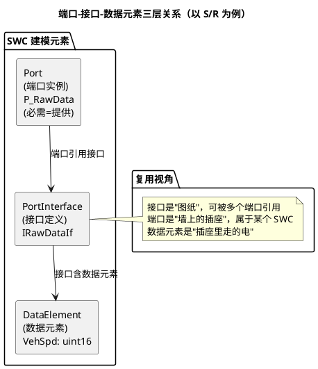

# 01-S-R与C-S端口

> 一句话定位：SWC 对外只有两种嘴——S/R 端口"放数据等人取"，C/S 端口"喊一嗓子要回答"；写 SWC 前必须先分清这对孪生兄弟。
> 等级：L2（L3 带内可提前读——建模 SWC 前就该看） ｜ 前置：[分层架构](../../1-L1基础/架构总览/01-分层架构.md)

SWC 之间不允许直接函数调用、不允许共享变量——所有往来必须过 RTE。而"怎么过"取决于你给 SWC 开的**端口（Port）**。端口是 SWC 与 RTE 的契约：契约写错（该用 C/S 的地方用了 S/R），后面配置全白搭。本篇把两种端口一次讲透，目标是：读完能对着需求正确选型、能读懂 arxml 里的端口定义。

## 原理

### 端口-接口-数据元素：三层概念



三层口诀：**接口定义形状（有什么数据/操作），端口决定方向（提供 P 还是需求数 R），数据元素是内容**。C/S 的"数据元素"换成 Operation（操作），形状由参数表+返回值定义。

### S/R vs C/S：一张表选型

| 维度 | S/R（Sender/Receiver） | C/S（Client/Server） |
|---|---|---|
| 本质 | **数据流**：写方放数据，读方来取 | **调用流**：客户端发起请求，服务端执行并回结果 |
| 方向 | 单向（P→R），无响应概念 | 请求-响应（C→S→C），天然双向 |
| 通信感受 | 异步、解耦：双方不必同时存在 | 同步感强：客户端发起后等服务端执行（可阻塞/非阻塞） |
| 语义细节 | last-is-best / 队列；InitValue 兜底 | Operation + 入出参数 + 返回值（Std_ReturnType） |
| 典型场景 | 周期信号：车速、温度、开关状态 | 即时服务：读诊断数据、执行标定、触发一次动作 |
| 选型口诀 | "状态/数值，谁来取都行" → S/R | "做一件事并要结果" → C/S |

一句话判据：**需求方拿到的是"一份最新的数据"还是"一次执行的结果"**——前者 S/R，后者 C/S。

### S/R 语义：数据的三条规矩

1. **last-is-best（最终值最新）**：默认模式。读方取到的是写方最近一次写的值；写两次读一次，中间那次**丢了也不心疼**——适合周期状态量（车速）。读端拿不到新值时返回上次的或 InitValue；
2. **队列模式（Queued）**：每个值都排队，读一次取走一个，不能丢——适合"事件型"数据（按键按下、一次性命令）。队列有深度，溢出即丢最旧/最新（按配置），工程上慎用，多数工具链对队列 S/R 支持有限；
3. **InitValue（初始值）**：接口数据元素上配的兜底值。RTE 启动后、任何写方动笔前，读方 Read 拿到的就是它——没配 InitValue，读到的是未定义内存，这是"上电瞬间数据异常"的经典来源。

### C/S 语义：一次函数级委托

- 接口里定义 **Operation**（操作）：若干入参/出参 + 一个返回值（通常 `Std_ReturnType`：E_OK / E_NOT_OK）；
- 客户端 `Rte_Call` → RTE → 服务端对应 **ServerRunnable** 执行 → 返回值原路带回；
- 同步语义下，客户端 runnable 在等待期间**让出执行**（等待点，OS 层配合），服务端被调度执行完才回来——所以 C/S 双方往往落同一核或需配好跨核路径；
- 一个 Operation 可以被多个客户端调用；服务端是否可重入，建模时要给 `reentrancy` 约定。

### 端口定义代码直觉（arxml 长这样）

```xml
<!-- ① 接口：S/R 的形状 -->
<SENDER-RECEIVER-INTERFACE>
  <SHORT-NAME>IRawVehSpdIf</SHORT-NAME>
  <DATA-ELEMENTS>
    <VARIABLE-DATA-PROTOTYPE>
      <SHORT-NAME>VehSpd</SHORT-NAME>
      <TYPE-TREF DEST="INTEGER-TYPE">/DataType/VehSpd_T</TYPE-TREF>
      <INIT-VALUE>...0...</INIT-VALUE>   <!-- 没配它=上电读垃圾值 -->
    </VARIABLE-DATA-PROTOTYPE>
  </DATA-ELEMENTS>
</SENDER-RECEIVER-INTERFACE>
<!-- ② 端口：方向在此刻确定 -->
<P-PORT-PROVIDED-INTERFACE ...>  <!-- 提供方：我写 VehSpd -->
<R-PORT-REQUIRED-INTERFACE ...>  <!-- 需求方：我读 VehSpd -->
<!-- C/S 侧：CLIENT-SERVER-INTERFACE 内是 OPERATIONS（含参数与返回类型）-->
```

### SWC 组网一例：传感器→控制器

```plantuml
@startuml
title 传感器 SWC → RTE → 控制 SWC：一个 S/R 通道的完整链路
skinparam defaultFontName "Microsoft YaHei"
[Swc_Sensor] as S
[Swc_Ctrl] as C
package "RTE" {
  [Rte_VehSpd 通道\n(生成缓冲+读写宏)] as RTE
}
S --( RTE : P 端口\nRte_Write_VehSpd()
RTE --) C : R 端口\nRte_Read_VehSpd()
note bottom of RTE
  生成物：每端口一组 Rte_Read/Rte_Write 宏
  同核=直接内存搬运；跨核=底层自动换 IOC 通道
  （IOC 详见本目录 03 篇）
end note
@enduml
```

链路走查：传感器 runnable 算完 → `Rte_Write` 落进 RTE 通道 → 控制 runnable 周期到点 → `Rte_Read` 取最新值。双方互相不知道对方存在——这就是端口换来的可移植性。

## 详解

### 需求端口与服务端口的方向迷阵

S/R 的"方向"容易绕晕：**P 端口=数据提供方（写），R 端口=数据需求方（读）**；C/S 相反：**C 端口=发起方（客户端），S 端口=执行方（服务端）**。记法：S/R 看"数据从谁流向谁"，C/S 看"谁喊谁干活"。P/R 端口还可以标"必需/可选"（provided-required），用于同一份 SWC 代码既当写方又当读方的场合（如信号转发 SWC），进阶建模再用。

### 为什么 SWC 间禁止直连

直连（直接调用/共享全局变量）会把两个 SWC 焊死：换核、换 ECU、换调度，全要改代码。过 RTE 后，位置/调度/核间细节全部由生成器消化——SWC 源码只认 `Rte_*` 接口，搬到哪里都能编译。这也是 C/S 服务端可以是 CDD（复杂设备驱动）或 BSW 模块（如 NvM 的块读写）的原因：RTE 把 BSW 也包装成端口世界的一等公民。

## 配置层/工程关联

- 建模工具（DaVinci Developer/ISOLAR-Artist）里操作顺序：**先建接口（Interface）→ 再给 SWC 开端口 → 最后连 Assembly/Composition 连接件**——跳步直开端口会引用不到接口；
- InitValue、队列深度、方向（P/R）都在接口/端口容器里配，生成到 `Rte_Type.h`/`Rte.c`（生成物解剖见本目录 [04-生成代码解读](04-生成代码解读.md)）；
- 一个接口被多个端口引用时，改接口=动所有引用方——接口版本管理（命名带版本、废弃走新接口）是团队协作纪律；
- 信号级诊断（Dem 上报、DaVinci 调参）常要求"端口数据有 InitValue 且类型明确"，配置评审逐项过。

## 易错点与陷阱

1. **拿 S/R 干 C/S 的活**：把"命令+应答"建成两个 S/R 信号（CmdSend/CmdAck），自己发明握手——丢失时序保证、绕过 RTE 的调用语义，评审必打回。
2. **InitValue 缺配**：上电第一周期读到野值，控制逻辑瞬间飞车；每个 S/R 数据元素必配 InitValue，配置检查器开强制。
3. **队列模式当万能药**：Queued 语义各家工具支持参差，且读方忘读就积压溢出——事件型数据优先考虑"计数器+状态位"的 last-is-best 建模。
4. **C/S 客户端当同步必然**：`Rte_Call` 在等待点让出后，若服务端 runnable 映射的 Task 极低优先级，客户端会"卡"很久——C/S 双方调度关系要联合评审（映射见 [02-Runnable映射](02-Runnable映射.md)）。
5. **P/R 方向建反**：把"我要读"建成 P 端口，连接件一连就报"提供对提供"冲突；方向错了别硬连，回端口定义改。
6. **跨核 S/R 当同核用**：端口跨核后底层走 IOC，访问语义有变化（详见 [03-IOC](03-IOC.md)），高频调用要想清楚延迟代价。

## 面试高频题

1. S/R 与 C/S 端口的本质区别是什么？各举两个车载场景。
   答：S/R 是异步数据通信——发送方 Rte_Write 即返回，接收方按 last-is-best 或队列语义取最新/排队数据，无调用关系；C/S 是同步调用语义——客户端 Rte_Call 阻塞等结果（等待点让出），服务端运算后回数据。场景：S/R 如车速信号周期广播、开关状态上报；C/S 如读故障码请求、执行标定例程。
2. last-is-best 与队列模式的语义差异？InitValue 在什么时候生效？
   答：last-is-best 永远保存最新一条，旧数据被覆盖（适合状态量）；队列模式按 FIFO 排队不丢（适合事件量，但读方忘读会积压溢出）。InitValue 只在通信还没发生过任何一次数据交换时作为初值生效（RTE 启动后读端口返回它），一旦首个有效数据到达就被替代——它不是"默认值"也不是复位值。
3. 为什么 AUTOSAR 规定 SWC 之间不能直接函数调用？
   答：直接调用会造成编译期地址耦合与部署耦合——组件换核、换 ECU、换调度都要改代码，破坏 SWC 可移植性与独立开发。RTE 作为唯一中介：端口+Rte_Call/Read/Write 生成代码解耦双方，部署映射（同核直调优化/跨核走 IOC/跨 ECU 走总线）由生成器决定，应用代码一行不改。
4. 一个 C/S 调用从客户端到服务端的完整链路经过哪些角色？跨核时会怎样？
   答：客户端 runnable 调 Rte_Call → RTE 生成代码（端口代理）→ 同核时直接调用服务端 runnable 所在上下文执行；跨核时经 IOC 核间通道投递请求、唤醒服务端所在核的 Task，客户端在等待点让出（阻塞等待点语义），结果再经 IOC 回传。跨核代价是延迟与 SpinLock 占用，服务端映射 Task 优先级过低会拖住客户端。

## 延伸

- [分层架构](../../1-L1基础/架构总览/01-分层架构.md)：RTE 作为隔离层的架构定位
- [02-Runnable映射](02-Runnable映射.md)：端口有了，读写它的 runnable 怎么跑起来
- [04-生成代码解读](04-生成代码解读.md)：Rte_Read/Rte_Write/Rte_Call 宏背后的生成物
- [ARXML手读](../../2-L2进阶/方法论与ARXML/03-ARXML手读.md)：亲手在 arxml 里找接口/端口定义
- [第一课-一座城的分区图](../../00-入门导读/01-AUTOSAR第一课-一座城的分区图.md)：RTE 在全图中的位置回看
