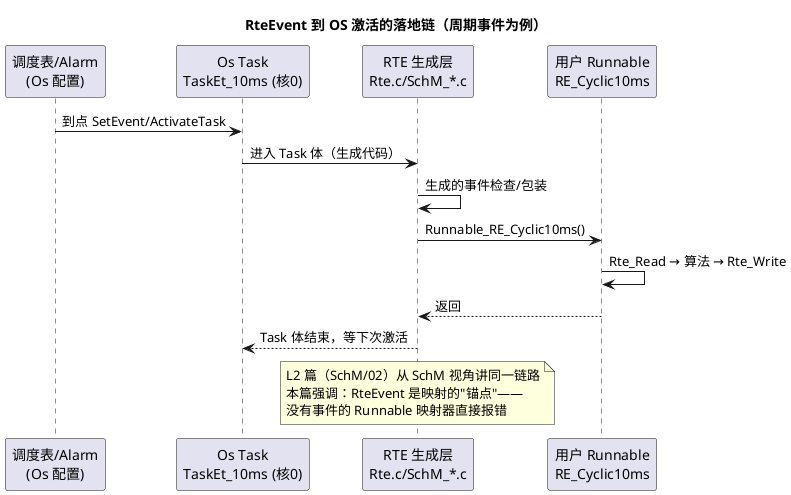

# 02-Runnable映射

> 一句话定位：站在 RTE 视角把"什么事件叫醒哪个 Runnable、落到哪个 Task"的四类 RteEvent 讲全——比 L2 篇多了初始化触发与 OS 激活的落地细节。
> 等级：L2→L3 ｜ 前置：[01-S-R与C-S端口](01-S-R与C-S端口.md)、[Runnable到Task映射](../../2-L2进阶/SchM与调度/02-Runnable到Task映射.md)

## 太长不看

> - 人话直觉：Runnable 是没有腿的函数，RteEvent 是它的闹钟，映射就是"闹钟响时把它抱进哪个 Task 的被窝"。
> - 本篇解决：四类 RteEvent 各自怎么触发、事件如何变成 OS 激活、映射表长什么样、同 Task 内顺序语义。
> - 赶时间记住：①周期/数据/模式/初始化四类事件对应四类宿主 Task；②映射链=Runnable→RteEvent→OsTask，RTE 生成调用序列；③同 Task 内严格串行、顺序由生成代码定死。

## 原理

### 四类 RteEvent：Runnable 的四种闹钟

| RteEvent | 触发条件 | 典型宿主 | 例子 |
|---|---|---|---|
| TimingEvent(period=x) | 周期到点 | 周期匹配的 Task | 10ms 车速滤波 |
| DataReceivedEvent(on RPort) | 关联 S/R 数据被写/到达 | 通信回调可达的 Task | 收到挡位信号触发换挡逻辑 |
| ModeSwitchEvent(ENTRY/EXIT/TRANSITION) | 模式切换（RTE 模式机/BswM 驱动） | 模式管理 Task | 进入睡眠前收尾 |
| InitEvent | OS 启动、调度开始前 | 启动类 Task（如 OS 启动任务） | 端口 InitValue 之后的首次自检 |

前两类是主力；ModeSwitchEvent 有同步/异步语义之分（同步=切过去要等 runnable 跑完）；**InitEvent 是 L3 新面孔**：它在 StartOS 之后、正常调度之前执行一次，承担 SWC 内部状态的首轮初始化——放这里的代码不能依赖任何外部输入（此时通信栈还没跑）。

### 事件如何变成 OS 激活：完整链路



与 L2 篇的分工：[Runnable到Task映射](../../2-L2进阶/SchM与调度/02-Runnable到Task映射.md) 讲"映射三段引用+调度侧如何唤醒"；本篇补 RTE 视角的事件全集（含 InitEvent）与生成侧的落地形态。两篇合看才是完整闭环。

### 映射配置表长什么样

```
RunnableToTaskMapping（系统描述中的核心容器，直觉化）
┌─────────────────────┬──────────────────────────┬──────────────────┐
│ RunnableEntity       │ 触发 RteEvent              │ 目标 OsTask       │
├─────────────────────┼──────────────────────────┼──────────────────┤
│ /SwcVeh/RE_Cyclic10  │ TimingEvent(10ms)         │ TaskEt_10ms (核0) │
│ /SwcVeh/RE_OnGear    │ DataReceivedEvent(P_Gear) │ TaskComRx (核0)   │
│ /SwcVeh/RE_ModeExit  │ ModeSwitchEvent(EXIT,Sleep)│ TaskMode (核1)   │
│ /SwcVeh/RE_Init      │ InitEvent                 │ TaskOsStartup(核0)│
└─────────────────────┴──────────────────────────┴──────────────────┘
约束：TimingEvent 周期 = 宿主 Task 实际触发周期（生成器强校验）
```

工具里通常是"选中 Runnable→指定事件→点选 Task"三步；底层落成上述引用三元组。**DataReceivedEvent 的宿主受限**：必须挂在触发源（Com 回调/SchM 事件）能到达的 Task 上，乱挂=事件永远不来。

### 同 Task 内多 Runnable 的执行顺序语义

- 一次 Task 激活内，映射进来的 Runnable **按生成顺序严格串行**，中间无抢占、无并行；
- 顺序来源：显式顺序约束（工具里 position/sequence）或映射顺序（工具默认，不可依赖——要确定就显式配）；
- 数据依赖靠顺序保证：生产者在前消费者在后，一个周期内闭环；顺序错了不是错误（编译器不报），是**悄悄晚一个周期**——最阴的性能 bug。

## 详解

### 一个 Runnable 只能有一个主触发事件吗

一个 Runnable Entity 可以关联多个事件（如既周期跑又数据触发跑），但**映射检查会变严**：多事件意味着 Task 到达路径多样，工具要求所有路径的 Task 兼容，且周期类与数据类混挂时抖动不可控——工程默认纪律：**一个 Runnable 一个触发事件**，多需求就拆两个 Runnable。

### InitEvent 与 EcuM/启动序列的关系

InitEvent runnable 在 OS 启动阶段（StartOS 后、调度器放开前，工具实现各异——常见为专用 Startup Task 或 TaskAutostart 一次性任务）执行。它晚于 PortInitValue 生效、早于任何 TimingEvent。典型用途：SWC 内部状态机复位、一次性自检、把内部状态同步到端口初值。**别在 InitEvent 里调外部服务**（NvM 读是异步的、Com 还没起来）——需要 NvM 数据的初始化应挂 NvM 回调或模式切换事件。

### 映射错误的三种典型症状

1. "Runnable 从来不跑"——事件没建/没映射/宿主 Task 没被唤醒源覆盖；
2. "跑的周期不对"——TimingEvent 周期与宿主 Task 不一致，或宿主被多个调度表抢；
3. "数据总是旧一拍"——同 Task 顺序颠倒，或生产者/消费者被拆到不同周期 Task。

## 配置层/工程关联

- 工具链分工：DaVinci Developer/ISOLAR 做 SWC+事件+映射 → 导出 ECU extract → tresos/DaVinci Configurator 生成 RTE——映射变更必重新生成并评审 `Rte.c` diff（方法见 [diff-review技巧](../../2-L2进阶/方法论与ARXML/04-diff-review技巧.md)）；
- 映射评审清单：①周期一致；②DataReceivedEvent 宿主可达；③生产者在消费者前；④跨核映射单独看（走 [03-IOC](03-IOC.md)，延迟与锁代价）；⑤ASIL 域不混挂；
- 生成物自查：打开 `SchM_<Swc>.c` 或 `Rte.c` 的 Task 调用序列，与配置表逐行核对（生成物解剖见 [04-生成代码解读](04-生成代码解读.md)）；
- 多核工程：映射表多一列"核归属"，本质由 Task 绑核决定（OS 侧见 [05-多核OS](../../2-L2进阶/系统服务栈/Os/05-多核OS.md)）。

## 易错点与陷阱

1. **无事件裸映射**：Runnable 没关联任何 RteEvent 就想挂 Task——生成器报错；先补事件再谈映射。
2. **InitEvent 里调异步服务**：NvM/Com 未就绪，返回 E_NOT_OK 被无视，状态机带着错误初值开跑。
3. **依赖工具默认顺序**：同 Task 两个 Runnable 没配显式顺序，工具升级后顺序变了，功能"莫名"差一拍——顺序永远显式化。
4. **DataReceivedEvent 挂错宿主**：触发源根本到不了那个 Task，事件永远不响；宿主选择要顺着触发回调链查。
5. **一个 Runnable 多事件混挂**：激活路径分析复杂度爆炸，抖动不可控；拆分是正解。
6. **改映射忘重新生成**：配置生效全靠生成，忘生成=白改（与 L2 篇同款陷阱，多核下更隐蔽——核间代码没更新，两核各跑旧版语义）。

## 面试高频题

1. RteEvent 有哪几类？InitEvent 在什么时机执行、能做什么不能做什么？
   答：四类：TimingEvent（周期）、DataReceivedEvent（数据到达）、ModeSwitchEvent（模式切换，有同步/异步语义）、InitEvent（初始化）。InitEvent 在 StartOS 之后、正常调度开始前执行一次（常见为 Startup/自启动 Task），晚于端口 InitValue 生效、早于任何周期事件——只能做内部状态复位、一次性自检、状态同步到初值；不能调外部异步服务（NvM/Com 未就绪），需要 NvM 数据的初始化应挂 NvM 回调或模式切换事件。
2. 描述一个 DataReceivedEvent 从信号到达总线到 Runnable 执行的完整链路。
   答：CAN 帧到达 → Can 驱动 ISR 收报文 → CanIf 递给 Com → Com 在 RxIndication 里按信号定义拆包、更新信号缓冲并触发通知 → 经 SchM 生成的回调/事件置位唤醒挂有该 DataReceivedEvent 的宿主 Task → Task 体内 RTE 生成代码调用对应 Runnable → Runnable 里 Rte_Read 取数执行。宿主 Task 必须在触发回调可达的路径上，乱挂则事件永远不来。
3. 同一 Task 内两个 Runnable 有数据依赖，怎么保证一个周期内闭环？
   答：利用同 Task 串行语义：显式配置顺序约束，把生产者 Runnable 排在消费者前——同一次激活内严格按生成顺序串行执行，先写后读一个周期内闭环。顺序错误编译器不报，症状是"数据旧一拍"，最阴的性能 bug；工具默认顺序不可依赖，永远显式配。
4. 映射到另一个核的 Task 会发生什么？（提示：IOC）
   答：Runnable 跑在宿主 Task 所在核，跨核端口数据由 RTE 自动生成 IOC 通道（核间通信+SpinLock）承载：读写在共享内存上做，配锁保护与核间通知；代价是访问延迟与锁占用，高频小数据被放大，极端时锁竞争反噬调度。评审跨核映射要单独列出跨核端口清单并用 trace 量化延迟。

## 延伸

- [01-S-R与C-S端口](01-S-R与C-S端口.md)：Runnable 里读写的就是这些端口
- [Runnable到Task映射](../../2-L2进阶/SchM与调度/02-Runnable到Task映射.md)（L2 基础版）
- [调度表](../../2-L2进阶/SchM与调度/01-调度表.md)：Task 被唤醒的另一侧
- [04-生成代码解读](04-生成代码解读.md)：映射结果在生成代码里的样子
- [模式仲裁](../../2-L2进阶/系统服务栈/BswM/01-模式仲裁.md)：ModeSwitchEvent 的上游驱动者
- 工程深入场景：TC377 三核项目做映射迁移评审时，先导出全量映射表按核分组，检查跨核 S/R 端口清单（每个都是潜在 IOC 通道），再用 trace 量化迁移前后端到端延迟——"映射改动"从来不只是改一张表，是调度、核间通信、锁三件事的联动。
