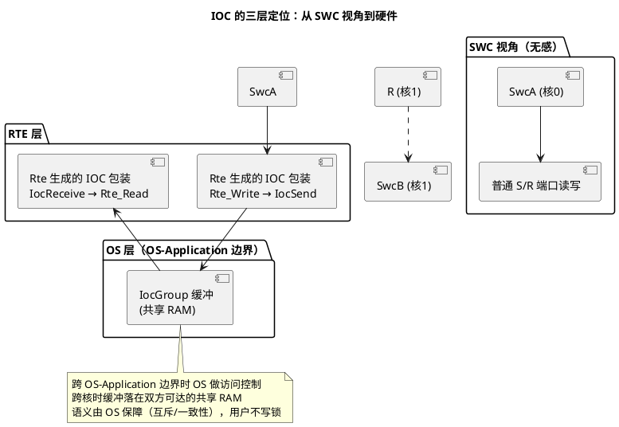
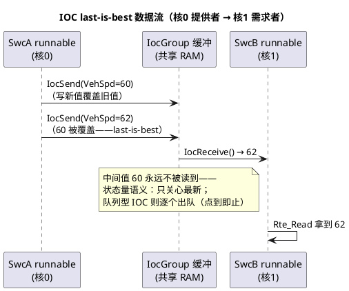

# 03-IOC

> 一句话定位：IOC 是 OS 内建的跨 OS-Application/跨核 1:1 快速数据通道——SWC 跨核 S/R 端口的底层落地，绕过整个通信栈的"核间直通车"。
> 等级：L2→L3 ｜ 前置：[01-S-R与C-S端口](01-S-R与C-S端口.md)

## 太长不看

> - 人话直觉：两个核之间挖一条专用小隧道，写方把数据塞进隧道口，读方从另一头取——不用惊动 Com/PduR 整个邮政系统。
> - 本篇解决：IOC 的定位与数据流、为什么跨核 S/R 不走普通路径、生成代码长什么样、限制清单。
> - 赶时间记住：①IOC=点对点直通，1 发 1 收；②跨核 S/R 由 RTE 自动生成 IOC 包装，SWC 无感；③last-is-best 语义下丢旧保新，无重传无通知（点到即止）。

## 原理

### IOC 的定位：三层视图看同一样东西



IOC（Inter-OS-Application Communicator）由 OS 提供：配置 IocGroup（数据元素+队列深度+收发方 OS-Application）后，**配置器生成 `IocSend_<group>` / `IocReceive_<group>` 函数**，内部自带互斥与顺序保护。SWC 侧的跨核 S/R 端口由 RTE 自动映射到 IOC 通道——写方调 `Rte_Write`，底层已换成 IOC 发送；应用代码完全无感（OS 侧多核背景见 [05-多核OS](../../2-L2进阶/系统服务栈/Os/05-多核OS.md)）。

### IOC 数据流：核 A 写 → 缓冲 → 核 B 读



### 为什么跨核 S/R 不走普通路径

| 路径 | 做了什么 | 问题 |
|---|---|---|
| 普通 S/R（同核） | RTE 直接读写本核缓冲 | 跨核时：两核直接读写同一裸变量→**数据撕裂/竞态**，没人保护 |
| 绕道通信栈（Com/PduR） | 序列化→Com→PduR→再回对方核 | 层层拷贝+排队，延迟与开销大，还要占 PDU 资源——杀鸡用牛刀 |
| IOC | OS 生成的专用通道：缓冲+互斥+一致性 | 点对点直达，开销最小，语义由 OS 保障 |

结论：跨核 S/R 的正确落点就是 IOC——它就是为"跨 OS-Application/跨核的裸数据直通"而生。

### 生成代码形态直觉

```c
/* RTE 侧（直觉化）：SwcA 的写端口在核0，SwcB 的读端口在核1 */
/* Rte_<SwcA>.h 里你调的还是普通宏： */
Rte_Write_SwcA_VehSpd(62);            /* 用户代码不变 */
/* Rte.c 里宏展开后（直觉）： */
#define Rte_Write_SwcA_VehSpd(v)  IocSend_IocG_VehSpd(v)   /* 直通 IOC */
/* OS 生成（Os_Ioc.c）：内部带互斥保护，无需用户加锁 */
/* SwcB 侧对称：IocReceive_IocG_VehSpd() 喂给 Rte_Read_SwcB_VehSpd */
```

识别特征：生成工程里出现 `Ioc*` 前缀文件/函数、arxml 里 `IOC-SETTING`/`IocGroup` 容器——说明这条 S/R 通道跨了 OS-Application 或核。

### 与核间中断的配合（一句）

IOC 是**被动通道**：读方靠周期轮询取数；若要"数据一到位立刻通知对方核处理"，需叠加核间中断做主动信号（机制见 [02-IOC与核间中断](../多核集成/02-IOC与核间中断.md)）。

## 详解

### IOC 的限制清单（点到即止）

- **点对点（1:1）**：一个 IocGroup 一个发送方一个接收方（OS 规定），不支持广播/多播——多消费者要拆多条通道或用通信栈；
- **无协议语义**：没有超时、重传、确认、过滤——它是数据通道不是通信服务，可靠性语义归应用；
- **队列语义有坑**：last-is-best 覆盖旧值是"设计如此"；队列型深度有限，**溢出丢弃通常没有通知**——依赖队列别丢的场景要自己加上层校验；
- **无变化通知**：写一百次同值，读方无从区分"没写过/写了一堆"——需要边沿语义就传计数器或叠中断；
- **配置期静态**：通道在配置里定死，运行期不能增删。

### IOC vs 跨核 SpinLock 手写共享区

BSW 模块或 CDD 之间（不走 SWC 端口）的跨核数据，两条路：直配 IOC（推荐，OS 生成互斥），或手写共享变量+SpinLock（仅当数据结构复杂到 IOC 装不下）。手写路径的风险与纪律见 [03-共享资源保护](../多核集成/03-共享资源保护.md)——能 IOC 就别手写。

### 怎么知道某条 S/R 走了 IOC

三步定位：①工具里看端口连接的 SWC 是否分属不同核/OS-Application；②查生成 `Rte.c` 中该端口的宏定义有无 `Ioc` 字样；③看 Os 配置里的 IocGroup 列表。排障"跨核数据老是很旧"时，先确认读方 Task 周期——last-is-best 下读方跑得慢，永远只见最新值，中间值全被覆盖。

## 配置层/工程关联

- RTE 配置直觉：SWC 映射分核后（映射见 [02-Runnable映射](02-Runnable映射.md)），**跨核端口连接自动触发 IOC 生成**——工具不问你，直接生成；评审时盯"跨核端口清单"即可；
- Os 配置侧：IocGroup 的数据类型、队列深度、属性（有/无通知）在 OS 配置器里可微调（若 RTE 自动生成则只读）；
- 性能预算：每个跨核 S/R 通道都有互斥开销，**高频写端口跨核是延迟放大器**——架构评审时按"每周期跨核字节数"设上限；
- 调试：IOC 数据可在调试器里直接看（缓冲就是共享 RAM 变量），比走 Com 的信号好查。

## 易错点与陷阱

1. **把 IOC 当通信栈用**：指望超时/重传/确认——没有；可靠性语义（如丢帧检测）要应用层自建。
2. **队列型 IOC 溢出无感**：深度配 4，突发写 10 次，丢 6 次静默无声——队列深度按最坏突发配，或干脆用 last-is-best+状态量建模。
3. **读方周期太慢还怪数据旧**：last-is-best 只保最新不保不丢，低频读方天然"跳帧"；要逐帧就别用 S/R 语义。
4. **跨核高频小数据**：每次 IOC 都有锁开销，1ms 级高频跨核小信号会烧掉互斥带宽——数据和消费者同核是第一原则。
5. **手改生成的 IOC 代码**：下次生成全冲掉；所有调整回配置工具做（生成代码纪律见 [04-生成代码解读](04-生成代码解读.md)）。
6. **忘了 IOC 与中断通知的分工**：以为 IOC 会"通知"对方核——不会；要实时性叠核间中断，两者配合模式见多核集成篇。

## 面试高频题

1. IOC 是什么？它和 Com/PduR 通信栈的本质区别？
   答：IOC（Inter-OS-Application Communicator）是 OS 内建的跨 OS-Application/跨核点对点快速数据通道：配置 IocGroup 后生成器产出 IocSend/IocReceive 函数，缓冲落共享 RAM，互斥与一致性由 OS 保障、用户不写锁。与通信栈的本质区别：IOC 是裸数据直通车，无超时/重传/确认/过滤等协议语义；Com/PduR 是完整通信服务（序列化、排队、选路），跨核用它纯属绕路且开销大。
2. SWC 的 S/R 端口跨核时，RTE 底层发生了什么？应用代码需要改吗？
   答：RTE 检测到端口两端 SWC 分属不同核/OS-Application，自动生成 IOC 包装：Rte_Write 宏展开为 IocSend_<group>，对端 Rte_Read 对应 IocReceive，缓冲+互斥由 OS 生成代码负责。应用代码完全无感、一行不改——跨核是部署映射决定的事。
3. IOC 的 last-is-best 语义意味着什么？什么场景不能用？
   答：意味着缓冲永远只存最新值，写两次读一次时中间值被覆盖丢弃——状态量语义（只关心最新，如车速）正合适。不能用的场景：事件流/逐帧处理（每个都必须处理，如报文计数、按键事件）——要逐帧就别用 last-is-best，改队列型（注意溢出静默丢弃）或传计数器/叠核间中断做边沿通知。
4. IOC 和核间中断各自的分工？典型组合是什么？
   答：IOC 是被动数据通道——写方塞数、读方轮询取，不带通知；核间中断是主动信号——"数据到了/事件发生了"立刻打断对方核。典型组合：IOC 传载荷 + 核间中断触发对方核的 Task 来取——事件型跨核数据（如感知结果搬运）的标准打法；纯状态量则 IOC 轮询就够。

## 延伸

- [01-S-R与C-S端口](01-S-R与C-S端口.md)：上层语义——IOC 只是它的跨核实现
- [05-多核OS](../../2-L2进阶/系统服务栈/Os/05-多核OS.md)：IOC 作为 OS 服务的定义面
- [02-IOC与核间中断](../多核集成/02-IOC与核间中断.md)：被动数据+主动通知的组合拳
- [03-核间通讯与共享资源](../../../02-芯片与体系结构/3-L3高级/多核架构/03-核间通讯与共享资源.md)：共享 RAM 与一致性的硬件底账
- [04-生成代码解读](04-生成代码解读.md)：从 Rte 宏追到 IocSend 的完整路径
- 工程深入场景：域控项目把感知数据从核 1 搬到核 0 的 SecOC 发送链，先导出跨核端口清单逐一评估——周期状态量留 IOC last-is-best，事件流改"IOC 传载荷+核间中断触发对方核 Task"组合，最后用核间 trace 量每条通道的端到端延迟分布，超预算的通道回架构层重新分核。
