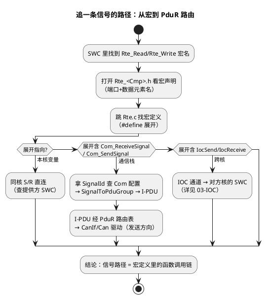

# 04-生成代码解读

> 一句话定位：拿着生成器吐出的 Rte.c/Rte_<Cmp>.h/Os 任务体逐层解剖——学会顺着宏追一条信号的真实路径，以及生成代码的铁律：只读不改。
> 等级：L2→L3 ｜ 前置：[01-S-R与C-S端口](01-S-R与C-S端口.md)

## 太长不看

> - 人话直觉：RTE 生成代码是"配置的另一种写法"——你在工具里点的每一项，都原样翻译成 C 代码；读它=用源码核对配置。
> - 本篇解决：生成物清单与分工、Rte 宏展开直觉、Task 体解剖、追信号路径的方法论。
> - 赶时间记住：①Rte_Type.h 定类型、Rte_<Cmp>.h 给宏、Rte.c 干活、Os 任务体做调度；②追信号=从 Rte 宏定义一路 #define 展开到 Com/PduR 或 IOC；③生成代码永不可手改，改=配置。

## 原理

### 生成物清单：谁负责什么

| 文件 | 内容 | 你会在里面看什么 |
|---|---|---|
| `Rte.c` | 通道实现：S/R 缓冲读写函数、C/S 分发、事件包装 | 宏的真实定义、端口数据落点（本核变量/IOC 调用） |
| `Rte_<Cmp>.h` | 每个 SWC 专属的端口访问宏（Rte_Read_/Write_/Call_...） | 该 SWC 可用的全部接口——SWC 代码只 include 它 |
| `Rte_Type.h` | 端口数据类型、接口结构、Impl/GeneratedBtn 定义 | 数据元素类型与 InitValue 的类型定义 |
| `Rte_Internal.h/.c` | 内部胶水：事件触发判定、模式机辅助 | 排障深挖时才进 |
| OS 侧任务体（`Os_Task*`/SchM 生成） | Task 函数体：按序调用 runnable wrapper | 执行顺序真相、Task 与 runnable 的宿主关系 |
| `SchM_<Mod>.c`（BSW 侧） | BSW 模块 MainFunction 的调度包装 | BSW 模块挂哪个 Task（对照映射见 [02-Runnable映射](02-Runnable映射.md)） |

### Rte_Read/Rte_Write/Rte_Call：宏展开直觉

```c
/* SWC 代码里写（Rte_<SwcVeh>.h 声明的宏）： */
speed = Rte_Read_SwcVeh_P_VehSpd();          /* S/R 读 */
(void)Rte_Write_SwcVeh_P_VehSpd(62);         /* S/R 写 */
result = Rte_Call_SwcVeh_rpDiag_ReadData(&val); /* C/S 调用 */

/* Rte.c 里宏可能展开成（直觉示例，工具各异）： */
/* ① 同核直连：直接读提供方缓冲（可能还带 Com 信号镜像） */
#define Rte_Read_SwcVeh_P_VehSpd()  (Rte_IRead_SwcVeh_VehSpd())
/* ② 数据来自总线信号：读的是 Com 拷贝的信号缓冲 */
/*    Rte_IRead 内部 → Com_ReceiveSignal(SigId, &buf) */
/* ③ 跨核：换成 IOC 接收（见 03-IOC） */
/*    Rte_IRead 内部 → IocReceive_IocG_xxx() */
/* ④ C/S：分发到服务端 wrapper（同步/异步由配置决定） */
```

宏是"交通指挥"：同一个 `Rte_Read`，按端口连接关系展开成本核变量读、Com 信号读、IOC 接收或 C/S 分发——**SWC 代码不变，路径全在配置里**。这就是追路径要顺着宏定义走的原因。

### 一个生成 Task 体的解剖

```c
/* OS/SchM 生成（结构直觉，各家命名不同）： */
TASK(TaskEt_10ms)                       /* ① OSEK Task：Os 配置生成 */
{
    /* ② RTE runnable wrapper：按映射顺序逐个调用 */
    Runnable_SwcSamp_RE_10ms();         /*   生产者在前（映射顺序） */
    Runnable_SwcFlt_RE_10ms();          /*   消费者在后 */
    /* ... 本 Task 映射的其他 runnable ... */
    (void)TerminateTask();              /* ③ OSEK 语义：自我终结 */
}

/* Runnable wrapper（Rte 生成）内部（直觉）： */
void Runnable_SwcSamp_RE_10ms(void)
{
    /* 事件检查（若配置了触发条件）→ 调用户函数 */
    SwcSamp_re_10ms();                  /* ④ 真正的用户代码入口 */
}
```

三层结构记牢：**Os 层（Task 壳与调度）→ RTE 层（wrapper 与顺序）→ 用户层（runnable 实体）**。调试断点打在哪一层，决定了你在查"调度没到"还是"逻辑错了"。

### 如何定位"信号到底走哪条路径"



方法论口诀：**宏名进、展开跟、Id 查配置**——Rte 宏只给你"下一站"，每一站再查配置里的 Id 引用，直到落到驱动或对端 SWC。

## 详解

### 为什么生成代码"不可手改"

1. 再生成即覆盖：手改内容无声消失，埋"我明明改了"的经典事故；
2. 手改造成配置与代码不一致：下次别人按配置排障，代码却是另一套行为；
3. 安全认证（ISO 26262 工具置信度）要求生成物可复现：手改破坏可追溯性。
正确姿势：所有行为调整回配置工具做；临时验证用调试器改内存/变量，不用编辑器改文件。团队协作以 diff 审查生成物变更（方法见 [04-diff-review技巧](../../2-L2进阶/方法论与ARXML/04-diff-review技巧.md)）。

### 读生成代码的三个高效习惯

- **从 SWC 视角切入**：先读 `Rte_<Cmp>.h`——它是该 SWC 的"接口清单"，比直接啃 Rte.c 快得多；
- **对照配置读**：arxml 里的端口连接（工具的 connection 视图）与 Rte.c 的宏定义对着看，一轮就建立"配置→代码"映射直觉（arxml 手读见 [ARXML手读](../../2-L2进阶/方法论与ARXML/03-ARXML手读.md)）；
- **只追一条链**：别通读 Rte.c（动辄上万行）——带着具体问题（"这个信号谁写的"）顺着一条链追到底。

### 常见生成物命名速认

`Rte_IRead_/IWrite`（内部缓冲访问）、`Rte_Call_`（C/S 分发）、`Rte_PP_/RP_`（端口前缀）、`IocSend_/IocReceive_`（跨核）、`SchM_<Mod>_MainFunction`（BSW 主函数）——认得前缀，生成工程就不再面目可憎。

## 配置层/工程关联

- 生成触发：ECU extract 或 RTE 配置变更后重新生成；**生成日志的 warning 必须清零**（很多"行为不对"的答案是生成时一条被忽视的警告）；
- 工程结构：RTE 生成物通常单独目录（如 `rte_gen/`），SWC 手写代码在组件目录——目录隔离提醒"哪些能改"；
- 版本管理：生成物是否入库看团队策略；入库则 diff 审查严格走查，不入库则 CI 必须可复现生成（工具版本+配置双锁）；
- 调试入口：追执行顺序看 Task 体；追数据路径看宏定义；追跨核看 Ioc 函数——三个入口对应三类问题。

## 易错点与陷阱

1. **手改生成代码**：再生成即丢，且破坏认证可追溯性——零容忍红线。
2. **断点打错层**：想知道"为什么没被调度"却打在用户函数里（第四层）——应打在 Task 体（第一层）看激活；反之查逻辑才进用户层。
3. **忽视生成警告**："映射周期不一致，已按 Task 周期生成"这类 warning 悄悄改变行为——生成日志逐条过。
4. **把 Rte 宏当函数黑盒猜**：不展开就断言"它肯定走了 Com"——跨核/直连/Com 三种展开都可能，必须看定义。
5. **新旧生成物混用**：改了配置只编译不重新生成，或生成一半失败继续编译——版本不一致的生成物是最难查的一类诡异 bug；生成-编译-烧录一条流水线。
6. **在生成代码里找"配置错在哪"**：方向反了——代码只是结果，回配置工具改源头。

## 面试高频题

1. RTE 生成物有哪些？各自承担什么职责？
   答：Rte_Type.h 定义端口数据类型与 InitValue；Rte_<Cmp>.h 是各 SWC 的端口访问宏清单（SWC 只 include 它）；Rte.c 是通道实现（S/R 缓冲读写、C/S 分发、事件包装）；Rte_Internal 做事件触发判定等胶水；OS 侧 Task 体按映射顺序调 runnable wrapper；SchM_<Mod>.c 包装 BSW 模块 MainFunction 挂进 Task。
2. 描述 Rte_Read 宏可能的几种展开，分别对应什么连接关系？
   答：①同核 S/R 直连——展开为本核提供方缓冲的内部读（Rte_IRead）；②数据来自总线信号——内部走 Com_ReceiveSignal 读 Com 拷贝的信号缓冲；③跨核——展开为 IocReceive_IocG_xxx()（IOC 通道）；对应地 Rte_Call 展开为 C/S 服务端分发。同一宏名不同展开，路径完全由端口连接配置决定——SWC 代码不变。
3. 一个信号从 CAN 总线到 SWC runnable 的代码级路径怎么追？
   答：口诀"宏名进、展开跟、Id 查配置"：SWC 里找到 Rte_Read 宏 → Rte_<Cmp>.h 看声明 → Rte.c 看 #define 展开，命中 Com_ReceiveSignal → 拿 SignalId 查 Com 配置（SignalToPduGroup → I-PDU）→ I-PDU 对应 PduR 路由表条目 → CanIf/Can 驱动的接收方向回调（CanIf→Com RxIndication 拆包回信号缓冲）。全程纯读生成物+arxml 即可画通。
4. 为什么生成代码不能手改？团队如何管控？
   答：三个理由：再生成即覆盖（手改无声消失）；造成配置与代码不一致（按配置排障的人被误导）；破坏 ISO 26262 工具置信度要求的生成物可复现性。管控：一切改动回配置工具；生成日志 warning 清零；生成-编译-烧录一条流水线防新旧生成物混用；生成物入库则走 diff 审查，不入库则 CI 锁工具版本+配置可复现生成。

## 延伸

- [01-S-R与C-S端口](01-S-R与C-S端口.md)：宏背后的语义层
- [02-Runnable映射](02-Runnable映射.md)：Task 体里调用顺序的由来
- [03-IOC](03-IOC.md)：展开成 IocSend/IocReceive 的那条分支
- [ARXML手读](../../2-L2进阶/方法论与ARXML/03-ARXML手读.md)：配置侧与代码侧对照着读
- [第一课-一座城的分区图](../../00-入门导读/01-AUTOSAR第一课-一座城的分区图.md)：生成代码在整个工程版图里的位置
- 工程深入场景：接手陌生 ECU 工程的"信号考古"流程——从 SWC 的 Rte_Read 宏出发，经 Com SignalId、I-PDU、PduR 路由表追到 CAN 报文与 DBC 条目，全程不跑代码纯读生成物+arxml；半天能画出整张信号流图，比抓总线猜快得多。
