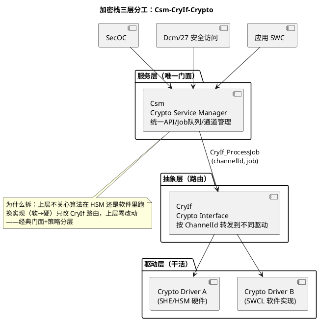
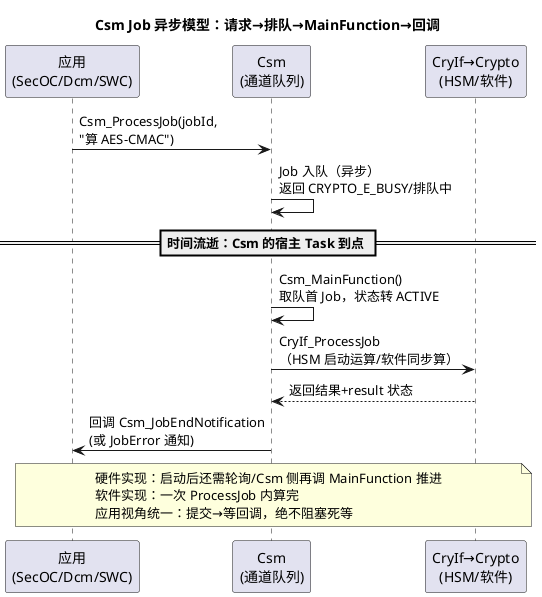

# 01-Csm-CryIf-Crypto

> 一句话定位：AUTOSAR 加密栈三件套——Csm 是统一服务柜台，CryIf 是路由分发员，Crypto 是真正干活的硬件/软件锁匠；一次加密请求=排队等 MainFunction 异步兑现。
> 等级：L2→L3 ｜ 前置：[AUTOSAR第一课-一座城的分区图](../../00-入门导读/01-AUTOSAR第一课-一座城的分区图.md)

## 太长不看

> - 人话直觉：全 ECU 只开一个"银行业务窗口"（Csm），所有模块凭单据（Job）排队，柜员（CryIf）把单据分给不同的金库（Crypto 硬件/软件实现），办完电话通知你（回调）。
> - 本篇解决：三层分工、Job 异步模型、密钥管理直觉、典型操作怎么配。
> - 赶时间记住：①应用只认 Csm_，不直接碰 Crypto；②Job=通道号+密钥+算法+模式，异步经 MainFunction 兑现；③密钥住在 KeyStore/硬件信任锚里，不落地明文。

## 原理

### 三层分工：为什么拆成三块

- **Csm**：全 ECU 统一入口。管理若干 Channel（通道），每个 Channel 一个队列；`Csm_JobInit`/`Csm_ProcessJob` 收请求、排队；
- **CryIf**：薄薄一层路由——按 ChannelId 把 Job 送到对应的 Crypto 驱动实例；
- **Crypto**：真正的算法执行者——HSM/SHE 硬件驱动，或软件密码库（SWCL）；一个 ECU 可同时挂多个（硬件快但贵、软件全但慢）。

### Job 异步模型：一次请求的一生

异步是刻意的：加密运算（尤其非对称）耗时长，若同步等待，调用方 Task 会被卡死——排队+回调让耗时运算与调度解耦。

### 密钥管理直觉（点到即止）

- 密钥不出信任锚：真实密钥存放在 **SHE/HSM 硬件 KeyStore**（或 Crypto 驱动管理的密钥区），应用只拿 KeyId 句柄引用，**永远拿不到密钥明文**；
- 典型流：产线经安全通道（如 SHE 的 LOAD_KEY 协议）注入密钥 → 运行期全靠 KeyId 使用；
- 更新/派生由专用 Job（KEY_SET/KEY_EXCHANGE/KEY_DERIVE）完成，全程密文搬运。
信息安全全貌（SHE/HSM 体系、攻击面）见 [功能安全与信息安全](../../../11-功能安全与信息安全/README.md)。

### 典型操作与配置直觉

| 操作 | CryptoService 算法族 | 典型用户 | 耗时量级 |
|---|---|---|---|
| HASH | SHA-256/384 | SecOC 新鲜度、固件校验、Dcm 签名 | 快 |
| MAC | AES-CMAC / HMAC | SecOC 认证（主流） | 快 |
| 加解密 | AES-128/256 (CBC/CTR/GCM) | 诊断安全传输、日志保护 | 中 |
| 随机数 | TRNG/DRBG | 挑战值、密钥派生种子 | 快（看源） |
| 签名/验签 | ECDSA/RSA | V2X、固件签名 | 慢（非对称） |

配置直觉：**一个 Job = 通道 + KeyId + 算法 + 模式**，工具里把四元组绑好，应用按 jobId 调用。

## 详解

### Job/Channel/Queue/Key 四个概念一条线

Channel（通道）是队列容器，配队列深度与优先级；Job 挂在某 Channel 上，定义用哪把 KeyId 干哪种活；调用 `Csm_ProcessJob(jobId)` 时 Job 进所属通道的队列。**排队的公平性由通道划分决定**——把 SecOC 的 MAC 计算和 Dcm 的慢签名放同一通道，SecOC 会被签名堵住（实时性事故）；按用户分通道是默认纪律。

### 硬件与软件实现的选择直觉

- 硬件（HSM/SHE）：快、密钥不出锚、不占主核算力；但通道数/Jobs 数有限、开发调试链路复杂；
- 软件（SWCL）：灵活全算法、好调试；占 CPU、密钥保护全靠内存分区（MPU/OS-Application 隔离）。
常见组合：**MAC/随机数走硬件**（高频小活），**低频大活（验签）走软件或专用时段**。

### 状态机速览

Job 生命周期：`IDLE → (排队) QUEUED → ACTIVE → (成功) IDLE / (失败) IDLE+错误`。排障时先看 Csm 通道状态与队列水位，再看 Crypto 驱动的错误码——错误码分层（Csm 层/CryIf 层/驱动层）逐层剥洋葱。

## 配置层/工程关联

- 三段配置链：Csm 的 Channel/Queue/Job → Job 引用 KeyId 与算法 → CryIf 的 ChannelMapping 决定路由到哪个 Crypto 驱动实例——**断链（Job 没映射到驱动）在生成期报错，运行期表现为"Job 永远不完成"**；
- MainFunction 挂载：`Csm_MainFunction`、`Crypto_<drv>MainFunction` 要映射进周期 Task（映射方法见 [02-Runnable映射](../RTE/02-Runnable映射.md)）——周期决定排队延迟下限，SecOC 用途常配 5~10ms；
- 密钥注入流程要与产线工艺对齐：SOP 前的安全注入（含 KeyStore 格式、产线节拍）是项目交付件之一；
- 多核注意：Crypto 硬件常绑定某核访问（如 HSM 与核0 的接口），跨核调用要走归属核的 Csm 通道——分核清单见 [01-主从核启动](../多核集成/01-主从核启动.md)。

## 易错点与陷阱

1. **同步心态调异步 API**：`Csm_ProcessJob` 提交后立刻读结果缓冲——大概率还没算完；必须等回调/轮询 Job 状态。
2. **MainFunction 没映射或周期太长**：Job 排队无人兑现，表现为"偶发超时"——排查先看 MainFunction 挂载与周期。
3. **通道混用堵队列**：SecOC 高频 MAC 与低频大计算共通道，实时认证被拖垮——按用户分通道。
4. **KeyId 与算法不匹配**：KeyId 指向的密钥长度/类型与 Job 算法不符，运行期报 KEY_INVALID 之类错误——配置矩阵（Key×Job）要评审。
5. **以为能读出密钥调问题**：Csm 不提供导出明文密钥的 API（设计如此）；调试用专用测试密钥+仿真模式，别想着"打印密钥看看"。
6. **忽略错误回调注册**：只注册了成功回调，失败静默——上层永远以为认证通过/失败毫无感知。

## 面试高频题

1. Csm/CryIf/Crypto 三层各自职责？为什么要中间加一层 CryIf？
   答：Csm 是全 ECU 统一服务门面（统一 API、Channel/Job 队列管理），CryIf 是薄路由层（按 ChannelId 把 Job 转发到对应驱动实例），Crypto 是真正执行者（HSM/SHE 硬件驱动或软件密码库）。加 CryIf 是为了隔离实现：上层不关心算法在 HSM 还是软件里跑，换实现（软→硬）只改 CryIf 路由映射，Csm 与应用零改动——经典门面+策略分层。
2. 描述一次 Csm 加密请求的完整异步流程；为什么设计成异步？
   答：应用调 Csm_ProcessJob(jobId) → Job 进所属 Channel 队列（可能返回 BUSY）→ 宿主 Task 到点跑 Csm_MainFunction 取队首 Job 转 ACTIVE → 经 CryIf_ProcessJob 交给 Crypto 驱动（硬件启动运算/软件同步算完）→ 结果经 Csm_JobEndNotification（或 JobError）回调应用。异步是刻意的：非对称等运算耗时长，同步等待会把调用方 Task 卡死——排队+回调让耗时运算与调度解耦。
3. 密钥在 AUTOSAR 加密栈里如何被保护？应用如何引用密钥？
   答：真实密钥存放在 SHE/HSM 硬件 KeyStore（或 Crypto 驱动管理的密钥区），永远不出信任锚、不落地明文；应用与各模块只拿 KeyId 句柄引用，Csm 不提供导出明文密钥的 API（设计如此）。产线经安全通道注入（如 SHE LOAD_KEY），更新/派生走专用 Job（KEY_SET/EXCHANGE/DERIVE）全程密文搬运。
4. SecOC 的 MAC 计算如何用到 Csm？（衔接下篇）
   答：SecOC 发送侧对 PDU 算 CMAC、接收侧验 MAC，都通过 Csm 的 MAC 类 Job（AES-CMAC，绑定专用 Channel+KeyId）提交；Csm_MainFunction 周期（常配 5~10ms）决定认证延迟下限。工程要点：SecOC 高频 MAC 必须独占通道，避免与 Dcm 低频大计算共通道被堵；密钥为每 ECU 的 SecOCPuzKey，经产线注入。

## 延伸

- [02-SecOC配置](02-SecOC配置.md)：加密栈最大的"客户"
- [AUTOSAR第一课](../../00-入门导读/01-AUTOSAR第一课-一座城的分区图.md)：服务层/驱动层分层直觉的出处
- [功能安全与信息安全](../../../11-功能安全与信息安全/README.md)：SHE/HSM 与密钥体系全貌
- [02-Runnable映射](../RTE/02-Runnable映射.md)：Csm_MainFunction 怎么挂进 Task
- [05-多核OS](../../2-L2进阶/系统服务栈/Os/05-多核OS.md)：HSM 归属核与跨核调用约束
- 工程深入场景：SecOC 上量后偶发"认证超时"，定位三步——抓 Csm 通道队列水位（是否排队峰值）、量 Csm_MainFunction 实际周期（是否被同 Task 重任务挤抖动）、查 HSM Job 并发上限（硬件通道排队）；多数结论是"通道分错+MainFunction 周期抖"，改配置即可救回，动算法是最后一步。
