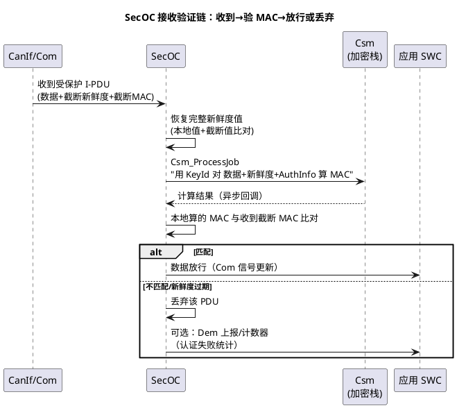

# 02-SecOC配置

> 一句话定位：SecOC 给关键报文套上"防伪封条"——MAC 防篡改、新鲜度值防重放；本篇讲清保护后报文长什么样、验证链怎么走、配置链怎么搭。
> 等级：L2→L3 ｜ 前置：[Csm-CryIf-Crypto](01-Csm-CryIf-Crypto.md)

## 太长不看

> - 人话直觉：给 CAN 报文盖骑缝章（MAC）+ 编流水号（Freshness）——章对不上是被篡改，流水号重复是重放攻击，两个都过才放行数据。
> - 本篇解决：SecOC 保护的报文结构、新鲜度机制、接收验证链、发送/接收配置链。
> - 赶时间记住：①PDU = 数据+截断新鲜度+截断MAC， AuthDataInfo 一起进 MAC 计算；②新鲜度靠计数器/时间派生，收发两端同步；③验证走 SecOC→Csm 算 MAC→比对，失败即丢报文并可上报。

## 原理

### 动机：总线报文天生裸奔

CAN/CAN-FD 无鉴权字段（见 [CAN帧格式](../../../05-汽车网络通讯/1-L1基础/CAN/协议原理/01-帧格式.md)）：接上总线谁都能发。对转向/制动/档位类报文，两类攻击直击要害——

- **篡改**：伪造/修改报文内容，接收方无感执行；
- **重放**：录一段历史合法报文重发（如"解锁"报文），接收方无法分辨新旧。

SecOC（Secure Onboard Communication）的解法：**发送端算 MAC（消息认证码）随报文发，新鲜度值参与 MAC 计算**——篡改改不动 MAC（不知密钥），重放因新鲜度值旧而被拒。

### 保护后的报文结构：I-PDU 布局

| 字段 | 作用 | 长度直觉 |
|---|---|---|
| Authentic I-PDU（数据本体） | 原有信号载荷 | 原样 |
| Truncated Freshness Value（截断新鲜度） | 防重放的"流水号"（低若干位） | 4~8 bit 常见 |
| Truncated MAC（截断认证码） | 防篡改"骑缝章" | 24~64 bit 常见 |

关键机制：**完整新鲜度值不直接传**（太占带宽），只传低位截断；收端用本地维护的完整值+算法恢复。MAC 输入 = 数据 + 新鲜度 + AuthDataInfo（含 Data ID 等协议常量），密钥来自 Csm KeyId——攻击者不知密钥，造不出合法 MAC。

### 新鲜度机制：流水号从哪来（点到即止）

- **计数器型**：单调递增计数器（每发一帧+1），主流方案；
- **时间型**：基于全局时间基派生；
- 收发同步：收端本地维护期望值，与收到截断值对比+容差窗口恢复；失步（长时间下电/丢帧）需 FvM（Freshness Value Manager）负责管理同步（含经诊断/专帧同步，一句：**FvM 管新鲜度值的派生与同步，SecOC 只管用**）。

### 接收验证链

发送方向对称：SecOC 取新鲜度→经 Csm 算 MAC→拼 PDU→交 Com/PduR 发出。**收发共用同一套 Csm Job 与密钥体系**（见 [01-Csm-CryIf-Crypto](01-Csm-CryIf-Crypto.md)）。

## 详解

### 截断的代价与补偿

MAC 与新鲜度都截短（省带宽），安全性靠"截断+高频变化"折衷：截断 MAC 被暴力伪造概率随截断位数上升（24bit≈千万级量级），配合失败计数与响应策略（连续失败熔断/上报）兜底。位数选择 = 带宽预算 × 安全要求的平衡题，OEM 规范通常直接给定。

### 验证失败后的行为设计

丢帧只是底线动作，完整设计要答三个问题：①失败如何上报（Dem 故障/SecOC 计数器）；②连续失败怎么办（进入受限模式/触发 BswM 动作，联动 [模式仲裁](../../2-L2进阶/系统服务栈/BswM/01-模式仲裁.md)）；③应用层数据"保持旧值还是失效处理"（信号失效超时策略）。这三问没答=集成没做完。

### 与部分网络（PN）的一句话关系

部分网络唤醒场景下（见 [部分网络](../../../05-汽车网络通讯/2-L2进阶/网络管理/04-部分网络.md)），睡眠期间新鲜度计数器仍在变——唤醒后收发两端可能失步，FvM 的同步机制与 PN 唤醒时序要联合设计，否则"每次唤醒第一帧必认证失败"。

### 带宽账：保护前先数 bit

加截断新鲜度+截断 MAC 后 PDU 变长：8 字节 CAN 报文塞不下就得上 CAN-FD 或砍数据长度——**哪些报文值得保护**（安全分析定清单，见 [功能安全与信息安全](../../../11-功能安全与信息安全/README.md)）是第一决策，不是所有报文都上 SecOC。

## 配置层/工程关联

- **配置链一（发送）**：SecOC Freshness Value 派生配置（或 FvM 引用）→ SecOCTxPdu（拼装布局：数据/新鲜度/MAC 偏移与长度）→ 引用 Csm Job（MAC 计算）→ 上层 PduR 路由到 Com；
- **配置链二（接收）**：SecOCRxPdu（含截断参数、验证失败策略）→ 同样引用 Csm Job → 验证通过的数据 PduR 转发给 Com（信号层无感）；
- **Csm Job 对应**：每条受保护 Pdu 关联一个 MAC 计算 Job（通道/KeyId/算法 AES-CMAC 主流）——Job 排队延迟直接决定验证时延，通道分配见上篇；
- **工具操作直觉**：tresos/DaVinci 里 SecOC 配置挂在 Com/PduR 附近（SecOC 是通讯服务栈成员，栈概览见 [通讯服务栈](../../2-L2进阶/通讯服务栈/01-Com.md)），按 Pdu 逐条配布局与 Job 引用；
- 多核部署：SecOC+Com 常在通讯核（核0），密钥计算走本核 Csm 通道（分核见 [01-主从核启动](../多核集成/01-主从核启动.md)）。

## 易错点与陷阱

1. **两端新鲜度失步**：长时间下电/丢帧后收端期望值偏移，全部认证失败——FvM 同步机制与初值注入是集成必答题，别只配发送侧。
2. **AuthDataInfo/Data ID 不一致**：收发双方参与 MAC 计算的常量（Data ID、算法 ID）不一致，MAC 永远对不上——对端矩阵逐项核对（OEM 间联调头号坑）。
3. **Csm Job 延迟拖垮验证**：MAC 计算排队在慢通道，认证超时性丢帧——SecOC 专用通道+MainFunction 周期预算（见上篇通道纪律）。
4. **截断位数照抄模板**：带宽紧张砍到 24bit MAC + 4bit 新鲜度，安全评估却按全量算——位数选择要过安全分析，不是拍脑袋。
5. **验证失败无任何上报**：失败静默丢弃，现场"功能偶发失灵"无从定位——失败计数器+Dem 上报是最小可观测集。
6. **收端忘了 Com 侧超时联动**：SecOC 丢帧后信号维持旧值，应用无失效处理——信号超时（Com timeout）策略与 SecOC 丢弃行为要联合设计。

## 面试高频题

1. SecOC 解决哪两类攻击？分别靠什么机制？
   答：解决篡改与重放。篡改靠 MAC（消息认证码）：发送端以密钥对"数据+新鲜度+AuthDataInfo"算 MAC 随报文发，攻击者不知密钥造不出合法 MAC，改一个 bit 验证即失败；重放靠新鲜度值（流水号）参与 MAC 计算——重放的历史报文新鲜度值过期，收端比对拒绝。
2. 画出受保护 I-PDU 的字段布局；新鲜度为什么截断传输？收端如何恢复？
   答：I-PDU = Authentic 数据本体 + Truncated Freshness Value（4~8bit）+ Truncated MAC（24~64bit）。完整新鲜度值太占带宽，只传低位截断；收端用本地维护的完整期望值与截断值比对、在容差窗口内恢复对齐，长时间失步由 FvM（Freshness Value Manager）经诊断/专帧同步——FvM 管新鲜度派生与同步，SecOC 只管用。
3. 描述一帧受保护报文从接收到数据放行的完整验证链。
   答：CanIf/Com 收到受保护 I-PDU → SecOC 恢复完整新鲜度（本地值+截断值比对）→ 经 Csm_ProcessJob 提交 MAC 计算 Job（KeyId 对 数据+新鲜度+AuthInfo 算 AES-CMAC，异步回调）→ SecOC 把本地算得的 MAC 与收到的截断 MAC 比对 → 匹配则数据放行（Com 信号更新，应用无感）；不匹配或新鲜度过期则丢弃该 PDU，可选 Dem 上报/失败计数。发送方向对称。
4. SecOC 验证失败后系统应该做什么？与 BswM/Dem 如何联动？
   答：丢帧只是底线，完整设计答三问：①失败可观测——失败计数器+Dem 故障上报（最小可观测集，否则"功能偶发失灵"无从定位）；②连续失败响应——进入受限模式/触发 BswM 规则动作（模式级降级或熔断）；③应用层数据策略——信号保持旧值还是失效处理，与 Com 超时策略联合设计。三问没答完=集成没做完。

## 延伸

- [01-Csm-CryIf-Crypto](01-Csm-CryIf-Crypto.md)：MAC 计算的底层兑现
- [CAN帧格式](../../../05-汽车网络通讯/1-L1基础/CAN/协议原理/01-帧格式.md)：被保护对象的原始结构
- [部分网络](../../../05-汽车网络通讯/2-L2进阶/网络管理/04-部分网络.md)：唤醒失步的关联场景
- [模式仲裁](../../2-L2进阶/系统服务栈/BswM/01-模式仲裁.md)：认证失败后的模式级响应
- [功能安全与信息安全](../../../11-功能安全与信息安全/README.md)：保护清单与威胁分析的上游
- 工程深入场景：整车 SecOC 联调打通流程——先工装模拟收发两端对同一 PDU 离线算 MAC 比对（排除配置矩阵问题），再上真件跑计数器同步，最后做丢帧/篡改注入测试验证拒绝行为；联调期把"Data ID 矩阵 + 截断位数 + 密钥 KeyId"三张表锁进基线，任何变更走三方（发送 ECU/接收 ECU/OEM 规范）会签。
