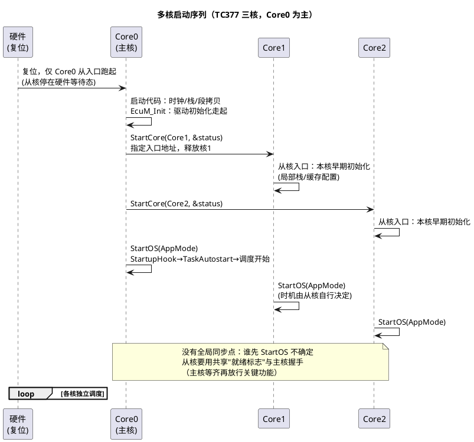

# 01-主从核启动

> 一句话定位：多核 ECU 上电后不是"所有核一起醒"——Core0 先行完成 EcuM/OS 初始化，再用 StartCore 逐个拉起从核；本篇讲清启动序列、主从分工与卡死排障。
> 等级：L2→L3 ｜ 前置：[AUTOSAR第一课-一座城的分区图](../../00-入门导读/01-AUTOSAR第一课-一座城的分区图.md)

## 太长不看

> - 人话直觉：多核启动像早上开店——店长（Core0）先到开灯烧水（初始化 BSW），然后挨个打电话叫员工（StartCore 拉从核），最后各人站各岗（各核 StartOS 开跑）。
> - 本篇解决：启动序列、主核/从核分工清单、BSW 分核直觉、启动卡死的排障路径。
> - 赶时间记住：①Core0 独跑 EcuM_Init，StartCore 拉从核；②从核入口只做本核早期初始化+StartOS；③OS 不提供"全员就绪"同步点，要自己握手。

## 原理

### 启动序列：从上电到各核调度



硬件侧细节（谁把从核摁在等待态、StartCore 的寄存器级动作）见 [02区-主从核启动](../../../02-芯片与体系结构/3-L3高级/多核架构/01-主从核启动.md)；OS 侧的 StartCore API 语义见 [05-多核OS](../../2-L2进阶/系统服务栈/Os/05-多核OS.md)。本篇站在**集成者视角**：序列排对、分工划清、卡点会查。

### 主核做什么、从核做什么

| 阶段 | Core0（主核） | 从核（Core1/2） |
|---|---|---|
| 上电 | 跑启动代码、时钟/RAM 初始化 | 硬件等待态（或跑极小 bootstrap 后停下） |
| 初始化 | EcuM_Init：Mcu/Port/Os 等 BSW 初始化；**StartCore 逐个拉起从核** | 从核入口：仅本核栈/缓存等局部初始化，**不碰共享资源** |
| OS 启动 | StartOS → 调度开始 | 收到主核放行（或入口直跑）→ StartOS |
| 运行期 | 通讯栈/诊断/模式管理；全局shutdown 时负责 **ShutdownAllCores** | 各自 OS-Application 的任务调度 |

铁律两条：①**只有主核调 EcuM_Init/StartCore/ShutdownAllCores**——从核调了是规范违例；②从核入口到 StartOS 之间越短越好，期间访问的每个共享资源都要问"主核初始化完了吗"。

### 各核 BSW 模块分布直觉

典型域控/网关分法（TC377）：

| 核 | 常驻内容 | 理由 |
|---|---|---|
| Core0 | Can/Ethernet 驱动、Com/PduR/SecOC、Dcm、EcuM/BswM、NvM | 通讯与生命周期管理天然单点，主核兼任 |
| Core1 | 应用算法、控制类 SWC | 算力隔离，避免被通讯抖动干扰 |
| Core2 | 功能安全监控（WdgM/E2E 校验）或第二路应用 | 安全域隔离（配合 Lockstep 硬件，见 [02区-Lockstep](../../../02-芯片与体系结构/3-L3高级/多核架构/02-Lockstep.md)） |

分布原则：**模块"户口"落在哪个核的 OS-Application，就由那个核的调度器驱动**；跨核数据流用 IOC（见 [03-IOC](../RTE/03-IOC.md)），共享外设要划归属（见 [03-共享资源保护](03-共享资源保护.md)）。

### 启动卡死的排障路径

```
现象：多核启动卡死（看门狗复位/停在某处不跑）
排障顺序：
① 卡在哪：调试器挂上，看各核 PC——三个核分别停在哪个函数
   ├─ 从核停在硬件等待态 → 主核 StartCore 没执行/失败 → 查主核是否卡在更早的初始化
   ├─ 从核停在入口早期   → 本核初始化访问了未就绪外设 → 查共享外设归属
   └─ 主核停在 EcuM_Init → 单核问题（时钟/RAM/驱动返回错误），先按单核查
② 从核跑了但功能死     → 查握手标志：主核等待的 ready 标志谁该置、置了吗
③ 跑起来又复位         → 看门狗：某核初始化太慢/死等 → 量各核到 StartOS 的时间
```

## 详解

### "没有全局同步点"意味着什么

OS 不保证"三核同一时刻开跑"。从核 StartOS 的时机由从核代码决定（常见：入口直接 StartOS，或等主核放行标志）。两种策略取舍：

- **直跑（快）**：从核尽早开跑，但访问的一切共享资源必须主核"预先初始化或在从核入口内自初始化"；
- **等放行（稳）**：从核入口等主核置 ready 再 StartOS——牺牲毫秒级启动时间，换确定性。功能安全项目常选后者，配合超时+错误处理。

### Shutdown 的对称问题

启动有主从，下电也要有：主核执行 EcuM 下电流程，最后 **ShutdownAllCores** 通知各核停调度；从核收到各自执行 ShutdownHook 后停机。漏配从核 shutdown 通知的典型症状——主核已躺平、从核还在跑，NvM 写一半被断电。

### 与 02 区硬件篇的对照阅读法

本篇每一步在硬件侧都有对应：StartCore 的本质是"主核写从核的启动地址寄存器+释放等待"（AURIX 上从核复位后停在 BMHD 引导判定）；从核"硬件等待态"细节、S32K3 双核（锁步对）的差异，读 [02区-主从核启动](../../../02-芯片与体系结构/3-L3高级/多核架构/01-主从核启动.md) 补硬件账——软件篇管"顺序与分工"，硬件篇管"寄存器与机制"。

## 配置层/工程关联

- **配置清单**：①每核一个 OS-Application 集（任务/中断归属）；②StartCore 调用点（通常 EcuM 阶段一末尾或主核 StartupHook）；③从核入口函数与各核栈/内存段（链接脚本分核段）；④握手标志变量（放共享 RAM， volatile+屏障语义，见 [读写时序与屏障](../../../01-编程语言/2-L2进阶/寄存器编程/04-读写时序与屏障.md)）；
- **工具操作**：tresos 里 Os→OsApplication→CoreAssignment 绑核；EcuM/EcuM Flex 侧配 StartCore 时机；从核任务映射见 [02-Runnable映射](../RTE/02-Runnable映射.md)；
- **链接脚本**：各核私有段（栈/数据）分核放置，共享段（握手标志/IOC 缓冲）落共享 RAM——链接脚本错误=偶发核间踩内存；
- **验收动作**：启动示波/trace 量"上电→各核 StartOS"时间；看门狗开启前完成全部核拉起。

## 易错点与陷阱

1. **从核访问未初始化共享外设**：主核还没配好的 UART/GPIO 被从核先碰，偶发卡死或破坏配置——从核入口只碰自己的资源，共享的等放行。
2. **握手标志无屏障/无 volatile**：编译器优化+写缓冲让"置了标志对方看不见"，主核死等——握手变量按共享内存纪律声明（见屏障篇）。
3. **从核自己调 EcuM_Init/StartCore**：规范违例，轻则错误返回，重则双初始化破坏状态——主从职责写进编码规范。
4. **StartCore 返回值没查**：status 非 OK 继续跑，后面全靠"以为核起来了"——每次 StartCore 后必须检查。
5. **忘配 ShutdownAllCores/从核 shutdown**：下电流程残废，NvM 数据损坏偶发——上下电用例都要测。
6. **分核方案后期大改**：任务/驱动归属大挪=重做映射与核间设计，启动代码全部重验——分核方案必须在架构早期冻结。

## 面试高频题

1. 描述 AUTOSAR 多核 ECU 从上电到各核调度运行的完整序列；主核独有的职责有哪些？
   答：复位后仅 Core0 从入口跑起：启动代码（时钟/栈/段拷贝）→ EcuM_Init（Mcu/Port/Os 等驱动初始化）→ StartCore 逐个拉起从核（指定入口、释放等待态）→ 各核做本核早期初始化 → 各核 StartOS 进入调度（从核时机自行决定，无全局同步点）。主核独有：EcuM_Init、StartCore、ShutdownAllCores——从核调这些是规范违例。
2. OS 为什么不提供多核同步启动点？工程上怎么补？
   答：各核 StartOS 时机由从核代码自行决定，OS 不保证"同一时刻全员开跑"——强制同步代价大且各核初始化负载不同。工程上用共享"就绪标志"握手：从核入口等主核置 ready 再 StartOS（稳，功能安全项目常选，配超时+错误处理），或从核直跑（快，但访问的共享资源必须已初始化）；主核等齐标志再放行关键功能。
3. 从核入口函数里能做什么、不能做什么？为什么？
   答：能做：本核局部初始化（私有栈、缓存配置）并尽快 StartOS。不能做：调 EcuM_Init/StartCore/ShutdownAllCores（主核专属）；访问共享外设与共享资源——主核可能尚未初始化它们，先碰就是偶发卡死或破坏配置；访问的每个共享资源都要先问"主核初始化完了吗"。
4. 多核启动卡死，你的排查步骤？
   答：①调试器挂上看各核 PC 定位：从核停硬件等待态→主核 StartCore 没执行/失败，回查主核是否卡在更早初始化；从核停入口早期→访问了未就绪外设，查共享外设归属；主核停 EcuM_Init→按单核问题查时钟/RAM/驱动返回值。②从核跑了但功能死→查握手标志（谁置、置了吗、volatile/屏障有没有）。③跑起来又复位→看门狗：量各核到 StartOS 的时间，某核初始化太慢或死等。

## 延伸

- [05-多核OS](../../2-L2进阶/系统服务栈/Os/05-多核OS.md)：StartCore/StartOS 的 OS 侧语义
- [02区-主从核启动](../../../02-芯片与体系结构/3-L3高级/多核架构/01-主从核启动.md)：硬件寄存器级机制
- [02区-Lockstep](../../../02-芯片与体系结构/3-L3高级/多核架构/02-Lockstep.md)：锁步核与性能核的启动差异
- [02-IOC与核间中断](02-IOC与核间中断.md)：起来之后的核间协作
- [03-共享资源保护](03-共享资源保护.md)：共享外设归属与锁
- 工程深入场景：TC377 三核项目"启动过慢触发看门狗"的压缩三板斧——从核入口改直跑（去掉无谓等待）、把非关键 BSW（NvM 镜像恢复）延后到运行期首次访问、握手标志改批量等待（一次等齐三个核）；每一招都要配套 trace 复测各核 StartOS 时刻，压完在上电到首帧 CAN 发出的全链路指标里验收。
