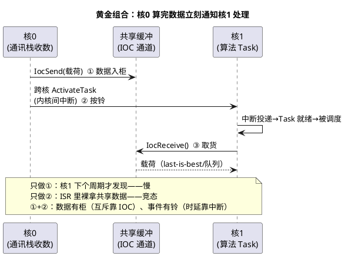

# 02-IOC与核间中断

> 一句话定位：核间通信两大件——IOC 是被动取件的快递柜，核间中断是主动按门铃；数据走柜、事件走铃，组合起来才是完整的跨核协作。
> 等级：L2→L3 ｜ 前置：[01-主从核启动](01-主从核启动.md)

## 太长不看

> - 人话直觉：核 A 给核 B 送东西——IOC 是放门口的储物柜（B 有空自己取），核间中断是按门铃（"东西到了，现在来拿"）；只放柜不按铃，B 可能很久才发现。
> - 本篇解决：两机制的分工对比、AURIX/S32K 平台的中断落地、典型组合模式。
> - 赶时间记住：①IOC=被动数据通道（轮询语义），核间中断=主动事件通知（微秒级）；②"IOC 传数据+中断做信号量"是黄金组合；③OS 的跨核 ActivateTask/SetEvent 底层就是核间中断。

## 原理

### 两机制对比：被动取件 vs 主动按铃

| 维度 | IOC（Inter-OS-App Communicator） | 核间中断（Cross-Core Interrupt） |
|---|---|---|
| 本质 | OS 提供的数据通道（缓冲+互斥） | 硬件中断信号跨核投递 |
| 语义 | 被动：读方轮询/周期取数 | 主动：对方核立刻被打断执行 ISR |
| 时延 | 取决于读方周期（毫秒级常见） | 微秒级（中断响应） |
| 载荷 | 数据（结构体/信号） | 几乎无载荷（就是个"铃"），数据另行取 |
| 典型用途 | 状态量/周期数据搬运 | 事件通知、跨核任务激活、握手 |
| 用它传什么 | 数据本体 | "有事发生"的信号 |

一句话分工：**IOC 送货，中断催单**。只用 IOC，事件可能躺一个周期才被发现；只用中断没数据通道，ISR 里还得自己解决数据搬运与竞态。

### AURIX（TC377）核间中断机制：中断路由器

TC377 没有核间直连中断线，靠**中断路由器（Interrupt Router，IR）+ 服务请求节点（SRC）**：某核写对方核的 SRC 寄存器触发服务请求，IR 按配置把请求路由到目标核的中断服务——这就是 AURIX 的"核间门铃"。OS 的跨核 `ActivateTask`/`SetEvent`、SpinLock 实现里的让渡通知，底层都经 IR 投递。SRC/IR 寄存器与中断机制详见 [Trap与中断机制](../../../02-芯片与体系结构/3-L3高级/TriCore架构/03-Trap与中断机制.md)。

### S32K 侧一句话

S32K3 双核（锁步对+可能的 HSM 内核）平台的核间通知走芯片的核间通信外设（如 MU/INTC 类模块产生的核间中断），AUTOSAR OS 同样在其上实现跨核 ActivateTask——机制思想与 AURIX 一致：写寄存器、触发对方核中断。

### OS 视角：你通常不直接碰中断

AUTOSAR OS 把核间中断包装成 API（不必手写 ISR）：

- `ActivateTask(task)`：task 在别的核 → 目标核排队激活（底层核间中断）；
- `SetEvent(task, mask)`：跨核置事件，唤醒目标核等待中的任务；
- SpinLock 等待优化：部分实现里自旋方可经核间中断请求持锁核提升处理。

手写核间中断 ISR 只在特殊场合（CDD 直控外设级门铃），且要遵守目标核中断优先级与 ISR 纪律。

### 典型组合模式：IOC 传数据 + 核间中断做信号量

这套组合在 SWC 层由 RTE 自动生成（跨核 S/R + 事件映射），BSW/CDD 层需自己按此模式拼装（IOC 语义详见 [03-IOC](../RTE/03-IOC.md)）。

## 详解

### 为什么不"中断里直接传数据"

ISR 跨核直接写对方核的变量：数据撕裂（读写不同步）、缓存一致性、优先级倒挂（对方核正持锁）全要自己扛——把"传数据"外包给 IOC（OS 内建互斥），中断只当门铃，复杂度立刻收敛。这也是"铃与柜分离"的设计本质：**事件通道与数据通道解耦**。

### 时延预算怎么算

组合模式的端到端时延 = IOC 写入（微秒级）+ 中断投递（微秒级）+ 目标核调度延迟（取决于目标核负载与优先级）。**大头几乎总在目标核调度**——把被通知的 Task 优先级配够，否则铃按了没人接。量法：核间 trace 时间戳（发送 Task、ISR 进入、目标 Task 首行）三段计时。

### 轮询 vs 中断的选型红线

- 低频状态量（50ms 级别的模式/参数）：IOC 轮询足够，加中断是过度设计；
- 事件流（每帧都要响应、丢不得）：IOC+中断组合；
- 极高频（>10kHz）跨核通知：先怀疑架构——该数据/计算是否该同核，中断风暴比轮询更糟。

## 配置层/工程关联

- IOC 通道配置（IocGroup：数据、队列深度、收发 OS-Application）与 SWC 跨核端口自动生成——见 [03-IOC](../RTE/03-IOC.md)；
- 跨核 ActivateTask 无需特殊配置（OS 多核支持自带），但**目标 Task 必须在目标核**——配错核激活返回错误；
- 手写门铃（CDD 场景）：AURIX 上配 SRC 归属与服务优先级（中断系统见 [Trap与中断机制](../../../02-芯片与体系结构/3-L3高级/TriCore架构/03-Trap与中断机制.md)），S32K 上配 MU/INTC 触发源；
- 中断优先级纪律：门铃 ISR 越短越好（置标志/激活任务即走），重活留给 Task；
- 共享缓冲的内存屏障：核间时序敏感的标志位读写要屏障护体（见 [读写时序与屏障](../../../01-编程语言/2-L2进阶/寄存器编程/04-读写时序与屏障.md)）。

## 易错点与陷阱

1. **只有铃没有柜**：中断里直接写对方核变量，偶发撕裂/不一致——数据一律进 IOC/受锁保护的缓冲，中断只通知。
2. **只有柜没有铃**：事件型数据靠周期轮询，最坏延迟=读方周期还自以为实时——事件流必须配主动通知。
3. **跨核 ActivateTask 当同核用**：目标是"请求已受理"，不是"对方已执行"——跨核激活是异步投递，紧跟着读对方写的数据会读到旧的。
4. **门铃 ISR 干重活**：ISR 里算数据/等锁，把目标核中断尾巴拖长——ISR 只置标志+激活任务。
5. **中断风暴**：高频事件每条都按铃，两核互相打断、活都干不成——批量/合并通知，或回到"该不该同核"的架构问题。
6. **忘记握手标志的屏障语义**：门铃+标志组合里标志无屏障，对方核"看见了铃没看见货"——数据写完→屏障→再按铃，顺序不能反。

## 面试高频题

1. IOC 和核间中断各自的定位？为什么常组合使用？
   答：IOC 是被动数据通道（缓冲+互斥，读方轮询取件，毫秒级），核间中断是主动事件通知（微秒级打断对方核，几乎不带载荷）。只用 IOC，事件可能躺一个周期才被发现；只用中断，ISR 里裸拿共享数据有撕裂/竞态。黄金组合：IOC 传载荷+跨核 ActivateTask/SetEvent 按铃——数据有柜、事件有铃，事件通道与数据通道解耦。
2. AURIX 上核间中断如何实现？（中断路由器/SRC）
   答：TC377 无核间直连中断线，走中断路由器（IR）+ 服务请求节点（SRC）：某核写对方核的 SRC 寄存器触发服务请求，IR 按配置把请求路由到目标核的中断服务。OS 的跨核 ActivateTask/SetEvent 与 SpinLock 让渡通知，底层都经 IR 投递；S32K3 侧思想一致（MU/INTC 类外设写寄存器触发对方核中断）。
3. AUTOSAR OS 里哪些 API 底层用了核间中断？跨核 ActivateTask 的语义边界？
   答：跨核 ActivateTask、SetEvent（及部分实现的 SpinLock 让渡通知）底层都是核间中断投递。语义边界：跨核激活只表示"请求已受理并投递到目标核排队"，不是"对方已执行"——它是异步的，紧跟其后读对方写的数据会读到旧值；且目标 Task 必须真的在目标核，配错核激活直接返回错误。
4. 核间事件通知的端到端延迟由哪些因素决定？如何优化？
   答：三段之和：IOC 写入（微秒级）+ 中断投递（微秒级）+ 目标核调度延迟（取决于目标核负载与 Task 优先级）——大头几乎总在目标核调度。优化：提被通知 Task 的优先级（铃按了要有人接）；ISR 只置标志+激活任务；批量/合并高频通知防中断风暴；量法用三段时间戳 trace（发送 Task、ISR 进入、目标 Task 首行）；超高频场景先回到"该不该同核"的架构问题。

## 延伸

- [01-主从核启动](01-主从核启动.md)：两核怎么跑到能通信这一步
- [03-IOC](../RTE/03-IOC.md)：柜子那一半的完整语义
- [Trap与中断机制](../../../02-芯片与体系结构/3-L3高级/TriCore架构/03-Trap与中断机制.md)：TC377 中断路由的寄存器级机制
- [03-核间通讯与共享资源](../../../02-芯片与体系结构/3-L3高级/多核架构/03-核间通讯与共享资源.md)：硬件视角的核间通信全貌
- [05-多核OS](../../2-L2进阶/系统服务栈/Os/05-多核OS.md)：跨核 API 与 SpinLock 的 OS 侧
- 工程深入场景：把"核1 收到触发帧→核0 发送响应"链路从 8ms 压到 1ms 以内——链路改造为 IOC 队列传载荷+跨核 SetEvent 立即唤醒发送 Task，发送 Task 优先级提到通讯核最高档，并用三段时间戳 trace 验证每段预算；量完发现剩余大头是目标核调度排队，就动 OS 优先级配置而不是继续优化搬运代码。
