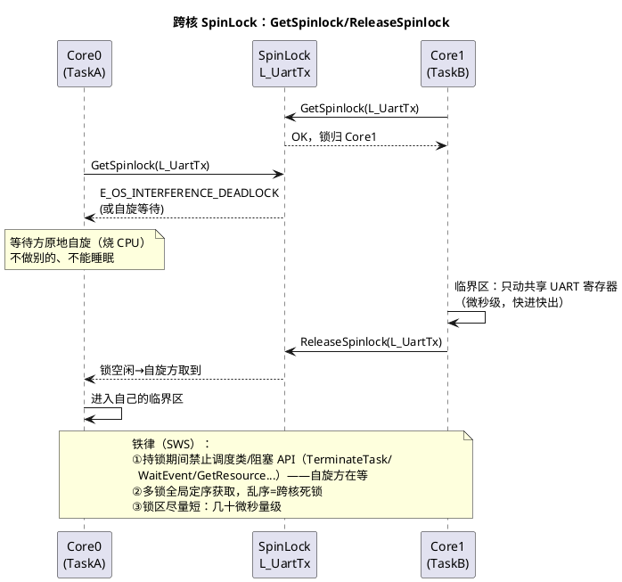

# 03-共享资源保护

> 一句话定位：跨核共享的每样东西都是雷——外设寄存器、全局变量、共享 RAM 区各有各的炸法；本篇给出风险清单、SpinLock 用法、屏障必要性与"一外设一核"的归属纪律。
> 等级：L2→L3 ｜ 前置：[01-主从核启动](01-主从核启动.md)

## 太长不看

> - 人话直觉：两核抢一口锅——谁都往里放菜就串味（数据竞争）；SpinLock 是锅上的锁（拿到才能动），屏障是"菜真下锅了才喊人吃"的保证。
> - 本篇解决：跨核共享的风险分类、SpinLock 正确用法、内存屏障何时必须、外设归属怎么划。
> - 赶时间记住：①能不共享就不共享——一外设一核；②必须共享的：数据走 IOC、临界区走 SpinLock（短）；③多锁全局定序，持锁不睡眠；④时序敏感处加屏障。

## 原理

### 跨核共享的风险清单

| 共享对象 | 风险 | 典型事故 |
|---|---|---|
| 外设寄存器（UART/SPI/ADC...） | 两核并发配置/读写，寄存器状态被搅乱 | 波特率被半途改写、DMA 描述符撕裂 |
| 全局变量（跨核裸读写） | 数据撕裂（非原子宽度）、读到半新半旧 | 64bit 时戳高32位是新值低32位是旧值 |
| 共享 RAM 区（缓冲/队列） | 读写指针竞态、覆盖未读数据 | 环形缓冲写指针追上读指针，数据无声丢失 |
| Cache 行（带缓存核间） | 一核改写、另一核读到旧缓存行 | TC377 性能核有缓存，共享数据一致性要维护 |

一句话总纲：**"裸共享"是原罪**——要么消灭共享（归属划分），要么给共享上保护（IOC/SpinLock），要么显式管理一致性（屏障/非缓存区）。

### SpinLock 机制：Get/Release 时序



SpinLock vs 核内 Resource 的分界（详见 [05-多核OS](../../2-L2进阶/系统服务栈/Os/05-多核OS.md)）：**Resource 靠优先级天花板，只在核内有效；跨核必须 SpinLock（对方核不看你的优先级，只能等锁）**。

### 跨核优先级反转：一句话级

持锁方（低优先级 Task）若被本核高优先级任务抢占而迟迟不释放，另一核的高优先级任务在锁上自旋干等——优先级"反转"跨核放大，且自旋还在烧对方核的 CPU。缓解靠两条纪律：锁区极短（减少被抢占窗口）+ 持锁不睡眠。

### 内存屏障：为什么锁还不够

SpinLock 保证"一次只有一个核进临界区"，但**不保证核内指令/访存顺序符合你的预期**：编译器重排、CPU 写缓冲，可能让"先写数据后置标志"变成对方核看到"标志已置数据还没落地"。跨核时序敏感的共享访问要屏障护体（读写屏障语义与用法详见 [读写时序与屏障](../../../01-编程语言/2-L2进阶/寄存器编程/04-读写时序与屏障.md)）。OS 的 SpinLock 实现通常内含必要屏障，但**锁外自己写的共享标志（握手、门铃）必须自己加**。

### 共享外设归属划分：一外设一核

```
外设归属清单（TC377 双核示例，工程化表格）
┌────────────────┬────────┬────────────────────────────┐
│ 外设            │ 归属核  │ 说明                        │
├────────────────┼────────┼────────────────────────────┤
│ CAN0/CAN1      │ Core0  │ 通讯栈整体在核0             │
│ UART(Diag)     │ Core0  │ 诊断独占                    │
│ ADC 组0        │ Core1  │ 算法采样独占                │
│ SPI(存储)      │ Core0  │ NvM 所在核                  │
│ STM0           │ Core1  │ 算法本地时戳                │
│ GPIO P10.x     │ Core1  │ 控制输出                    │
└────────────────┴────────┴────────────────────────────┘
划分原则：
① 一个外设只归一个核（含其全部配置/数据/中断）
② 必须两核用的外设：拆通道（SPI 片选分核、CAN 报文组分核）仍一外设一主
③ 归属写进架构文档+链接/配置评审清单，改动走变更流程
```

归属消灭了大多数共享——**最好的锁是不需要锁**。真正绕不开的跨核数据交换，优先 IOC（OS 内建互斥，见 [02-IOC与核间中断](02-IOC与核间中断.md)），IOC 装不下的复杂结构才手写 SpinLock 临界区。

## 详解

### 三级防护选型决策

1. **能归属**：外设/数据划给单一核 → 零同步开销（首选）；
2. **能 IOC**：跨核数据流（点对点、结构可拆）→ OS 生成的互斥通道；
3. **才手写**：复杂共享结构（多字段原子更新、环形缓冲）→ SpinLock 临界区+屏障，锁区最短化。

### 数据撕裂的直观理解

一个 64bit 变量，Core0 写低 32 位与高 32 位是两条指令；Core1 中间读——拿到"新低+旧高"。volatile 救不了这个（volatile 只保证不优化掉访问，不保证原子性）。解法：加锁、拆成 32bit、或双缓冲+序号（读两次序号一致才算数）。

### 死锁的两副面孔

- **锁序死锁**：Core0 持 A 求 B，Core1 持 B 求 A——全局锁序表（所有核同一顺序获取）预防；
- **自旋-睡眠死锁**：持锁方调 WaitEvent 睡了，等待方永远自旋——持锁禁睡眠纪律（SWS 明文）。
排查工具：调试器停全核看各核 PC 是否都卡在 GetSpinlock；OS 的锁监控（部分实现带超时检测/E_OS_INTERFERENCE_DEADLOCK 返回）。

### 缓存注意（TC377）

性能核（TC1.6.x+）带缓存，共享 RAM 区要么配非缓存段（链接脚本+MPU 属性），要么靠屏障+缓存维护——共享区配置错误的表现是"偶发读到旧值"，极难复现。共享数据默认放非缓存/共享属性段是省心做法。

## 配置层/工程关联

- Os 配置：`OsSpinLock`（每锁一条）+ `LockMethod`（压中断范围，LOCK_CAT2_INTERRUPTS 常用）+ 锁顺序（TrySpinlock/顺序约束进配置）——配置表即锁台账；
- 链接脚本：核私有段/共享段分区，共享段属性（非缓存/共享内存）——IOC 缓冲、握手标志、SpinLock 保护的数据都落共享段；
- 评审清单：①新共享数据的三问（能归属吗/能 IOC 吗/必须手写锁吗）；②多锁获取顺序；③锁区长度估计；④屏障点（锁外的共享标志）；
- 工具链：tresos Os 配置 SpinLock；外设归属清单用架构文档+中断归属配置（各核中断路由）双重落实。

## 易错点与陷阱

1. **volatile 当跨核保护**：只防编译器优化，防不了撕裂与乱序——volatile 是必要非充分，防护靠锁/IOC/屏障。
2. **锁区里调调度 API**：TerminateTask/WaitEvent/长 IO——自旋-睡眠死锁或 SWS 违例报错；锁内只动共享数据，取数出锁再处理。
3. **多锁乱序**：两核反序取两把锁，偶发互等死锁且复现率极低——全局锁序表+静态检查。
4. **锁粒度过大**：一把锁护整个发送流程（含计算+搬运），自旋排队把对方核利用率烧穿——锁只护真正的共享写。
5. **共享标志无屏障**：门铃/握手标志"先置标志后写数据"被重排，对方核看到铃没看到货——写数据→屏障→发信号。
6. **外设两边都配**：两核初始化代码各自配同一外设，后配的覆盖先配的——归属清单管到底，初始化只出一份。

## 面试高频题

1. 跨核共享有哪几类风险？各举一个事故形态。
   答：①外设寄存器——两核并发配置/读写搅乱状态（波特率被半途改写、DMA 描述符撕裂）；②全局变量裸读写——非原子宽度撕裂（64bit 时戳高 32 位新值低 32 位旧值）；③共享 RAM 缓冲/队列——读写指针竞态覆盖未读数据（环形缓冲写追上读，无声丢失）；④Cache 行——带缓存核一核改写另一核读到旧缓存行（偶发旧值，难复现）。总纲：裸共享是原罪——归属、上保护、或显式管一致性。
2. SpinLock 与 Resource 的区别？持 SpinLock 有哪些禁令？为什么？
   答：Resource 靠优先级天花板协议，只在核内有效；跨核只能 SpinLock——对方核不看你的优先级，抢不到锁就只能自旋等。禁令：持锁期间禁止调度类/阻塞 API（TerminateTask/WaitEvent/GetResource 等）——另一核可能在自旋烧 CPU 等你，你一睡眠就是自旋-睡眠死锁；另外多锁必须全局定序获取，乱序即跨核锁序死锁；锁区要短（微秒级），减少被抢占窗口与跨核优先级反转。
3. 有了 SpinLock 为什么还需要内存屏障？
   答：SpinLock 只保证"一次一个核进临界区"，不保证核内指令/访存顺序——编译器重排与写缓冲可能让"先写数据后置标志"在对方核看来是"标志已置、数据未落地"（看见铃没看见货）。OS 的 SpinLock 实现通常内含必要屏障，但锁外自己写的共享标志（握手、门铃）必须自己加：写数据→屏障→再发信号。
4. 如何设计多核系统的外设与数据归属？谈谈"一外设一核"。
   答：三级决策：能归属则归属（一个外设连同配置/数据/中断只归一个核，零同步开销，"最好的锁是不需要锁"）；必须两核用的拆通道仍一外设一主（SPI 片选分核、CAN 报文组分核）；跨核数据优先 IOC（OS 内建互斥），IOC 装不下的复杂结构才手写 SpinLock+屏障，锁区最短化。归属清单写进架构文档与配置评审，改动走变更流程；共享数据默认放非缓存/共享属性段。

## 延伸

- [01-主从核启动](01-主从核启动.md)：共享资源在启动期的时序陷阱
- [02-IOC与核间中断](02-IOC与核间中断.md)：替代手写锁的 IOC 通道
- [05-多核OS](../../2-L2进阶/系统服务栈/Os/05-多核OS.md)：SpinLock 的 OS 规范语义
- [读写时序与屏障](../../../01-编程语言/2-L2进阶/寄存器编程/04-读写时序与屏障.md)：屏障与原子性的语言级基础
- [03-核间通讯与共享资源](../../../02-芯片与体系结构/3-L3高级/多核架构/03-核间通讯与共享资源.md)：硬件视角的共享内存与一致性
- 工程深入场景：多核偶发"日志时戳跳变"定位实录——共享 64bit 时戳被跨核裸读写，改造成"写方持 SpinLock 写+读方双读校验"，再把时戳改由归属核单一维护、他核经 IOC 取快照；三步各自用压力测试复现率对比验证（改造前千次一现→归零），最后把"共享变量清单"做成 CI 静态扫描项，防新增裸共享。
