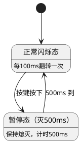
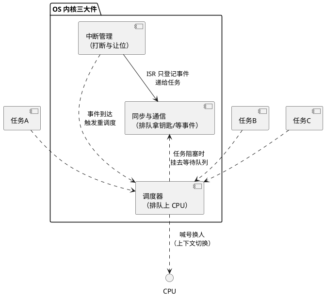

# 从前后台到 RTOS——操作系统全景

> 一句话定位：用一个 LED 程序的三次进化，把"为什么需要操作系统、操作系统到底替你管了什么"一次讲透，为整个 08 区建立全景坐标。
> 等级：L1 ｜ 前置：无

## 0. 开场：同一个需求，三种世界

需求很简单：一个 ECU 上的 LED，要 100ms 闪一次；同时按一下按键，LED 要立刻停 500ms 再恢复闪烁。

就这一个需求，裸机能做、状态机能做、RTOS 也能做——但代码的样子、好改的程度、出 bug 的方式完全不同。本文让这个 LED 程序进化三次，每进化一次，都多出一份"操作系统才会给你的东西"。读完你会明白：**操作系统不是必需品，是管理复杂度的工具**；什么时候值得请它出场，什么时候它反而是累赘。

## 1. 第一次进化：前后台大循环

最早的写法，`main()` 里一个 `while(1)`，转圈：

```c
int main(void)
{
    SystemInit();
    while (1)
    {
        LED_Toggle();          /* 每圈翻一次 LED */
        Delay_ms(100);         /* 阻塞延时 100ms */
        Key_Scan();            /* 顺手看一眼按键 */
    }
}
```

这叫**前后台系统**（术语按 Labrosse《μC/OS-II》以来的通行约定）：`while(1)` 大循环跑在**后台**，是程序主体；中断（比如按键触发的外部中断）是**前台**，随到随处理，打断后台干点急活再放回去。

它的账很好算：**没有 OS，代码即流程**。但它立刻暴露两个痛点——

- **延时靠死等**：`Delay_ms(100)` 期间 CPU 什么都不能干，按键很可能被错过（按下的那一下正好落在死等里）；
- **节奏绑死在圈上**：想再加一个"每 10ms 采一次 ADC"，就得把大循环拆碎重排——功能越多，循环体越难改。

这是 08 区 [1-L1基础/裸机与状态机编程](../1-L1基础/裸机与状态机编程/README.md) 的起点。

## 2. 第二次进化：时间片轮询——把"节奏"从循环里解放出来

第一刀改进：不再死等，让一个定时器中断每 1ms 打一次拍子，主循环里按拍子办事：

```c
volatile uint8 tick_10ms, tick_100ms;

void Timer_ISR(void)   /* 每 1ms 一次，前台 */
{
    if (++g_ms >= 10)  { g_ms = 0; tick_10ms = 1; }
    if (++g_100 >= 100){ g_100 = 0; tick_100ms = 1; }
}

int main(void)
{
    SystemInit();
    while (1)
    {
        if (tick_100ms) { tick_100ms = 0; LED_Toggle(); }
        if (tick_10ms)  { tick_10ms  = 0; Key_Scan();   }
    }
}
```

CPU 不再死等，转圈很快，谁的时间到了就伺候谁。这就是**时间片轮询**：中断当节拍器，主循环当办事窗口。

但需求里还有"按一下停 500ms 再恢复"——这是一个**有记忆的行为**：LED 现在"正常闪"，按键后进入"暂停态"，500ms 后回到"正常闪"。硬写在循环里会到处插 `if`，越写越乱。更清醒的做法是把 LED 的行为画成状态机：



**事件驱动状态机**：状态只有几个，事件只有几类，任何时刻程序"在哪个状态、收到什么事件、做什么动作、去哪个状态"一张表说清。这是裸机世界的顶点——**不加 OS 也能把复杂逻辑管得明明白白**。

到这里，裸机的三板斧（前后台、时间片轮询、事件驱动状态机）已经用完。它们管住了"节奏"和"流程"，但有三样东西始终没人管：

- 两个模块同时想用一段内存/一个外设，谁先谁后？
- 按键响应（急活）和 LED 闪烁（慢活）如果各写各的循环段，急活凭什么保证先跑？
- 每个模块自己的等待（等 500ms、等通讯应答）都在消耗同一条主循环。

这三样，正是操作系统出场时自带的行李。

## 3. 第三次进化：RTOS 多任务——每个模块活在自己的"进程感"里

请出 RTOS，程序变成这样：

```c
void Task_LED(void *arg)      /* 优先级低 */
{
    for (;;)
    {
        LED_Toggle();
        Osal_Delay(100);      /* 延时让出 CPU，不是死等 */
    }
}

void Task_Key(void *arg)      /* 优先级高 */
{
    for (;;)
    {
        if (Key_Pressed())
            Take_Mutex(&led_ctrl);   /* 告诉 LED：暂停 500ms */
        Osal_Delay(10);
    }
}
```

看直觉上发生了什么：**每个模块都以为自己独占 CPU**，各自一个 `for(;;)` 死循环，想延时就延时——RTOS 在背后悄悄地换人。这就是 RTOS 给的第一样东西：**任务（Task）**——把"一件事"包成独立单位，配一个优先级，剩下的交给 OS。

| 裸机的痛 | RTOS 给了什么 | 一句话直觉 |
|---|---|---|
| 主循环里插不进急活，响应时间没保证 | **任务 + 优先级抢占调度** | 急事排前面，OS 随时换人上 CPU |
| 模块间共用资源靠人肉约定，忘了就踩踏 | **信号量 / 互斥锁** | 共用的东西配把钥匙，排队拿、用完还 |
| 每个模块的等待都在消耗唯一的循环 | **阻塞式 API**（延时/等事件/收消息） | 等的时候让位给别人，事件到了 OS 叫你 |
| 想让模块间传数据，只能塞全局变量 | **消息队列 / 事件** | 像寄快递，发件人收件人各干各的 |
| 中断里不敢干活，只能在主循环里到处查询 | **ISR 与任务分工**（延迟处理） | 中断只登记，重活回任务里干 |

这张表就是整个 08 区的目录预告：右列每一行，都对应后面一个子目录。

## 4. OS 内核三大件：排队上 CPU、排队拿钥匙、打断与让位

剥掉各种 RTOS 的名字差异，内核干的活就是三件，件件都是"排队"：

### 4.1 调度 = 排队上 CPU

CPU 只有一颗（先说单核），任务有很多个。调度器就是那个喊号的：按优先级从就绪队列里挑一个上 CPU；时间片轮转时人人有份；任务调了延时/等信号，就被挪去"等待区"，CPU 立刻让给下一位。**上下文切换**就是换人时把上一位的现场（寄存器、栈）存好、把下一位的现场恢复——快的话几微秒。

### 4.2 同步 = 排队拿钥匙

多个任务共用一个资源（一段内存、一个外设），不排队就会踩踏（读到一半被改）。互斥锁就是那把钥匙：拿到钥匙的用，没拿到的排队睡；钥匙一还，OS 叫醒队首。信号量、事件组、消息队列都是"排队等某个条件成立"的变体。钥匙制度玩不好会出两个名场面：**优先级反转**（低优先级拿着钥匙，高优先级干等，中间优先级插队）和**死锁**（你拿我的等我，我拿你的等你）。

### 4.3 中断管理 = 打断与让位

中断比一切任务都急，随时打断当前在跑的任何人。但 ISR 里不能久留（别人都停着呢），所以成熟的做法是"**顶半快速登记、底半回任务慢慢干**"。OS 在这里的贡献：提供"从 ISR 安全地把事件递给任务"的通道，以及在临界区里暂时关中断/锁调度的手段。

三大件拧在一起的全景：



看懂这张图，任何一本 RTOS 书的前三章你都可以快速略读——它们都是在讲这三件事的某一面。

## 5. 全景坐标：OSEK/AUTOSAR OS 与 Linux 在哪

本区后面按带展开，先把全景坐标钉死：

- **1-L1基础**：先从[裸机与状态机编程](../1-L1基础/裸机与状态机编程/README.md)吃透裸机三板斧，再进 [RTOS通用原理](../1-L1基础/RTOS通用原理/README.md)——三大件的概念主阵地，通吃所有 OS；[RTX](../1-L1基础/RTX/README.md) 顺带一读；
- **2-L2进阶**：[OSEK与AUTOSAR-OS](../2-L2进阶/OSEK与AUTOSAR-OS/README.md) 是汽车人的主业——OSEK 内核本质 + 商业 OS 对比（怎么生成任务、静态配置的哲学）；[FreeRTOS](../2-L2进阶/FreeRTOS/README.md) 用开源源码当三大件的实物教材对照学习；RT-Thread、VxWorks 各一篇概览；
- **3-L3高级**：[嵌入式Linux](../3-L3高级/嵌入式Linux/README.md) 是跨界进阶方向，点到即止。

一句带过 AUTOSAR OS 的位置：它在全景图里就是"OSEK 内核（静态任务、优先级抢占、事件与资源）+ 汽车安全扩展"，**怎么在 ECU 里配置它**（任务映射、Alarm、Hook）属于 07 区的正业，见 [07-AUTOSAR架构/2-L2进阶/系统服务栈/Os](../../07-AUTOSAR架构/2-L2进阶/系统服务栈/Os/README.md)——本区只讲它的内核原理本质，两区互链不重复。

## 6. 下一步读什么

1. [1-L1基础/裸机与状态机编程](../1-L1基础/裸机与状态机编程/README.md)：把本文第 1、2 节的进化前两步落成正式笔记——前后台、时间片轮询、事件驱动状态机；
2. [1-L1基础/RTOS通用原理/任务调度原理](../1-L1基础/RTOS通用原理/任务调度原理/README.md)：三大件之"排队上 CPU"，任务状态机与上下文切换；
3. [1-L1基础/RTOS通用原理/同步与互斥](../1-L1基础/RTOS通用原理/同步与互斥/README.md)：三大件之"排队拿钥匙"，优先级反转必懂；
4. [2-L2进阶/OSEK与AUTOSAR-OS](../2-L2进阶/OSEK与AUTOSAR-OS/README.md)：回到汽车主业，看 OSEK 内核如何把三大件做成静态配置；
5. [2-L2进阶/FreeRTOS](../2-L2进阶/FreeRTOS/README.md)：对照开源实现验证你对三大件的理解。

---

维护约定：笔记命名 `序号-主题.md`；真实截图放 `_images/`；流程/时序/状态/架构图用 PlantUML 内嵌正文，规范见 [图表规范与模板](../../00-总览/图表规范与模板.md)。
