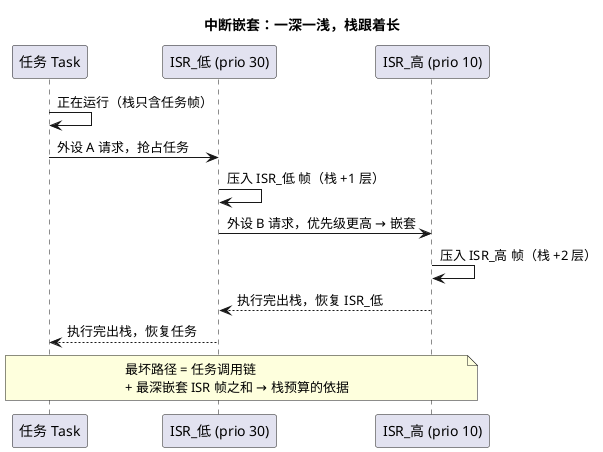

# 01-中断嵌套

> 一句话定位：中断嵌套不是"开了就行"，而是一笔用优先级分组换响应、用栈深付账的交易——本文讲清谁能嵌套谁、嵌套时栈往哪长、RTOS 在哪里划红线。
> 等级：L2 ｜ 前置：[从前后台到RTOS-操作系统全景](../../../00-入门导读/01-从前后台到RTOS-操作系统全景.md)

## 核心概念

中断嵌套：ISR 执行期间，**抢占优先级更高**的新中断到来，硬件保存当前 ISR 现场、转去执行高优 ISR，返回后继续低优 ISR。它让"更急的活"不等"次急的活"，代价是**栈深增加 + 低优 ISR 时延抖动**。

三个关键区分：

- **抢占优先级（组优先级）**：决定能否嵌套——只有抢占优先级更高才能打断当前 active 的中断；
- **子优先级**：只在抢占级相同时决定硬件排队先后，**不产生嵌套**；
- **优先级分组（Grouping）**：把有限位数切成"抢占位 + 子位"，是压嵌套深度的第一手段。

## 详解

### 1. 硬件侧：谁裁嵌套

| 平台 | 仲裁者 | 数值方向 | 嵌套判定 |
|---|---|---|---|
| S32K（Cortex-M） | NVIC，`AIRCR.PRIGROUP` 划分抢占位/子位 | 数值越小优先级越高 | 新中断抢占级数值 < 当前 active 才嵌套 |
| TC377（TriCore） | IR 模块仲裁各 SRN（Service Request Node） | 数值越大优先级越高，**0 = 禁用** | 新中断优先级数值 > 当前才嵌套 |

两平台数值方向**相反**，从 S32K 迁到 TC377 的工程师最容易在这里配反：现象是一个"以为很急"的中断总被压着，或干脆不触发。

### 2. OS 侧：类别 1 / 类别 2 ISR（AUTOSAR OS）

- **类别 1（Category 1）**：直接挂硬件向量表，**不经过 OS**——最快，但不能调任何 OS 服务（`SetEvent`/`ActivateTask` 都不行），OS 也不知道它的存在（不统计开销、不受 OS 临界区管控的框架保护）；
- **类别 2（Category 2）**：OS 生成 ISR 框架（前缀/后缀）包住用户函数，允许调 OS 服务，返回用户级前触发重调度——代价是入口/出口多一些指令。

选型直觉：纯粹"抄个寄存器、写个标志位"的极高优中断用类别 1；需要**唤醒任务**的中断一律类别 2。

### 3. FreeRTOS 的红线：configMAX_SYSCALL_INTERRUPT_PRIORITY

Cortex-M 端口下，`configMAX_SYSCALL_INTERRUPT_PRIORITY`（数值上）以上的中断会被内核临界区屏蔽（`taskENTER_CRITICAL` 提升 BASEPRI）。因此：

- **可以调 `xQueueSendFromISR` 等 FromISR API 的中断**：逻辑上必须"弱于或等于"这条红线（NVIC 数值 ≥ 该宏），否则临界区屏蔽不住它，内核链表会被撕裂；
- **绝不进内核、只干极短硬件活的中断**：可以比红线更急，但不许碰任何 FreeRTOS API。

注意 FreeRTOS 里"任务优先级数值越大越高、NVIC 中断优先级数值越小越高"，两套方向相反，配置时必看注释。

### 4. 嵌套的账本：栈与时延

- **栈**：Cortex-M 上 handler 模式用 MSP，FreeRTOS 把 MSP 用作独立中断栈，任务栈（PSP）不背中断帧；但多数 OSEK/AUTOSAR OS 端口把 ISR 帧压在**被打断任务的栈**上——所以 07 区反复强调"栈预算 = 调用链 + 最大 ISR 嵌套帧 + 余量"（见 [01-任务与调度](../../../../07-AUTOSAR架构/2-L2进阶/系统服务栈/Os/01-任务与调度.md)）。**端口实现不同，公式就不同，先确认移植层**；
- **时延**：嵌套把低优 ISR 的完成时间推后（最坏 = 所有更高优 ISR 之和），对"中断必须 N µs 内完成"的指标，要按最坏嵌套链算，而不是平均值。

### 5. 压嵌套深度的三招

1. **优先级分组收口**：Cortex-M 4 位优先级切成"1 抢占位 + 3 子位"，则任意时刻最多 2 层中断（抢占级只有两档），同档内 8 个子级全部排队执行——栈预算直接从"最深 16 层"降到"最深 2 层"；
2. **屏蔽阈值抬底**：Cortex-M 设 `BASEPRI`，把低于某数值（更不急）的中断整体挡住；TriCore 天然按 ICR 里的当前优先级数值判定能否进入，效果等价——本质都是给"此刻谁有资格打断我"画一条线；
3. **ISR 本身瘦身**：把 ISR 拆成"顶半登记 + 任务处理"（见 [04-顶半底半](04-顶半底半.md)），单层 ISR 执行时间越短，嵌套窗口越小，即便发生也很快退出去。

嵌套深度的实测办法：在 ISR 入口/出口翻转 GPIO，用逻辑分析仪量电平叠加层数与最长占用时间——比读代码可靠得多。

## 易错点与陷阱
1. **开了嵌套后偶发栈溢出复位**：任务本体够用，最深中断嵌套帧一压就爆——对策：按"最深嵌套链"重算栈预算并留 20~30% 余量，配合 [02-栈溢出检测](../内存管理/02-栈溢出检测.md) 验证。
2. **高优先级中断里调 FromISR API 死机**：该中断比 `configMAX_SYSCALL_INTERRUPT_PRIORITY` 更急，内核临界区挡不住它——对策：要调 API 就降到红线之下，或拆成类别 1 抄数据 + 类别 2 递交。
3. **同抢占级两个中断"不嵌套"被当成 bug**：子优先级只排队不抢占——对策：真需要嵌套的两级必须放不同抢占组。
4. **类别 1 ISR 里调 `ActivateTask` 无效甚至跑飞**：类别 1 不经 OS 框架，没有重调度点——对策：升级为类别 2，或改成"类别 1 置标志 + 任务轮询"。
5. **S32K→TC377 移植后中断不触发**：AURIX 优先级 0 表示禁用、数值越大越急，直接照搬 Cortex-M 习惯配了小数值——对策：按平台方向重配（见 [03-中断优先级实践](../../../../02-芯片与体系结构/2-L2进阶/TC377平台/中断系统/03-中断优先级实践.md)）。
6. **中断延迟指标不达标**：低优 ISR 里关中断太久或干重活，高优被压住——对策：ISR 顶半化（见 [04-顶半底半](04-顶半底半.md)），统计最长关中断时长。

## 面试高频题

**Q：中断嵌套发生的条件是什么？**
答：新到中断的抢占优先级高于当前正在执行的 ISR（且未被屏蔽/未超 BASEPRI 阈值）；仅子优先级更高只能排队，不能嵌套。ARM Cortex-M 由 NVIC 在硬件入栈后比较抢占级决定是否取新向量。

**Q：ISR 嵌套时，现场保存在哪？和任务上下文切换有何不同？**
答：Cortex-M 硬件自动压 8 个寄存器（R0-R3、R12、LR、PC、xPSR）到当前 handler 栈（MSP），其余由 ISR 编译代码按需压；任务切换则由 PendSV 在最低优先级统一做，软件压完整上下文到任务栈（PSP）。OSEK 类端口则常把 ISR 帧压在被打断任务的栈上，因此任务栈预算必须含中断帧。

**Q：AUTOSAR OS 类别 1 和类别 2 中断的区别？**
答：类别 1 不经 OS、直接挂向量表，不能调用 OS 服务，OS 不可见；类别 2 由 OS 框架包裹，可调 `SetEvent`/`ActivateTask` 等服务，退出时触发重调度，且受 OS 中断管理（如 `SuspendAllInterrupts` 会屏蔽它）。需要与任务交互的 ISR 选类别 2，只做极短硬件操作的选类别 1。

**Q：为什么说"优先级分组"能控制嵌套深度？**
答：把抢占位划少、子位划多，会让更多中断落在同一抢占组——同组内只排队不嵌套，等于给这组中断加了一道"组内互斥"，最坏嵌套深度被压到组数级别，栈预算和时延分析都更容易做；代价是组内高子优级也要等低子优级做完。

## 延伸

- [02-临界区](02-临界区.md)：嵌套的"刹车"——关中断与锁调度的层次；
- [02-NVIC与中断](../../../../02-芯片与体系结构/1-L1基础/ARM-Cortex-M/02-NVIC与中断.md)：Cortex-M 侧抢占/子优先级寄存器细节；
- [03-中断优先级实践](../../../../02-芯片与体系结构/2-L2进阶/TC377平台/中断系统/03-中断优先级实践.md)：TC377 侧优先级配置与 AURIX 方向坑；
- [01-任务与调度](../../../../07-AUTOSAR架构/2-L2进阶/系统服务栈/Os/01-任务与调度.md)：类别 2 中断返回是四大调度点之一，含栈预算公式。