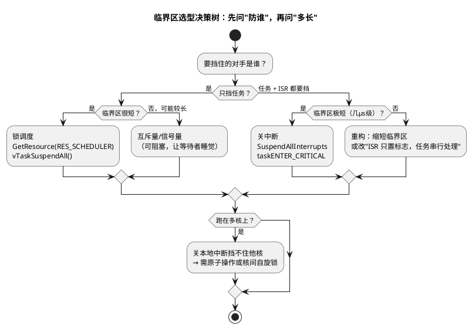

# 02-临界区

> 一句话定位：临界区是并发世界里"这一段必须独占"的声明——本文给出从"防谁、多长、可否阻塞"三问到 AUTOSAR 三层原语与 FreeRTOS 对应 API 的完整选型地图。
> 等级：L2 ｜ 前置：[01-中断嵌套](01-中断嵌套.md)

## 核心概念

**临界区（Critical Section）**：访问共享资源（全局变量、外设寄存器、链表）时，一旦执行到一半被打断、另一执行流也进来改，不变量即被破坏的那段代码。它不是"跑得慢的代码"，而是"不能被并发进入的代码"。

给一段代码上锁前，先问三个问题：

三问之外还有一条铁律：**临界区里不做任何可能阻塞的事**。

## 详解

### 1. AUTOSAR OS 的三层原语

| 原语 | 挡任务 | 挡 ISR | 可嵌套 | 典型用途 |
|---|---|---|---|---|
| `GetResource(RES_SCHEDULER)` | 是（天花板=最高任务优先级） | 否 | 与其他资源同规则 | 只需任务互斥的短段 |
| `SuspendOSInterrupts` | 否 | OS 管的中断（Tick、类别 2） | 计数式，须配对 | 防类别 2 ISR 的短段，比全关快 |
| `SuspendAllInterrupts` | 否 | 所有可屏蔽中断 | 计数式，须配对 | 防一切 ISR 的极短段 |

要点：`SuspendAllInterrupts` 最终落到平台关中断指令，**连类别 1 中断也一并挡住**；`SuspendOSInterrupts` 只挡 OS 托管中断，**类别 1 不受影响**——所以"这段必须绝对安静"与"更急的类别 1 还得跑"两种诉求要分开选。

### 2. FreeRTOS 的对应物

| FreeRTOS API | 挡任务 | 挡 ISR | 说明 |
|---|---|---|---|
| `taskENTER_CRITICAL()` | 是 | 挡到 `configMAX_SYSCALL_INTERRUPT_PRIORITY` | 进出置 BASEPRI，嵌套计数 |
| `vTaskSuspendAll()` | 是（锁调度） | 否 | 不关中断，中断仍可进但退出 ISR 不切换 |
| 互斥量 `xSemaphoreTake` | 是 | 否 | 优先级继承，可阻塞等待 |
| `portSET_INTERRUPT_MASK_FROM_ISR()` | — | — | ISR 内部保护内核数据的入口配套 |

### 3. 临界区纪律（Code Review 清单）

1. **短**：几行赋值/判断为目标；超过十几行就要重审"能否把耗时段搬出去"；
2. **无阻塞**：不许 `vTaskDelay`、等队列、等互斥量、`printf`、`malloc`；
3. **进出配对**：所有 `return`/错误分支都要走到 Resume；
4. **不跨调用未知代码**：临界区里不调回调/函数指针，长度不可控；
5. **时长有账**：最长关中断时间 = 可容忍的最高优中断延迟 − 该 ISR 执行时间，逐处登记。

### 4. 关中断与系统时基

SysTick 也是中断：关中断期间 tick 到来会挂起（pending），若同周期内多次到期只记一次——**系统时间变慢**，所有超时、调度周期跟着漂。所以"长时间关中断"的典型症状是：周期任务周期悄悄变长、超时误报。CPU 负载率统计也会失真。

## 易错点与陷阱

1. **现象：系统假死、只剩最高优中断还能跑**——原因：某条早退 `return` 漏了 `ResumeAllInterrupts`，全局中断屏蔽计数没清零——对策：进出用宏包裹、统一出口（goto cleanup 或 do-while(0)），静态检查配对。
2. **现象：`vTaskSuspendAll` 后调 `xQueueSend` 触发断言/死等**——原因：锁调度期间不允许任何可能阻塞的内核调用——对策：临界区内只碰变量，通信搬到区外。
3. **现象：关中断保护了变量，CAN 还是丢报文**——原因：关中断时长超过报文间隔，外设 FIFO 溢出——对策：把格式化、拷贝大块数据移出临界区，临界区只留"取索引/换指针"。
4. **现象：以为 `GetResource(RES_SCHEDULER)` 万能，变量仍被 ISR 改**——原因：它只挡任务不挡中断——对策：ISR 也碰的共享数据必须用关中断/原子（见 [03-ISR与任务交互](03-ISR与任务交互.md)）。
5. **现象：多核项目里"关了中断"还是偶发数据撕裂**——原因：关的只是本核中断，另一核照常访问——对策：共享计数用原子操作，跨核结构用核间锁或单生产者单消费者无锁队列。
6. **现象：周期任务周期偶发变长 1ms**——原因：别处长关中断把 SysTick 合并了——对策：按纪律第 5 条查最长关中断点，用 GPIO+逻辑分析仪定位。

## 面试高频题

**Q：实现临界区有哪几种手段？各自挡得住谁？**
答：①关中断（挡一切 ISR 与任务，最重、时延影响最大）；②锁调度（挡任务切换，不挡 ISR，如 RES_SCHEDULER/vTaskSuspendAll）；③互斥量/信号量（只挡任务，可阻塞等待，带优先级处理）。按"对手是谁"选最小够用的那档。

**Q：为什么临界区内不能调用阻塞 API？**
答：阻塞 API 让当前任务进入等待态并触发调度；关中断/锁调度状态下调度被禁止，内核要么断言报错、要么永远等不到唤醒条件变成死锁；即便允许，也会把"极短关中断"拖成"长期关中断"，破坏实时性。

**Q：`taskENTER_CRITICAL()` 和 `vTaskSuspendAll()` 有什么区别？**
答：前者提升 BASEPRI，把不高于 `configMAX_SYSCALL_INTERRUPT_PRIORITY` 的中断也屏蔽掉，任务和 ISR 一起挡，适合保护"ISR 与任务共享"的数据；后者只禁止任务切换，中断照常响应、ISR 里还能用 FromISR API，适合"仅任务间共享"的稍长临界区，且不增加中断延迟。

**Q：AUTOSAR 里 `SuspendAllInterrupts` 与 `SuspendOSInterrupts` 怎么选？**
答：前者屏蔽所有可屏蔽中断（含类别 1 所依赖的平台中断），保护最彻底、代价最大；后者只屏蔽 OS 托管的中断（Tick、类别 2），入口开销更小，但挡不住类别 1。若临界区内共享的数据类别 1 ISR 也会碰，必须用前者。

## 延伸

- [03-ISR与任务交互](03-ISR与任务交互.md)：ISR 与任务共享数据的通信套路；
- [同步与互斥](../同步与互斥/README.md)：互斥量、信号量与优先级反转的系统展开；
- [02-事件与资源](../../../../07-AUTOSAR架构/2-L2进阶/系统服务栈/Os/02-事件与资源.md)：RES_SCHEDULER 与优先级天花板的原生语境；
- [02-NVIC与中断](../../../../02-芯片与体系结构/1-L1基础/ARM-Cortex-M/02-NVIC与中断.md)：BASEPRI/PRIMASK 屏蔽寄存器细节。