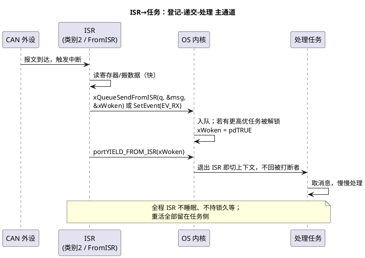

# 03-ISR与任务交互

> 一句话定位：ISR 是"借来的执行流"——本文用一张能做/不能做表划清它与任务的边界，再给出从二值信号量、FromISR 队列到任务通知的三条递货通道，以及共享裸数据时的保护要领。
> 等级：L2 ｜ 前置：[02-临界区](02-临界区.md)

## 核心概念

ISR 没有自己的任务身份：它借被打断者的现场执行、借（任务栈或中断）栈用、不能"等任何东西"。**ISR 的本职是"登记"，任务的本职是"处理"**——两者之间需要一个 OS 提供的安全通道。



## 详解

### 1. ISR 能做 / 不能做（双平台对照）

| 行为 | FreeRTOS ISR 内 | AUTOSAR 类别 2 ISR 内 | 原因 |
|---|---|---|---|
| 置标志/读写外设寄存器 | 可以 | 可以 | 纯内存/寄存器操作 |
| 唤醒任务 | FromISR API / 任务通知 | `SetEvent` / `ActivateTask` | 内核提供的 ISR 安全入口 |
| 传数据 | `xQueueSendFromISR` | Ioc_Send / 全局缓冲 | 不阻塞、短临界区实现 |
| 阻塞等待 | **禁止** | **禁止**（服务返回 E_OS_CALLEVEL 或阻塞类服务非法） | ISR 无阻塞语义，等=卡死所有人 |
| `vTaskDelay`/`WaitEvent`/`Sleep` | **禁止** | **禁止** | 同上 |
| `malloc`/`printf`/文件 IO | **禁止** | **禁止** | 堆非重入、耗时不可控 |
| `TerminateTask`/`ChainTask` | — | **禁止**（任务级服务） | E_OS_CALLEVEL |
| 非任务版内核 API（`xQueueSend` 等） | **禁止** | — | 内部可能阻塞/临界区假设不同 |

### 2. FromISR 语义三件套

1. **API 名带 FromISR**：内部用"锁调度+短关中断"保护队列，且绝不把调用者挂起；
2. **`pxHigherPriorityTaskWoken`**：本次递交若解锁了比"被打断任务"更高优的任务则置 pdTRUE——内核借它告诉 ISR "外面有人比你当前更急"；
3. **`portYIELD_FROM_ISR(x)`**：ISR 退出前请求 PendSV 立即切换。不调用它也能工作，但唤醒会推迟到下一个调度点（最坏一个 tick），实时指标直接劣化。

### 3. 三条递货通道怎么选

| 通道 | 携带数据 | 开销 | 适用 |
|---|---|---|---|
| 二值信号量 | 无（纯"有事"） | 低 | 事件型唤醒："来活了" |
| 队列 FromISR | 有（拷贝 N 字节） | 中 | 每次事件带不同数据（CAN 帧、采样值） |
| 任务通知 | 可带 32 位值/位事件 | 最低（直达 TCB） | 点对点、无第三方旁观者 |
| AUTOSAR：`SetEvent` | 事件掩码位 | 低 | 扩展任务事件循环 |
| AUTOSAR：`ActivateTask` | 无 | 低 | 基本任务、丢前次结果也无妨的周期处理 |
| AUTOSAR：Ioc | 有（可跨核） | 中 | OS 生成的 ISR/任务/核间数据通道 |

选型口诀：**只报信用信号量，带数据用队列，点对点且要快要省用通知/事件**。

### 4. 共享裸变量：能不碰就不碰

ISR 与任务共享一个 `volatile uint32` 仍不够——`volatile` 只保证"每次都真读内存"，不保证读-改-写原子。任务侧要改它时必须进短临界区（`taskENTER_CRITICAL` / `SuspendAllInterrupts`），或干脆用原子操作；更彻底的做法是"ISR 只写、任务只读"的单向数据 + 序号校验（详见 [02-竞态排查](../死锁与竞态分析/02-竞态排查.md)）。

### 5. 一段标准骨架（FreeRTOS 版）

```c
volatile uint32_t g_rx_count = 0;          /* ISR 写、任务读 */

void CAN_RX_IRQHandler(void)               /* 优先级数值 >= configMAX_SYSCALL_INTERRUPT_PRIORITY */
{
    BaseType_t woken = pdFALSE;
    Can_Msg_t msg;
    Can_ReadHw(&msg);                      /* 快：读寄存器/FIFO */
    (void)xQueueSendFromISR(g_canQ, &msg, &woken);   /* 递数据 */
    g_rx_count++;                          /* 单写者，安全 */
    portYIELD_FROM_ISR(woken);             /* 尾部统一判一次 */
}

void Task_CanProc(void *arg)               /* 处理侧：所有重活在这 */
{
    Can_Msg_t msg;
    for (;;)
    {
        if (xQueueReceive(g_canQ, &msg, portMAX_DELAY) == pdPASS)
        {
            Can_Dispatch(&msg);            /* 解析、转发、打印都在任务里 */
        }
    }
}
```

对照 AUTOSAR 版：ISR 换成类别 2，`xQueueSendFromISR` 换成 `SetEvent(Task_CanProc, EV_CAN_RX)`（数据放全局环形缓冲）或 `IocSend_Can(msg)`，其余结构完全同构——**登记在 ISR，处理在任务**。

## 易错点与陷阱
1. **现象：偶发 HardFault，栈里指向队列函数**——原因：ISR 里调了任务版 `xQueueSend`，其内部可能阻塞——对策：换 FromISR 版本；打开 `configASSERT` 让它在开发期就炸出来。
2. **现象：任务唤醒总是慢约 1ms（一个 tick）**——原因：ISR 尾部没调 `portYIELD_FROM_ISR`，唤醒被推迟到下个调度点——对策：检查 `xHigherPriorityTaskWoken` 是否被消费。
3. **现象：高频事件偶发丢失、计数对不上**——原因：二值信号量只有 0/1 两态，连到两次事件只保留一次——对策：事件要计数用计数信号量/队列长度=最深突发。
4. **现象：调试时一开 printf 系统就死**——原因：printf 族非重入且吃栈吃时间，在 ISR 里调用等于放大一百倍——对策：ISR 里最多置错误码，打印搬进任务。
5. **现象：同类中断多实例共享一个 ISR，行为时对时错**——原因：每个实例各自 Send 后多次 yield，或共享静态缓冲未加保护——对策：按实例分缓冲；yield 只需在最后判一次。
6. **现象：变量改了任务读不到"新值"又偶发读到半新半旧**——原因：缺 `volatile`（编译器缓存）＋非原子访问（结构体撕裂）两病并发——对策：`volatile` 管可见性、临界区/原子管原子性，两个都要。

## 面试高频题

**Q：为什么 FreeRTOS 把 ISR 版 API 单独做成 FromISR 系列？**
答：任务版 API 假设"调用者是个任务、可以阻塞、可被调度走"；ISR 里这些假设全不成立——阻塞会让所有优先级一起停摆。FromISR 版本实现上保证不阻塞、临界区极短，并通过 `pxHigherPriorityTaskWoken` 把"该不该立刻切换"的判断交回 ISR 尾部统一处理。

**Q：`pxHigherPriorityTaskWoken` 不置位/不消费各有什么后果？**
答：不置位（内核自动置，但你不传变量）：等同于丢失"有人更急"的信息；不消费（不调 `portYIELD_FROM_ISR`）：功能仍正确，但刚解锁的高优任务要等到下一个调度点才上 CPU，实时性劣化最多一个 tick。正确姿势：初值 pdFALSE，传入 API，退出前 `portYIELD_FROM_ISR(x)`。

**Q：ISR 到任务传数据，何时用队列、何时用共享变量？**
答：数据小且"每次事件独立成包"用队列（自带互斥与排队语义，代价是拷贝）；数据大/速率高用共享缓冲+信号量报信（避免拷贝，但缓冲管理要自己做：环形队列、双缓冲）；点对点单值用任务通知最省。判断标准是"拷贝成本 vs 自己管同步的出错风险"。

**Q：AUTOSAR 类别 2 ISR 里把数据给任务的合法途径有哪些？**
答：①`SetEvent` 唤醒扩展任务（任务自己去取数据）；②`ActivateTask` 激活基本任务；③Ioc（IOC）发送——OS 配置工具生成的 ISR 安全、可跨核的数据通道；④写全局缓冲 + 事件报信（缓冲访问须自行保证互斥）。直接在 ISR 里等待任务结果或调用任务级服务都非法。

## 延伸

- [04-顶半底半](04-顶半底半.md)：把"登记-处理"拆分做成系统级设计；
- [02-事件与资源](../../../../07-AUTOSAR架构/2-L2进阶/系统服务栈/Os/02-事件与资源.md)：SetEvent 事件循环与 Ioc 的配置视角；
- [01-任务管理](../../../2-L2进阶/FreeRTOS/01-任务管理.md)：FreeRTOS 任务模型与通知机制的源码侧展开；
- [02-竞态排查](../死锁与竞态分析/02-竞态排查.md)：共享裸数据的三类竞态模式与对策。