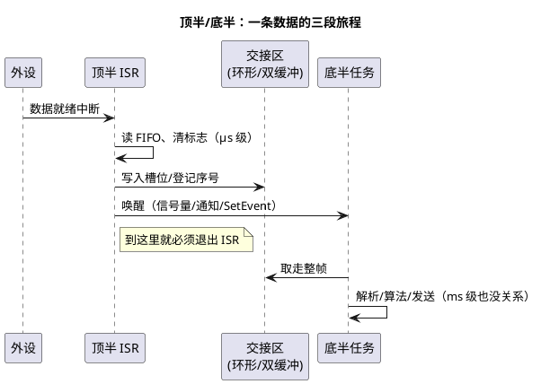

# 04-顶半底半

> 一句话定位：顶半在 ISR 里只做"非做不可的最小集"，底半回到任务里慢慢干——三路实现（延迟处理任务/软中断/任务通知）加环形缓冲、双缓冲两套无锁交接，把中断响应做成一笔可预算的账。
> 等级：L2 ｜ 前置：[03-ISR与任务交互](03-ISR与任务交互.md)

## 核心概念

**顶半（Top Half）**＝ISR 里必须立刻做的部分：清中断标志、读取会被覆盖的硬件寄存器/FIFO、把事件登记下来。**底半（Bottom Half）**＝其余一切可以推迟的处理：协议解析、滤波算法、组包发送。拆分后，系统的中断延迟只取决于顶半长度，处理延迟取决于底半任务的调度优先级——**两笔账分开算，都可预算、都可优化**。



## 详解

### 1. 三路实现，一个思想

| 路线 | 做法 | 平台对应 | 适合 |
|---|---|---|---|
| ① 延迟处理任务 | 专职任务等信号量/事件，醒来处理 | FreeRTOS：专用任务 `xSemaphoreTakeFromISR` 唤醒；AUTOSAR：类别 2 ISR `SetEvent` 唤醒扩展任务 | 最通用，处理逻辑就是一个普通任务 |
| ② 软中断/软定时器 | 把底半挂到一个由低优中断或定时器驱动的执行环境 | FreeRTOS 软件定时器任务；RT-Thread softirq；Linux softirq/tasklet | 多个零散延迟工作的汇聚点 |
| ③ 任务通知直击 | ISR 直接向目标任务发通知（带值/事件位） | FreeRTOS `vTaskNotifyGiveFromISR`；AUTOSAR `SetEvent` | 点对点、要求最低唤醒开销 |

Linux 内核的 softirq/tasklet/workqueue 是同一思想的放大版；RTOS 里通常一个"中断服务任务"就够，不必造软中断框架。

### 2. 数据交接：环形缓冲与双缓冲

**SPSC 环形队列（单生产者单消费者）可以无锁**：写者只动 head、读者只动 tail，各自单写单读，配合 `volatile` 索引与恰当的读写屏障即可安全；容量取 2 的幂，用 `& (N-1)` 取模。

```c
#define RING_SZ (1u << 6)                  /* 64，2 的幂 */
static Can_Msg_t  ring[RING_SZ];
static volatile uint32_t r_head, r_tail;   /* ISR 只写 head，任务只写 tail */

/* 顶半（ISR 上下文） */
void Ring_Push(const Can_Msg_t *m)
{
    uint32_t h = r_head;
    uint32_t next = (h + 1u) & (RING_SZ - 1u);
    if (next != r_tail)                    /* 满则丢新（策略可改丢旧） */
    {
        ring[h] = *m;
        r_head = next;                     /* 索引最后发布，消息先就位 */
    }
    else { g_drop_cnt++; }                 /* 必须留观测手段 */
}
```

**双缓冲（ping-pong）**适合"整帧快照"：顶半把数据写进后台缓冲，翻转指针，底半处理前台——避免读一半被写一半；翻转必须原子（指针交换用原子/关极短中断），并防止"读者还没用完旧帧又被翻走"（加序号或占用计数）。

### 3. 底半任务的三项调度决策

1. **优先级**：太低→数据在环形里堆积溢出；太高→抢占正常业务任务。经验：取"消费速率 ≥ 生产速率"所需的最小优先级，用丢包计数验证；
2. **积压策略**：环形满了怎么办——丢最旧（保新鲜，控制类）、丢最新（保完整，记录类）、覆盖标志（诊断类）——三种语义必须在设计期选定；
3. **批量处理**：一次唤醒处理完队列里所有积压（`while (r_tail != r_head)`），减少唤醒次数，也自然平滑毛刺。

### 4. 拆分准则

- **必须留顶半**：清标志/应答硬件、读取会被覆盖的寄存器、极短时限动作（如通信应答位）、更新单写者统计；
- **必须去底半**：一切可能阻塞（队列满等待、互斥、Flash 写）、printf/日志、大数组拷贝、算法运算；
- **判断句**："这段代码如果现在不做，硬件会不会坏/数据会不会丢？"——不会就下放底半。

## 易错点与陷阱

1. **现象：高速采样偶发丢点**——原因：底半任务优先级低于业务任务，积压覆盖——对策：提优先级或缩处理时间，用 `g_drop_cnt` 监控并设阈值告警。
2. **现象：环形缓冲"永远不满"却偶发读到半新半旧消息**——原因：先发布索引后写数据，读者看到新索引时消息体还没写完——对策：先写数据、后写索引（如骨架代码顺序），多核再加内存屏障。
3. **现象：双缓冲翻转后读者偶发拿到写了一半的帧**——原因：翻转时上一帧还没被消费完——对策：加序号/占用计数，读者确认帧完整再处理。
4. **现象：中断风暴，CPU 满载在 ISR 里打转**——原因：把清中断标志也"下放"到了任务，硬件一直重触发——对策：清标志永远留顶半。
5. **现象：处理链 A 任务→事件→B 任务→事件→C 任务，端到端延迟超标**——原因：链式唤醒每跳叠加调度延迟，且优先级安排不当造成倒挂——对策：合并处理步骤或提高链路优先级，端到端延迟按每跳最坏值求和预算。
6. **现象：DMA 搬运数据偶发"旧的"**——原因：平台带数据 cache 时，DMA 写内存 CPU 却读到 cache 旧值——对策：DMA 缓冲放非缓存区或做 cache 失效/清理（S32K3/TC39x 类平台尤须注意）。

## 面试高频题

**Q：顶半和底半的划分原则是什么？**
答：顶半只做"不做硬件就会坏/数据就会丢"的最小集：清标志、读易失寄存器、登记数据与事件；其余全部下放底半任务。目标是把 ISR 执行时间压到最短，使中断延迟可预算、嵌套栈深可控、对其他中断的干扰最小。

**Q：SPSC 环形队列为什么可以不加锁？前提是什么？**
答：单核下，写者只修改 head、读者只修改 tail，两个索引的修改互不可见地"单向推进"；只要保证"先写数据后发布索引"的顺序，读者看到新 head 时数据必然完整。前提是严格单生产者单消费者、索引用 `volatile` 防优化、容量为 2 的幂避免取模竞态；多核还需要内存屏障。

**Q：底半用低优先级任务实现，会有什么风险？怎么发现？**
答：生产速率超过消费速率时数据积压，环形缓冲覆盖丢数据。发现手段：满/丢计数器、水位统计（最大积压深度）、周期性对账（中断计数 vs 处理计数）。解决：提优先级、批量处理、增大缓冲，或按业务语义选择丢旧/丢新策略。

**Q：Linux 的 softirq/tasklet 和 RTOS 的底半任务是一回事吗？**
答：思想同源（推迟中断处理），机制不同。Linux softirq 在中断返回点于"进程上下文之外"批量执行、可并发，tasklet 是同 CPU 串行化的软中断变体，workqueue 才是进程（线程）上下文；RTOS 通常没有这套分层，直接用一个受信号量/事件唤醒的普通任务当底半，调度语义更简单可测。

## 延伸

- [RTOS通用原理](../README.md)：本带总目录，顶半底半是中断管理的收官设计；
- [03-Alarm与ScheduleTable](../../../../07-AUTOSAR架构/2-L2进阶/系统服务栈/Os/03-Alarm与ScheduleTable.md)：周期性"底半"——把延迟处理做成时间驱动；
- [01-任务管理](../../../2-L2进阶/FreeRTOS/01-任务管理.md)：底半任务本身就是任务，优先级与阻塞语义在此展开；
- [03-中断优先级实践](../../../../02-芯片与体系结构/2-L2进阶/TC377平台/中断系统/03-中断优先级实践.md)：顶半长度与优先级配置的实测联动。