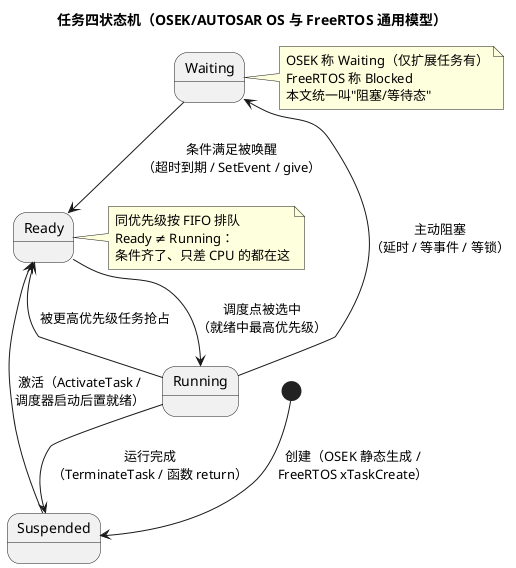

# 01-调度模型

> 一句话定位：任务四状态机 + 固定优先级抢占是 OSEK/AUTOSAR OS 与 FreeRTOS 共用的调度底座——本文讲清"谁上 CPU"这套所有 RTOS 心照不宣的模型。
> 等级：L2 ｜ 前置：[从前后台到RTOS-操作系统全景](../../../00-入门导读/01-从前后台到RTOS-操作系统全景.md)

## 核心概念

调度要回答的问题只有一句：**单核 CPU 同一时刻只能跑一个任务，下一个让谁上？** 拆开是两个零件：

1. **任务状态机**——每个任务任一时刻处于四态之一，调度器干的全部活就是搬任务在状态间的位置；
2. **调度策略**——从就绪集合里挑人的规则。

三个最易混的状态一句话钉死：**Ready 是"万事俱备只差 CPU"；Waiting 是"在等条件，给 CPU 也没用"；Suspended 是"未激活/已结束"**。调度器在调度点做的事 = 从 Ready 集合挑最高优先级者置 Running，把原 Running 者挪去 Ready（被抢占）/ Waiting（阻塞）/ Suspended（结束）。

**调度点（Scheduling Points）**——OS 只在这些时刻重新挑人，其余时间绝不换人：

| 调度点 | OSEK/AUTOSAR OS | FreeRTOS |
|---|---|---|
| 任务结束/主动让出 | TerminateTask / ChainTask | 任务函数 return |
| 调用改变任务状态的 API | ActivateTask / SetEvent / ReleaseResource | Give / Take / Send 等内核 API |
| 主动阻塞 | WaitEvent（扩展任务） | vTaskDelay / xSemaphoreTake 等阻塞 API |
| 时钟节拍 | Counter/Alarm 到期激活任务 | tick 到期解除延时、同级轮转 |
| ISR 退出 | Cat2 ISR 结束时重调度 | ISR 退出或 portYIELD_FROM_ISR |

## 详解

### 三大调度策略对比

| 维度 | 固定优先级抢占 | 时间片轮转 | EDF（最早截止期优先） |
|---|---|---|---|
| 挑人规则 | 就绪中优先级最高者，且随时可抢 | 同优先级轮流坐庄，每拍一换 | 截止期最近者优先（优先级动态变） |
| 响应确定性 | 高：最坏响应时间可算 | 中：多一个时间片的抖动 | 理论最优（利用率可达 100%） |
| 过载行为 | 先饿死最低优先级，高的照常活 | 全面变慢、抖动 | "多米诺"：全体相继错过截止期 |
| 分析/认证 | 有成熟公式（RTA，见 03 篇） | 难给出紧的界 | WCRT 分析困难，安全认证少有支持 |
| 内核复杂度 | 小（位图找最高位即可） | 中 | 大（动态排序、截止期管理） |
| 谁在用 | OSEK/AUTOSAR OS、FreeRTOS、VxWorks | 桌面/通用系统、FreeRTOS 同级可选 | 学术与少数软实时系统 |

### 汽车为什么选固定优先级抢占

1. **可静态分析**：每个任务的最坏响应时间有闭合公式（`R = C + B + Σ⌈R/T⌉·C`，见[优先级设计](03-优先级设计.md)），是安全时序论证的直接交付物；EDF 的动态优先级让这套分析无从下手。
2. **抖动小**：控制类任务（喷油、扭矩监控）要的是"每次都在同一时刻附近发生"，时间片轮转天然多一拍抖动。
3. **内核小而可认证**：静态优先级可以静态配置——OSEK 的任务/优先级/栈全部编译期定死，无动态排序，代码路径少、好测试。
4. **过载可预期**：CPU 满载时最先饿死的是最低优先级，关键链路不受牵连；EDF 过载时谁都可能崩。
5. **与周期激活体系咬合**：Alarm/ScheduleTable 周期激活任务，"周期越短优先级越高"（RMS）一条规则贯穿到底，见 [Alarm与ScheduleTable](../../../../07-AUTOSAR架构/2-L2进阶/系统服务栈/Os/03-Alarm与ScheduleTable.md)。

### OSEK 与 FreeRTOS：同一模型的两种口音

- **都是固定优先级抢占**：FreeRTOS 抢占由 `configUSE_PREEMPTION=1` 开启（设 0 退化为协作式）；OSEK/AUTOSAR OS 以全抢占（FULLY）为现代项目默认。
- **同优先级行为不同**：OSEK 同优先级 FIFO、无时间片，工程惯例一个优先级一个任务；FreeRTOS 默认 `configUSE_TIME_SLICING=1`，同优先级每 tick 轮转（可关闭）。
- **优先级数值方向**：FreeRTOS 数值越大优先级越高（0 = Idle 最低）；各 OS/工具链约定不一，移植时必须核对手册，不能想当然。
- **任务何时创建**：OSEK 静态生成、无运行时 create；FreeRTOS 动静态皆可——静态时序分析口径上前者天然友好。

## 易错点与陷阱

1. **把 Ready 当 Running 排查**。系统"卡死"时先问"几个任务处于 Ready 且优先级高于当前？"——单核同时只能有一个 Running，一堆高优 Ready 说明调度被关了（临界区没出来 / 调度锁没释放）。对策：用 trace 工具看状态分布，而不是盯着某任务代码发呆。
2. **裸机习惯带进 RTOS：忙等轮询标志**。高优任务 `while(!flag);` 会饿死所有低优任务还白烧 CPU。对策：等条件一律用阻塞 API（等事件/等信号量），见[信号量](../同步与互斥/01-信号量.md)。
3. **以为上了 RTOS 响应自动变快**。RTOS 给的是"可分析、可抢占"，不是"自动快"——低优长活 + 错误优先级照样超时；快慢最终取决于优先级结构（见[优先级设计](03-优先级设计.md)）。
4. **时间片当万能公平**。同优先级时间片对控制任务是抖动源。对策：车载只在"平级后台活"（日志、慢速通信）容忍时间片，关键任务独占优先级。
5. **优先级数值方向想当然**。带着"0 最高"的旧习惯在 FreeRTOS 里恰好全反。对策：接手项目先读 `FreeRTOSConfig.h` 与 OS 手册的优先级章节。
6. **ISR 里调用任务态 API**。OSEK 在 Cat2 ISR 里调非法服务会进 ErrorHook；FreeRTOS 在 ISR 里调非 FromISR 版本属未定义行为。对策：ISR 只 give/置位/发送，见[中断管理](../中断管理/README.md)。

## 面试高频题

**Q：任务有哪四个状态？各由谁触发转换？**
答：Suspended（未激活）、Ready（就绪）、Running（运行）、Waiting（阻塞，OSEK 仅扩展任务有）。激活 API 与 Alarm 把任务从 Suspended 拉到 Ready；调度点选中使 Ready→Running；更高优先级就绪使 Running→Ready（被抢占）；任务调用延时/等待类 API 使 Running→Waiting；条件满足或超时使 Waiting→Ready；任务结束使 Running→Suspended。主动转换发生在任务自己的代码流里，被动转换由调度器与中断驱动。

**Q：为什么车载 RTOS 几乎都选固定优先级抢占，而不是时间片轮转或 EDF？**
答：①最坏响应时间可静态计算（RTA 公式），满足安全时序论证；②抖动小，控制任务发生时刻确定；③内核实现简单、任务与优先级静态配置，利于认证；④过载行为可预期（先饿死最低优先级），EDF 过载会多米诺式全崩且 WCRT 分析困难。汽车要的是确定性与可审计性，不是理论利用率上限。

**Q：FreeRTOS 与 OSEK 的调度器有什么异同？**
答：同：单核固定优先级抢占 + 调度点重调度，就绪队列同优先级 FIFO。异：FreeRTOS 优先级数值大者优先、任务可运行时创建、同优先级默认时间片轮转、可配成协作式；OSEK 任务与优先级静态配置、同优先级无时间片、扩展任务经 WaitEvent 进入 Waiting。AUTOSAR OS 在 OSEK 血统上加了 MPU 分区保护与多核扩展。

**Q：什么是调度点？为什么"调用一个 API 也可能引发任务切换"？**
答：调度点是 OS 重新挑任务的合法时刻：任务结束、调用改变状态类 OS 服务、主动阻塞、tick 到期、ISR 退出。ActivateTask/SetEvent/Give 这类 API 会把别的任务拉进 Ready，若其优先级更高，API 内部立刻触发重调度，当前任务原地被换下——所以 API 返回后，当前上下文对"刚才被换下又换回"是透明的，但期间 CPU 已经给别人干过活了。

## 延伸

- [02-上下文切换](02-上下文切换.md)：换人时现场怎么存、怎么恢复，栈怎么换；
- [03-优先级设计](03-优先级设计.md)：优先级数字怎么定——RMS 与响应时间分析；
- [07 区 Os/01-任务与调度](../../../../07-AUTOSAR架构/2-L2进阶/系统服务栈/Os/01-任务与调度.md)：这套模型在 AUTOSAR OS 里的配置化形态（基本/扩展任务、抢占策略）；
- [OSEK与AUTOSAR-OS](../../../2-L2进阶/OSEK与AUTOSAR-OS/README.md)：汽车 OS 主业的静态配置哲学；
- [FreeRTOS](../../../2-L2进阶/FreeRTOS/README.md)：开源源码对照验证调度模型。
