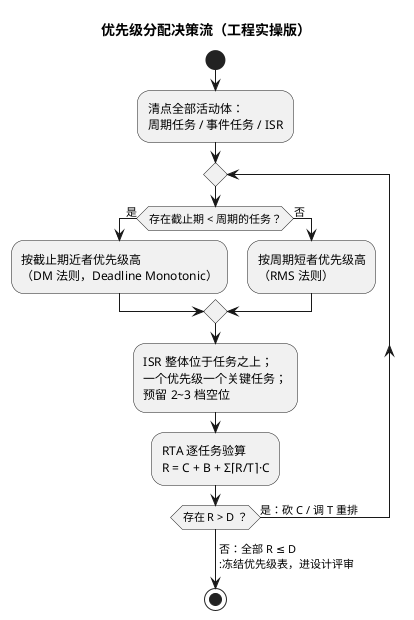

# 03-优先级设计

> 一句话定位：优先级表达的是"紧急程度"（谁的截止期近）而不是"业务重要性"——RMS 给出周期任务的黄金分配法则，响应时间分析（RTA）给出可交付的时序证明。
> 等级：L2 ｜ 前置：[02-上下文切换](02-上下文切换.md)

## 核心概念

优先级分配的黄金法则一句话：**周期越短（截止期越近）的任务，优先级越高**——单调速率调度（RMS, Rate Monotonic）的分配法则。逻辑很朴素：跑得勤的活必须随叫随到，否则每一拍都在积累延迟；跑得疏的活晚一点无伤大雅。

## 详解

### RMS 与它的利用率天花板

n 个相互独立的周期任务、按 RMS 分配优先级，只要总利用率满足下式，系统**必定可调度**：

`U = Σ(Ci/Ti) ≤ n × (2^(1/n) − 1)`

| 任务数 n | 安全利用率上界 |
|---|---|
| 1 | 100% |
| 2 | 82.8% |
| 3 | 78.0% |
| 5 | 74.3% |
| ∞ | ln2 ≈ 69.3% |

两条重要提醒：

- 这是**充分不必要**条件：超过 69.3% 不一定调度不开，只是"保票"没了——此时用 RTA 精确判定，别急着砍功能；
- EDF 理论上界是 100%，但如[调度模型](01-调度模型.md)所析：过载行为与可分析性让它进不了安全内核。

### 响应时间分析（RTA）：可交付的证明

固定优先级系统里，任务 i 的最坏响应时间用迭代法求：

`R_i(k+1) = C_i + B_i + Σ(j∈hp(i)) ⌈R_i(k)/T_j⌉ × C_j`，从 R_i(0)=C_i 起迭代至收敛，R ≤ D 即证明可调度。

三项含义：自己的最坏执行时间 C；**被低优任务持锁挡住的阻塞 B**——优先级反转的定量化身，见[互斥锁与优先级继承](../同步与互斥/02-互斥锁与优先级继承.md)；被所有高优任务反复抢占的开销（⌈R/T⌉ 是"在你响应期间高优来了几趟"）。这张迭代表就是时序安全论证的交付物，比"跑一晚没死"硬得多。

### ISR 与任务：一张完整的优先级阶梯

- OSEK/AUTOSAR OS：Cat2 ISR 优先级**高于一切任务**，ISR 之间按硬件优先级嵌套——所以 ISR 越短越好，业务紧急度交给任务侧表达；
- FreeRTOS：数值上"更紧急"于 `configMAX_SYSCALL_INTERRUPT_PRIORITY` 的中断**不得调用任何 FromISR API**——那是内核临界区（S32K 用 BASEPRI、TC377 用 ICR 抬 CPU 优先级）划出的边界；
- 工程惯例阶梯（自上而下）：安全/控制环 > 总线协议机（CanIf/PduR 链路）> 应用周期任务 > 诊断与网络管理 > NvM/日志类慢活。

### BSW 落地惯例

- 1ms/5ms/10ms/100ms 的 MainFunction 天然对应 RMS 阶梯：采样与控制最高，通讯次之，诊断、NvM 垫底；
- 事件驱动任务（如 CanRx 处理）插在"它的截止期"对应的档位，而不是无限拔高——拔到 ISR 边上等于绕过了 OS 的管理；
- 优先级表写进设计文档并走评审；改任何任务的周期/优先级/C 都要重跑 RTA——这一步在很多团队是缺失的，恰是时序回归的起点。

## 易错点与陷阱

1. **按"业务重要性"排优先级**。现象：安全监控任务被刷屏任务压住。原因：把"重要"当"紧急"，调度器只认截止期。对策：重要性用架构手段（保护、冗余、监控）表达，紧急性才用优先级表达。
2. **全部任务同优先级 + 时间片**。现象：控制抖动、CAN 偶发丢帧。原因：放弃固定优先级的确定性，退化成轮询排队。对策：回到一优一关键任务，时间片只留给平级后台活。
3. **优先级档位一次用满**。现象：后期加任务没位置，只能挤占邻居。对策：设计期预留 2~3 档空位，并按"ISR 边界/控制/通讯/后台"分组命名管理。
4. **中断优先级越过内核允许线**。现象：偶发 HardFault、内核数据结构错乱。原因：高于屏蔽线的 ISR 调了 FromISR API，内核临界区挡不住它。对策：核对 configMAX_SYSCALL_INTERRUPT_PRIORITY 与 NVIC 配置（S32K）、ICR 与 OS 手册（TC377）。
5. **改了任务周期没重排优先级**。现象：某任务从 100ms 提到 10ms 后全系统开始超时。原因：RMS 假设被破坏，高优抢占量陡增。对策：周期/优先级/RTA 三者捆绑评审，一处改动全表复算。
6. **用"再提一档优先级"修一切超时**。现象：按下葫芦浮起瓢，低优任务开始饿死。对策：超时先查 RTA 三项——砍 C、控 B，优先级调整是最后手段。

## 面试高频题

**Q：什么是 RMS？为什么周期短的任务优先级要高？**
答：Rate Monotonic：周期任务按周期从短到长分配从高到低的优先级。直觉：周期短的任务执行间隔小，被延迟一拍就吃掉其响应预算的大头，必须随叫随到；周期长的任务偶尔晚一点影响小。理论上 RMS 是固定优先级里的最优静态分配，配套判据是利用率上界 n(2^(1/n)−1)（极限 ln2≈69.3%），更精确用 RTA 迭代。

**Q：总利用率超过 69.3%，系统一定调度不开吗？**
答：不一定。69.3% 是"任意独立周期任务集都安全"的充分条件下界，不是必要条件。超过后应改用响应时间分析逐任务精确计算最坏响应时间；周期成谐波关系（互为倍数）的任务集常在 80%~90% 利用率下依然可调度。但作为设计余量准则，越过界限就该警惕并着手优化 C 与 B。

**Q：RTA 公式里的阻塞项 B 是什么？和优先级反转什么关系？**
答：B 是任务 i 可能被低优先级任务持锁挡住的最坏时长（每个互斥资源至多贡献一个临界区长度）。它正是优先级反转的定量化身：反转被优先级继承/天花板协议限定后，代价收敛为有界的 B。这也解释了为什么临界区必须短——B 直接加进所有比持锁者高的任务的响应时间。

**Q：中断优先级和任务优先级是什么关系？**
答：整体高于任务：OSEK 里 Cat2 ISR 高于全部任务，FreeRTOS 里 ISR 走 NVIC 独立优先级空间、不与任务数值比较。但内核会给 ISR 划线：FreeRTOS 中比 configMAX_SYSCALL_INTERRUPT_PRIORITY 更紧急的中断不能调用任何 FromISR API；OSEK 中 ISR 只能用允许的服务子集。所以工程上 ISR 只登记、业务紧急度由任务优先级表达。

## 延伸

- [01-调度模型](01-调度模型.md)：固定优先级抢占为什么是车载唯一主流；
- [02-上下文切换](02-上下文切换.md)：优先级差带来的切换频度与开销；
- [07 区 Os/03-Alarm与ScheduleTable](../../../../07-AUTOSAR架构/2-L2进阶/系统服务栈/Os/03-Alarm与ScheduleTable.md)：周期激活如何喂出 RMS 阶梯；
- [07 区 Os/01-任务与调度](../../../../07-AUTOSAR架构/2-L2进阶/系统服务栈/Os/01-任务与调度.md)：优先级与任务类型在 AUTOSAR OS 的静态配置；
- [互斥锁与优先级继承](../同步与互斥/02-互斥锁与优先级继承.md)：阻塞项 B 的来源与治理。
