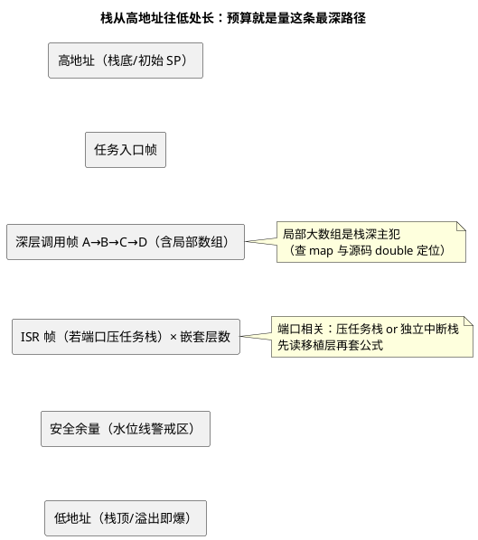

# 01-栈大小确定

> 一句话定位：栈大小不是拍脑袋——静态分析算最坏路径、水位法实测余量、经验值起步，三法交叉验证；FreeRTOS 以"字"计深的坑与 OSEK"基本任务共享栈"的省钱哲学一并讲清。
> 等级：L2 ｜ 前置：[从前后台到RTOS-操作系统全景](../../../00-入门导读/01-从前后台到RTOS-操作系统全景.md)

## 核心概念

任务栈是每个任务的"私人工作台"：局部变量、函数调用现场、（部分端口下的）中断帧都压在这里。**栈预算公式**：

```
栈大小 = 最深调用链帧 + 最深中断嵌套帧 + 库函数暗栈 + 安全余量(20~30%)
```



## 详解

### 1. 栈里到底压了什么

| 内容 | 说明 | 排查手段 |
|---|---|---|
| 局部变量 | 数组/结构体是栈深主犯 | 查源码；大数组改 static 或动态池 |
| 返回地址、被保存寄存器 | 每层调用几十字节 | 编译器 -fstack-usage 可生成每函数用量 |
| ISR 帧 | 端口相关（见下） | 读移植层说明 |
| 库函数暗栈 | printf 族可达数百字节~1KB+ | 文档/实测，别假设"很小" |
| 浮点上下文 | 带 FPU 端口额外几十字节 | 编译选项与 ABI |

TriCore（TC377）特例：任务/中断**上下文切换走 CSA（上下文保存区）链表**，不靠压栈——所以任务栈主要承载局部变量，但 **CSA 池必须配够**，否则切换时直接 trap（这口锅常被错记在"栈不够"头上）。

### 2. 双平台栈模型对照

| | FreeRTOS | OSEK / AUTOSAR OS |
|---|---|---|
| 栈归属 | 每任务独立栈，`xTaskCreate` 指定深度（**单位：字，不是字节！**） | 基本任务可共享栈（run-to-completion + 同优先级不互相打断 → 栈不重叠）；扩展任务各配独立栈 |
| 中断栈 | Cortex-M 端口：MSP 独立中断栈，任务栈不背中断帧 | 多数端口：ISR 帧压在被打断任务栈上 → 必须计入预算 |
| 监控 API | `uxTaskGetStackHighWaterMark()`（返回字） | OS 栈使用监控（如 GetStackUsage 类接口/配置项） |

**端口不同公式就不同**：同一份"任务栈预算含不含中断帧"，FreeRTOS-Cortex-M 答"不含"、多数 OSEK 端口答"含"——先读移植层，再谈预算。

### 3. 三种定栈方法

1. **静态分析（算最坏）**：从调用图+反汇编推最坏路径栈深（AbsInt StackAnalyzer 类工具、或编译器 `-fstack-usage` + 手工/脚本汇总调用链）。**认证友好**——ISO 26262 要的是"证据"而不是"跑了一个月没爆"；
2. **水位法（实测余量）**：创建任务时把栈填满 `0xA5` 花纹，跑完典型+最坏工况后看花纹被冲刷到哪：FreeRTOS 用 `uxTaskGetStackHighWaterMark`，得到历史最坏剩余量；
3. **经验值起步（先活下来）**：简单控制任务 256~512B；带 printf/浮点/Sprintf 1~2KB；协议栈/诊断任务 2~4KB。**先放大跑通，再靠 1、2 收紧**。

定栈的**验收标准**（三法会师）：静态分析上界 ≤ 配置值，且（配置值 − 实测最坏用量）≥ 20% 余量；任何一法不过线就先加栈再优化。三法结论打架时，取更保守的那个——栈多给的代价是几十字节 RAM，栈少给的代价是一台召回。

### 4. 三大栈杀手与一个变量

- **printf/printf 家族**：newlib 的 printf 带浮点格式化轻松吃掉 1KB+；要打印就自己写轻量版；
- **递归**：调用深度数据相关，静态分析只能给上界，车规里基本禁用；
- **局部大数组**：`uint8_t buf[512]` 一行就吃掉半个任务栈——改 static（注意重入）、或内存池；
- **一个变量——优化等级**：`-O0` 与 `-O2` 栈深可差 20%+（不内联 vs 内联展开），**用调试版的测量数据定量产版栈位，等于拿错刻度的尺子**。

## 易错点与陷阱

1. **现象：配了 512"字节"栈，FreeRTOS 断言立刻炸**——原因：`usStackDepth` 单位是字，S32K（32 位）上 512 字=2048 字节，反着理解则差 4 倍——对策：记住"参数是 word，×4 才是字节"，code review 专查这一行。
2. **现象：水位显示余量充足，量产偶发溢出**——原因：水位只覆盖跑过的路径，最深错误处理链没被跑到——对策：构造最坏路径（注入故障跑错误分支）+ 静态分析兜底。
3. **现象：一加 log 任务就复位**——原因：printf 暗栈数百字节被低估——对策：实测 printf 栈耗，或换轻量格式化。
4. **现象：调试版稳、量产版爆栈**——原因：优化等级改变内联与栈布局——对策：以量产编译选项做最终测量。
5. **现象：TC377 上"栈够"却切换异常 trap**——原因：CSA 池耗尽，不是任务栈问题——对策：核对 CSA 数量配置与最深抢占链。
6. **现象：函数指针/回调的调用链漏算**——原因：静态分析看不全间接调用——对策：回调注册表人工补图，或给这类函数保守上界。

## 面试高频题

**Q：任务栈预算要考虑哪些项？写出公式。**
答：栈 = 最深调用链各帧之和 + 最深中断嵌套帧（端口把 ISR 压任务栈时）+ 库函数（如 printf）暗栈 + 20~30% 安全余量。其中调用链含函数指针可达的所有分支，取最坏而非平均。

**Q：水位法（高水位标记）怎么测栈余量？有什么局限？**
答：任务创建时把栈空间填入固定花纹（0xA5），系统运行后从栈底向使用方向扫描花纹被覆盖的边界，得出"历史最坏已用深度"（FreeRTOS 的 `uxTaskGetStackHighWaterMark` 即此）。局限：只反映实际执行过的路径——没跑到的最深分支测不到，须配合静态分析与故障注入。

**Q：FreeRTOS 的 `xTaskCreate` 栈参数和 `uxTaskGetStackHighWaterMark` 返回值单位是什么？**
答：都是"字（StackType_t）"不是字节——32 位平台上 1 字=4 字节。常见事故是把 512 当字节配（实际给了 2KB，浪费）或把返回值 100 当字节（实际还剩 400 字节，误判紧张）。

**Q：为什么 OSEK 的基本任务可以共享一个栈，FreeRTOS 任务却各自要独立栈？**
答：OSEK 基本任务 run-to-completion：不等待事件、执行到 TerminateTask 才结束，且同优先级任务不互相打断——任意时刻每优先级至多一个任务"活着在路上"，栈不会重叠，可共享。FreeRTOS 任务是任意阻塞/挂起的执行流，随时停在半路，必须各自持有独立栈保存现场（扩展任务同理）。

## 延伸

- [02-栈溢出检测](02-栈溢出检测.md)：算不准时的三层保险；
- [02-栈与堆](../../../../01-编程语言/2-L2进阶/内存管理/02-栈与堆.md)：栈的 C 语言视角与增长方向；
- [01-五大内存区](../../../../01-编程语言/2-L2进阶/内存管理/01-五大内存区.md)：栈在整幅内存地图中的位置；
- [01-任务与调度](../../../../07-AUTOSAR架构/2-L2进阶/系统服务栈/Os/01-任务与调度.md)：OSEK 共享栈哲学与调度模型的绑定关系。