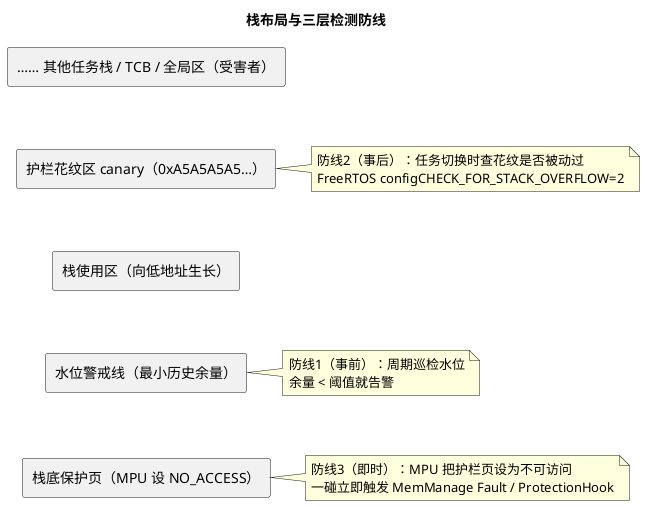

# 02-栈溢出检测

> 一句话定位：栈溢出是最阴的故障——炸在别处、死在远处；花纹护栏、水位巡检、MPU 保护页三层防线加上 AUTOSAR ProtectionHook 联动，把"事后验尸"变成"当场抓获"。
> 等级：L2 ｜ 前置：[01-栈大小确定](01-栈大小确定.md)

## 核心概念

栈越界时最先死掉的往往不是栈主人：溢出冲刷的是**栈相邻的内存**（别的任务栈、TCB、全局变量、队列控制块）——于是症状出现在受害者身上（某全局变量莫名被改、别的任务跑飞），而肇事任务毫发无损地继续跑。这就是"栈溢出排查难"的根源，也是"必须主动布防"的理由。



## 详解

### 1. FreeRTOS：configCHECK_FOR_STACK_OVERFLOW

- **=1（查尾针）**：任务创建时在栈区末端写入固定花纹，每次任务**被切出**时检查最后 16 字节是否仍是花纹。开销极小，但只在切换点查、只查边缘；
- **=2（尾针 + 栈指针双重校验）**：在 =1 的花纹校验基础上，任务**被切出**时再把当前栈指针寄存器与该任务栈的合法区间比对，指针落在区间外即判溢出——能抓住"指针已飞出但还没踩到边缘花纹"的场景，仍是切换点检查（注意：**全深度扫描花纹估算用量是 `uxTaskGetStackHighWaterMark` 的行为**，不属于检测开关 =2）；
- 命中后回调 `vApplicationStackOverflowHook(task, name)`。**局限**：检测发生在溢出之后——若溢出瞬间已踩坏邻居，证据链可能已被污染。

### 2. 水位巡检（事前告警）

守护任务周期调用 `uxTaskGetStackHighWaterMark()`，把每任务历史最小余量与阈值比较，低于阈值置 DTC/发诊断事件。这是**量产件上唯一现实的"栈健康观测"**：不影响实时性，还能按里程累积趋势。

### 3. MPU：越界即报的硬件防线

栈底（溢出方向）划出一页设为**不可访问**：溢出向下探的第一步就触发 fault（Cortex-M 的 MemManage Fault，`SCB->CFSR.STKERR`），现场干净、当场抓获。FreeRTOS-MPU 端口为每个任务定义"栈区+全局区+外设区"三张通行证；AUTOSAR OS 则把栈保护并入 **OS-Application 的内存保护**：非信任 OS-Application 的栈越界/写越权 → 进 `ProtectionHook`，按配置决定"记 DCT 后重启"或"关断"，这是 26262 安全机制的组成部分（见 [04-Hook](../../../../07-AUTOSAR架构/2-L2进阶/系统服务栈/Os/04-Hook.md)）。

### 4. 症状学与排查顺序

| 症状 | 更可能是 |
|---|---|
| 随机 HardFault，地址无规律 | 栈溢出踩坏返回地址/函数指针 |
| 某全局变量偶发"自己变了" | 相邻任务栈溢出冲刷（map 反查变量地址，看谁在旁边） |
| 复位前最后一条日志是某任务中途打印 | 该任务 printf 暗栈爆栈 |
| TRACE32 看栈指针历史超出栈区 | 直接实锤 |

无 JTAG 的现场件：靠防线 1/2 提前布防 + NOINIT 区留的复位诊断快照复盘（见 [04-静态分配策略](04-静态分配策略.md) 的 NOINIT 段）。

### 5. 最小防御配置示例

```c
/* FreeRTOSConfig.h —— 打开检测，留给 Hook 的只许是最轻的动作 */
#define configCHECK_FOR_STACK_OVERFLOW   2
#define configRECORD_STACK_HIGH_ADDRESS  1

void vApplicationStackOverflowHook(TaskHandle_t xTask, char *pcName)
{
    /* 只取证：任务句柄/名字两个字节，绝不 printf、不进队列 */
    g_fault.task = xTask;
    g_fault.magic = 0xDEAD57ACu;
    portDISABLE_INTERRUPTS();
    for (;;) { }                    /* 按项目策略：复位前冻结现场，等看门狗 */
}

/* 守护任务：水位巡检（防线 1，量产保留） */
void Task_StackGuard(void *arg)
{
    for (;;)
    {
        TaskHandle_t h;
        TaskStatus_t s;
        vTaskList(&s);                            /* 或逐任务 uxTaskGetStackHighWaterMark */
        (void)h;
        /* 余量 < 阈值：置 DTC / 记 NOINIT 快照，不动任务 */
        vTaskDelay(pdMS_TO_TICKS(1000));
    }
}
```

对应 AUTOSAR 侧的配置直觉：`OsStackMonitoring` 打开 + OS-Application 声明为非信任 + 每任务栈保护，违规走 `ProtectionHook(PROTECTION_STACKOVERFLOW)`——三条防线在两个平台上一一对应，只是名字换了一茬。

## 易错点与陷阱
1. **现象：栈溢出 Hook 里 printf，系统二次崩溃**——原因：Hook 跑在出错上下文里，栈已不健康，再吃 printf 暗栈等于补刀——对策：Hook 只置全局标志+存任务名两个字节，输出交给健康任务。
2. **现象：检测到溢出时，受害变量早已被改**——原因：花纹法是"切换点事后查"，溢出到检出之间有窗口——对策：要"即时"上 MPU 保护页；花纹法定位"谁溢出"，MPU 定位"哪一刻"。
3. **现象：量产件栈溢出无据可查**——原因：量产配置把监控全关——对策：水位巡检+阈值 DTC 属于"零成本保险"，量产保留。
4. **现象：FreeRTOS 下查遍所有任务栈都健康，仍偶发跑飞**——原因：MSP 中断栈不在任务列表里，没被监控——对策：单独给中断栈布花纹（`configMINIMAL_STACK_SIZE` 相应核算）。
5. **现象：动态改栈后水位突然"归零"**——原因：花纹只在创建时填一次，`xTaskCreate` 后手动改区域不会重填——对策：别在运行期动栈区；确需迁移用重建任务的方式。
6. **现象：把 cache 一致性/野指针误判为栈溢出，改栈无效**——原因：症状重叠但病因不同——对策：先看 map 定"被改变量的邻居"，再下结论（见 [06-内存泄漏与越界排查](../../../../01-编程语言/2-L2进阶/内存管理/06-内存泄漏与越界排查.md)）。

## 面试高频题

**Q：FreeRTOS 两种栈溢出检测的原理与局限？**
答：=1 在任务切出时检查栈末端固定花纹是否被覆盖；=2 在 =1 基础上再校验任务切出瞬间的栈指针是否落在合法栈区间（抓"指针已飞出但未踩到花纹"）；都在任务切换时执行，命中后进 `vApplicationStackOverflowHook`。要估"用了多深"是 `uxTaskGetStackHighWaterMark` 周期巡检的事，不属于这两个开关。局限：事后检测——溢出瞬间可能已踩坏相邻内存；且只覆盖任务栈，MSP 中断栈要另行布防。

**Q：如何实现"溢出当场抓获"而不是事后发现？**
答：用 MPU 把栈底（生长方向前沿）设为不可访问的保护页：溢出向下探的第一步就触发内存管理 fault（Cortex-M STKERR / AURIX 内存保护 trap），异常帧里直接给出肇事任务与出错 PC。AUTOSAR OS 将其纳入 OS-Application 内存保护，经 ProtectionHook 统一处置。

**Q：ProtectionHook 和 ErrorHook 有什么区别？**
答：ErrorHook 处理 OS 服务调用的返回错误（参数/上下文非法），属于"软件错误"；ProtectionHook 处理内存保护、栈监视、执行时间超标等硬件级违规，属于"安全事件"，可配置反应（杀任务、重启 ECU），是 26262 内存保护的落点。两者都不能做重活，取证转发即可。

**Q：产线上无法接调试器的件，怎么留栈溢出的"黑匣子"？**
答：量产保留水位巡检+阈值 DTC（防线 1）；关键运行数据写入 NOINIT 段，复位后由启动代码检查校验和并打包成快照上报（结合 [04-静态分配策略](04-静态分配策略.md)）；有 MPU 的件开启栈保护页，让违规当场触发 ProtectionHook 记录后处置。

## 延伸

- [03-堆与碎片](03-堆与碎片.md)：另一种"越界"——堆越界与碎片；
- [06-内存泄漏与越界排查](../../../../01-编程语言/2-L2进阶/内存管理/06-内存泄漏与越界排查.md)：pattern/金丝雀/map 反查的通用武器库；
- [04-Hook](../../../../07-AUTOSAR架构/2-L2进阶/系统服务栈/Os/04-Hook.md)：ProtectionHook 的配置视角与纪律；
- [03-Trap与中断机制](../../../../02-芯片与体系结构/3-L3高级/TriCore架构/03-Trap与中断机制.md)：TC377 上内存保护违规如何以 trap 形式上报。