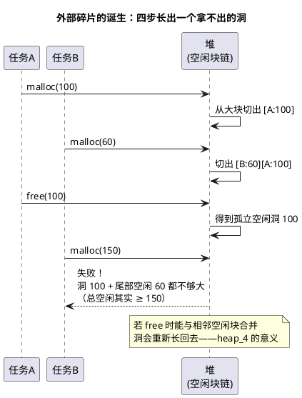

# 03-堆与碎片

> 一句话定位：RTOS 的堆是"能用但最好别用"的工具——heap_1~5 一张表选型、碎片怎么一步步长出来、汽车为什么干脆把运行期分配判了缓刑；对象池是动态与确定性的折中圣品。
> 等级：L2 ｜ 前置：[02-栈溢出检测](02-栈溢出检测.md)

## 核心概念

堆给的是**运行期按需分配**的自由，代价是三宗罪：**时间不确定**（分配耗时随碎片状态漂移）、**失败模式后移**（启动时全成功，跑 N 天后失败）、**碎片**——总空闲够、单块不够，申请"物理上存在、逻辑上拿不出"的内存。



**外碎片**：空闲块被已用块隔开，无法满足大申请；**内碎片**：块头+对齐取整造成的块内浪费（见 [03-内存对齐与填充](../../../../01-编程语言/2-L2进阶/内存管理/03-内存对齐与填充.md)）。

## 详解

### 1. FreeRTOS heap_1~5 一张表

| 方案 | 分配 | 释放 | 合并 | 定位 | 适用 |
|---|---|---|---|---|---|
| heap_1 | ✓ | ✗ | — | 只增不减 | 一切都在启动期分配、永不释放：**最像车规哲学** |
| heap_2 | ✓ | ✓ | ✗ | 已过时 | 相邻空闲不合并，久了必碎，别再选 |
| heap_3 | ✓ | ✓ | 看底层 | 包装编译器 malloc/free + 临界区保护 | 用平台 libc 堆，**线程安全但 ISR 不安全** |
| heap_4 | ✓ | ✓ | ✓ | 首次适配 + 前后合并 | **默认推荐**：通用、抗碎片能力最好 |
| heap_5 | ✓ | ✓ | ✓ | heap_4 + 多段不连续 RAM | RAM 分散在多个区域的芯片 |

### 2. 碎片机理与对策

- **成因**：不同大小的块交错分配/释放，空闲空间被切碎；释放顺序与申请顺序不对齐时最严重；
- **首次适配 vs 最佳适配**：首次适配快、倾向把大块留给大申请（heap_4 用它）；最佳适配省空间但更碎更慢；
- **治标**：合并（heap_4）、分配尺寸取整到少数几档（如全按 8 的幂申请）；
- **治本**：固定块内存池——所有块同尺寸，空闲链表内嵌在空闲块自身，`malloc/free` 双双 O(1)，**外碎片在定义上不存在**，内碎片被"同尺寸"换成了确定性。

```c
/* 固定块对象池骨架：空闲链表藏在块内部 */
#define POOL_N   32u
#define BLK_SZ   sizeof(Msg_t)          /* 全池同尺寸 */
static Msg_t  pool_mem[POOL_N];
static Msg_t *pool_free;                /* 空闲链表头 */

void Pool_Init(void)
{
    for (uint32 i = 0u; i < POOL_N; i++)          /* 挂成链 */
    {
        pool_mem[i].next = pool_free;
        pool_free = &pool_mem[i];
    }
}
Msg_t *Pool_Get(void)  { Msg_t *m = pool_free; if (m) pool_free = m->next; return m; }
void  Pool_Put(Msg_t *m) { m->next = pool_free; pool_free = m; }
```

### 3. 汽车为什么判运行期堆"缓刑"

- **确定性**：CAN 报文处理的内存需求不能"看碎片脸色"——时间与成功率都要常数；
- **认证**：ISO 26262 要论证最坏情况，堆的失败模式（碎片、耗尽、双 free、悬垂）每一个都难给证据；
- **AUTOSAR 的答案**：BSW 里几乎不存在运行期 malloc——所有缓冲（NvM 页缓冲、Dcm 会话缓冲、Com IPDU）都在**配置/生成期静态分配**；应用层要"动态"就用固定块池或静态队列；
- **工程折中**：实在需要（第三方协议栈、加密库），学 heap_1——**只在初始化阶段分配，之后永不释放**，碎片自然无从谈起。

### 4. ISR 与堆

ISR 内禁止 malloc/free：堆互斥用锁实现（临界区/互斥量），ISR 里等锁=系统级死等；且分配耗时不可预算，直接破坏中断延迟指标。

## 易错点与陷阱

1. **现象：启动自检全过，路试两周后偶发分配失败**——原因：碎片 + 峰值叠加，最坏组合没在台架复现——对策：量产前做"分配/释放随机序列"压力测试，或干脆转静态/对象池。
2. **现象：FreeRTOS + newlib 的工程偶发死机在 malloc 内**——原因：heap_3 只保证任务间安全，ISR 里调了 malloc——对策：ISR 禁碰堆，改池化。
3. **现象：`configTOTAL_HEAP_SIZE` 设了 64KB，map 里 RAM 却爆了**——原因：静态区+堆池+任务栈都从同一块物理 RAM 出，忘了总额核算——对策：链接期做全 RAM 预算表（见 [04-静态分配策略](04-静态分配策略.md)）。
4. **现象：free 之后偶发"数据还在"又偶发跑飞**——原因：悬垂指针——free 后内存归属堆，内容"暂时没变"纯属运气——对策：free 后立刻置 NULL，见 [06-内存泄漏与越界排查](../../../../01-编程语言/2-L2进阶/内存管理/06-内存泄漏与越界排查.md)。
5. **现象：sizeof 结构体 100，池里却申请 104**——原因：块头/对齐取整——对策：池块尺寸按"对齐后尺寸"统一放大，接受这点内碎片。
6. **现象：双核项目里共享堆偶发数据损坏**——原因：两核各自以为自己的锁管住了堆——对策：每核私有池，跨核走专用共享区+核间同步。

## 面试高频题

**Q：FreeRTOS 五种堆方案怎么选？**
答：永不释放选 heap_1（最像车规）；通用场景选 heap_4（带前后合并，抗碎片）；RAM 分散多段选 heap_5；必须复用平台 libc 堆才用 heap_3；heap_2 已过时不选。判断主线是"要不要 free"与"碎片能不能容忍"。

**Q：什么是外部碎片？heap_4 如何缓解？**
答：外碎片指空闲内存总量足够、但因被已用块分隔而无法满足一次大申请的状态。heap_4 用首次适配并在 free 时把与相邻空闲块合并成大块，让"洞"能重新长回去；但交错分配/释放仍可能碎，根治靠固定块池或纯静态。

**Q：为什么车规 ECU 尽量避免运行期动态分配？**
答：一是确定性：分配时间与成功率依赖碎片状态，不满足实时与功能安全的最坏情况论证；二是失败模式后移：启动成功不代表运行期成功，问题在数周后爆发难以复现；三是认证成本：泄漏/双释放/悬垂指针每种错误都要设计防护。AUTOSAR 的做法是配置期静态分配 + 需要弹性处用固定块池。

**Q：固定块内存池为什么没有外碎片？代价是什么？**
答：所有块同尺寸，任何空闲块都能满足任何申请——"尺寸不匹配"这个外碎片的存在条件被消除；分配/释放都是链表头操作，O(1) 且可在关极短中断下做到 ISR 安全。代价是内碎片：块尺寸必须按最大对象取齐，且各类对象要分池规划，灵活性差。

## 延伸

- [04-静态分配策略](04-静态分配策略.md)：把"不用堆"做成系统级方案；
- [04-malloc原理与碎片](../../../../01-编程语言/2-L2进阶/内存管理/04-malloc原理与碎片.md)：块头、空闲链表与合并/分裂的 C 语言底层；
- [06-内存泄漏与越界排查](../../../../01-编程语言/2-L2进阶/内存管理/06-内存泄漏与越界排查.md)：悬垂指针、双 free 的排查武器库。