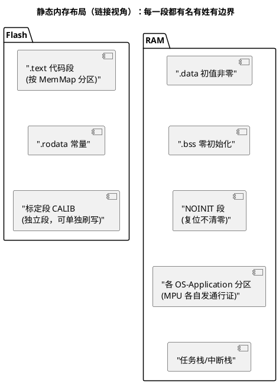

# 04-静态分配策略

> 一句话定位：车规内存布局的主旋律——一切在链接期定死：静态创建、MemMap 分段、MPU 分区护体、NOINIT 保命；动态内存不是被禁止，而是被关进"仅初始化期"的笼子。
> 等级：L2 ｜ 前置：[03-堆与碎片](03-堆与碎片.md)

## 核心概念

**静态分配**：所有代码与数据的地址、大小在编译/链接期确定，map 文件就是最终判决书。好处三连——**确定性**（无运行期分配失败）、**可审计**（链接器 map 即证据）、**碎片免疫**（不存在"分配"这个动作）。代价：灵活性差、RAM 按峰值配置容易吃紧，需要"错峰共享"技巧。



## 详解

### 1. FreeRTOS 的全静态模式

`configSUPPORT_STATIC_ALLOCATION = 1` 后，任务/队列/信号量/事件组/软件定时器全部有 `...CreateStatic` 版本：内存由应用提供（static 数组），内核只登记。同时必须实现两个"内存供给"回调——Idle/Timer 任务的栈与 TCB 也改由应用给：

```c
static StaticTask_t  g_idle_tcb;
static StackType_t   g_idle_stack[configMINIMAL_STACK_SIZE];

void vApplicationGetIdleTaskMemory(StaticTask_t **ppxIdleTcb,
                                   StackType_t **ppxIdleStack,
                                   uint32_t *pulIdleStackSize)
{
    *ppxIdleTcb        = &g_idle_tcb;
    *ppxIdleStack      = g_idle_stack;
    *pulIdleStackSize  = configMINIMAL_STACK_SIZE;
}
```

收益：链接期就能列出全部内核对象，`uxTaskGetSystemState` 级别的账本不再有"隐藏分配"；代价：对象数量上限写死——而车规恰恰喜欢写死。

### 2. AUTOSAR 的 MemMap：把"落哪段"从源码抽走

源码里 `#include "MemMap.h"` 前后夹住 `MEMMAP_<SECTION>` 宏，编译期展开成 `#pragma section`，链接期由配置生成的段定义定址（机制详见 [05-AUTOSAR-MemMap机制](../../../../01-编程语言/2-L2进阶/内存管理/05-AUTOSAR-MemMap机制.md)）。典型分区：标定参数独立段（可单独擦写）、错误码进 NOINIT、核心逻辑指定特定 core 的近 RAM（TC377 每核 DSPR 独立，跨核数据显式进共享 SRAM，见 [05-多核OS](../../../../07-AUTOSAR架构/2-L2进阶/系统服务栈/Os/05-多核OS.md)）。

### 3. MPU 分区：静态布局的"护体神功"

静态布局让每块数据的边界**在链接期已知**——这正好是 MPU 需要的输入。AUTOSAR 把 MPU 配置与 **OS-Application** 绑定：每个 OS-Application 声明可读/可写区间，任务/ISR 运行时按所属 App 换装 MPU 通行证；非信任 App 越界写 → ProtectionHook（见 [02-栈溢出检测](02-栈溢出检测.md) 第 3 节）。没有静态布局，"谁能写哪"就只能靠自觉；有了它，硬件替你站岗。

### 4. NOINIT：留给"下一次启动"的信

复位后大部分 RAM 被启动代码清零/赋初值，但 NOINIT 段**刻意不清**：放看门狗复位前的诊断快照、崩溃任务号、DTC 中间态。纪律：NOINIT 数据必须带 magic+校验和，验证通过才当真——否则上次残值会被当成本次有效数据。

### 5. 峰值叠加与错峰共享

静态的账按"各模块最坏用量"记，若某模块只在初始化用大缓冲、另一模块只在运行期用，两者峰值错开却各配一份 = 浪费。对策：

- **联合复用**：`union { InitBuf_t init; RunBuf_t run; }`——加注释声明互斥条件；
- **共享池+仲裁**：一个固定块池多个模块按约定借用（借还都在任务级，有锁保护）；
- **生命周期压缩**：初始化大缓冲用完即"归还"给系统（指针交接给运行期模块）。

## 易错点与陷阱

1. **现象：静态对象=全局生命周期带来的重入踩踏**——原因：多个任务/激活实例共用同一 static 缓冲——对策：每实例私有缓冲，或进临界区/加互斥；可重入函数内禁 static 工作区。
2. **现象：union 复用缓冲偶发互相覆盖**——原因：错峰假设被新增代码打破（初始化任务被调度切走后运行期模块开跑）——对策：union 复用必须配"交接同步点"（事件/信号量），并在注释写明所有权转移规则。
3. **现象：复位后读到"假诊断数据"**——原因：NOINIT 残值无校验——对策：写入时带 magic+版本+校验和，读取先验后用。
4. **现象：开了全静态，第三方库偷偷 malloc 崩溃**——原因：库内部使用运行期分配——对策：链接期查 map 里的 malloc 符号引用；给库配 heap_1 专用池（仅初始化期）。
5. **现象：标定参数刷写失败/被误擦**——原因：没放独立段，与代码/数据混居——对策：CALIB 独立 MemMap 段+独立 Flash 区域，刷写流程按段操作。
6. **现象：跨核变量读不到更新**——原因：放在了单核私有 RAM 或未处理缓存一致性——对策：跨核数据显式放共享 SRAM；带 cache 的平台做维护或用非缓存区。

## 面试高频题

**Q：车规为什么以静态分配为主？动态内存的风险具体有哪些？**
答：静态分配把内存问题全部前移到链接期：地址确定、总量确定、map 可审计，满足确定性调度与功能安全论证。动态内存的风险：分配时间与成功率依赖碎片状态（时序不确定）、失败模式后移到运行期难复现、悬垂/泄漏/双释放等错误类别都要额外防护。

**Q：FreeRTOS 如何做到完全静态？**
答：`configSUPPORT_STATIC_ALLOCATION=1`，所有内核对象用 `xTaskCreateStatic`/`xQueueCreateStatic` 等 Static 版本创建，内存由应用的 static 数组提供；并实现 `vApplicationGetIdleTaskMemory`/`vApplicationGetTimerTaskMemory` 两个回调供系统任务使用。至此内核零运行期分配。

**Q：MemMap 机制解决什么问题？**
答：让"代码/数据落在哪个内存段"从源码中解耦：源码用 `MEMMAP_*` 宏声明分区意图，段名由配置工具生成，链接脚本决定最终地址——同一份代码可以在不同项目里被排布到不同 Flash/RAM 区（如标定段、核绑定段、NOINIT 段），不用改源码。

**Q：静态布局和 MPU 保护是什么关系？**
答：MPU 保护需要"区域的起始地址、大小、权限"三要素，而这三要素只有在静态布局下才是编译期已知的、可精确对齐的。AUTOSAR 将 MPU 区间与 OS-Application 绑定：信任 App 全开放，非信任 App 只能碰自己声明的区间，越界由硬件 trap 进 ProtectionHook——静态布局是因，硬件护体是果。

## 延伸

- [03-堆与碎片](03-堆与碎片.md)：被"关进笼子"的动态分配长什么样；
- [05-AUTOSAR-MemMap机制](../../../../01-编程语言/2-L2进阶/内存管理/05-AUTOSAR-MemMap机制.md)：MEMMAP 宏展开与段定义的完整机制；
- [05-多核OS](../../../../07-AUTOSAR架构/2-L2进阶/系统服务栈/Os/05-多核OS.md)：TC377 双核下的 RAM 归属与共享区规划；
- [02-临界区](../中断管理/02-临界区.md)：静态缓冲共享时的互斥选型。