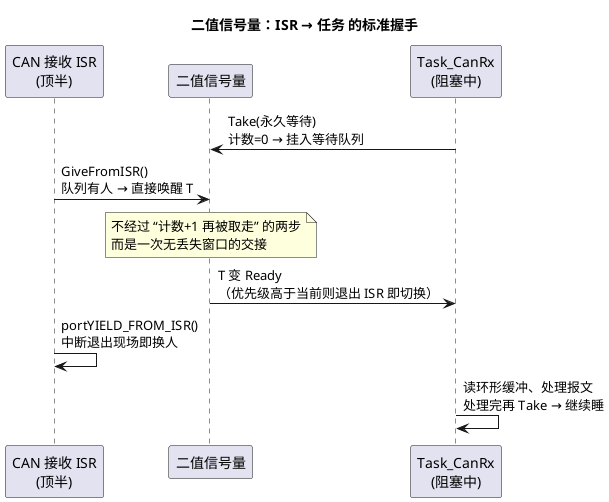

# 01-信号量

> 一句话定位：信号量 = 一个计数器 + 一条等待队列，take 没拿到就睡、give 有人等就叫醒——RTOS 里最古老的"发信号"原语，也是 ISR 与任务之间最安全的握手通道。
> 等级：L2 ｜ 前置：[从前后台到RTOS-操作系统全景](../../../00-入门导读/01-从前后台到RTOS-操作系统全景.md)

## 核心概念



语义只有两条，所有变种都从这两条长出来：

- **take**：计数 > 0 → 减 1 立即返回；计数 = 0 → 当前任务挂进等待队列（阻塞，可选超时）；
- **give**：等待队列有人 → 唤醒队首（交接）；没人等 → 计数 + 1（不超过上限，"记住"这次给信号）。

## 详解

### 三种变体一张表

| 维度 | 二值信号量 | 计数信号量 | 互斥锁（下篇主角） |
|---|---|---|---|
| 计数范围 | 0/1 | 0~N（上限配置） | 0/1 |
| 本职 | **同步/通知**：事件发生了 | **资源计数**：N 个同类资源剩几个 | **互斥**：独占共享区 |
| ISR 能否 give | 能（FromISR） | 能（FromISR） | **不能**（有"持有者"概念） |
| 优先级保护 | 无 | 无 | 有（继承/天花板） |
| 典型场景 | ISR→任务通知、任务间握手 | DMA 通道池、连接数限流 | 共享缓冲区、外设会话 |

### give/take 的细节语义

- give 遇到**计数已满**会失败（FreeRTOS 返回 pdFALSE）——事件可能被丢，**返回值必须检查**；计数信号量的上限应等于真实资源数；
- take 的超时参数三档用法：0 = 纯查询不等待；有限值 = 带超时重试；无限 = 死等（慎用——看门狗视角这是"合法的卡死"）；
- give 在没人等时把信号存进计数：下一个 take 立刻成功——**信号量有"记忆性"**。对比：事件位"粘滞直到清除"、队列"逐条排队"，三者的容量语义完全不同（见[事件组](03-事件组.md)与[消息队列](04-消息队列.md)）。

### FromISR：ISR 侧的铁律

**ISR 只 give，不 take**。原因：take 失败要"阻塞等待"，而 ISR 不是任务、没有可挂起的上下文。所以：

- FreeRTOS 的 FromISR 版 API 一律不阻塞，也不当场切换，而是用 `pxHigherPriorityTaskWoken` 标记"是否惊动了高优任务"，ISR 尾部统一 `portYIELD_FROM_ISR()`；
- OSEK 同理：ISR 可 SetEvent / ActivateTask（给方向），WaitEvent（等方向）只属于任务，非法调用进 ErrorHook；
- ISR 里连"有限超时的 take"都不存在——没有"稍后再试"的稍后。

### OSEK 视角：没有"通用信号量"这件东西

OSEK OS 刻意只提供两个原语，把信号量的两大用途拆开：**Event** 管通知（挂在任务上的掩码、单播），**Resource** 管互斥（优先级天花板）。计数信号量的"资源池"语义由应用层（缓冲管理、计数变量）或 COM/IOC 承担。所以"OSEK 里怎么做资源池"的答案是：不是 OS 原语，是应用层计数 + Event/Resource 组合，详见 [07 区 Os/02-事件与资源](../../../../07-AUTOSAR架构/2-L2进阶/系统服务栈/Os/02-事件与资源.md)。

### 三个标准用法

```c
/* ① ISR→任务事件通知（二值）：顶半登记、底半干活 */
void CanRx_Isr(void)
{
    Rb_Push(&g_canRb, &frame);              /* 数据进环形缓冲 */
    xSemaphoreGiveFromISR(g_semCan, &woken);
    portYIELD_FROM_ISR(woken);              /* 惊动高优就立刻换人 */
}
void Task_CanRx(void *arg)
{
    for (;;) {
        xSemaphoreTake(g_semCan, portMAX_DELAY);
        while (Rb_Pop(&g_canRb, &frame)) { Can_Process(&frame); }
    }
}

/* ② 资源池（计数，初值 = 上限 = 资源数） */
xSemaphoreTake(g_semDma, 100);              /* 领一个 DMA 通道，没空位等 100ms */
Dma_Start(ch, ...);
xSemaphoreGive(g_semDma);                   /* 用完必须还 */

/* ③ 任务间单向同步（“数据备好了吗”） */
/* 生产者 */ Fill(buf); xSemaphoreGive(g_semReady);
/* 消费者 */ xSemaphoreTake(g_semReady, portMAX_DELAY); Use(buf);
```

## 易错点与陷阱

1. **拿二值信号量当互斥锁用**。现象：高优任务偶发超时。原因：信号量没有优先级继承，低优持"锁"、高优等锁时被中优插队——教科书优先级反转。对策：保护共享资源一律用互斥锁/Resource，见[互斥锁与优先级继承](02-互斥锁与优先级继承.md)。
2. **ISR 里调用 take 或任何阻塞 API**。现象：断言失败/HardFault。原因：ISR 没有可阻塞的上下文。对策：把"等"挪进任务，ISR 只 give。
3. **give 返回值不检查**。现象：偶发丢事件且无法定位。原因：计数满时 give 静默失败。对策：检查返回值并累计上报，评估上限是否配小。
4. **计数上限与真实资源数不一致**。现象：超发资源、数组越界。原因：MAX 配大于资源数。对策：上限=资源数，写死在创建处并与资源定义放在一起。
5. **把"take 成功"当"事件内容"**。现象：处理了旧数据或重复数据。原因：信号量只说"有事件"，不带内容不带次数（连发两次只看见一次）。对策：内容用队列/环形缓冲，次数用计数信号量。
6. **用轮询+延时代替信号量**。现象：响应拍子粗、CPU 空转。原因：裸机习惯带进 RTOS。对策：事件驱动改造，见[调度模型](../任务调度原理/01-调度模型.md)。

## 面试高频题

**Q：二值信号量、计数信号量、互斥锁三者有什么区别？**
答：二值信号量：0/1 计数，做同步/事件通知，ISR 可 give；计数信号量：0~N，管理同类资源池的余量；互斥锁：0/1 但有"持有者"概念、谁拿谁还，内置优先级继承/天花板，专用于互斥共享资源，ISR 不可用。一句话：发信号用信号量，管余量用计数，上锁用互斥锁。

**Q：为什么 ISR 里只能 give 不能 take？**
答：take 的本质是"条件不满足就把当前执行流挂起"，实现上要保存任务上下文切换出去；ISR 不是任务、没有自己的栈与 TCB 可挂，阻塞语义无从谈起。所以所有 RTOS 的 ISR 侧原语都是 give/置位/发送类非阻塞操作（FromISR 系列、SetEvent），等待永远发生在任务侧。

**Q：give 发出时没有任务在等，这个信号去哪了？**
答：存进计数器：计数 +1（不超过上限），下一个 take 立即成功不阻塞——信号量有"记忆性"。二值最多记 1 次、计数最多记 N 次，超出的 give 失败、事件丢失。这也是它和队列的差别：队列逐条排队不丢条数；和事件组的差别：事件位能按位区分事件类别。

**Q：信号量、事件组、队列各适合什么场景？**
答：只关心"发生了、唤醒我" → 二值信号量（ISR 高频路径首选）；关心"发生了哪几类、要组合等待" → 事件组；要传数据内容且不丢条数 → 队列；要管同类资源余量 → 计数信号量。车载实践：ISR→任务握手用信号量/事件，任务间小消息用队列，共享数据上锁用互斥锁。

## 延伸

- [02-互斥锁与优先级继承](02-互斥锁与优先级继承.md)：信号量为什么不能当锁用的完整理由；
- [03-事件组](03-事件组.md)：带"哪一类事件"语义的同步原语；
- [调度模型](../任务调度原理/01-调度模型.md)：等待队列与任务状态机的关系；
- [07 区 Os/02-事件与资源](../../../../07-AUTOSAR架构/2-L2进阶/系统服务栈/Os/02-事件与资源.md)：OSEK 用 Event+Resource 拆解信号量的两大用途；
- [FreeRTOS](../../../2-L2进阶/FreeRTOS/README.md)：源码里看计数器与等待列表的真实长相。
