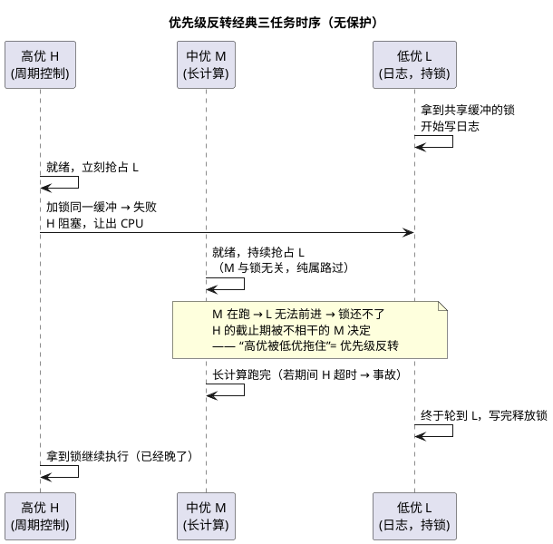

# 02-互斥锁与优先级继承

> 一句话定位：互斥锁是有"主人"的钥匙——优先级继承与优先级天花板两种协议把"拿钥匙的人不能被无限期插队"变成机制保证，OSEK 的 GetResource 就是天花板协议本身。
> 等级：L2 ｜ 前置：[01-信号量](01-信号量.md)

## 核心概念

互斥锁与二值信号量的本质差异：**互斥锁有持有者（owner）**——谁上锁谁解锁，归还与任务的生死绑定。这个"主人"身份让内核能做一件信号量做不到的事：**动态调整持有者的优先级**。没有这层保护，就会上演 RTOS 最著名的翻车现场：

反转成立只需三要素：**抢占内核 + 低优持锁高优等锁 + 中优任务插队**。缺一不可——所有解法都从拆这三要素下手。

## 详解

### 解法一：优先级继承（Priority Inheritance）

H 等 L 的锁时，内核把 L **临时抬到 H 的优先级**：M 再也插不进来，L 以"高优身份"尽快跑完临界区、释放锁、降回原优先级，H 立刻接管。

- FreeRTOS 的 `xSemaphoreCreateMutex()` 内置继承：持有期间其优先级 = 所有等待者中最高者；
- 代价：只救"单层"反转——链式等待（L 又在等 K 的锁）需要递归继承；**不防死锁**（互相持锁照样抱死）；
- 实现要点：Release 时若仍有人等，保持最高等待者优先级，否则降回基优先级。
- 直觉记法：继承协议下，"锁的主人暂时借穿等待者的军衔"——还锁时脱下来，谁也没吃亏。

### 解法二：优先级天花板（Priority Ceiling）——OSEK 的选择

每个资源配置一个天花板优先级（≥ 所有会使用它的任务的最高优先级）。**GetResource 的瞬间就把任务抬到天花板**，不等"有没有人来等"再判断：

| 维度 | 优先级继承 PI | 优先级天花板 PCP（OSEK） |
|---|---|---|
| 何时抬升 | 高优来等锁才抬（被动） | 拿锁瞬间就抬（主动/立即） |
| 抬到多少 | 等待者的最高优先级 | 资源配置的天花板优先级 |
| 防死锁 | 不防 | **防**：持资源禁阻塞 + LIFO 释放，循环等待被掐死 |
| 抢占判断 | 需查询锁的等待关系 | O(1)：与当前所持最高天花板比较 |
| 配置成本 | 零配置 | 需静态配置天花板（AUTOSAR 工具链自动算） |
| 代表 | FreeRTOS Mutex、POSIX | OSEK/AUTOSAR OS Resource、VxWorks（可选） |

OSEK 的 `GetResource(ResID)/ReleaseResource(ResID)` 就是立即天花板协议，配三条硬约束：持资源期间**禁止调用阻塞类服务**（WaitEvent 等）、禁止 TerminateTask、释放必须 LIFO。`RES_SCHEDULER` 是特殊资源：天花板 = 系统最高任务优先级，Get 它等价于"关任务级抢占"（中断照进）——常用于保护非重入库函数。配置与用法见 [07 区 Os/02-事件与资源](../../../../07-AUTOSAR架构/2-L2进阶/系统服务栈/Os/02-事件与资源.md)。

### 临界区与锁的层次：选型决策

| 手段 | 原理 | 最大持有时长 | 能否阻塞等待 | 保护对象 |
|---|---|---|---|---|
| 关中断（BASEPRI/ICR） | 屏蔽一切抢占源 | 几条~几十条指令（μs 级） | 否 | 任务与 ISR 共享的极短区 |
| 调度锁（RES_SCHEDULER / vTaskSuspendAll） | 只挡任务抢占，ISR 照进 | 短 | 否 | 仅任务间共享、期间不依赖阻塞 |
| 互斥锁（Mutex/Resource） | 排队+唤醒+优先级保护 | ms 级可接受 | 是 | 任务间共享的结构体/外设会话 |
| 自旋锁（多核 SpinLock） | 忙等占核 | 极短 | 否（忙等） | 多核共享变量、缓存行 |

单核选型顺序：**任务与 ISR 共享 → 关中断（越短越好）或顶半底半+缓冲；仅任务间、临界区长 → 互斥锁；几条指令的小事 → 关中断；跨核 → AUTOSAR SpinLock**（见 [07 区 Os/05-多核OS](../../../../07-AUTOSAR架构/2-L2进阶/系统服务栈/Os/05-多核OS.md)）。

## 易错点与陷阱

1. **二值信号量当互斥锁**。现象：高优偶发超时，压测才现。原因：信号量无 owner、无继承，反转三要素齐活。对策：凡"保护共享资源"一律 Mutex/Resource，信号量只做通知。
2. **ISR 里 take 互斥锁**。现象：API 层面直接非法。原因：互斥锁的优先级协议建立在"持有者是任务"之上，ISR 无此身份（FromISR 也不提供）。对策：ISR 用信号量/事件登记，回任务再拿锁。
3. **OSEK Resource 天花板配置过低**。现象：开了天花板照样反转。原因：天花板 < 某使用者的优先级，那个使用者照样插队。对策：用工具链按使用者集合自动计算；手改 OIL/ARXML 后必须复算。
4. **持锁干长活/调阻塞 API**。现象：全系统高优任务集体慢一个档次。原因：RTA 的阻塞项 B 被放大，且 OSEK 直接禁止。对策：临界区只包真正共享的几行，I/O、大计算、内存申请移出去。
5. **同一任务重复上锁非递归锁**。现象：自己等自己，永久卡死。原因：普通 Mutex 无递归计数。对策：FreeRTOS 用 xSemaphoreCreateRecursiveMutex；OSEK 结构上禁止——重构代码消除重入。
6. **关中断当万能锁**。现象：中断延迟飙升、丢 CAN 帧、看门狗复位。原因：把 ms 级的活关进了 μs 级的手段里。对策：关中断只护几条指令；长活换互斥锁。

## 面试高频题

**Q：什么是优先级反转？怎么解决？**
答：低优先级任务持锁，高优先级任务等锁阻塞，此时中优先级任务抢占低优任务，高优任务的完成时间被无关的中优任务决定——名义高优实际被低优拖住。解决：①优先级继承（PI）：高优等锁时把持有者临时抬到高优优先级，FreeRTOS Mutex 内置；②优先级天花板（PCP）：拿锁即抬到资源天花板，OSEK GetResource 即此，还配合约束掐死死锁。根治还包括缩短临界区、消除不必要的共享。

**Q：优先级继承和优先级天花板有什么区别？OSEK 为什么选后者？**
答：PI 被动：有人等锁才抬、抬到等待者高度，零配置但不管死锁、链式等待需递归继承；PCP 主动：拿锁瞬间抬到静态配置的天花板，抢占判断 O(1)，配合"持锁禁阻塞、LIFO 释放"消灭循环等待。OSEK 选 PCP 因为天花板是编译期常量、直接进 RTA 的阻塞项 B，静态可分析、实现简单，契合静态内核哲学。

**Q：互斥锁和二值信号量这么像，为什么不能互换？**
答：三个差别：①owner 语义：锁谁拿谁还（可校验、可绑任务生死），信号量任何上下文都能 give；②优先级保护：锁有继承/天花板，信号量没有——互换直接造出优先级反转；③ISR 可用性：信号量 give 可来自 ISR，锁不可以。口诀：同步用信号量，互斥用锁。

**Q：RES_SCHEDULER 是什么？和关中断有什么区别？**
答：OSEK 预置的内部资源，天花板 = 系统最高任务优先级；GetResource(RES_SCHEDULER) 等效于"锁调度器"：挡住一切任务级抢占，但**中断照常进**。关中断则连 ISR 一起挡。所以它适合保护"任务间、几行代码、不介意被中断打断"的区；要连中断一起挡（与 ISR 共享的数据）必须用关中断原语。FreeRTOS 的对应物是 vTaskSuspendAll()。

## 延伸

- [01-信号量](01-信号量.md)：为什么信号量干不了锁的活；
- [05-优先级反转案例](05-优先级反转案例.md)：火星探路者事故的完整复盘与排查闭环；
- [03-事件组](03-事件组.md)：通知类原语的另一位成员；
- [07 区 Os/02-事件与资源](../../../../07-AUTOSAR架构/2-L2进阶/系统服务栈/Os/02-事件与资源.md)：GetResource 天花板在 AUTOSAR OS 的配置化形态；
- [07 区 Os/05-多核OS](../../../../07-AUTOSAR架构/2-L2进阶/系统服务栈/Os/05-多核OS.md)：多核时代的 SpinLock 层次。
