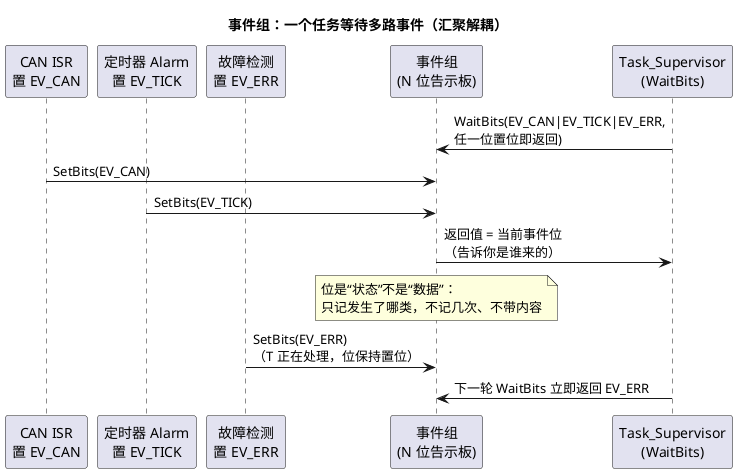

# 03-事件组

> 一句话定位：事件组 = 一块"N 位告示板"——生产者置位、消费者按位组合等待（或/与），一个等待点同时盯多类事件；OSEK 的 Event 是它的"挂在任务身上"的单播版。
> 等级：L2 ｜ 前置：[02-互斥锁与优先级继承](02-互斥锁与优先级继承.md)

## 核心概念



一句话定位它与其他原语的分工：**信号量回答"有没有"，事件组回答"是哪几件"，队列回答"内容是什么"**。

## 详解

### FreeRTOS 事件组的机制

- 位宽：`configUSE_16_BIT_TICKS = 1` 时 8 位可用，否则 24 位可用——每类事件占一位，位宽不够就拆多个组或改用队列；
- `xEventGroupSetBits / ClearBits / GetBits`：置位/清位/读位，任务上下文使用；
- `xEventGroupWaitBits(组, 掩码, xClearOnExit, xWaitForAllBits, 超时)`：两个布尔参数决定等待语义——`xWaitForAllBits` 选**或/与**（任一位到 vs 全部到），`xClearOnExit` 选**返回时是否自动清位**；
- **广播语义**：多个任务等同一位，置位时全部唤醒——与 OSEK 的单播正好相反（见下表）；
- ISR 里只能用 `xEventGroupSetBitsFromISR`——它内部经定时器守护任务转交（"置位+唤醒"的组合动作不满足 ISR 确定性约束），所以唤醒会晚一拍；急路径改用信号量或任务通知。

### OSEK Event：同一思想的"单播严格版"

| 维度 | FreeRTOS EventGroup | OSEK Event |
|---|---|---|
| 载体 | 独立内核对象，全局共享 | 挂在每个任务身上的事件掩码 |
| 谁能置位 | 任何任务/ISR（FromISR 转交） | SetEvent(目标任务, 掩码)，可跨任务指定（含 ISR） |
| 谁能等待 | 任何任务，可多任务等同一位 | 只有宿主任务 WaitEvent，一个位一个消费者 |
| 唤醒语义 | 广播（全部唤醒） | 单播（只醒宿主） |
| 清除 | xClearOnExit 或手动 ClearBits | ClearEvent 只能任务清自己 |

OSEK 把事件绑死在任务上，换来两点收益：**投递精准**（不惊醒无关者）与**静态可查**（每任务的掩码编译期确定）。代价是"多消费者"要显式多次 SetEvent 复制。AUTOSAR OS 完整继承此设计，扩展任务的完整事件循环见 [07 区 Os/02-事件与资源](../../../../07-AUTOSAR架构/2-L2进阶/系统服务栈/Os/02-事件与资源.md)。

### 事件循环骨架（两种口音对照）

```c
/* FreeRTOS：OR 等待 + 用返回值判断来源 */
EventBits_t bits = xEventGroupWaitBits(g_eg, EV_CAN|EV_TICK|EV_ERR,
                                       pdTRUE,   /* 返回即清位 */
                                       pdFALSE,  /* 任一位到即返回（OR） */
                                       pdMS_TO_TICKS(100));
if (bits & EV_CAN)  { Can_Handle();  }
if (bits & EV_TICK) { Tick_Handle(); }
if (bits & EV_ERR)  { Err_Handle();  }   /* 用返回值，别再 GetBits */

/* OSEK：先等后取再清，经典三连 */
WaitEvent(EV_CAN | EV_TICK | EV_ERR);
GetEvent(Task_Sup, &ev);
ClearEvent(ev);                        /* 清“取到的”，不清处理期间新来的 */
if (ev & EV_CAN) { /* ... */ }
```

### 选型表：通知类三兄弟

| 需求 | 用什么 |
|---|---|
| 只需"有事叫我"（单一事件、ISR 高频） | 二值信号量 / 任务通知 |
| 多类事件、一个等待点、组合条件 | 事件组 / OSEK Event |
| 要传数据、不许丢条数 | 队列 |
| 同一事件发生次数要保留 | 计数信号量（事件位只有 1 bit） |

## 易错点与陷阱

1. **OR 等待后不读返回值**。现象：不知道是谁触发，只能全查一遍。原因：WaitBits 的返回值才是"本次到货清单"。对策：永远用返回值分支；不要事后 GetBits——期间位可能又变了。
2. **xClearOnExit 配错**。清了没处理的位 → 事件凭空消失；没清 → 下次 WaitBits 立即返回同一批位，死循环空转。对策：OR 消费型用 pdTRUE；"读状态"型手动清。
3. **拿事件位当数据/次数用**。现象：连发三次只处理一次。原因：位只有 1 bit，无内容无计数。对策：次数用计数信号量，内容走队列；位只做"发生过"的路标。
4. **OSEK 忘了 ClearEvent**。现象：WaitEvent 立即返回"假事件"，任务空转。原因：事件粘滞直到清除。对策：固定"Wait→Get→Clear(取到的)→处理"四连；Clear 用取到的掩码而不是写死。
5. **ISR 里调 Wait 或非 FromISR 的 Set**。现象：断言/未定义行为。原因：等待需要任务上下文；置位伴随唤醒要走安全路径。对策：ISR 只用 FromISR 版（注意转交延迟）或改用信号量。
6. **多消费者误用广播**。现象：一个位唤醒 N 个任务，N−1 个白跑（惊群）。原因：FreeRTOS 事件组是广播语义。对策：单播需求用 OSEK SetEvent / 任务通知 / 队列，或每位一个消费者并在文档写明归属。

## 面试高频题

**Q：事件组和信号量有什么区别？分别适合什么场景？**
答：信号量是一个计数（有/无、余量），只回答"有没有事件"；事件组是 N 个独立位，回答"发生了哪几类"，还支持 OR/AND 组合等待。单事件高频通知（尤其 ISR→任务）用二值信号量更轻；一个任务要同时盯多路事件（CAN/定时/故障汇聚）用事件组。OSEK 里的对应物是 Event——挂在任务身上的单播掩码。

**Q：OSEK 的事件为什么是"单播"的？有什么好处？**
答：OSEK 的事件掩码长在每个任务身上：SetEvent 指定目标任务置位，只有宿主能 WaitEvent/ClearEvent，一个事件只有一个消费者。好处：投递精准不惊群；每任务的掩码静态可查，配合扩展任务状态机做时序分析简单。代价：多消费者要显式多次投递。

**Q：事件位会丢失吗？连续置位两次会怎样？**
答：位是状态不是队列：置位后到清除前是"粘滞"的，此间再置位不报错、但无从区分一次还是 N 次——次数信息丢失；不过"发生过"不会丢（内核保证唤醒，这比裸标志强）。要保次数用计数信号量，要保内容用队列。

**Q：xEventGroupWaitBits 的 xClearOnExit 和 xWaitForAllBits 分别控制什么？**
答：xWaitForAllBits=pdFALSE 时任一指定位置位即返回（OR，多路汇聚）；=pdTRUE 时全部指定位置位才返回（AND，做多条件齐备的同步点）。xClearOnExit=pdTRUE 时返回前自动清掉掩码内的位（OR 消费模式）；=pdFALSE 时位保持由用户手动清（读状态模式）。四个组合对应四种使用姿势。

## 延伸

- [01-信号量](01-信号量.md)：单事件通知的原语；
- [04-消息队列](04-消息队列.md)：要带内容时的选择；
- [调度模型](../任务调度原理/01-调度模型.md)：WaitEvent 如何把任务推进 Waiting 态；
- [07 区 Os/02-事件与资源](../../../../07-AUTOSAR架构/2-L2进阶/系统服务栈/Os/02-事件与资源.md)：扩展任务事件循环的完整形态与 RES_SCHEDULER；
- [FreeRTOS](../../../2-L2进阶/FreeRTOS/README.md)：事件组源码与任务通知的轻量替代。
