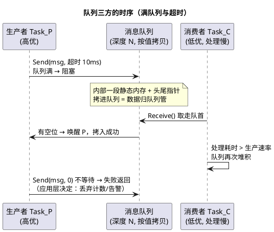

# 04-消息队列

> 一句话定位：队列 = 定长元素的 FIFO + 按值拷贝 + 两端可阻塞——RTOS 里唯一"既传内容又不丢条数"的原语；车载 OSEK/AUTOSAR 里它的对应物不在 OS，而在 COM 与 IOC。
> 等级：L2 ｜ 前置：[03-事件组](03-事件组.md)

## 核心概念

队列把三件事打包成一个原语：**传递内容（拷贝语义）**、**保序保条数（FIFO）**、**流量调节（两端阻塞/超时）**。[信号量](01-信号量.md)和[事件组](03-事件组.md)都只有唤醒没有内容——这是队列不可替代的地方。

## 详解

### FreeRTOS 队列的关键性质

- **按值拷贝**：xQueueSend 把 `sizeof(元素)` 字节从发送者拷进队列内部存储，接收时再拷出。数据在队列里的生命周期与发送者解耦——**没有共享就没有竞态**，这是它天然线程安全的根源；内核只需用临界区保护指针操作，多生产者多消费者随便用；
- 创建时定死"深度 × 元素大小"，一次性占好内存（车载口味优先 xQueueCreateStatic 静态创建）；
- `xQueueSendFromISR` / `xQueueReceiveFromISR`：ISR 侧收发，规则同信号量——不阻塞、带 woken 标志；
- `xQueuePeek` 看队首不取走；`xQueueMessagesWaiting` 查水位——背压监控的关键仪表；
- `xQueueOverwrite`：仅深度 1 的队列可用，"新值覆盖旧值"——适合**状态**（最新采样），不适合**命令**（每条都要执行）。

### 大数据怎么办：传值的两难与传指针的铁律

按值拷贝对大结构（几 KB 的 PDU）很贵。传指针是标准解法，但必须守住所有权规则：

- **发送后发送方不得再碰这块内存**（所有权转移），或走内存池+归还信号量；
- **绝不能传栈上地址**——函数一返回就悬垂；
- 车载更常用"静态内存池 + 句柄进队列"：池子固定、归还靠约定，内存行为可预测，见[内存管理](../内存管理/README.md)。

### 两种 ISR→任务搬运姿势

| 姿势 | 做法 | 适用 |
|---|---|---|
| 队列直搬 | ISR 里 xQueueSendFromISR 把数据拷进队列 | 低频、消息小（按键事件、命令字） |
| 缓冲+信号量 | ISR 写环形缓冲再 give 信号量，任务被唤醒后批量取 | 高频、数据大（CAN 流、ADC 流） |

判据是"每条消息的拷贝成本 × 到达频率"：高频大流量走队列会把 CPU 耗在 memcpy 上，且队列深度难以估计；缓冲+信号量让 ISR 只做一次内存写，批处理效率高一个量级。

### OSEK/AUTOSAR 视角：队列不住在 OS 里

| 层 | 机制 | 一句话 |
|---|---|---|
| OSEK OS | **没有通用消息队列** | 只有 Event（通知）+ Resource（互斥），消息走 COM |
| OSEK COM | SendMessage / ReceiveMessage | 消息+标志+滤波，面向通信抽象 |
| AUTOSAR COM | 信号 → I-PDU，Com_SendSignal/ReceiveSignal | 按信号打包、回调通知，发往总线 |
| AUTOSAR IOC | 跨 OS-Application（含跨核）数据通道 | 队列式（保条数）或数据量式（保最新） |

所以"FreeRTOS 里一个 queue 的事"，在 AUTOSAR 工程里要拆开：**同核走应用层缓冲+Event，上总线走 COM，跨核跨分区走 IOC**。IOC 的"队列式/数据量式"二选一，正是"保条数 vs 保最新"的架构决策，见 [07 区 Os/05-多核OS](../../../../07-AUTOSAR架构/2-L2进阶/系统服务栈/Os/05-多核OS.md)。

### 队满策略三选一

1. **阻塞超时**：把背压传导给生产者（生产快于消费时让上游知道疼）——默认推荐；
2. **丢弃+计数**：保实时性弃完整性（日志、监控类流量）；
3. **覆盖最新**（xQueueOverwrite）：只关心最新状态（采样值类）。

选错方向的现象都很典型：命令被覆盖导致丢执行、日志被阻塞拖慢控制环。

## 易错点与陷阱

1. **传栈上指针进队列**。现象：接收方读到随机值。原因：发送函数返回后栈帧回收。对策：静态缓冲或内存池，所有权规则写进接口注释。
2. **ISR 里用非 FromISR 版本或带超时**。现象：断言/HardFault。原因：ISR 无阻塞语义。对策：ISR 侧一律 FromISR + woken 标志。
3. **消费速率失衡不设监控**。现象：内存没爆但延迟爆炸，旧消息排队几秒才被处理。原因：队列把"丢"变成"等"，问题被缓冲掩盖。对策：xQueueMessagesWaiting 高水位监控 + 队满计数上报，把背压显性化。
4. **大结构按值拷贝**。现象：发送任务 CPU 占用高、时序抖动。原因：每条消息全量 memcpy。对策：传句柄/指针+池，或拆成"事件通知+共享区（配互斥锁）"。
5. **在 AUTOSAR 工程里找"OS 队列"找不到就全局变量裸传**。现象：偶发数据撕裂。原因：跨任务共享无同步。对策：同核用 Event+缓冲或 SchM 临界区，跨核走 IOC，上总线走 COM。
6. **把队列当同步屏障**。现象：时序对不上，等待方先跑了一步。原因：队列是异步缓冲不是握手协议。对策：要握手用成对信号量，或多条件齐备用事件组 AND 等待。

## 面试高频题

**Q：FreeRTOS 队列为什么用拷贝语义？有什么好处？**
答：发送时把数据按元素大小完整拷进队列内部存储，接收时拷出。好处：①所有权随拷贝转移，收发双方不共享内存，从机制上消灭竞态；②发送方栈上的临时变量也能安全发送（拷完即独立）；③天然支持多生产多消费，内核只需保护队列自身的指针。代价是拷贝开销——大数据传指针（配池与所有权规则）或用流缓冲。

**Q：队列、信号量、事件组、任务通知怎么选？**
答：要传内容且保条数 → 队列；只要"有事发生"的唤醒 → 二值信号量或任务通知（更轻：每任务一个 32 位通知值，免建对象）；要多类事件组合等待 → 事件组；管同类资源余量 → 计数信号量。ISR→任务高频小通知首选任务通知/信号量，任务间结构化消息用队列。

**Q：车载 AUTOSAR 环境里，任务间传消息用什么？**
答：OS 层没有通用队列（OSEK 血统只有 Event/Resource）。实践：同核同分区用应用层缓冲+Event 或 SchM 临界区；跨核跨 OS-Application 用 IOC（队列式保条数、数据量式保最新）；上总线或经 PduR 路由走 AUTOSAR COM 的信号机制。FreeRTOS 式"随手建个 queue"在静态配置哲学里不存在。

**Q：队列满了怎么办？三种策略各适合什么？**
答：①阻塞超时：背压传给生产者，适合上游能等的正常流控；②丢弃+计数：保实时舍完整，适合日志/监控类；③覆盖旧值（深度 1 的 xQueueOverwrite）：只关心最新状态，适合采样值。按消息语义选：命令类绝不覆盖，状态类不必阻塞。

## 延伸

- [03-事件组](03-事件组.md)：不带内容的唤醒原语；
- [01-信号量](01-信号量.md)：最轻的通知通道，内存池归还的配对原语；
- [07 区 Os/05-多核OS](../../../../07-AUTOSAR架构/2-L2进阶/系统服务栈/Os/05-多核OS.md)：IOC 跨核数据通道与 SpinLock；
- [FreeRTOS](../../../2-L2进阶/FreeRTOS/README.md)：队列与任务通知的源码级对照；
- [内存管理](../内存管理/README.md)：静态分配与内存池——传指针方案的地基。
