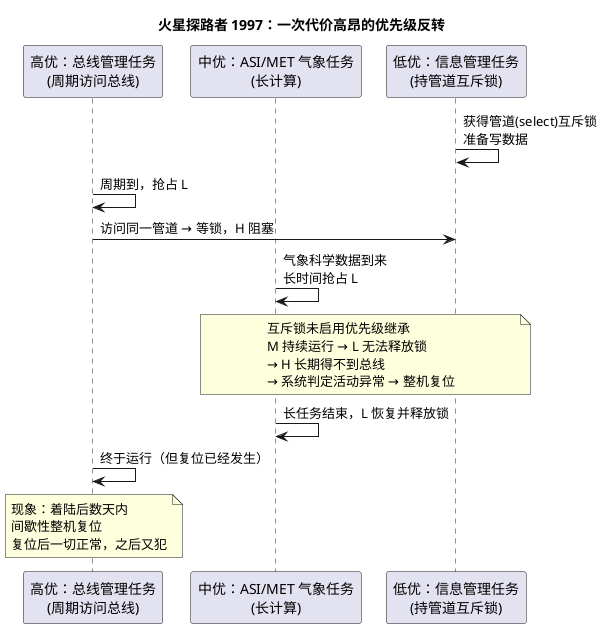

# 05-优先级反转案例

> 一句话定位：1997 年火星探路者在火星上反复整机复位，根因是一次教科书级优先级反转——本篇用这个名案加汽车变体，把"怎么发现、怎么定位、怎么修"走成完整闭环。
> 等级：L2 ｜ 前置：[04-消息队列](04-消息队列.md)

## 核心概念

案发三要素与[互斥锁与优先级继承](02-互斥锁与优先级继承.md)完全一致：**抢占内核 + 低优持锁高优等锁 + 中优插队**，缺一环都不翻车。JPL 的修复后来成为传奇：地面仿真器复现后，**向 3 亿公里外的探测器远程上传补丁，打开那把互斥锁的优先级继承**——机制没换，只拧了一个开关。

## 详解

### 案件复盘表

| 角色 | 优先级 | 行为 | 在事故中的角色 |
|---|---|---|---|
| 总线管理任务 | 高 | 周期性经 IPC 管道调度总线数据 | 受害者：等锁阻塞，错过总线窗口 |
| ASI/MET 气象任务 | 中 | 气象科学数据处理，长计算 | 无意加害者：长期抢占持锁者 |
| 信息管理任务 | 低 | 持有管道互斥锁写数据 | 持锁者：被压制，无法前进释放锁 |
| VxWorks 互斥锁 | — | 创建时默认未启用优先级继承 | 根因：机制开关没打开 |

关键教训不是"程序员菜"——三段代码各自都正确，**错在组合后的系统行为没有任何单点能看出来**。这正是"时序问题要靠机制与工具防，不靠聪明"的原因。复盘三条启示：

- 单元测试全绿 ≠ 系统时序正确：反转只活在"组合"里，评审要带着优先级表和锁清单看；
- 默认配置是最大的坑：当年 VxWorks 默认未启用继承，今天每个 OS 的"默认值"都该过一遍安全清单；
- 远程可观测性救了任务：trace 工具留在固件里，才可能"在火星上调试"——量产 ECU 的 Hook/Trace 同理。

### 汽车工程师的变体现场

- **BSW 共享缓冲被诊断卡住**：Dcm 传大块 DID 数据（长临界区）期间持有与 CanIf/PduR 共享的缓冲锁，中优的 XCP 测量任务持续运行，周期 10ms 的总线任务超时，触发通信恢复流程；
- **外设会话被日志压制**：低优任务持 SPI 片选与配置锁，被中优日志任务压制，高优采样任务等锁错过采样窗；
- **共同画像**：平时一切正常；压力测试/特定数据量/特定温度（时钟漂移）下偶发；复位后自愈；错误钩子里只有"超时"没有"原因"。

### 排查方法论（四步闭环）

1. **特征画像先立案**：高优任务"偶发超时"，且发生时刻与低优/中优任务的活跃度强相关——先用日志/计数验证相关性，别急着怀疑硬件；
2. **工具上手段**：OS Trace 看任务状态时间轴（关键画面：H 处于 Waiting、L 处于 Ready 却长期不被调度，中间必有 M 在跑）；关键路径 GPIO 翻转+逻辑分析仪量"持锁时长"；AUTOSAR ErrorHook/ProtectionHook 留证据，见 [07 区 Os/04-Hook](../../../../07-AUTOSAR架构/2-L2进阶/系统服务栈/Os/04-Hook.md)；
3. **注入复现**：给中优任务塞满负载、缩短高优超时阈值、降低主频——把概率问题变成必现问题，复现脚本进回归用例；
4. **修复验证**：对比修复前后 RTA 的阻塞项 B（见[优先级设计](../任务调度原理/03-优先级设计.md)）与实测持锁时长分布，用数据证明收敛——不是"跑一晚没复现就算修好"。

### 修复手段的优先级排序

1. **消除/缩短共享**（治本）：双缓冲、按任务私有化数据、顶半底半分工——最好的锁是不存在的锁；
2. **换正确的锁**（治机制）：FreeRTOS Mutex 自带继承 / OSEK Resource 天花板，见[互斥锁与优先级继承](02-互斥锁与优先级继承.md)；
3. **调优先级结构**（治环境）：把插队的中优降档、改激活时机——只在 1、2 做不动时用。

**禁止**的"修复"：无脑提高受害任务优先级（反转与绝对高低无关，M 照样插队）、sleep 等待碰运气、放宽看门狗。

## 易错点与陷阱

1. **"提一档优先级"当修复**。现象：这个任务好了，别的任务开始超时。原因：反转由"相对顺序+中优插队"决定，抬高受害者绝对档位不改变三角关系。对策：按修复排序 1→2→3 走，提档只做过渡手段。
2. **sleep/延时重试掩盖问题**。现象：复现率下降，延迟恶化。原因：把确定性等待换成概率性等待。对策：删掉所有"为了不崩"的 sleep，换成带超时的阻塞原语+告警计数。
3. **开了继承就以为免疫**。现象：链式等待（L 又在等 K 的锁）仍反转，交叉持锁仍死锁。原因：PI 只救单层、不防死锁；天花板才把死锁一起掐死。对策：OSEK 环境严守 Resource 约束（持锁禁阻塞+LIFO）；FreeRTOS 严守上锁顺序约定，见[死锁与竞态分析](../死锁与竞态分析/README.md)。
4. **临界区里藏 I/O**。现象：B 项暴涨，全体高优慢一档。原因：锁里干了等外设/大 memcpy 的活。对策：临界区只包共享数据操作，I/O 移出去用状态机分段。
5. **只在标准工况台架测**。现象：路试/高低温才复现。原因：时序窗口随负载与时钟漂移开合。对策：压力注入常态化（满负载+时钟偏移+故障注入组合），复位类问题必看 OS Trace 而非只看应用日志。
6. **复位了事**。现象：看门狗复位后系统"自愈"，问题被关闭。原因：复位是探测器不是修复器。对策：每次意外复位都要拿到 Hook/Trace 证据链之后才能关问题单。

## 面试高频题

**Q：讲一下火星探路者的优先级反转事故。**
答：1997 年 NASA 火星探路者着陆后反复整机复位。根因：VxWorks 上高优先级的总线管理任务与低优先级的信息管理任务共享 IPC 管道（select 互斥锁）；高优等锁期间，中优先级的长计算气象任务持续抢占持锁的低优任务，高优长期得不到执行，系统判定异常触发复位。修复：JPL 地面仿真复现后远程上传补丁，启用该互斥锁的优先级继承。教训：反转是三个"各自正确"的组件组合出的系统级时序故障，必须靠机制（PI/天花板）与工具（trace）防御。

**Q：线上产品出现"高优任务偶发超时"，你的排查思路是什么？**
答：①画像：确认超时时刻与低优/中优任务活跃度的相关性，对齐时间轴；②取证：OS Trace 看状态时间轴——关键画面是"H 在 Waiting、L 在 Ready 却没跑"，中间必有 M 占着 CPU；用 GPIO+逻辑分析仪量化持锁时长；③复现：给中优加负载、缩高优超时阈值、降主频，把偶发变必现；④修复按序：消除共享>换正确的锁>调优先级，并用 RTA 阻塞项 B 与实测数据验证收敛。

**Q：优先级继承和优先级天花板分别怎么救探路者这个案子？**
答：PI：H 等锁瞬间，L 被抬到 H 的优先级，M 无法再插队，L 快速释放、H 接管——探路者的实际修复就是打开这个开关。PCP：L 拿锁瞬间即被抬到资源天花板（不低于所有使用者的最高优先级），M 从一开始就插不进来；且配合"持锁禁阻塞、LIFO 释放"，交叉持锁构不成循环等待，连死锁一起防。OSEK GetResource 用的就是 PCP。

**Q：为什么"提高高优任务的优先级"修不好优先级反转？**
答：反转的本质是"高优的推进被中优对低优的抢占间接阻塞"，是三个优先级的相对关系问题。抬高受害者的绝对优先级后，中优 M 依然压制持锁的低优 L、锁依然还不了、H 依然等。只有打破三角（继承/天花板抬高 L、降走 M、或消灭共享）才有效；盲目提档还会制造新的饿死者。

## 延伸

- [02-互斥锁与优先级继承](02-互斥锁与优先级继承.md)：PI/PCP 的机制细节与对比表；
- [优先级设计](../任务调度原理/03-优先级设计.md)：RTA 阻塞项 B 的定量视角；
- [07 区 Os/04-Hook](../../../../07-AUTOSAR架构/2-L2进阶/系统服务栈/Os/04-Hook.md)：ErrorHook/ProtectionHook——取证证据链的来源；
- [死锁与竞态分析](../死锁与竞态分析/README.md)：与反转同源的另一类时序故障；
- [FreeRTOS](../../../2-L2进阶/FreeRTOS/README.md)：Mutex 内置继承的开源实现对照。
