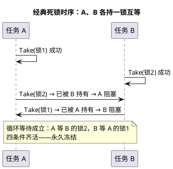

# 01-死锁四条件

> 一句话定位：互斥、持有并等待、不可剥夺、循环等待——四条同时成立才死锁，缺一即活；车规的破法不是"写代码小心"，而是用天花板协议和锁全序让四条**在结构上凑不齐**。
> 等级：L2→L3 ｜ 前置：[从前后台到RTOS-操作系统全景](../../../00-入门导读/01-从前后台到RTOS-操作系统全景.md)

## 太长不看

- 死锁 = 互斥、持有并等待、不可剥夺、循环等待**同时成立**，破坏任意一条即可预防；
- 车规首选**机制性预防**：AUTOSAR 优先级天花板 + 标准资源"一次只持一个" + 全序获取，让循环等待不可能发生；
- 破坏手段性价比排序：锁全序 > 一次性获取 > try-超时 > 运行期检测（最后防线）；
- **工程深入场景**：只有当你负责"多资源访问路径设计 / 跨核锁设计 / 给遗留代码补锁"时，才需要深入资源分配图与检测算法；日常开发遵守"资源序表"纪律即可，本文第 3 节的约定比算法更常救你命。

## 核心概念

**死锁**：一组执行流互相持有对方需要的资源、又都在等对方释放，谁也走不了。Coffman 四条件：

| 条件 | 含义 | 典型破坏手段 |
|---|---|---|
| 互斥 | 资源一次只能一人用 | 缩小互斥面：SPSC 无锁、数据复制 |
| 持有并等待 | 拿着 A 又去等 B | 一次性获取（两阶段） |
| 不可剥夺 | 拿不到也抢不走 | try + 超时，失败先放掉手里的 |
| 循环等待 | 等待关系成环 | **锁全序/偏序**（最实用） |

## 详解

### 1. 四条件的"可破坏性"逐一评估

- **互斥**：共享资源本性使然，最难破坏。工程上做的是**减少互斥面**——能单向读写的不双向、能复制的不共享、能无锁队列的不上锁（见 [04-顶半底半](../中断管理/04-顶半底半.md) 的 SPSC）；
- **持有并等待**：进临界区前**一次性**申请全部所需资源，要么全拿到、要么一个不拿。代价是"占着用不上"的窗口变长——车规里通常只对 2~3 把锁的小集合用；
- **不可剥夺**：`xSemaphoreTake(m, timeout)` 拿不到就超时返回，并把已持有的先释放再整体重试。注意会引入**活锁**（两人都退都重来，永远撞车）——重试要加随机/错峰退避；
- **循环等待**：给所有锁排一个**全局全序**（编号），任何代码路径都按升序获取。成本最低、最常被认证审查认可——**首选**。

### 2. AUTOSAR OS：从机制上让死锁不可能

优先级天花板协议顺手掐死了两条（详见 [02-事件与资源](../../../../07-AUTOSAR架构/2-L2进阶/系统服务栈/Os/02-事件与资源.md)）：

1. **资源占用遵循栈式协议（OS 251）**：OSEK 规范层面按 LIFO 次序占用/释放校验资源；"一次只许持有一个标准资源、嵌套 `GetResource` 即报 `E_OS_ACCESS`"是具体实现的限制而非标准规定，以所用内核手册为准；
2. **获取即升到天花板优先级**：天花板 = 所有可能用它的任务的最高优先级，且约定**天花板值互不相同、按序获取**——低天花板的先拿、高天花板的后拿，等待关系只会单向流动，**成不了环**。

这是"结构防死锁"的范本：不靠程序员自觉，靠 API 语义直接拒绝错误姿势。FreeRTOS 的互斥量只有**优先级继承**（防反转），不防死锁——两把互斥量照样锁死，防护要自己靠纪律（全序）或超时。

### 3. 工程纪律：资源序表

项目级维护一张**全局资源获取顺序表**（含互斥量、资源、外部设备总线），例如：

| 序 | 资源 | 备注 |
|---|---|---|
| 1 | CAN 总线锁 | 最先拿 |
| 2 | NvM 写锁 | 写 Flash 前置 |
| 3 | 日志缓冲锁 | 允许长持有 |
| 4 | 统计计数 | 用原子，不算锁 |

规则只有一条：**任何路径只准按表升序拿锁**。Code review 时拿这张表对照，比任何算法都便宜有效。

### 4. 死锁三兄弟：分得清才治得对

- **死锁**：互相等待，永久冻结，谁也不再前进；
- **活锁**：都在动（不断拿锁-失败-重试），但整体不前进——治法：错峰退避；
- **饥饿**：某人永远抢不过别人——治法：排队（FIFO 互斥）、优先级天花板把"低优持锁"变"持锁即高优"。

### 5. 检测与恢复（最后防线）

单核实时系统少有运行期死锁检测器，工程做法：看门狗超时 → 复位前 dump 各任务栈回溯与"等待对象"（谁在等哪把锁、锁被谁持有——FreeRTOS 可遍历 `uxTaskGetSystemState`），离线把等待关系画成**资源分配图**，找环即实锤。恢复策略按安全等级：记账复位（记录次数）→ 降级运行 → 安全状态停车。

## 易错点与陷阱

1. **现象：调 `GetResource` 两次返回 `E_OS_ACCESS`，以为是 OS bug**——原因：所用内核限制标准资源一次只持一个——OSEK 规范本身按栈式协议（OS 251）校验 LIFO 次序，"禁止嵌套/嵌套报 E_OS_ACCESS"是具体实现的限制而非标准规定，以内核手册为准——对策：确实要嵌套就用非标准机制（关中断/内部资源语义），或重构为一次持有。
2. **现象：持锁调用第三方/回调函数后偶发冻结**——原因：回调内部又拿了别的锁，隐式违反全序——对策：持锁区间禁调外部代码；回调所需数据出锁后再处理。
3. **现象：以为开了优先级继承就高枕无忧**——原因：继承只解决优先级反转，不阻止循环等待——对策：两把以上锁必须有全序。
4. **现象：超时重试逻辑让 CPU 空转但日志显示"一直在干活"**——原因：活锁，双方同频重试——对策：退避加抖动，或改一次性获取。
5. **现象：ISR 里 take 互斥量直接断言**——原因：互斥量的优先级继承需要任务上下文，ISR 里无意义——对策：ISR 与任务共享数据改关中断/原子（见 [02-竞态排查](02-竞态排查.md)）。
6. **现象：双核各持一把锁互等，关中断也没用**——原因：关的是本核中断，他核照常持有——对策：跨核共享用专用核间锁/原子，且同样遵守全序。

## 面试高频题

**Q：死锁的四个必要条件是什么？各举一种破坏方法。**
答：互斥（减少共享面/无锁设计）、持有并等待（一次性获取全部资源）、不可剥夺（try+超时，失败先释放已持有）、循环等待（全局锁全序，按升序获取）。四条须同时成立，破坏任一即可预防死锁。

**Q：为什么 AUTOSAR OS 的优先级天花板协议能从机制上防死锁？**
答：两条硬约束：①资源占用按栈式协议（OS 251）校验 LIFO 次序，部分实现进一步限制一次只持一个标准资源并返回 E_OS_ACCESS——这是实现级约束而非 OSEK 标准规定，以内核手册为准；②资源天花板值互不相同且按序获取，任务拿到资源即升到天花板优先级，等待依赖只能从低天花板流向高天花板，方向单一成不了环——"循环等待"在结构上不可能。

**Q：死锁、活锁、饥饿的区别？**
答：死锁是互相持有并等待，永久冻结、无人前进；活锁是双方不断动作（如反复拿锁失败重试）但整体无进展；饥饿是某执行流长期得不到资源（被高优者反复插队）但它没被冻结在等待环里。对应治法分别是破坏四条件、错峰退避、FIFO 排队/天花板。

**Q：线上 ECU 疑似死锁，没有在线调试器，怎么定位？**
答：看门狗复位前把"每任务当前等待对象 + 每把锁当前持有者"写入 NOINIT 快照，复位后上报；离线把等待关系画成资源分配图（任务→等锁、锁→属任务），出现有向环即证明死锁，环上成员就是肇事者。长期靠"资源序表"纪律预防。

## 延伸

- [02-竞态排查](02-竞态排查.md)：锁解决不了的另一类并发病；
- [同步与互斥](../同步与互斥/README.md)：互斥量、优先级继承与反转的系统展开；
- [02-事件与资源](../../../../07-AUTOSAR架构/2-L2进阶/系统服务栈/Os/02-事件与资源.md)：天花板协议的配置视角与 RES_SCHEDULER；
- [01-任务与调度](../../../../07-AUTOSAR架构/2-L2进阶/系统服务栈/Os/01-任务与调度.md)：冻结的任务在调度器眼里的状态。