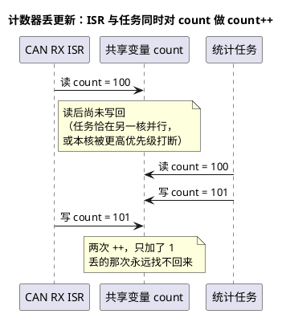

# 02-竞态排查

> 一句话定位：死锁是"谁都动不了"，竞态是"大家都在跑、结果却看时序脸色"——read-modify-write、检查后使用、非原子访问三类窗口，用消息化、原子操作、关中断三招按场景逐一关死。
> 等级：L2→L3 ｜ 前置：[01-死锁四条件](01-死锁四条件.md)

## 太长不看

- 竞态成立三要素：**多个执行流 + 共享对象 + 至少一步非原子操作**，缺一即安全——排查就是画这张三要素表；
- 三类经典窗口：**RMW 丢更新**（`count++` 读改写三步被打断）、**TOCTOU**（check 之后 use 之前被插队）、**撕裂读**（多字数据只搬了一半）；
- 修复优先级：**改设计消灭共享**（消息化/单写者+差分读）> **原子操作**（单变量 RMW）> **关中断/加锁**（多变量复合区）；
- 单核上关中断是万能钥匙但拉高中断延迟；多核（TC377 三核）上关本核中断护不住他核——必须换原子指令或自旋锁；
- **volatile ≠ 原子**：它只保证"每次真读内存"，不保证"读改写不被打断"——嵌入式并发第一大俗错。

## 核心概念

**竞态条件（race condition）**：程序正确性依赖时序巧合——同样的输入，因调度与中断到达时机不同，输出时对时错。与死锁的分工：死锁冻结（谁也不跑），竞态错乱（都在跑、结果错）。两病可以共存：先用锁治竞态，用不好又喂出死锁。

三类窗口（认脸比记定义有用）：

| 窗口 | 形状 | 典型现场 |
|---|---|---|
| read-modify-write | 读→改→写三步，断在哪步都丢 | `count++`、`flags |= bit`、链表摘节点 |
| 检查后使用（TOCTOU） | if 判断与动作之间被插队 | `if (!fifo_full) push()`、`if (p) use(*p)` |
| 非原子访问 | 一个"值"要多次访存才搬完 | 64 位变量在 32 位核上、多字结构体 |

## 详解

### 1. 三类窗口逐一拆开看

**RMW**：`count++` 在 C 层是一条语句，机器层是三步——读内存到寄存器、寄存器加一、写回内存。任何一步之后被打断，另一执行流基于同一旧值完成自己的三步，后写者覆盖先写者——**丢更新**。位操作 `flags |= 0x01` 同理（读-或-写）。

**TOCTOU（time-of-check to time-of-use）**：判断那一刻条件为真，执行那一刻世界已经变了。嵌入式高频现场是**手写环形缓冲**：`if (队列未满) 写入`——判断与写入之间来了一脚中断、中断里也写了，队列溢出。对策：判满+写入整体进临界区，或改用内部保证原子性的消息队列接口。

**撕裂**：32 位核上 `uint64_t` 计数器要两条 load 才搬完，中间被 ISR 改写——读到"低 32 位是新值、高 32 位是旧值"的缝合怪。多字段结构体同理：单字段原子 ≠ 整体语义一致，要**序列号回验（seqlock 思想）或双缓冲**才治得住。

### 2. 实例复盘：丢更新从哪一笔开始丢

背景：CAN 报文计数，ISR 里 `rxCnt++`，统计任务周期性做 `rxCnt = 0`（清零读秒表）。故障现象：偶发"这一秒少统计了几十帧"，示波器确认总线上帧一帧没少。

拆解：`rxCnt = 0` 本身看似一条 STR 就完，但**清零瞬间** ISR 到达——清零前的计数还没被统计任务读走，就被抹掉了。丢的不是总线上的帧，是**账本上的帧**。修法二选一：

- 计数器改**差分读**：ISR 只做 `rxCnt++`，统计任务只读不清，本次读数减上次读数即周期帧数——单写者，共享写写冲突从结构上消失；
- 或规定清零权归 ISR：统计任务置"请求清零"标志，ISR 在自己的上下文里完成——同样收敛到单写者。

通用教训：**两个执行流都写同一变量，无论写的是 `++` 还是 `= 0`，都要按竞态处理**。

### 3. 原子操作 vs 关中断：怎么选

| 方案 | 护住范围 | 代价 | 适用 |
|---|---|---|---|
| 关中断（单核） | 一切共享（任务+ISR） | 关闭期间中断延迟累积 | 与 ISR 共享的小复合区 |
| 关调度 | 只防任务、不防 ISR | 低 | 纯任务间短区 |
| 原子操作 | 单变量 RMW | 几乎为零 | 计数器、标志位 |
| 锁/资源 | 大，但需全员遵守 | 切换开销、优先级问题 | 复合数据结构 |

选型直觉：

- **只有一两个整型的 ++/--/置位** → 原子操作。S32K（Cortex-M4/M7）用 LDREX/STREX 独占访问或 GCC `__atomic_*` 内建函数；TC377（TriCore）用 SWAP/LDMST 原子指令，跨核还有硬件信号量（SEM）模块可用；
- **与 ISR 共享的小复合区** → 任务侧关中断，一把伞罩住两侧；ISR 侧若会被更高优先级中断抢占，同理在 ISR 内做短临界区；
- **纯任务间** → 锁/资源（还能吃到优先级继承与天花板协议的好处），别动不动关中断；
- **多核**：关中断失效（只关本核），短临界区换原子指令/自旋锁，长交互换消息（IOC/队列）——见 [05-多核OS（07区）](../../../../07-AUTOSAR架构/2-L2进阶/系统服务栈/Os/05-多核OS.md)。

关中断的纪律：区间内**只做纯内存操作**——不调 OS 服务、不 printf、不做长循环；进出成对（宏包裹），开栈回溯检查遗漏。

### 4. 排查方法论：治"一个月一次"的病

竞态的难点是复现，方法论就是**把时序不确定性放大**：

- **压力注入**：中断负载拉满、在可疑点主动 `taskYIELD()`/短延时制造切换窗口，把偶发变成必现；
- **观测零接触**：加 printf 本身会改变时序（海森堡 bug）——优先硬件 trace（ETM/OCDS）、DMA 搬运日志、事后 dump；
- **代码模式静态扫**：列共享变量表（谁在哪个上下文读写），专找 `++/--/|=/=&`、`if (p)`、多字读写；PC-lint/Polyspace 并发规则兜底；
- **从果倒推**：数值"少了"是丢更新、"缝合错乱"是撕裂、"重复/越界"是 TOCTOU——三类果对应三类因，先分类再定位。

## 易错点与陷阱

1. **现象：变量加了 volatile 还是丢更新。原因：volatile 只禁止编译器缓存与重排，不保证机器层三步 RMW 不被打断**——对策：可见性（volatile）与原子性（原子操作/关中断）是两件事，分开做，别指望一个关键字兼职。
2. **现象：单核一切正常，多核一开就错。原因：单核靠关中断天下太平，多核上他核照常访问**——对策：跨核共享一律走原子指令/自旋锁/IOC，并在代码里显式标注"此变量跨核共享"。
3. **现象：读 64 位时间戳偶发跳变巨大。原因：32 位核两条 load 之间被写入，撕裂**——对策：序列号回验（读两次夹一次版本号）、关中断读，或"读低-读高-回读低"三步校验。
4. **现象：队列明明判了满还是溢出。原因：判满（check）与写入（use）之间被 ISR 插队写入**——对策：判断+动作进同一临界区，或改用 API 内部保证原子性的消息队列。
5. **现象：关中断保护后偶发丢中断/通信超时。原因：临界区里干了重活（printf/Flash 擦写），中断被憋太久**——对策：临界区只搬数据不做处理，规矩同 [04-顶半底半](../中断管理/04-顶半底半.md)。
6. **现象：统计"大体正确"，边界帧偶发丢失。原因：清零与自增是两个执行流的写写冲突**——对策：共享计数器改差分读或收敛到单写者，从结构上消灭双写。

## 面试高频题

**Q：`count++` 为什么不是原子操作？有哪些修法？**
答：编译成三条指令——读内存到寄存器、加一、写回。任何一步之后发生任务切换或中断，另一执行流基于同一旧值完成自己的写回，后写覆盖先写，造成丢更新。修法按代价升序：原子加（Cortex-M 的 LDREX/STREX、TriCore 的 LDMST）；任务侧关中断包住整个 RMW；改设计——单写者+差分读，或消息化交给一个执行流串行处理。

**Q：volatile 能保证中断/线程安全吗？**
答：不能。volatile 只解决可见性与编译器优化——禁止缓存进寄存器、禁止合并删减读写，每次都真访存；但它不阻止"读-改-写三步之间被切换或中断"，也管不了多核一致性时序。并发安全要靠原子操作、关中断、锁这些真正的同步原语；volatile 通常只是它们的配套（防止同步代码被优化没）。

**Q：关中断、关调度、原子操作各适合什么场景？**
答：关中断护住本核上一切共享（含 ISR），代价是中断延迟，适合与 ISR 共享的小复合临界区；关调度只防任务不防 ISR，适合纯任务间短区；原子操作零封锁代价但只覆盖单变量读改写，适合计数器与标志位。多核场景关中断失效，须换原子指令或自旋锁。共同纪律：区间最短化、不 IO、不调阻塞服务。

**Q：一个每月偶发一次的数据错乱，怎么排查是不是竞态？**
答：先给"果"分类：数值偏小是丢更新、新旧缝合是撕裂、重复越界是 TOCTOU，反推窗口类型；再列共享变量表（谁在哪个上下文读写），找双写者与跨上下文裸访问；用压力注入（拉高中断频率、可疑点主动让出 CPU）放大窗口提高复现率，观测尽量零接触（硬件 trace 而非 printf，避免改变时序）；静态工具扫 RMW/TOCTOU 模式兜底。修复后长时间压测回归确认。

## 延伸

- [01-死锁四条件](01-死锁四条件.md)：锁用过头喂出的另一种病；
- [02-临界区](../中断管理/02-临界区.md)：关中断/关调度的实现细节与进出纪律；
- [04-顶半底半](../中断管理/04-顶半底半.md)：把临界区做短的架构级手段；
- [04-消息队列](../同步与互斥/04-消息队列.md)：消息化——消灭共享的正路；
- [05-多核OS（07区）](../../../../07-AUTOSAR架构/2-L2进阶/系统服务栈/Os/05-多核OS.md)：多核下自旋锁与 IOC 的配置视角。
