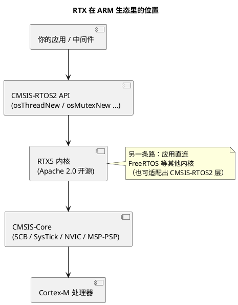

# 01-RTX概览

> 一句话定位：ARM 官方参考实现级 RTOS——随 Keil MDK 发行、Apache 2.0 开源、CMSIS-RTOS2 API 的参考实现，学 Cortex-M 生态绕不开的"官方示范答案"；对 AUTOSAR 工程师是认识 CMSIS 世界观的一扇门，不是生产主力。
> 等级：L1→L2 ｜ 前置：[从前后台到RTOS-操作系统全景](../../00-入门导读/01-从前后台到RTOS-操作系统全景.md)

## 核心概念

RTX（当前主流为 RTX5）由 ARM 维护、随 Keil MDK 发行、源码开源，并充当 **CMSIS-RTOS2 标准 API 的官方参考实现**——相当于"标准文本 + 官方示范工程"打包。两层关系记牢：

- **CMSIS-RTOS2** 是 API 标准（`osThreadNew`/`osMutexNew` 这一层，理论上底层内核可替换）；
- **RTX5** 是这个 API 的参考实现内核（也提供自己的原生 API 层）。

它证明了一件事：**在 Cortex-M 上做一个够用的抢占内核，门槛并不高**——调度、线程、定时器、事件标志、互斥量、信号量、消息队列、内存池一应俱全，极简配置下内核代码量仅几 KB 级。

## 详解

### 1. 内核特性速览

- **调度**：固定优先级抢占，同优先级可时间片轮转（可关）；上下文切换走 PendSV/SysTick，配合 Cortex-M 的双栈指针（MSP/PSP）开销极小；
- **IPC 家族**：线程（含线程信号 signal）、事件标志、互斥量（支持优先级继承）、计数/二值信号量、消息队列、内存池；
- **对象创建**：静态（编译期分配控制块）与动态（全局堆）双模式，可整体关闭动态——比 FreeRTOS 默认形态更"车规友好"；
- **安全向**：支持 Armv8-M **TrustZone** 上下文管理（安全/非安全侧调用过滤）；新版本向 Cortex-A/R 与多核方向扩展；
- **工具**：Keil MDK 的 Event Recorder 可视化线程切换与事件流。

### 2. 与 FreeRTOS / OSEK 对比

| 维度 | RTX5 | FreeRTOS | OSEK/AUTOSAR OS |
|---|---|---|---|
| 出身 | ARM 官方参考实现 | 开源社区事实标准 | 车规工业标准 |
| API | CMSIS-RTOS2（标准层） | 自有 API（生态最大） | 标准系统服务 |
| 对象创建 | 静态/动态双模 | 动态为主可全静态 | 仅静态 |
| 互斥 | 互斥量带优先级继承 | 互斥量带优先级继承 | 资源天花板（防反转+防死锁） |
| 生态圈 | MDK/CMSIS 体系 | 芯片厂 SDK 移植最广 | 车规认证与工具链生态 |
| 学习价值 | 认识 ARM 官方姿势 | 就业通用面最广 | 汽车主业本体 |

### 3. S32K 生态圈的外围角色

S32K 的官方世界（S32 Design Studio + SDK/RTD）里，RTOS 默认位是 **FreeRTOS**，AUTOSAR 位是各家商业 OS——**RTX 不在主干道上**。但值得花半小时认识它的三个理由：

1. **CMSIS 是通用语**：CMSIS-Core/CMSIS-Driver/CMSIS-RTOS 的分层思想贯穿 ARM 生态，读 NXP/ST 的 SDK 与中间件常会撞见；认识 RTX 顺带认识这套世界观；
2. **参考实现=最佳教材**：想看"一个最小抢占内核怎么写"，RTX5 源码短、贴 Cortex-M 手册，比 FreeRTOS 更适合当教材读；
3. **原型与教学**：MDK 生态里快速搭原型、ARM 大学计划课程，RTX 是默认选项。

一句话：**知道门牌、认识分层、源码可当教材；别指望它在 S32K 车规项目里当主角。**

## 易错点与陷阱

1. **现象：以为 CMSIS-RTOS2 是一个 RTOS。原因：把 API 标准当内核**——对策：CMSIS-RTOS2 是 API 层标准，RTX 是其参考实现；别的内核理论上也能适配这层 API。
2. **现象：工程里混用 RTX 原生 API 与 CMSIS-RTOS2 API。原因：两套都能跑**——对策：新工程统一走 CMSIS-RTOS2 层，给未来留内核可替换性。
3. **现象：默认全动态创建，量产内存吃紧。原因：RTX 对象默认走全局堆**——对策：车规习惯静态分配为主、按需关闭动态——与 OSEK 哲学对齐，见 [01-OSEK内核](../../2-L2进阶/OSEK与AUTOSAR-OS/01-OSEK内核.md)。
4. **现象：把 RTX 塞进任意架构的项目。原因：它与 Cortex-M 体系绑定较深**——对策：跨架构或需要车规认证路径的项目回到 FreeRTOS/OSEK 阵营。

## 面试高频题

**Q：RTX 和 CMSIS-RTOS 是什么关系？**
答：CMSIS-RTOS（现为主流的 CMSIS-RTOS2）是 ARM 定义的 RTOS API 标准，规范线程/定时器/IPC 的函数名与语义；RTX 是 ARM 随 Keil MDK 发行、开源的参考实现内核。类比 AUTOSAR：CMSIS-RTOS2 像"标准规范文本"，RTX 像"官方示范实现"——应用层只依赖 API 层时，理论上可换底层内核。

**Q：RTX 和 FreeRTOS 之间怎么选？**
答：开发环境绑定 Keil MDK、目标就是 Cortex-M、想要官方参考实现级的短小源码可读性、或团队要用 CMSIS-RTOS2 标准层保持内核可替换性时，选 RTX；要最广社区生态、最多芯片移植面、就业通用性，FreeRTOS 更优；要车规认证与静态哲学，走 OSEK/AUTOSAR OS。S32K/TC377 的量产项目里两者都属工具与学习属性。

**Q：为什么说 RTX 的静态模式"车规友好"？**
答：车规实时系统的核心诉求是可预测：对象编译期定死意味着无堆、无碎片风险、栈与控制块内存精确规划、最坏情况行为可分析——这正是 OSEK 的立身哲学。RTX5 支持全静态创建并允许关闭动态分配，是 ARM 生态里最接近这种姿势的内核；但它不提供天花板协议这类 OSEK 机制，"姿势像"不等于"认证等价"。

## 延伸

- [01-OSEK内核](../../2-L2进阶/OSEK与AUTOSAR-OS/01-OSEK内核.md)：车规世界的对照哲学；
- [FreeRTOS 区导读](../../2-L2进阶/FreeRTOS/README.md)：开源阵营主力，与本篇对比着读；
- [任务调度原理](../RTOS通用原理/任务调度原理/README.md)：RTX/FreeRTOS/OSEK 共用的调度理论底座；
- [02-上下文切换](../RTOS通用原理/任务调度原理/02-上下文切换.md)：RTX 在 Cortex-M 上怎么用 MSP/PSP 落地这套理论。
