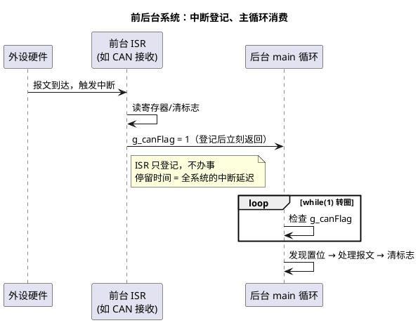

# 01-前后台系统

> 一句话定位：`while(1)` 大循环当后台、中断当前台的裸机架构，是一切嵌入式代码的起点，也是理解"为什么需要 RTOS"的反面教材。
> 等级：L1 ｜ 前置：[从前后台到RTOS-操作系统全景](../../00-入门导读/01-从前后台到RTOS-操作系统全景.md)

## 原理

前后台系统 = **后台（主循环）+ 前台（中断）**。中断负责" catching 突发事件"——置个标志、搬个数据就返回；主循环负责"办事"——转圈检查每个标志，谁置位了就伺候谁。



**实时性瓶颈一句话：一个标志从置位到被处理，最坏要等主循环把"剩下的一整圈"跑完。** 即最坏响应时间 ≈ 主循环一圈的最坏执行时间（WCET）——圈里任何一段长活（Flash 擦除、打印、CRC 计算大表）都会拖慢所有其他标志的响应。

## 详解

### 标准骨架

```c
volatile uint8_t g_canFlag = 0;
volatile uint16_t g_adcVal  = 0;

void CanRx_ISR(void)          /* 前台：只登记 */
{
    g_adcVal  = ADC_Read();   /* 搬数据进全局 */
    g_canFlag = 1;            /* 置标志 */
}

int main(void)
{
    SystemInit();
    for (;;)                  /* 后台：转圈消费 */
    {
        if (g_canFlag)
        {
            g_canFlag = 0;
            CanMsg_Process(); /* 真正干活在这里 */
        }
        Key_Scan();
        Wdg_Trigger();        /* 喂狗也排在圈里，圈太长就喂不上 */
    }
}
```

### 三条隐含规则（没人写进代码，但必须心里有数）

1. **代码顺序 = 隐式优先级**。排在循环前面的检查先被服务。想提高某件事的响应，要么往前挪，要么把别的拆短——全靠人肉排程。
2. **标志位是 ISR 与主循环之间唯一的"合同"**。位标志只能表达"发生过"，表达不了"发生了几次"（连发两次只看见一次）；要次数就得用计数器，要内容就得用缓冲区（环形缓冲）。
3. **共享变量的原子性靠"谁写谁独占"的约定**。ISR 永远打断主循环，所以主循环读多字节变量、做读-改-写（`g_cnt++`）都可能被拦腰截断——单核裸机里最便宜的同步手段就是关键几条指令关中断。

### 什么时候前后台够用、什么时候不够

- 够用：功能少（几个标志）、每段活都短（μs~ms 级）、没有硬截止时间要求——典型的车身小节点、传感器采集板。
- 不够：①有硬实时 deadlines（如电机控制环、CAN 报文必须 5ms 内回）而循环一圈 WCET 无法收敛；②模块多了互相插队，改一处动全身；③多个模块各有自己的"等待"，全挤在一条循环里没法独立表述——这正是 [RTOS 任务模型](../RTOS通用原理/任务调度原理/01-调度模型.md)解决的问题。

## 易错点与陷阱

1. **标志位忘写 `volatile`，程序"偶尔"不响应**。开优化后编译器把 `if (g_canFlag)` 缓存在寄存器里循环外提，ISR 改了内存主循环也看不见；现象是 Debug 版正常、Release 版丢事件。对策：ISR 与主循环共享的变量一律 `volatile`，并理解它的边界（可见性 ≠ 原子性）。
2. **用单标志位承载"多次事件"，丢请求**。10ms 内连到两帧报文，主循环只处理一次。对策：按语义选载体——次数用计数器、数据用环形缓冲、开关量才用 bit 标志。
3. **主循环里塞阻塞调用**：`Delay_ms(100)`、等 Flash 就绪的死等、printf 走 UART 查询发送。一圈从 1ms 涨到 100ms，所有实时指标跟着崩，喂狗也开始抖。对策：延时一律改为"到点检查"的时间片方式（见[下一篇](02-时间片轮询.md)）。
4. **多字节共享变量读取被 ISR 打断，读出"拼接值"**。主循环先读低 16 位、被 ISR 改写、再读高 16 位，拼出一个从没存在过的值（S32K 上 `uint64_t`、TC377 上跨字访问都会发生）。对策：读侧短暂关中断，或用双缓冲/序列号校验。
5. **在中断里办事而不是登记**。ISR 里跑报文解析、打印，期间同级/更低中断全部被挡，别的 ISR 延迟飙升。对策：ISR 只做"取数据+置标志"，处理留给主循环（顶半底半思想的雏形）。
6. **以为响应快慢看 CPU 主频**。前后台的响应瓶颈是循环结构（一圈 WCET），不是主频——主频翻倍只把一圈从 20ms 缩到 10ms，结构问题依旧。

## 面试高频题

**Q：什么是前后台系统？前台和后台各指什么？**
答：前台指中断服务程序，负责响应异步事件；后台指 `main()` 里的无限大循环，顺序轮询处理各模块。中断只"登记"（置标志/搬数据），主循环负责消费标志执行真正的处理逻辑。

**Q：前后台系统最坏情况下，一个事件的响应延迟是多少？**
答：约等于主循环转一整圈的最坏执行时间（WCET）：事件标志置位后，最坏要等主循环把本次已执行部分回绕到该标志的检查点才能被处理。所以工程上要求实测"最大圈时间"，并保证它小于所有事件中最紧的容忍时限。

**Q：为什么中断与主循环共享的标志变量必须加 `volatile`？**
答：`volatile` 告诉编译器该变量随时可能被"编译器看不见的路径"（中断）修改，禁止把它缓存到寄存器或把读写优化掉。不加时 Debug 版正常、开优化后主循环可能永远读旧值，表现为随机丢事件。

**Q：前后台系统什么时候该升级成 RTOS？给出可量化判据。**
答：出现以下任一即应考虑：①存在硬截止时间且小于主循环一圈 WCET，且无法靠拆分循环满足；②模块数量增长导致循环体耦合、改动风险失控；③多个模块需要独立的阻塞等待与不同响应优先级。核心是"实时性与复杂度管理需求超出人肉排程能力"，而不是功能本身。

## 延伸

- [02-时间片轮询](02-时间片轮询.md)：把"节奏"从循环里解放出来的第一次进化；
- [中断初识-从轮询到中断](../../../02-芯片与体系结构/00-入门导读/03-中断初识-从轮询到中断.md)：硬件视角看中断怎么打断 CPU；
- [volatile的正确使用](../../../01-编程语言/2-L2进阶/寄存器编程/01-volatile的正确使用.md)：标志位同步的语言层基础；
- [调度模型](../RTOS通用原理/任务调度原理/01-调度模型.md)：前后台"人肉排程"的下一站——让调度器接管优先级；
- [OSEK与AUTOSAR-OS](../../2-L2进阶/OSEK与AUTOSAR-OS/README.md)：汽车主业里"前后台进化终点"的静态配置形态。
