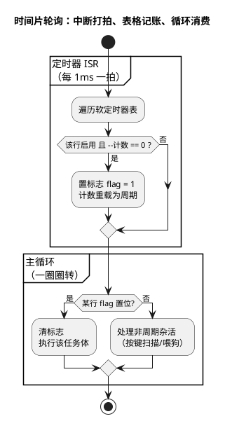

# 02-时间片轮询

> 一句话定位：用一个 1ms 定时器中断当节拍器、一张软定时器表管理所有周期任务，把"死等延时"赶出主循环——裸机的第一次进化，也是 RTOS tick 调度的雏形。
> 等级：L1 ｜ 前置：[01-前后台系统](01-前后台系统.md)

## 核心概念

[前后台系统](01-前后台系统.md)最痛的一条是**延时阻塞**：`Delay_ms(100)` 期间 CPU 空转，按键、CAN 报文全都没人伺候。时间片轮询的解法是把"节奏"从主循环里剥离出来，交给硬件定时器，形成三件套：

- **节拍器（tick 中断）**：定时器每 1ms 打一拍，ISR 里只做"倒计数、置标志"两件事；
- **软定时器表**：每个周期任务占一行 `{周期, 剩余计数, 标志}`，到期即置位；
- **消费循环**：主循环快速转圈，谁的时间到了就伺候谁——CPU 不再死等，永远在"能干活就干活"。



**改进的本质**：延时从"占用 CPU 的死等"变成"表格里的一次倒计数"；周期从"散落在代码里的魔法数字"变成"表里的一列数据"——加一个周期任务从"改循环结构"降级为"表里加一行"。

## 详解

### 标准骨架

```c
#define TMR_CNT 4
typedef struct {
    uint16_t period;        /* 周期，单位 tick */
    uint16_t cnt;           /* 剩余计数 */
    uint8_t  flag;          /* 到期标志 */
    uint8_t  en;            /* 使能 */
} SoftTimer_t;

volatile SoftTimer_t s_tmr[TMR_CNT] = {
    {   10,   10, 0, 1 },   /* 10ms ：按键扫描   */
    {   20,   20, 0, 1 },   /* 20ms ：CAN 周期发送 */
    {  100,  100, 0, 1 },   /* 100ms：LED 闪烁   */
    { 1000, 1000, 0, 1 },   /* 1s  ：慢速诊断    */
};

void Timer1ms_ISR(void)                     /* 前台：只倒计数 */
{
    for (uint8_t i = 0; i < TMR_CNT; i++) {
        if (s_tmr[i].en && --s_tmr[i].cnt == 0U) {
            s_tmr[i].flag = 1;
            s_tmr[i].cnt  = s_tmr[i].period;    /* 到期即重载 */
        }
    }
}

int main(void)
{
    SystemInit();
    Timer_Start_1ms();
    for (;;) {                               /* 后台：转圈消费 */
        for (uint8_t i = 0; i < TMR_CNT; i++) {
            if (s_tmr[i].flag) {
                s_tmr[i].flag = 0;
                Task_Run(i);                 /* 真正干活在这里 */
            }
        }
        Wdg_Trigger();
    }
}
```

### 周期精度的三个档次

1. **ISR 内自动重载（上面的写法）**：倒计数与重载都发生在 tick ISR 里，与任务执行时长解耦——任务跑 3ms 也不影响 10ms 周期本身，误差只剩晶振与 tick 中断被延迟的部分。**默认选这档。**
2. **执行后重置计数**：`Task_Run()` 结束才 `cnt = period`——周期变成"执行时间 + period"，每圈都多算一次任务耗时，误差**累积漂移**（10ms 任务实际 13ms 一轮，1 分钟后慢出 18 秒）。经典错误写法。
3. **绝对时间戳**：记录 `next += period`，比较 `now >= next` 判断到期，落后多拍还能追帧。适合 CAN 周期发送这类"宁可连发也要贴住总线节拍"的场合。

### 它与 RTOS tick 的血缘

tick 中断 + 到期任务 + 主循环消费，正是 RTOS 调度器的骨架：RTOS 把"软定时器表"升级为按到期时间排序的**延时链表**，把"主循环轮询标志"升级为"到期唤醒任务 + 优先级调度"。差的那一口气（详见[调度模型](../RTOS通用原理/任务调度原理/README.md)）：就绪了也不能立刻上 CPU——最坏响应仍要等主循环转完一圈 WCET，且没有优先级，10ms 的急活和 1s 的慢活排同一个队。
## 易错点与陷阱

1. **现象：周期越跑越慢，重启后恢复。原因：消费侧执行完才重置计数**，任务耗时被逐圈累加进周期。对策：计数与重载只在 tick ISR 内完成；高精度场合改用绝对时间戳方案。
2. **现象：偶发丢拍、某次周期任务没执行。原因：单 bit 标志只能表达"发生过"表达不了"发生了几次"**——两次到期之间主循环只消费了一次。对策：标志改计数器（`missCnt++` 做 overrun 统计），周期预算必须大于任务 WCET 加一圈耗时。
3. **现象：改了 `en` 使能开关后偶发怪值。原因：表是 ISR 与主循环的共享数据**，主循环读-改-写 `en`/`period` 时被 tick ISR 拦腰打断。对策：修改表项前短暂关中断，或约定"运行期只改 en 一个字节且用原子写"。
4. **现象：10ms 任务响应抖动大。原因：多个任务同拍到期扎堆，加上其中某段长活（Flash 擦除）堵路**。对策：初始 `cnt` 错相位（10ms 任务拆成 2/4/6/8ms 起点），长活拆成小段或挪到低频档。
5. **现象：整个系统的节奏偶尔"卡一下"。原因：tick 中断优先级配低了，被长 ISR 压住**。对策：tick 中断给较高优先级，全系统 ISR 一律只登记不办事；用示波器翻 GPIO 实测 tick 抖动。
6. **在 tick ISR 里直接调任务函数（回调式软定时器）**，把业务干进中断——中断延迟全线飙升。对策：到期只置标志，业务回主循环；回调式仅限几条指令的轻量动作。

## 面试高频题

**Q：时间片轮询相比前后台系统改进在哪？还有什么没解决？**
答：改进三点——延时不再阻塞 CPU（节拍器接管节奏）、周期由表格集中管理（加任务不动循环结构）、空闲时主循环可进低功耗等待中断。没解决：无优先级（急活慢活同队）、最坏响应仍等于主循环一圈 WCET、多个模块的独立阻塞等待仍挤在一条循环里——这三条正是 RTOS 的出场理由。

**Q：如何消除时间片轮询的周期累积误差？**
答：把"倒计数 + 重载"放进 tick ISR 内完成，让周期与任务执行时长解耦，误差只剩时基源误差与 tick 中断自身延迟；更严格时用绝对时间戳（`next += period`，与 `now` 比较），迟到时可追帧。切忌在任务执行完才重置计数——那是漂移的标准来源。

**Q：为什么说时间片轮询是 RTOS 调度器的雏形？**
答：结构同构：tick 中断对应 RTOS 的系统节拍，软定时器表对应内核的定时器/延时队列，消费循环对应调度循环。缺的是上下文切换与优先级调度——就绪任务不能立刻抢占 CPU，只能等循环轮到它，所以实时性上限仍由一圈 WCET 决定。

**Q：怎么在产品里检测丢拍？**
答：给每个软定时器加 overrun 检测：ISR 置标志前发现标志仍是 1（上一次未被消费），或消费侧读取计数差超过一个周期，就累加 overrun 计数器并通过诊断接口上报；量产件把它纳入 DTC/生产监控，开发期用它给"周期预算 = 任务 WCET + 一圈耗时"的假设做实测背书。

## 延伸

- [01-前后台系统](01-前后台系统.md)：本篇的起点，痛点与三条隐含规则；
- [03-事件驱动状态机](03-事件驱动状态机.md)：节奏解决之后，解决"有记忆的复杂流程"；
- [任务调度原理](../RTOS通用原理/任务调度原理/README.md)：把本篇的雏形长成真正的调度器；
- [中断初识-从轮询到中断](../../../02-芯片与体系结构/00-入门导读/03-中断初识-从轮询到中断.md)：硬件视角看节拍器本身怎么工作；
- [OSEK与AUTOSAR-OS](../../2-L2进阶/OSEK与AUTOSAR-OS/README.md)：这套"tick + 周期表"思想在车规标准里的终极形态——Alarm 与 Counter。