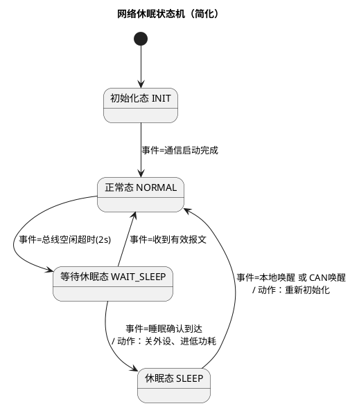

# 03-事件驱动状态机

> 一句话定位：用"状态枚举 + 事件分发 + 转移表"把复杂时序逻辑写成一张可画的图——裸机架构的顶点，也是 CanSM/ComM/NvM 等一切 AUTOSAR 状态机的思想原型。
> 等级：L1 ｜ 前置：[02-时间片轮询](02-时间片轮询.md)

## 核心概念

裸机三板斧的最后一板：[前后台](01-前后台系统.md)解决"异步事件怎么响应"，[时间片轮询](02-时间片轮询.md)解决"周期节奏怎么管理"，**事件驱动状态机**解决"有记忆的复杂流程怎么组织"。

四要素一句话：**状态**记"办到哪了"，**事件**是"刚才发生了什么"，**动作**是"这次要干什么"，**转移**定"下一步去哪"。它的本质是把隐式的程序计数器（代码走到哪行）换成显式的状态变量——程序随时可能被打断重入，回来后靠变量而不是靠"还在那个函数里"来恢复上下文。

以一个典型的"网络休眠管理"为例（每个车身 ECU 都有的逻辑）：



**事件驱动**的含义：主循环不再逐个模块轮询"所有逻辑"，而是只做一件事——从事件源取事件，交给当前状态的处理器。状态机平时"睡着"，事件来了才动一下。

## 详解

### 写法一：switch-case（直观版）

```c
typedef enum { ST_INIT, ST_NORMAL, ST_WAIT, ST_SLEEP } NmState_t;
typedef enum { EV_COM_UP, EV_IDLE_TO, EV_MSG_RX, EV_SLEEP_OK, EV_WAKEUP } NmEvent_t;

void Nm_Handle(NmEvent_t ev)          /* 每次处理一个事件 */
{
    switch (g_nmState) {
    case ST_NORMAL:
        switch (ev) {
        case EV_IDLE_TO: g_nmState = ST_WAIT; break;
        default: break;               /* 本状态不关心的事件，忽略 */
        }
        break;
    case ST_WAIT:
        switch (ev) {
        case EV_MSG_RX:  g_nmState = ST_NORMAL; break;
        case EV_SLEEP_OK: Ecu_GoLowPower(); g_nmState = ST_SLEEP; break;
        default: break;
        }
        break;
    /* ... 其余状态 ... */
    default: break;
    }
}
```

### 写法二：函数指针表（表驱动版）

```c
typedef void (*SmHandler_t)(NmEvent_t ev);
static const SmHandler_t s_nmTable[ST_NUM][EV_NUM] = {
    /*            EV_COM_UP      EV_IDLE_TO     EV_MSG_RX      EV_SLEEP_OK    EV_WAKEUP  */
    /* INIT   */ { Nm_GoNormal,  Sm_Ignore,     Sm_Ignore,     Sm_Ignore,     Sm_Ignore },
    /* NORMAL */ { Sm_Ignore,    Nm_GoWait,     Sm_Ignore,     Sm_Ignore,     Sm_Ignore },
    /* WAIT   */ { Sm_Ignore,    Sm_Ignore,     Nm_GoNormal,   Nm_GoSleep,    Sm_Ignore },
    /* SLEEP  */ { Sm_Ignore,    Sm_Ignore,     Sm_Ignore,     Sm_Ignore,     Nm_WakeUp  },
};

void Nm_Dispatch(NmEvent_t ev)
{
    s_nmTable[g_nmState][ev](ev);     /* O(1) 直达，没有一层层 case */
}
```

### 两种写法怎么选

| 维度 | switch-case | 函数指针表 |
|---|---|---|
| 可读性 | 直观，一屏看完某状态全部行为 | 行为散在各函数，需配图 |
| 加状态/事件 | 改多处 case，容易漏 | 改表 + 加函数，结构强制对齐 |
| ROM/Flash 局部性 | 集中，cache 友好 | 表小、函数分散 |
| 空间成本 | 编译器生成跳转链/树 | N×M 全表（稀疏时浪费） |
| 可自动生成 | 难 | 易（从状态图/模型生成代码） |
| 静态检查 | 编译器能查漏 case（枚举全 switch） | 表初始化靠人，漏项=野指针 |

经验法则：状态≤5、事件≤6 用 switch；规模上去、或要接 Simulink/建模工具自动生成，用表驱动。

### 事件从哪来

- **ISR 置位/入队**：CAN 收到报文 → ISR 只登记，主循环翻译成 `EV_MSG_RX`；
- **时间片到期**：软定时器到点 → 产生 `EV_IDLE_TO` 这类超时事件；
- **其他模块调用**：直接调 `Nm_Handle(EV_COM_UP)` 投递。

事件是"易逝品"：状态机没空消费就丢了，所以严格场合要给事件配环形队列（见易错点 2）。

### 层次状态机（HSM）一句话

状态可嵌套：子状态共享父状态的转移（如所有状态都响应 `EV_WAKEUP` 回 NORMAL），避免每个状态重复写同一条转移。汽车诊断协议栈（如 UDS 会话/安全访问管理）复杂后都会长出层次。

### 汽车视角：AUTOSAR 就是一部状态机大全

CanSM 的总线状态机、ComM 的通信模式、NvM 的 Job 处理、Dem 的故障位生命周期、BswM 的模式仲裁——全是"状态+事件+转移表"的变体。裸机时代把状态机思想吃透，进了 AUTOSAR 看 BswM 规则表会有"原来如此"的瞬间。
## 易错点与陷阱

1. **现象：状态数膨胀到几十个，加一个功能要改一半状态。原因：把"数据的不同取值"也建成了状态**（如把车速分成 5 个状态）。对策：状态只表达"行为模式不同"，数值差异交给状态内的变量——状态+变量，而不是把变量塞进状态。
2. **现象：偶发漏处理某事件，复现困难。原因：事件是易逝的，状态机在处理上一个事件时新事件只置了个 bit**，消费不及时就被后到的覆盖。对策：事件走环形队列而不是标志位集合；至少对"必须不丢"的事件做计数。
3. **现象：状态机一跑，10ms 任务全抖。原因：在动作函数里干长活**（NVM 写、Flash 擦除、等待应答）。对策：动作只做"改状态+发起异步请求+置标志"，长活拆成"请求-完成事件"两半，中间靠事件续。
4. **现象：表驱动版偶发跑飞。原因：状态/事件枚举加了新项，表没扩，越界读到野指针**。对策：表维度用 `[ST_NUM][EV_NUM]` 常量而不是魔法数字；初始化显式全覆盖，缺项一律填 `Sm_Ignore`；上电校验表非空。
5. **现象：进入某状态时的初始化动作在某些路径没执行。原因：entry 动作复制粘贴到每条入边，改一处漏一处**。对策：entry/exit 动作收进"进入/离开该状态的统一入口"，转移表只管去向；或用工具生成保证一致性。
6. **现象：状态机"自己跳状态"，时序错乱。原因：ISR 或别的模块直接改 `g_state = X` 绕过了转移函数**。对策：状态变量只允许在 Handle/Dispatch 内部修改；跨模块交互全部转成事件投递。

## 面试高频题

**Q：switch-case 和函数指针表驱动的状态机各适合什么场景？**
答：switch-case 集中直观、编译器可做完整性检查，适合小规模（状态/事件各 5 个上下）手写维护；表驱动把"状态×事件→处理"变成数据结构，加行为只改表加函数，适合规模大、稀疏转移少、或需要从状态图/建模工具自动生成代码的场景。代价是表初始化必须全覆盖，否则是野指针级故障。

**Q：事件驱动状态机如何与前后台/时间片轮询架构结合？**
答：中断只登记事件（置位或入队），时间片到期产生超时事件，主循环统一"取事件→按当前状态分发"。状态机本身不带调度，它是被主循环轮询调用的一个纯逻辑单元——所以它可以和任何裸机架构组合，也天然适配单帧处理模型。

**Q：Moore 机和 Mealy 机有什么区别？工程上重要吗？**
答：Moore 机的动作只依赖当前状态（输出与事件解耦、行为更易分析）；Mealy 机的动作依赖状态+事件（表达更紧凑、少建状态）。工程上绝大多数实现是混合体，知道概念的价值在于评审时能说清"这个输出到底由谁触发"，以及测试覆盖要按"状态×事件"二维枚举。

**Q：为什么汽车 ECU 软件里到处是状态机？**
答：①ECU 的逻辑天然是异步事件（报文、按键、超时、诊断请求）驱动的有记忆流程，状态机是最贴合的建模方式；②状态图可以画出来评审，可读可审计，满足功能安全对开发过程的要求；③裸机没有线程，状态机是唯一能把"跨多次调用的流程"组织起来的手段——RTOS 时代它依然是任务内部结构化的首选。

## 延伸

- [状态机（数据结构与算法-C实现）](../../../01-编程语言/2-L2进阶/数据结构与算法-C实现/04-状态机.md)：数据结构视角——转移表怎么存、稀疏矩阵怎么省；
- [01-前后台系统](01-前后台系统.md)：状态机运行其上的地基；
- [02-时间片轮询](02-时间片轮询.md)：超时事件的来源；
- [任务调度原理](../RTOS通用原理/任务调度原理/README.md)：进 RTOS 后，状态机住进任务里的形态；
- [OSEK与AUTOSAR-OS](../../2-L2进阶/OSEK与AUTOSAR-OS/README.md)：任务+事件的标准形态——OSEK 的事件机制就是"给任务装信箱"。