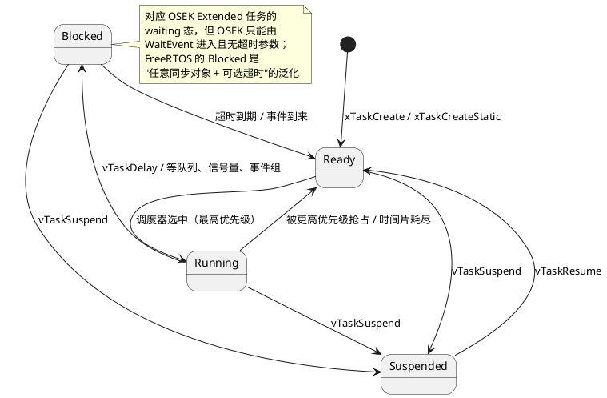
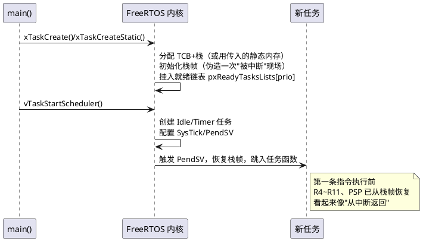

# 01-任务管理

> 一句话定位：用 FreeRTOS 的"运行时创建任务"对照 AUTOSAR OS 的"编译期定死任务"，一次看清两种 RTOS 世界观的分叉点。
> 等级：L2 ｜ 前置：[01-从前后台到RTOS-操作系统全景](../../00-入门导读/01-从前后台到RTOS-操作系统全景.md)

## 核心概念

FreeRTOS 任务 = 一个永不返回的函数 + 一块私有栈 + 一个 TCB（Task Control Block）。四个运行状态与 OSEK/AUTOSAR OS 几乎同构，唯独多出一个 Suspended：

对照 OSEK 状态机：suspended→ready 是 ActivateTask、ready→running 是调度器选中、running→waiting 是 WaitEvent。FreeRTOS 的 Blocked 把"带超时的等待"做成了原生能力——OSEK 里要配一个 Alarm 定时激活才能近似。

## 详解

创建与销毁的两套 API：

| | 动态 | 静态 |
|---|---|---|
| 创建 | `xTaskCreate()`（TCB+栈从内核堆分配） | `xTaskCreateStatic()`（传入 StaticTask_t 与栈数组） |
| 销毁 | `vTaskDelete()`（Idle 任务回收 TCB/栈） | 同左（静态栈需自己管理） |
| AUTOSAR 对照 | 无对应——OSEK 没有运行时创建 | 对应 OIL/arxml 静态配置生成的任务 |TCB 关键字段（走读 task.c 可见）：`pxTopOfStack`（必须是第一个字段，汇编按偏移 0 取栈顶）、`xStateListItem`（挂在就绪/阻塞/挂起链表）、`xEventListItem`（挂在同步对象等待链表）、`uxPriority`、`pxStack`。这份结构与 OSEK 生成代码里的 task descriptor（函数指针+优先级+栈指针）一一对应——只是 OSEK 的是 const 数组，FreeRTOS 的是运行时链表节点。

优先级语义差异（必考级对照）：

| | FreeRTOS | AUTOSAR OS（OSEK 血统） |
|---|---|---|
| 数值方向 | 数字越大优先级越高 | 数字越小优先级越高 |
| 优先级 0 | 保留给 Idle 任务 | 普通可配置优先级 |
| 运行时改优先级 | `vTaskPrioritySet()` 随意 | 不允许（静态定义） |
| 空闲任务 | 内核自建 Idle 任务兜底 | 无 Idle 任务概念，空转由 Os 挂钩子 |

Basic vs Extended 任务的映射：OSEK 的 Basic 任务不能等事件（无 waiting 态），生命周期是"激活-跑完-终止"；Extended 任务可 WaitEvent。FreeRTOS 没有这层区分——任何任务都能阻塞。工程上的心智映射：事件驱动任务 ≈ Extended，自旋轮询任务 ≈ Basic 的近似——但只是近似（FreeRTOS 轮询任务照样占 CPU，OSEK Basic 任务 TerminateTask 后 CPU 立即让出）。

任务函数永不 return：FreeRTOS 里 return 会被 `configASSERT` 拦（LR 指向 prvTaskExitError），应显式 `vTaskDelete(NULL)`；OSEK 里必须显式 `TerminateTask()`，return 同样是未定义行为——两家在这点上难得一致。

从创建到第一次上 CPU 的完整时序（Cortex-M 口径）：

这张图的关键直觉：**任务的第一口 CPU 是"伪造中断返回"给的**——创建时内核在栈里手工摆好一个假现场，PendSV 一恢复，PC 就落在任务函数第一行。OSEK 生成代码其实同款思路（初始上下文由启动代码摆好），只是你从不被允许看见它。

调试视角：开 `configUSE_TRACE_FACILITY` + `configGENERATE_RUN_TIME_STATS` 后，`uxTaskGetSystemState()`/`vTaskGetRunTimeStats()` 能打印每个任务的 CPU 占比与栈水位——等价于 Tracealyzer 的数据源，也是排查"谁把 CPU 吃光了"的第一工具；OSEK 侧对应 Os 的 ExecutionBudget / timing protection。

## 易错点与陷阱

1. **现象：任务卡死在启动后第一句。原因：** 栈给小了——`usStackDepth` 单位是 word 不是 byte（Cortex-M 上要 ×4），溢出破坏相邻内存。**对策：** `uxTaskGetStackHighWaterMark()` 实测余量，TC377/S32K 上从 128 word 起步量。
2. **现象：优先级"越高越慢"。原因：** 从 AUTOSAR 带来的直觉——1 比 9 高——在 FreeRTOS 里正好反着。**对策：** 移植老代码时统一做一层 `OS_PRIO_TO_FREERTOS(p)` 宏映射，别靠人肉翻译。
3. **现象：频繁 xTaskCreate/vTaskDelete 后堆耗尽。原因：** 动态创建走内核堆，且删除者的内存由 Idle 任务回收，删除速率高于 Idle 运行速率就漏。**对策：** 车规口径直接禁动态创建（`configSUPPORT_DYNAMIC_ALLOCATION=0`），全部静态。
4. **现象：删除持有互斥量的任务后死机。原因：** vTaskDelete 不会释放任务持有的锁。**对策：** 任务退出前归还所有资源——与 OSEK 未释放 Resource 就 TerminateTask（未定义行为）一样靠纪律兜底。
5. **现象：xTaskCreateStatic 编译报 undefined。原因：** 没开 `configSUPPORT_STATIC_ALLOCATION=1`。**对策：** FreeRTOSConfig.h 同步打开，并实现 `vApplicationGetIdleTaskMemory()` 等回调（内核的 Idle/Timer 任务也要静态供给）。

## 面试高频题

**Q：FreeRTOS 任务四状态与 OSEK 任务状态机怎么对应？**
答：Running/Ready 一一对应；OSEK 的 waiting 对应 FreeRTOS 的 Blocked，但 Blocked 泛化为"等任何同步对象且可带超时"，waiting 只能由 WaitEvent 进入且无超时；OSEK 没有 Suspended（任务要么激活在队列要么终止），FreeRTOS 的 vTaskSuspend 可从任何状态进入、vTaskResume 拉回。

**Q：xTaskCreate 和 ActivateTask 是一回事吗？**
答：不是。xTaskCreate 是"创建任务实体"（分配 TCB 和栈、挂入就绪表）；AUTOSAR OS 任务在配置期就已存在，ActivateTask 只是"激活"——把任务从 suspended 变 ready 或递增激活计数。语义上 xTaskCreate 更接近生成器里的任务定义，ActivateTask 的效果更接近"创建即运行的一次性触发"。

**Q：为什么车规项目禁用动态任务创建？**
答：三点：堆碎片与最坏情况分配时间不可证；失败路径（返回 errCOULD_NOT_ALLOCATE_REQUIRED_MEMORY）难以在安全论证中闭环；ISO 26262-6 与 MISRA C 实践回避不受控动态内存。FreeRTOS 用 xTaskCreateStatic + 关动态分配即可全静态，与 AUTOSAR OS 同等"零运行时分配"。

**Q：Idle 任务在 FreeRTOS 里做什么，AUTOSAR OS 为什么没有？**
答：FreeRTOS 的 Idle 任务回收被删任务的内存、跑空闲钩子（含 tickless 低功耗）。AUTOSAR OS 任务集静态且不可删，没有内存要回收，CPU 空转由 Os 的 Idle/空转 hook 接管——所以不需要一个任务兜底。

## 延伸

- [02-调度](02-调度.md)：创建之后谁先跑——调度篇。
- [任务调度原理（L1 基础）](../../1-L1基础/RTOS通用原理/任务调度原理/README.md)：通用调度模型先行回顾。
- [07 区 Os 任务与调度](../../../07-AUTOSAR架构/2-L2进阶/系统服务栈/Os/01-任务与调度.md)：主业侧 AUTOSAR Os 任务配置实战。
- [05-内存管理heap方案对比](05-内存管理heap方案对比.md)：动态创建的内存从哪来。