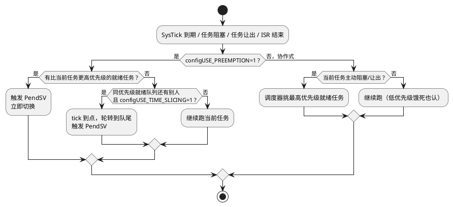

# 02-调度

> 一句话定位：把 FreeRTOS 调度器的三个 config 开关、四个调度点吃透，并对照 OSEK 的满抢占/时间片语义——顺带收编软件定时器这个"藏在守护任务里的调度用户"。
> 等级：L2 ｜ 前置：[01-任务管理](01-任务管理.md)

## 核心概念

FreeRTOS 调度 = **固定优先级抢占**为骨架 + **同优先级时间片轮转**为补充，一切由三个宏开关控制。整个决策流程只有一张图：



## 详解

### 四个调度点

调度器不是常驻循环，它只在四个时机被"请出来"挑人：**任务主动阻塞**（vTaskDelay/等队列满）、**任务让出**（taskYIELD）、**更高优先级任务被就绪**（ISR 里 xQueueSendFromISR 唤醒了高优任务）、**tick 到期**（时间片轮转、超时检查）。OSEK 的调度点集合几乎相同：TerminateTask/WaitEvent/ChainTask + ISR 结束时的 dispatching——**两家都是"事件驱动调度"，没有哪个 RTOS 真的在一个循环里不停挑人**。

### 关键 config 与语义

| 宏 | 作用 | 车规典型取值 |
|---|---|---|
| `configUSE_PREEMPTION` | 抢占开/关（关=协作式） | 1 |
| `configUSE_TIME_SLICING` | 同优先级时间片轮转开/关 | 0（消除轮转抖动，确定性优先） |
| `configTICK_RATE_HZ` | tick 频率，所有延时的分辨率 | 1000（与 Os 1ms tick 对齐） |
| `configMAX_PRIORITIES` | 优先级级数（0 到 N-1） | 按需，别虚高（就绪表变长） |
| `configUSE_TICKLESS_IDLE` | 空闲时停 tick 降功耗 | 座舱类关心，MCU 主控一般 0 |

时间片粒度 = 1 个 tick，**不可配成"任务 A 两片、任务 B 一片"**——没有权重轮转。要权重，要么分优先级，要么自己在任务里做配额。OSEK 同理：同优先级 FIFO、无时间片（部分商业内核如 ERIKA 支持"时间片调度器"近似）。

### vTaskDelay vs vTaskDelayUntil（周期任务必考）

`vTaskDelay(n)` = 从**现在**起睡 n tick——每周期实际间隔 = 执行时间 + n，会漂移。`vTaskDelayUntil(&last, n)` = 睡到**绝对时刻** last+n——周期严格。10ms 控制任务（等效 OSEK 里"Alarm 周期激活任务"）必须用后者：

```c
void Task_10ms(void *arg)
{
    TickType_t last = xTaskGetTickCount();
    for (;;)
    {
        do_control();
        vTaskDelayUntil(&last, pdMS_TO_TICKS(10));   /* 严格 10ms，不累积漂移 */
    }
}
```

### 软件定时器：藏在守护任务里的回调

`xTimerCreate()` 创建的定时器回调**不在中断里跑**，而是由内核的 Timer 服务任务（守护任务，优先级 `configTIMER_TASK_PRIORITY`）从命令队列取出来执行。三个直接推论：

1. 回调要短——它阻塞的是**所有**软件定时器的回调；
2. 回调里不能直接调带阻塞参数（portMAX_DELAY）的 API，会死锁守护任务；
3. `xTimerStart()` 只是往命令队列投一条命令（`configTIMER_QUEUE_LENGTH` 满了就失败），不是立即生效。

vs OSEK Alarm 对照：

| | FreeRTOS 软件定时器 | OSEK/AUTOSAR Alarm |
|---|---|---|
| 回调上下文 | Timer 守护任务（任务态） | CallbackAlarm 在 ISR 上下文；激活型 Alarm 拉起任务 |
| 创建时机 | 运行时 xTimerCreate | 配置期静态定义 |
| 周期/单次 | pdTRUE/pdFALSE 一个参数 | AUTOSAR 中 OSTimer/周期 Alarm |
| 精度 | tick 级 + 队列排队延迟 | tick 级、在 tick ISR 里直接派发，延迟更确定 |
| 车规口径 | 能用，但高确定性行为仍建议任务+DelayUntil | 主流做法 |

### Idle 任务与空转

没有任务就绪时跑 Idle（优先级 0）：回收被删任务内存、执行空闲钩子（`vApplicationIdleHook`）、配合 tickless 停表降功耗。对应 AUTOSAR Os 的 Idle Hook / 空转循环——概念同构，只是 FreeRTOS 把它做成了一个真实任务。
## 易错点与陷阱

1. **现象：周期任务越跑越慢，每圈多漂 1ms。原因：** 用 `vTaskDelay(n)` 做周期，执行耗时被累加进周期。**对策：** 换 `vTaskDelayUntil()`（绝对时刻唤醒）；这是从 AUTOSAR Alarm 迁移过来最常见的坑。
2. **现象：开了时间片后同优先级任务抖动变大。原因：** 轮转在每个 tick 边界强切，任务被打断在半句上。**对策：** 车规确定性场景直接 `configUSE_TIME_SLICING=0`，任务要么分级要么自己让出。
3. **现象：低优先级任务永远跑不到。原因：** 抢占式下中高优先级任务常年就绪（如某任务 while(1) 里只 delay 0 或压根不阻塞）。**对策：** 排查设计——FreeRTOS 没有aging（等待提优先级）机制，饿死是你的设计问题不是内核问题。
4. **现象：软件定时器回调里调用 xQueueSend 满延时参数后整机卡死。原因：** 回调在守护任务里跑，阻塞它=所有定时器停摆，若阻塞的队列又被别的定时器回调喂数据则死锁。**对策：** 回调里只用 0 超时参数，把重活转给工作任务。
5. **现象：改了 configTICK_RATE_HZ 后所有延时翻倍/减半。原因：** 业务代码里硬编码了 tick 数而不是 `pdMS_TO_TICKS(ms)`。**对策：** 全库统一用宏换算，把 tick 频率当纯内核配置。
6. **现象：vTaskDelayUntil 首次调用就断言。原因：** 上一次唤醒时刻变量未初始化为当前 tick，且 `xLastWakeTime` 落在过去——`vTaskDelayUntil` 只能向前。**对策：** 循环外先 `xLastWakeTime = xTaskGetTickCount()`。

## 面试高频题

**Q：FreeRTOS 怎么决定该切换任务了？**
答：没有常驻调度循环。四个调度点触发重调度：任务阻塞、任务让出（taskYIELD）、ISR 中唤醒了更高优先级任务（FromISR 返回后 portYIELD_FROM_ISR）、SysTick 到期（时间片与超时）。Cortex-M 上切换统一落到 PendSV 中断里执行，保证原子性。

**Q：时间片轮转和抢占是什么关系？**
答：抢占是"不同优先级之间，高的来了立刻切"；时间片是"同优先级之间，每个 tick 轮换一次"。前者由 configUSE_PREEMPTION 控制，后者由 configUSE_TIME_SLICING 控制，且后者依赖 tick 存在。两者独立开关——关掉时间片只保留抢占是常见车规配置。

**Q：vTaskDelay 和 vTaskDelayUntil 的区别？**
答：Delay 是相对延时（从调用时刻起睡 n），周期会被执行时间拉长产生漂移；DelayUntil 是绝对延时（睡到上次唤醒时刻+n），周期严格。周期性控制任务必须用 DelayUntil，等价于 OSEK 里周期 Alarm 激活任务的语义。

**Q：FreeRTOS 软件定时器回调相当于在中断里吗？**
答：不。回调在内核的 Timer 守护任务上下文里执行，通过命令队列传递请求。因此回调里可以调用任务级 API，但不能长时间阻塞，否则所有定时器都被拖住——这与 OSEK CallbackAlarm（在计数器 tick 的 ISR 上下文执行、必须更短更快）语境不同，别混。

## 延伸

- [03-同步与通信](03-同步与通信.md)：阻塞与唤醒的另一半——任务通知如何绕过队列。
- [04-中断管理](04-中断管理.md)：ISR 结束这个调度点的细节与 FromISR 双轨制。
- [调度通用原理（L1 基础）](../../1-L1基础/RTOS通用原理/任务调度原理/README.md)：调度模型、优先级反转的原理侧。
- [07 区 Os 任务与调度](../../../07-AUTOSAR架构/2-L2进阶/系统服务栈/Os/01-任务与调度.md)：AUTOSAR Os 调度类（FULL/SCHEDULE_TABLE）配置实战。
- [07 区 Os Alarm 与 ScheduleTable](../../../07-AUTOSAR架构/2-L2进阶/系统服务栈/Os/03-Alarm与ScheduleTable.md)：主业侧时间触发的标准做法。