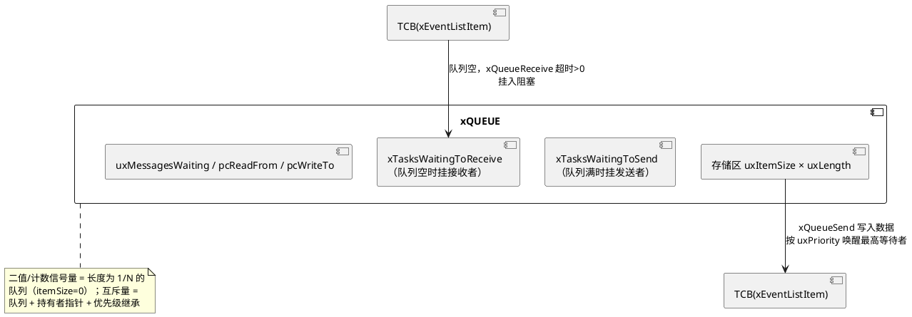

# 03-同步与通信

> 一句话定位：队列/二值/计数信号量/互斥量/事件组五件套，加上绕过一切中间对象的任务通知第六件，对照 OSEK 的 Event/Resource/COM 一次选型到位。
> 等级：L2 ｜ 前置：[02-调度](02-调度.md)

## 核心概念

FreeRTOS 所有同步对象共享同一个骨架：**一个内核对象 + 两条等待链表**（等数据的、等空间的），阻塞与唤醒都发生在链表搬移上。以队列为代表：

OSEK 侧的对应物更"散"：Event 挂在任务自己的等待位图上，Resource 走天花板链，COM 是独立规范。FreeRTOS 把它们全部统一到"队列机"上——理解了队列，五件套全会。

## 详解

### 六件套 vs OSEK 对照总表

| 对象 | FreeRTOS API（代表） | OSEK/AUTOSAR 对应 | 关键差异 |
|---|---|---|---|
| 队列 | `xQueueSend/Receive` | `SendMessage`/OSEK COM | FreeRTOS 按值拷贝进队列，COM 常传引用+生命周期约定 |
| 二值信号量 | `xSemaphoreGive/Take` | 无原生（Alarm 激活近似） | FreeRTOS 用于"ISR→任务"事件递送；OSEK 此场景靠激活任务 |
| 计数信号量 | 同上（创建时给初值） | 无原生（EVENT 聚合近似） | 事件不计数、信号量计数——资源池管理 |
| 互斥量 | `xSemaphoreCreateMutex` | `GetResource/ReleaseResource` | 继承 vs 优先级天花板（下节） |
| 事件组 | `xEventGroupSetBits/WaitBits` | `SetEvent/WaitEvent` | 事件组可 AND/OR 组合、可一次唤醒多任务（广播） |
| 任务通知 | `xTaskNotify/NotifyWait` | 无（最接近"直连版 SetEvent"） | 直写 TCB 字段，不进任何队列，最快 |

### 队列：拷贝语义与两条等待链

`xQueueSend()` 把 `uxItemSize` 字节**从调用者缓冲区拷贝进队列存储区**，`xQueueReceive()` 再拷出去——数据在队列里有一份独立副本。这与 OSEK COM 的常见实现（传指针，发送方负责生命周期）是根本分歧：拷贝安全但大结构有开销，传引用快但有悬垂风险。工程折衷：大报文传指针 + 引用计数/内存池，把生命周期问题变回静态可证。

队列满时发送者挂 `xTasksWaitingToSend`，队列空时接收者挂 `xTasksWaitingToReceive`——一次 Give 唤醒**等待链上优先级最高**的任务（不是 FIFO，按优先级排），这是与"OSEK 激活多实例任务排队"最大的行为差异：FreeRTOS 的等待队列是优先级有序链表。

### 互斥量：优先级继承 vs 天花板

FreeRTOS 互斥量实现的是**简单优先级继承**（Priority Inheritance）：持有者临时提到"等待者中最高优先级"，释放时还原。OSEK/AUTOSAR 的 Resource 是**立即优先级天花板协议（IPCP/OPCP）**：GetResource 的瞬间直接升到该资源的静态天花板，不管有没有人在等。

| | 继承（FreeRTOS） | 天花板（OSEK） |
|---|---|---|
| 提升时机 | 有人被阻塞后才提 | 取资源立即提 |
| 死锁 | **不防**（交叉持锁可死锁） | 天花板序天然防死锁 |
| 有界阻塞 | 弱界 | 强界（可算 WCBC） |

车规视角的结论：FreeRTOS 互斥量挡得住经典优先级反转，挡不住死锁——多锁场景必须自建加锁序纪律（同 OSEK 的静态顺序约束一样靠设计保证，参见死锁四条件的原理篇）。

### 任务通知：第六件，也是最快的一件

`xTaskNotify()` 不创建任何内核对象：它直接置位目标 TCB 里的 `ulNotifiedValue` 和 `ucNotifyState`，`xTaskNotifyWait()` 就地等这个字段。省掉队列存储、省掉两次链表挂摘——官方口径比二值信号量快约 45%。动作模型一共有：`eSetBits`（当事件用）、`eIncrement`（当计数信号量用）、`eSetValueWithOverwrite/WithoutOverwrite`（当长度 1 邮箱用），一套 API 顶三件套。

代价与限制：**只能一对一定向**（一个 TCB 只有一个通知值），不能广播、不能多个生产者无痕汇聚——两个 ISR 都往同一任务 Increment，接收方分不清是谁来的。OSEK 工程师的直觉映射：它像"每个任务自带的 32 位事件掩码"，但比 SetEvent 多了计数值语义。

### ISR 侧的一切

所有上表 API 在中断里必须换 `FromISR` 版本并处理 `xHigherPriorityTaskWoken`——机制与惯例单独成篇：[04-中断管理](04-中断管理.md)。

## 易错点与陷阱

1. **现象：ISR 里 `xSemaphoreTake(Mutex)` 编译过但带断言的工程直接断言。原因：** 互斥量有"持有者"概念且实现优先级继承，必须在任务上下文。**对策：** ISR→任务递事件用二值信号量或任务通知；互斥量只护任务间共享资源——对应 OSEK 里 ISR 根本不允许 GetResource 的同款纪律。
2. **现象：队列传大结构后 CPU 占用暴涨。原因：** 队列按值拷贝，一进一出两次 memcpy。**对策：** 队列里传指针，数据本体放静态内存池/环形缓冲，并约定所有权移交；等价于 OSEK COM 外部数据区的引用传递。
3. **现象：从 OSEK 迁来的代码 `xSemaphoreTake(..., 0)` 预期"等到事件"，结果直接返回失败。原因：** OSEK `WaitEvent` 是无限期阻塞且无超时参数，FreeRTOS 超时 0 = 不等待立即返回。**对策：** 无限等要显式传 `portMAX_DELAY`（且开 `INCLUDE_vTaskSuspend` 时它才真正无限）。
4. **现象：任务通知偶发"丢事件"。原因：** 用了 `eSetValueWithOverwrite` 又连续发两次，前值被覆盖——或 `xTaskNotifyWait` 的 `ulBitsToClearOnExit` 把还想保留的位清了。**对策：** 位语义用 `eSetBits`+精确清位掩码；覆盖语义只在"最新值有意义"（如最新采样值）时用。
5. **现象：两任务交叉持两把互斥量死锁，看门狗复位。原因：** 优先级继承不防死锁（只防反转）。**对策：** 全工程规定锁序（如按句柄地址升序获取）；这与 OSEK 靠静态天花板序防死锁不同，FreeRTOS 必须自律。
6. **现象：`xEventGroupSync` 的多方同步卡死一个任务。原因：** `uxAutoReset` 的到达组没集齐，某参与者异常分支没调 Sync。**对策：** 所有参与者路径（含错误分支）必须走完 Sync，或改用带超时的 `WaitBits` 轮询到位。

## 面试高频题

**Q：任务通知为什么比信号量/队列快？**
答：它不创建中间内核对象：没有队列存储区、没有两条等待链表的挂摘操作，发送方直接写目标 TCB 的 `ulNotifiedValue`/`ucNotifyState` 字段并按需唤醒。省掉了队列的加锁、拷贝、链表搬移，官方数据比二值信号量快约 45%。代价是只能一对一、不能广播、多生产者不可区分。

**Q：FreeRTOS 互斥量和 OSEK Resource 有什么本质区别？**
答：协议不同。FreeRTOS 是简单优先级继承：持有者被高优先级等待者阻塞后才提升到对方优先级，防的是无界优先级反转，不防死锁；OSEK 是立即优先级天花板（IPCP）：GetResource 瞬间提升到资源静态天花板，与资源序配合可证有界阻塞并防死锁。迁移要点：FreeRTOS 多锁场景必须自建加锁顺序纪律。

**Q：二值信号量和互斥量都"非 0 即 1"，能互换用吗？**
答：不能。二值信号量是同步原语（谁都可以 Give/Take，典型是 ISR Give、任务 Take，无所有权）；互斥量是互斥原语（带持有者与优先级继承，只有持有者能 Give，且只能任务上下文用）。互换的直接后果：用信号量护共享区没有优先级继承，反转复发；用互斥量做 ISR 递事件则 API 直接不可用。

**Q：事件组相比 OSEK Event 强在哪、弱在哪？**
答：强在三点：AND/OR 位组合等待（WaitEvent 只能 OR）、一次 SetBits 可广播唤醒多个等待任务、位可由任意任务/ISR 置起。弱在：事件组是独立内核对象（要创建、占内存），OSEK Event 附着在任务上零成本；且事件组无"自动清零+定向"语义，收发双方要自己管位的清除。

## 延伸

- [04-中断管理](04-中断管理.md)：这五件套在 ISR 里的 FromISR 双轨制与唤醒惯例。
- [信号量（L1 基础）](../../1-L1基础/RTOS通用原理/同步与互斥/01-信号量.md)：计数/二值/互斥三类语义的原理侧。
- [互斥锁与优先级继承（L1 基础）](../../1-L1基础/RTOS通用原理/同步与互斥/02-互斥锁与优先级继承.md)：继承与天花板协议的原理推导。
- [优先级反转案例（L1 基础）](../../1-L1基础/RTOS通用原理/同步与互斥/05-优先级反转案例.md)：反转怎么在示波器上现形。
- [07 区 Os 事件与资源](../../../07-AUTOSAR架构/2-L2进阶/系统服务栈/Os/02-事件与资源.md)：主业侧 Event/Resource 配置实战。
