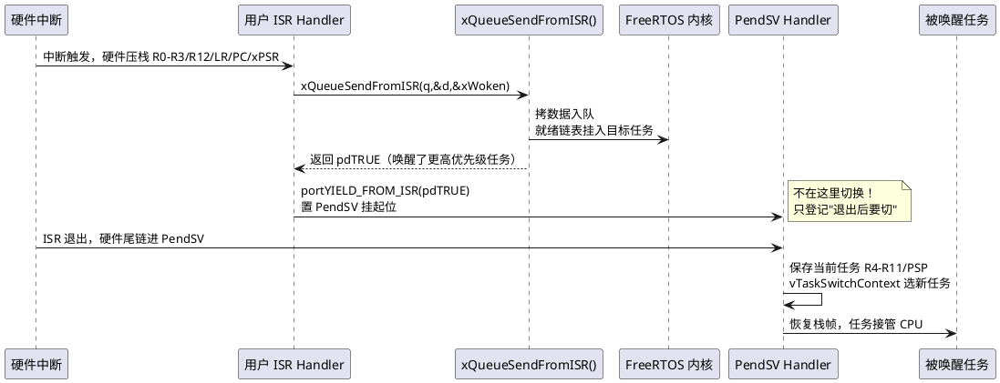

# 04-中断管理

> 一句话定位：FromISR 双轨制、xHigherPriorityTaskWoken 惯例与 BASEPRI 临界区嵌套计数，对照 AUTOSAR OS 的 Cat1/Cat2 中断类别。
> 等级：L2 ｜ 前置：[03-同步与通信](03-同步与通信.md)

## 核心概念

FreeRTOS 中断管理一句话：**ISR 里只许用 `FromISR` 后缀 API + 只许以 `portYIELD_FROM_ISR` 收尾**。一次完整的"ISR 唤醒任务"全程：



对照 AUTOSAR：Cat2 ISR 退出时 OS 在包装层做 dispatching（检查该不该切任务）——FreeRTOS 把同样的"检查点"交给开发者手写 `portYIELD_FROM_ISR`，语义同源，自动化程度不同。

## 详解

### 双轨制 API：为什么必须分两套

任务上下文的 API 可以阻塞（队列满就睡到超时）；ISR 上下文**没有任务身份**，睡不得、也不能碰调度器内部结构。于是每个会涉及等待链表的 API 都派生 `FromISR` 版：**超时参数被强制拿掉**（等价 0）、内部改用中断安全路径。对照 OSEK：OSEK 干脆不允许 ISR 里调任何可阻塞服务，只开放 PostTask/SetEvent/ActivateTask 这类"投递型"API——FreeRTOS 的 FromISR 族恰好就是这批投递型 API 的泛化。

| 上下文 | 可用 API | 对应 OSEK ISR 服务 |
|---|---|---|
| ISR，优先级数值 ≥ MAX_SYSCALL | `xxxFromISR` 全族 | Cat2 可用服务（ActivateTask/SetEvent/SendMessage…） |
| ISR，优先级数值 < MAX_SYSCALL（更高） | **任何内核 API 都不行** | Cat1：不碰 OS，纯私有处理 |
| 任务 | 全部非 FromISR 版 | 任务级服务 |

### xHigherPriorityTaskWoken 惯例（必背模板）

```c
void CAN_RX_IRQHandler(void)
{
    BaseType_t xHigherPriorityTaskWoken = pdFALSE;
    /* 多次调用时只传同一个变量的地址，累计"是否唤醒过更高优先级任务" */
    xQueueSendFromISR(xCanRxQueue, &frame, &xHigherPriorityTaskWoken);
    xTaskNotifyFromISR(xCanTaskHandle, 1UL, eSetBits, &xHigherPriorityTaskWoken);
    portYIELD_FROM_ISR(xHigherPriorityTaskWoken);   /* 惯例：handler 最后一句 */
}
```

关键直觉：`FromISR` 版本**永不切换任务**（ISR 里切现场会破坏中断嵌套约定），它只把"有更高优先级任务就绪了"这一事实通过 `pdTRUE` 带出来，由 `portYIELD_FROM_ISR` 置 PendSV 挂起位；真正切换发生在 ISR 退出、硬件尾链进最低优先级的 PendSV 时——一步都不抢。

### taskENTER_CRITICAL：嵌套计数 + BASEPRI

Cortex-M 端口实现三层细节，背下来面试直接加分：

1. **不是关全局中断**。`portSET_INTERRUPT_MASK_FROM_ISR`/`taskENTER_CRITICAL` 把 `BASEPRI` 抬到 `configMAX_SYSCALL_INTERRUPT_PRIORITY`——只屏蔽"允许调内核 API 的那层"中断，高于它的（电机保护、安全中断）照常响应。OSEK/AUTOSAR 的 OS_DISABLE_ALL_INTERRUPTS 层级化屏蔽同款思想。
2. **嵌套计数** `uxCriticalNesting`：进入 +1、退出 -1，减到 0 才真正放行 BASEPRI——临界区可以任意嵌套，内层退出不会提前解锁。
3. **临界区内禁止阻塞**：`vTaskEnterCritical` 会断言调度器未被挂起，临界区里调 `xQueueSend(..., portMAX_DELAY)` 这类可阻塞 API 直接触发 `configASSERT`。

### 两个优先级宏

`configKERNEL_INTERRUPT_PRIORITY`（PendSV/SysTick 用，必须最低）与 `configMAX_SYSCALL_INTERRUPT_PRIORITY`（FromISR 族允许的最低中断优先级门槛，也是临界区 BASEPRI 的值）。数值上：**中断优先级数值 ≥ MAX_SYSCALL 才能调 FromISR**——记住 NVIC 数值越大优先级越低，和任务优先级方向正好相反。

### 延迟处理：顶半/底半

ISR 只做"取数据+递事件"，处理丢给任务——FreeRTOS 没有命名这个模式，但"二值信号量/通知 + 专用处理任务"就是标准顶半/底半实现；AUTOSAR 侧对应 Cat2 ISR + 激活 Dedicated Task 的分工惯例。原则同一条：**ISR 时长 = 中断延迟的一部分，越短越好**。

## 易错点与陷阱

1. **现象：ISR 里调 `xQueueSend`（无 FromISR）带断言工程当场断言，关闭断言则偶发调度错乱。原因：** 任务版 API 会操作等待链表并可能触发任务切换，ISR 上下文无 TCB 身份，现场被写坏。**对策：** ISR 只用 FromISR 族；开 `configASSERT` 让它在开发期就炸——等价于 OSEK 里在 Cat1 ISR 调 OS 服务的静态检查，只是 FreeRTOS 把检查推迟到了运行期。
2. **现象：CAN 唤醒的任务偶发多等 1 个 tick 才跑。原因：** 忘写 `portYIELD_FROM_ISR(xHigherPriorityTaskWoken)`，唤醒的任务要等下一次 SysTick 调度点才上 CPU。**对策：** 任何 FromISR 调用之后检查是否有收尾 yield；把"handler 最后一句必须是 yield"当 code review 检查项。
3. **现象：移植后某个高优先级中断里调 FromISR 直接断言。原因：** 该中断 NVIC 优先级数值小于 `configMAX_SYSCALL_INTERRUPT_PRIORITY`（优先级更高），BASEPRI 屏不住它，内核数据结构可能被它和临界区并发改写。**对策：** 要么降该中断优先级，要么它彻底不碰内核 API（当 Cat1 用）。
4. **现象：中断偶发不被响应，示波器抓到长临界区。原因：** 临界区里干了重活（printf、memcpy 大缓冲、flash 擦写）。**对策：** 临界区只包"共享数据的那几行"；重活挪出或改用任务级同步——OSEK 侧同款纪律（GetResource 内禁长活）。
5. **现象：CubeMX/HAL 工程里 tick 变慢或 SysTick_Handler 冲突。原因：** HAL 的 `HAL_SYSTICK_IRQHandler` 与 FreeRTOS 的 `xPortSysTickHandler` 共用向量，或工程在别处重定义了 `xPortPendSVHandler`。**对策：** `SysTick_Handler` 里调 `HAL_IncTick()` 后转发 `xPortSysTickHandler()`（或用 `vApplicationTickHook`），保证向量表只有一份内核实现。
6. **现象：多设备共用一个 ISR，唤醒逻辑偶发漏切。原因：** 每个 FromISR 调用各传了独立的局部 `xWoken`，只把最后一个交给 yield，前面的唤醒信号被丢。**对策：** 同一 handler 内共享**一个** `xHigherPriorityTaskWoken` 变量，全部 API 传它的地址，最后统一 yield。

## 面试高频题

**Q：为什么 FreeRTOS 需要 FromISR 版 API，而 OSEK 不需要？**
答：FreeRTOS 的任务级 API 内含阻塞逻辑和任务级链表操作；ISR 没有 TCB 身份，阻塞无意义且切换现场会破坏嵌套约定，所以派生非阻塞、中断安全的 FromISR 版。OSEK 从设计上就只给 ISR 开放"投递型"服务（ActivateTask/SetEvent/SendMessage），不存在可阻塞 API，自然无需两套。代价差异：FreeRTOS 靠运行期断言与自觉，OSEK 靠静态配置检查（Cat1 里调服务直接配置报错）。

**Q：xHigherPriorityTaskWoken 的工作机制是什么？**
答：FromISR API 唤醒等待任务后，比较被唤醒任务与当前被中断任务的优先级；更高则把调用者传入的变量置 pdTRUE。portYIELD_FROM_ISR 看到 pdTRUE 就置 PendSV 挂起位，ISR 退出后硬件尾链进最低优先级的 PendSV 完成切换。切换被推迟到 ISR 之外，保证中断嵌套约定不被破坏——对应 Cat2 ISR 退出时 OS 包装层的 dispatching。

**Q：taskENTER_CRITICAL 在 Cortex-M 上是怎么实现的？嵌套怎么处理？**
答：把 BASEPRI 写为 configMAX_SYSCALL_INTERRUPT_PRIORITY，屏蔽优先级数值大于等于它的中断（即"内核可见层"），高于它的中断不受影响；同时维护 uxCriticalNesting 嵌套计数，进入 +1、退出 -1，减到 0 才恢复 BASEPRI=0。因此临界区可嵌套，且不牺牲最高优先级中断的实时性——与 OSEK 的分级中断屏蔽同思想。

**Q：FreeRTOS 怎么划分中断类别，与 AUTOSAR Cat1/Cat2 对应关系？**
答：按"能不能调内核 API"划：NVIC 优先级数值 ≥ configMAX_SYSCALL_INTERRUPT_PRIORITY 的中断可调 FromISR 族，角色等同 Cat2（可激活任务/发事件）；数值更小（优先级更高）的中断被 BASEPRI 屏蔽在外，只能做纯私有处理，角色等同 Cat1。区别在执行机制：AUTOSAR 用配置期类别声明+统一包装函数，FreeRTOS 靠 API 后缀约定+运行期断言。

## 延伸

- [05-内存管理heap方案对比](05-内存管理heap方案对比.md)：中断与任务共享的内核堆方案与栈保护。
- [ISR 与任务交互（L1 基础）](../../1-L1基础/RTOS通用原理/中断管理/03-ISR与任务交互.md)：顶半/底半与事件递送的原理侧。
- [临界区（L1 基础）](../../1-L1基础/RTOS通用原理/中断管理/02-临界区.md)：屏蔽层级与最短临界区原则。
- [中断嵌套（L1 基础）](../../1-L1基础/RTOS通用原理/中断管理/01-中断嵌套.md)：NVIC 嵌套与尾链机制。
- [07 区 Os Hook](../../../07-AUTOSAR架构/2-L2进阶/系统服务栈/Os/04-Hook.md)：主业侧各类回调的上下文限制对照。
