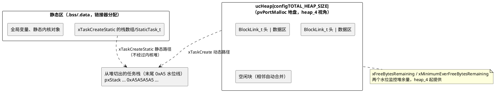

# 05-内存管理heap方案对比

> 一句话定位：五个官方堆实现一张表选型 + configTOTAL_HEAP_SIZE 边界 + 栈溢出检测两种模式，对照 OSEK"零堆全静态"的车规世界观。
> 等级：L2 ｜ 前置：[04-中断管理](04-中断管理.md)

## 核心概念

FreeRTOS 内存全景只有三块：**静态区**（链接器分配）、**内核堆**（`configTOTAL_HEAP_SIZE` 字节的数组，pvPortMalloc 的地盘）、**任务栈**（动态创建时从内核堆切出来，静态创建时自己在静态区给数组）。heap_1~5 的全部差异只在中间那块怎么管：

OSEK/AUTOSAR OS 侧没有中间那块：所有 TCB、栈、控制块在配置期定死、编译期落 .bss——这是两种内存世界观的分水岭。

## 详解

### heap_1~5 全对比表（选型主表）

| 方案 | 分配 | 释放 | 空闲块合并 | 碎片风险 | 典型用途 |
|---|---|---|---|---|---|
| heap_1 | 顺序递增（指针只进不退） | **不支持** | 无需 | **零** | 创建后不删的初始化期分配；功能安全最易论证 |
| heap_2 | best-fit 首个够用块 | 支持 | **不合并** | 有（释放不归还相邻） | 已淘汰，新项目别选 |
| heap_3 | 封装 C 库 malloc/free | 支持 | 看 C 库 | 看 C 库 | 堆归链接器管、需与 libc 共用的场合 |
| heap_4 | first-fit + 相邻合并 | 支持 | **合并**（向低/高双向） | 低（仍非零） | 需要运行时增删对象的首选 |
| heap_5 | 同 heap_4 | 支持 | 同上 | 同上 | 堆跨多个不连续 RAM 段（如 TC377 的多个核间/DSPR 区域） |

两个监控量（heap_4/5）：`xFreeBytesRemaining`（当前剩余）与 `xMinimumEverFreeBytesRemaining`（历史最低水位）——后者才是**最坏情况证据**，安全论证里拿它说话。

### heap_4 走读要点

每块前置 `BlockLink_t`（块大小+空闲标志），空闲块按地址序串成链；释放时若前/后块空闲即合并成大块，吸收外部碎片的主要来源。分配用 first-fit 从链头找第一个够大的块，太大则劈分。**内部碎片**（uxItemSize 对齐取整）与**分配时间波动**（找块路径不定长）依然存在——这是"为什么车规最好别用堆"的源码级答案，对应堆与碎片原理篇。

### 栈溢出检测：configCHECK_FOR_STACK_OVERFLOW 两档

| 档位 | 原理 | 抓得住 | 抓不住 |
|---|---|---|---|
| 1 | 任务创建时栈底填 `0xA5A5A5A5` 图案，调度 Idle 任务时检查是否被啃 | 已发生并驻留的溢出 | 溢出后又弹回（图案恰好未破坏） |
| 2 | 档 1 + 校验栈底指针值（pxEndOfStack 存的 TCB 指针是否还在） | 同上，更多一层 | 越过栈底撞进别的内存、且没碰到检测点 |

命中后回调 `vApplicationStackOverflowHook(TaskHandle_t, char* taskName)`——注意 hook 里只剩"记录+复位"可做。两档都是**事后检测非预防**：真正硬保护要上 MPU（FreeRTOS-MPU 端口把任务栈划成保护区，越界直接 MemManage fault），对应 AUTOSAR OS 的 Memory Protection（Os + MPU 按任务/OsApplication 划区）。

### pvPortMalloc 与 C 库 malloc 的关系

内核只认 `pvPortMalloc/vPortFree` 两个符号，heap_x.c 是它们的五种实现；C 库的 `malloc/free` 是另一套（链接器堆），二者互不相通。工程上两选一：要么重定义 `malloc` 转发到 pvPortMalloc（让第三方库也吃内核堆，省一份堆预算），要么严格隔离并各自留余量——最忌两套并存又都不监控。heap_3 是唯一主动去封装 C 库的方案，选它等于把堆管理权交还链接器脚本。

### 运行期工具与车规口径

`uxTaskGetStackHighWaterMark(handle)` 返回历史最小剩余（word 数）——给每个任务定栈大小的实测依据，与 L1 栈大小确定篇的静态推算法互为验证。车规口径三件套：`configSUPPORT_DYNAMIC_ALLOCATION=0` 全静态（内核堆整个消失，heap_x.c 都不编入）→ 不行则 heap_1/heap_4 + 只在初始化期分配；`configCHECK_FOR_STACK_OVERFLOW=2` 常开；上线前用 HighWaterMark 收敛栈余量再冻结。

### vs OSEK 静态栈

OSEK 任务栈在 OIL/arxml 里逐任务声明，生成器算总和落 .bss，运行期零分配、零碎片、最坏情况内存=总 .bss——一句话可证。FreeRTOS 动态路径放弃了这个性质，换"运行时弹性"；静态路径（xTaskCreateStatic）把它拿回来。对照结论：**FreeRTOS 不是不能用得像 OSEAR 一样静态，只是默认不强制你**——`configSUPPORT_STATIC_ALLOCATION` + 禁动态双开关就是"OSEK 模式"。

## 易错点与陷阱

1. **现象：xTaskCreate 大量任务后偶发 NULL 返回。原因：** 每个任务的 TCB+栈都从 `configTOTAL_HEAP_SIZE` 切，堆总量没算够。**对策：** 预算表：Σ(栈 word×4+TCB+队列等对象)，配 `xMinimumEverFreeBytesRemaining` 监控留 20% 余量——OSEK 侧等价于生成器替你算总栈，这里要自己算。
2. **现象：vPortFree 之后 `xFreeBytesRemaining` 涨了但系统还是报内存不足。原因：** 释放产生的外部碎片：空闲块都小于下次要的大块（heap_2 尤甚）。**对策：** 换 heap_4；对象定长化（所有队列 uxItemSize 统一）让空闲块永远够装同类请求。
3. **现象：栈溢出检测档 1 没报警但相邻全局变量已被改写。原因：** 档位检测发生在 Idle/调度点，溢出又弹回或只啃了中间段就绕过水位线。**对策：** 档 2 + 关键任务上 MPU 端口；发布版禁依赖"检测得到"——预防靠栈实测收敛。
4. **现象：溢出 hook 里 printf 后整机死得更透。原因：** 溢出时栈已破，printf 族递归/缓冲开销大，二次踩踏。**对策：** hook 只做：写一段裸内存标记（或 RAM log）+ 复位；禁止任何库函数重活。
5. **现象：heap_5 工程初始化即断言。原因：** 没先调 `vPortDefineHeapRegions()`（且数组按地址升序、首项最低地址）就 pvPortMalloc。**对策：** main 第一件事定义 HeapRegion_t 表并初始化，再谈任何创建。
6. **现象：usStackDepth=128 的任务实际只用了 512 字节就崩。原因：** 又是 word 单位坑——128 word=512 字节，从 AUTOSAR（栈按字节声明）迁来的直觉差 4 倍。**对策：** 统一宏 `STACK_DEPTH(bytes) ((bytes)/sizeof(StackType_t))` 包装，见[01-任务管理](01-任务管理.md)。

## 面试高频题

**Q：heap_1 到 heap_5 怎么选？**
答：只初始化期创建、永不释放→heap_1（无碎片、时间确定、最好论证）；运行期有增删→heap_4（first-fit+相邻合并，碎片最低）；堆要跨多段不连续 RAM→heap_5；必须与 C 库 malloc 共享堆→heap_3；heap_2 无合并已淘汰。车规排序：不用堆（全静态）> heap_1 > heap_4。

**Q：configCHECK_FOR_STACK_OVERFLOW 两档原理和局限？**
答：档 1 在栈底填 0xA5 图案，调度时检查图案是否被啃——只能抓"已发生且驻留"的溢出；档 2 追加校验栈底保存的 TCB 指针值。共同局限：事后检测非预防，越界绕过检测点/溢出后弹回都抓不住；硬保护需 MPU 端口或 AUTOSAR 式 Memory Protection。命中走 vApplicationStackOverflowHook，hook 内只许记录+复位。

**Q：为什么 OSEK/AUTOSAR OS 没有堆，FreeRTOS 要设计五个堆？**
答：OSEK 定位静态配置系统：任务栈、TCB 全在 OIL 声明、编译期落 .bss，运行期零分配，最坏情况内存=链接器报告，天然可证。FreeRTOS 定位通用 RTOS，xTaskCreate 运行时创建必须有堆；又因嵌入式碎片/确定性敏感，官方给五个可换实现让用户按"是否需要释放、是否多段 RAM"自选——FreeRTOSConfig.h 改一行即换，这是它"内核最小+可裁剪"哲学的典型体现。

**Q：xMinimumEverFreeBytesRemaining 和 xFreeBytesRemaining 有什么区别，为什么要看前者？**
答：后者是当前剩余，后者正常不代表没出过事；前者记录历史最低水位，是"最坏情况还剩多少"的证据。安全论证/量产标定看前者：它低过阈值说明某时刻堆压到极限，即使现在恢复了也要追责——等价于栈的 HighWaterMark 思想。

## 延伸

- [06-源码分析](06-源码分析.md)：tasks.c/queue.c/list.c 走读地图与 PendSV 切换现场。
- [堆与碎片（L1 基础）](../../1-L1基础/RTOS通用原理/内存管理/03-堆与碎片.md)：内外部碎片、first-fit/best-fit 原理侧。
- [栈大小确定（L1 基础）](../../1-L1基础/RTOS通用原理/内存管理/01-栈大小确定.md)：静态推算与 HighWaterMark 实测法。
- [栈溢出检测（L1 基础）](../../1-L1基础/RTOS通用原理/内存管理/02-栈溢出检测.md)：水位线/MPU/影子栈各流派对比。
- [静态分配策略（L1 基础）](../../1-L1基础/RTOS通用原理/内存管理/04-静态分配策略.md)：为什么车规偏爱全静态。
