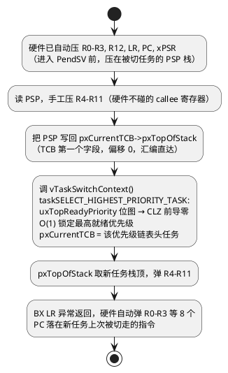

# 06-源码分析

> 一句话定位：tasks.c/queue.c/list.c 文件地图、PendSV 切换现场逐行走读、就绪位图 O(1) 选人与调度器启动流——把前五篇的黑盒从源码侧合上。
> 等级：L2 ｜ 前置：[05-内存管理heap方案对比](05-内存管理heap方案对比.md)

## 核心概念

FreeRTOS 内核小到可以整读（核心三文件约万行）。所有魔法的一半在 `xPortPendSVHandler`（Cortex-M 端口）——一次任务切换的完整现场：

另一半魔法在 list.c：一切等待、就绪、超时结构都是同一套链表原语——读懂 list.c，tasks.c/queue.c 只剩业务组织。

## 详解

### 文件地图（走读入口）

| 文件 | 职责 | 走读起点 |
|---|---|---|
| `list.c` | 链表原语（~250 行） | `vListInsert()` |
| `tasks.c` | 任务/调度/Idle/统计，最大 | `xTaskCreate()` → `prvAddNewTaskToReadyList()` |
| `queue.c` | 队列+二值/计数/互斥量全家族（队列机统一实现） | `xQueueGenericSend()` |
| `timers.c` / `event_groups.c` / `stream_buffer.c` | 定时器守护/事件组/流缓冲 | `xTimerCreate()` 等 |
| `portable/[compiler]/[arch]/port.c` | 端口层：PendSV/SysTick/临界区 | `xPortPendSVHandler()` |
| `portable/MemMang/heap_x.c` | 五个堆实现（见 05 篇） | `pvPortMalloc()` |

版本口径：走读按 FreeRTOS-Kernel v10.x+（AWS 维护版）；老教材里的 V7.x/V8.x 文件划分略有出入（如 croutine.c 协程已边缘化）。

走读前三个准备：**①** 打开 `configASSERT` 与 `configUSE_TRACE_FACILITY`，断言是源码的"路标注释"，一炸就知道走到了哪层防线；**②** 认准三个全局锚点变量：`pxCurrentTCB`（当前任务）、`pxReadyTasksLists`（就绪表）、`xDelayedTaskList`（延时表）——调试器 watch 这三个，主线不迷路；**③** 对照 map 文件确认没裁剪（`configUSE_16_BIT_TICKS`、`INCLUDE_vTaskDelete` 等会把整段代码条件编译掉，找不到函数先查 config）。

### list.c：一把 xItemValue 排出所有优先级

`ListItem_t` 三件套：`xItemValue`（排序键）、`pvOwner`（回指 TCB）、`pvContainer`（宿主链表）。`vListInsert()` 按 `xItemValue` **升序**插入：挂就绪链表时 value=优先级（同优先级 FIFO 尾插）；挂延时链表时 value=**唤醒时刻 tick**——于是 `xTaskDelayUntil` 后链表天然按到期先后排好，SysTick 每拍只看链表头：`xListOfDelayedTask` 头部未到期即可整表跳过，**超时检查 O(1)**。这是"用数据结构换调度效率"的教科书案例；OSEK 生成代码里对应的计数器/报警堆按到期时间排序，思想同源。

### 就绪表：configMAX_PRIORITIES 与位图加速

就绪结构 = `pxReadyTasksLists[configMAX_PRIORITIES]`（每优先级一条链表）+ `uxTopReadyPriority`（当前最高就绪优先级游标）。选人两条路：

- 通用版（`configUSE_PORT_OPTIMISED_TASK_SELECTION=0`）：从 uxTopReadyPriority 往下扫链表是否空；
- 端口优化版（=1）：uxTopReadyPriority 当**位图**用，`31 - CLZ(uxTopReadyPriority)` 一条指令定位最高位——严格 O(1)，代价是 **configMAX_PRIORITIES ≤ 32**。

对照 OSEK：优先级数通常个位数，调度器直接查静态调度表；FreeRTOS 靠位图+链表把"任意动态优先级"做到了 O(1)——这也是 01 篇说"configMAX_PRIORITIES 别虚高"的源码原因（位图/链表数组随它线性长）。

### xPortPendSVHandler 逐行要点（Cortex-M）

结合核心概念图，四个必答细节：**①** 只压 R4-R11——R0-R3/R12/LR/PC/xPSR 由异常硬件自动压，软件只补硬件不管的那 8 个；**②** `pxTopOfStack` 是 TCB 第一个字段，汇编按偏移 0 直取，C 结构体布局参与 ABI；**③** PendSV 配成**最低中断优先级**——同一时刻最多挂起一次切换请求，多个调度点竞争自然去重，切换永不在 ISR 中途发生（对照 04 篇 FromISR 的"只登记不动手"）；**④** `BX LR` 返回时用的是 PSP（进程栈），EXC_RETURN 的 LSB 区分 MSP/PSP——新建任务的假栈帧就是按这个"待返回现场"摆的（回看 01 篇首次上 CPU 时序）。

### vTaskStartScheduler 启动流（从 main 到第一个任务）

1. `vTaskStartScheduler()`：挂起调度器与中断 → 创建 Idle（失败则 configASSERT，静态模式下内存由 `vApplicationGetIdleTaskMemory` 供给）→ `configUSE_TIMERS` 时建 Timer 守护任务；
2. `xPortStartScheduler()`：清 uxCriticalNesting 计数、配 PendSV/SysTick 为最低优先级（`configKERNEL_INTERRUPT_PRIORITY`）、开 SysTick；
3. `prvPortStartFirstTask()`：Cortex-M 经典实现触发 SVC 0（或直接恢复），从 MSP 切到任务 PSP；
4. 第一个最高优先级任务开跑——**main 的栈此后不再使用**（回落为 MSP 中断栈）。

对照 OSEK：`StartOS(AppMode)` 同样是"初始化调度器+跳进最高优先级任务"，只是 AUTOSAR 把 1~3 步全部生成进 StartupCode 不给你看。走读建议路线：`xTaskCreate` → `prvAddNewTaskToReadyList` → `vTaskDelayUntil` → `prvAddCurrentTaskToDelayedList` → `xPortSysTickHandler` → `xPortPendSVHandler`，一条"生-睡-醒-切"主线全通。

两个顺手要记的细节：带 FPU 的端口靠 `CONTROL.FPCA` 与 EXC_RETURN bit4 决定是否懒压 S 寄存器，任务栈必须 8 字节对齐（`configSTACK_DEPTH_TYPE` 对齐由内核处理）；ECLIC/其他架构端口把 PendSV 换成各自"最低优先级软中断"，思想不变——**看懂 Cortex-M 一个端口，其他端口只剩寄存器名不同**。

一句话收束本篇（也是整个 FreeRTOS 子目录）：tasks.c 管"谁在等什么"，queue.c 管"事件和数据怎么搬"，list.c 管"怎么挂得快找得快"，port.c 管"现场怎么换"——四个文件拼出前五篇所有概念，无他。

## 易错点与陷阱

1. **现象：手动把某中断向量改接 PendSV 优先级高于最低。原因：** 端口约定 PendSV 必须最低，改高后切换可能嵌套在别的 ISR 中途，现场保存错乱偶发硬错。**对策：** 端口配置神圣不可改；要自定义中断，走自己的向量并遵守 04 篇的双轨制。
2. **现象：CubeMX/HAL 或 bootloader 动过 MSP 后第一个任务启动即 HardFault。原因：** `prvPortStartFirstTask` 经典实现从向量表 0 项恢复 MSP 并校验，MSP/向量表被改则初始栈帧错位。**对策：** 保证启动链中向量表与 MSP 一致；自定义 bootloader 跳转后先设 SCB->VTOR 再起调度器。
3. **现象：走读时 vTaskSwitchContext 里变量全被优化没。原因：** pxCurrentTCB/uxTopReadyPriority 本身就是 volatile，O2/O3 下大量中间态寄存器化。**对策：** 用 FreeRTOS+Tracealyzer/SystemView 或 configASSERT 断点策略看事件流，别单步硬刚优化代码；TCB 用 watch 窗口盯实例。
4. **现象：开了端口优化选人后编译报错/越界。原因：** `configUSE_PORT_OPTIMISED_TASK_SELECTION=1` 时位图 32 位上限，configMAX_PRIORITIES 设了 64。**对策：** 要么 ≤32，要么回通用版；顺带记住该优化在 ARM 上靠 CLZ 指令，换架构看 portmacro.h 是否支持。
5. **现象：改源码加打印后偶发优先级错乱。原因：** 在 vTaskSwitchContext/链表操作处插了非原子日志，破坏"关中断内完成选人"的约定。**对策：** 内核区加探针只用挂跟踪宏（traceTASK_SWITCHED_IN）或环缓冲免锁写，不插 printf。
6. **现象：以为 queue.c 只管队列，找不到 xSemaphoreGive 实现。原因：** 二值/计数/互斥量全是队列机的宏马甲：`xSemaphoreGive`→`xQueueGenericSend`、`xSemaphoreTake`→`xQueueReceive`，互斥量只是带 `queueQUEUE_IS_MUTEX` 的特殊队列。**对策：** 走读从 `xQueueGenericCreate` 与 `xQueueGenericSend` 两条线进；03 篇的对象统一论在源码侧就是 queue.c 一个文件。

## 面试高频题

**Q：为什么任务切换放在 PendSV 里、还必须是最低优先级？**
答：切换要求"现场完整且不被打断地一次完成"。PendSV 设最低优先级后：(1) 多个调度点同时置位只挂起一次，天然去重；(2) 若置位时有更高中断在跑，PendSV 被推迟到所有 ISR 结束后尾链执行，切换永不在 ISR 中途插入；(3) 保存/恢复各只需一次 R4-R11 的压弹，开销恒定。这就是 04 篇 FromISR"只登记不动手"的底层支撑，对应 Cat2 ISR 退出时统一 dispatching 的思想。

**Q：FreeRTOS 怎么做到 O(1) 找最高就绪任务？**
答：两级结构：每优先级一条就绪链表 pxReadyTasksLists[prio]，配 uxTopReadyPriority 记录最高非空优先级。端口优化版把它当位图，`31-CLZ()` 一条前导零指令定位最高位，再取该链表头任务——与就绪任务总数无关。代价：优先级数≤32（位图字长）；通用版退化为从游标向下扫空链表，仍近似 O(1)（游标只降不升直到重置）。

**Q：一次完整上下文切换，哪些寄存器由谁保存？**
答：硬件自动：R0-R3、R12、LR、PC、xPSR（异常入栈，压在 PSP）；软件（PendSV 汇编）：R4-R11（callee-saved，手工压弹），TCB 只需存 pxTopOfStack 一个指针；FPU 端口下懒压栈再管 S0-S15/FPSCR（CONTROL.FPCA 标记）。恢复是对称的弹栈+BX LR。所以"上下文=8 硬件字+8 软件字"共 16 字（不含浮点）——这也是栈深推算的底层依据。

**Q：vTaskStartScheduler 到第一个任务执行之间发生了什么？**
答：建 Idle/Timer 任务→xPortStartScheduler 清临界嵌套计数、把 PendSV/SysTick 配成最低优先级、启动 SysTick→prvPortStartFirstTask 恢复 MSP（经典实现经 SVC 0）→切 PSP 到最高优先级任务的假栈帧→异常返回语义落到任务函数第一行。此后 main 栈退役为中断栈。对照 OSEK StartOS：步骤同构，差别只在 AUTOSAR 全由生成代码完成、FreeRTOS 允许你逐行走读。

## 延伸

- [01-任务管理](01-任务管理.md)：假栈帧如何让新任务"像从中断返回"一样起跑。
- [02-调度](02-调度.md)：四个调度点如何各自走到 PendSV。
- [上下文切换（L1 基础）](../../1-L1基础/RTOS通用原理/任务调度原理/02-上下文切换.md)：callee/caller 寄存器与切换开销原理侧。
- [调度模型（L1 基础）](../../1-L1基础/RTOS通用原理/任务调度原理/01-调度模型.md)：位图/链表就绪结构的通用模型。
- [07 区 Os 任务与调度](../../../07-AUTOSAR架构/2-L2进阶/系统服务栈/Os/01-任务与调度.md)：AUTOSAR 生成代码侧的调度表与 dispatch 对比。
