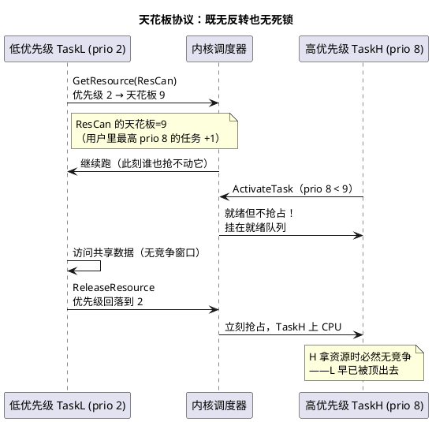

# 01-OSEK内核

> 一句话定位：汽车工业给"单核 MCU 上的硬实时"定下的静态内核标准——固定优先级抢占 + 资源天花板 + Alarm/Counter 模型，一切编译期定死，是 AUTOSAR OS 的直系祖先。
> 等级：L2 ｜ 前置：[01-前后台系统](../../1-L1基础/裸机与状态机编程/01-前后台系统.md)

## 核心概念

OSEK/VDX 是 1993 年起由德国车企（奔驰、宝马、大众等）联合制定的汽车电子开放式标准，名字是德语"车内电子开放系统及其接口"的缩写。它回答的问题只有一个：**怎么在几 KB RAM 的单核 MCU 上，做出时序可证明的实时系统？**

答案是一套设计哲学：**把一切动态性消灭在编译期**——任务静态创建、优先级静态分配、栈静态规划、对象数量静态定死。运行时内核没有任何"分配/查找/不确定性"，换来的是最坏情况可分析（WCRT/调度分析可算）、内存占用可预测——这正是车规功能安全喜欢的底子。

内核四要素：

| 要素 | 一句话 | 关键 API |
|---|---|---|
| Task | 静态任务，固定优先级抢占调度 | ActivateTask / TerminateTask |
| Event | 扩展任务的等待对象（每任务一组 bit） | SetEvent / WaitEvent / ClearEvent |
| Resource | 带天花板优先级的资源（互斥） | GetResource / ReleaseResource |
| Alarm/Counter | 时间触发：计数器到期触发动作 | SetRelAlarm / CancelAlarm |

伴生标准一句话：**OSEK OS 管调度，OSEK COM 管任务间/ECU 间通信（消息机制），OSEK NM 管网络休眠唤醒协调**——三者合称 OSEK/VDX 体系，后来分别进化为 AUTOSAR 的 OS、COM（→RTE 承接）与 Nm/ComM 方向。

调度模型一句话：**固定优先级、抢占式**——高优先级任务一旦被激活（就绪），立刻抢占当前低优先级任务；同优先级可选时间片轮转（配置项）。没有"动态优先级"，没有"就绪了排队等时间片"。

## 详解

### 任务：不是函数，是永不返回的实体

OSEK 任务由 OIL 配置（OSEK Implementation Language）静态声明，编译时生成任务控制块与栈。任务函数结构是定死的：

```c
TASK(Task10ms)
{
    /* 无参数、无返回值、不 return */
    CanIf_ReadRxData(&frame);
    App_Process(&frame);

    TerminateTask();        /* 唯一合法出口，通知内核"我跑完了" */
}
```

两类任务（一致性类别 BCC/ECC 的分界）：

| | 基本任务 Basic Task | 扩展任务 Extended Task |
|---|---|---|
| 能否 WaitEvent 阻塞 | 不能，从头跑到尾 | 能，可等待事件挂起 |
| 等待期间占栈 | 不占（单栈即可复用） | 占（每个扩展任务独立栈） |
| 典型用途 | 周期数据处理 | 事件驱动的长流程（如诊断会话） |

一致性类别（Conformance Class）是能力的"套餐档位"：BCC1（仅基本任务、每任务 1 个激活请求、1 事件）、BCC2（+多次激活排队、多任务同优先级）、ECC1（+扩展任务）、ECC2（全开）。项目按需选档，配置工具据此裁剪内核体积。

### 资源：天花板优先级协议（OSEK 的灵魂）

优先级反转和死锁，OSEK 用一条规则一起解决——**Immediate Priority Ceiling（立即天花板协议）**：每个 Resource 在配置期算出"天花板 = 所有可能使用它的任务的最高优先级"；任务 `GetResource` 的瞬间，优先级**直接提升到天花板**；`ReleaseResource` 时回落。



为什么能同时防两个经典问题：

- **防优先级反转**：持有资源的任务优先级 ≥ 所有潜在竞争者，中优先级任务也插不进来（传统优先级反转里"第三方插队"的路径被堵死）；
- **防死锁**：任务持有资源时优先级已顶到天花板，任何能和它成"环"的任务（必然要用同一批资源、优先级不高于天花板）根本无法运行，等待图成不了环。

代价：中优先级任务也被短暂挡住（天花板提升是"宁可错杀"），所以临界区必须极短。

### Alarm/Counter：时间触发的标准形态

Counter 是计数器（通常由硬件定时器 tick 驱动，每 tick 一次 +1）；Alarm 挂在 Counter 上，配置"到期值 + 循环周期 + 动作"。到期动作四选一：激活任务 / 设置事件 / 增加另一个 Counter / 调回调。这正是[时间片轮询](../../1-L1基础/裸机与状态机编程/02-时间片轮询.md)里"软定时器表"的标准版本。

### 应用程序的形状：没有自由的 main

OSEK 程序从 `StartOS()` 进入（之前只有驱动初始化），到 `ShutdownOS()` 结束（通常由致命错误触发）。任务永不返回，也没有 `main()` 里的大循环——**循环即调度，调度即内核**。这是裸机思维到 RTOS 思维最需要翻转的一处。

### 与 FreeRTOS 逐点对比

| 维度 | OSEK OS | FreeRTOS |
|---|---|---|
| 任务创建 | 编译期 OIL 静态声明，禁止运行时创建 | `xTaskCreate()` 运行时动态创建（也可静态） |
| 调度 | 固定优先级抢占，无动态优先级 | 固定优先级抢占 + 可选同优先级轮转 |
| 互斥 | Resource 天花板协议（防反转+防死锁，代价小） | Mutex 带优先级继承（防反转，不防死锁） |
| 时间服务 | Alarm/Counter（静态配置到期） | vTaskDelay / 软件定时器（动态） |
| 内存 | 无堆、无动态分配，栈静态精确规划 | 默认堆分配（可改静态池） |
| API 形态 | 系统服务，错误码返回（E_OS_LIMIT 等） | 句柄式 API，返回 pdPASS/err |
| 出身 | 车规标准，认证友好，多家商业实现 | 开源参考实现，认证需自行包装 |
> 本目录讲内核原理与标准本质；"在 ECU 集成环境里怎么配任务/Alarm/Hook"的实操篇在 [07-AUTOSAR架构/系统服务栈/Os](../../../07-AUTOSAR架构/2-L2进阶/系统服务栈/Os/README.md)，两区分工互链。

## 易错点与陷阱

1. **现象：任务跑完后系统行为错乱甚至跑飞。原因：任务函数 `return` 了而没调 `TerminateTask()`**——内核不知道任务已结束，栈与控制块状态非法。对策：任务末行必须 `TerminateTask()`（或 `ChainTask()` 链接下一个任务）；部分实现的编译期检查可打开。
2. **现象：调用 `WaitEvent` 返回 E_OS_ACCESS 报错。原因：在基本任务（BCC 类别）里等待事件**——基本任务没有等待能力。对策：需要等待的任务必须配成扩展任务（ECC），代价是独立栈；或把等待逻辑改成"事件置位+重新激活"的轮询形态。
3. **现象：高优先级任务"随机"被延迟几百微秒。原因：`GetResource` 后某条提前 return/错误分支漏了 `ReleaseResource`**，天花板一直压着所有竞争者。对策：资源作用域严格包裹共享数据访问，用宏（进/出成对）或静态分析工具（如 Polyspace/PC-lint 自定义规则）强制配对。
4. **现象：连续两次 `ActivateTask` 后任务只跑了一次。原因：BCC1 类别下每任务只允许 1 个挂起激活**，重复激活返回 E_OS_LIMIT 被忽略。对策：需要排队就升到 BCC2/ECC2；或设计上保证激活源有节流，并用错误钩子记录 E_OS_LIMIT。
5. **现象：ISR 里调用任务级服务（TerminateTask/Schedule 等）系统报 E_OS_CALLEVEL。原因：OSEK 对"哪个服务能在哪类上下文调用"有严格表格**，Cat1/Cat2 中断里允许的只是子集。对策：查所用实现的服务调用上下文表；ISR 里只做 SetEvent/ActivateTask 一类许可操作。
6. **现象：共享数据偶发撕裂，但明明加了 Resource。原因：天花板配置错了**——天花板必须 ≥ 所有使用该资源任务的最高优先级，手改优先级后没重算。对策：天花板一律交给配置工具自动推导，不手填；改任务优先级后全量重新生成配置。

## 面试高频题

**Q：OSEK 为什么禁止动态创建任务？**
答：三个理由叠加——①确定性：对象全部静态后，调度最坏情况可数学分析（响应时间分析），满足功能安全对可预测性的要求；②内存：无堆即无碎片风险，栈可按任务精确分配，几 KB RAM 也敢规划；③认证：静态系统行为边界清晰，安全案例好写。代价是灵活性，但车控软件的负载在开发期就是已知的。

**Q：OSEK 的资源天花板协议如何同时防优先级反转和死锁？**
答：配置期给每个资源算出"所有潜在使用者中的最高优先级"作为天花板；任务获取资源瞬间优先级提升到天花板。持有期间任何竞争者（含中优先级第三方）都无法运行，反转无从发生；而死锁需要"环上每个任务都持有资源"，但先持有资源的任务已顶到天花板，环上其他任务根本调度不上来——等待图成不了环。代价是临界区内过度提升，故要求临界区极短。

**Q：基本任务和扩展任务的核心区别是什么？怎么选？**
答：扩展任务能调用 WaitEvent 进入等待态（挂起等事件），基本任务一旦激活必须从头跑到尾。等待能力带来栈成本：扩展任务等待时现场要保留，需独立栈；基本任务可共享栈。选型：周期性短活用基本任务；长流程事件驱动（诊断、网络管理）用扩展任务，并通过一致性类别（BCC/ECC）让内核裁剪到最小。

**Q：OSEK COM 和 OSEK NM 是干什么的？和 OS 什么关系？**
答：三者是 OSEK/VDX 标准族的分工：OS 管"CPU 上谁在跑"（调度/同步/定时）；COM 管消息通信——任务间和 ECU 间按消息机制收发（含信号打包、传输模式）；NM 管网络级休眠唤醒协调（节点间协商进睡眠）。在 AUTOSAR 里它们分别演进为 OS、由 RTE/COM 承接的通信、Nm/ComM——概念血统一脉相承。

## 延伸

- [02-AUTOSAR-OS扩展](02-AUTOSAR-OS扩展.md)：下一代怎么在 OSEK 之上加多核与分区；
- [任务与调度（07区配置篇）](../../../07-AUTOSAR架构/2-L2进阶/系统服务栈/Os/01-任务与调度.md)：同样的概念，换到集成工具里怎么落地配置；
- [事件与资源（07区配置篇）](../../../07-AUTOSAR架构/2-L2进阶/系统服务栈/Os/02-事件与资源.md)：Event/Resource 的 ECU 配置实操；
- [FreeRTOS](../FreeRTOS/README.md)：开源世界的镜像，对照着看静态与动态两种哲学；
- [调度模型（通用原理）](../../1-L1基础/RTOS通用原理/任务调度原理/README.md)：抢占调度与响应时间分析的通用理论。