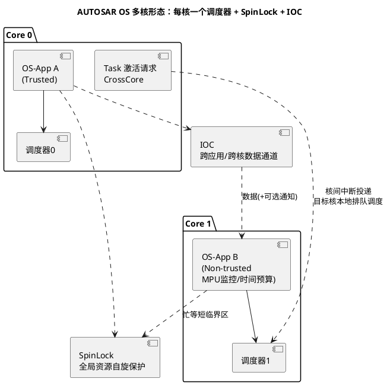

# 02-AUTOSAR-OS扩展

> 一句话定位：AUTOSAR OS = OSEK 内核 + 四件新行李——ScheduleTable、OS-Application 分区、多核 SpinLock/IOC、多源 Counter，把 90 年代的静态内核标准升级到多核与安全隔离时代。
> 等级：L2 ｜ 前置：[01-OSEK内核](01-OSEK内核.md)

## 核心概念

AUTOSAR OS 不是重写的内核，而是 **OSEK OS 的严格超集**：单核上你看到的任务/事件/资源/Alarm 与 [OSEK 内核](01-OSEK内核.md)一模一样；真正的增量是四件扩展，分别回应汽车电子的四个新现实——动力调度要严格相位、软件要分区容错、MCU 走向多核、时间源不止定时器一个：

| 扩展 | 回应的现实 | 一句话 |
|---|---|---|
| ScheduleTable | 动力总成等需要多任务严格相位同步 | 一张"节目单"上排好多个到期点，绝对刻度自动循环 |
| OS-Application | 软件来自多家供应商，要防互相拖垮 | 把 OS 对象分组封装成"应用"，可加内存/时间监控 |
| SpinLock + 多核 | Lockstep/并行多核成为主流（TC377 三核、S32K 双核） | 每核独立调度，核间用自旋锁护全局，IOC 传数据 |
| 多源 Counter | 时间不只来自定时器（曲轴角、GPT、外设计数） | Counter 可由多种硬件源驱动递增 |

这四件按"可伸缩等级"打包出售——**SC1~SC4**：

| 等级 | 内容 | 适用 |
|---|---|---|
| SC1 | ≈ OSEK（ECC1 级）任务/事件/资源/Alarm/钩子 | 传统单核小 ECU |
| SC2 | SC1 + ScheduleTable | 单核但相位要求高 |
| SC3 | SC1 + OS-Application（可含保护） | 需要分区/QM 混布 |
| SC4 | SC2 + SC3 全部 | 多核 + 分区，域控标配 |

## 详解

### ScheduleTable：从"单个闹钟"到"整张节目单"

Alarm 的模型是"设一个到期点，响了再设下一个"——两个任务要保证 1ms 相位差，得手工配两个 Alarm 且祈祷配置不漂。ScheduleTable 直接把**一串 expiry point（到期点）**排到一条绝对时间轴上：每个点带自己的偏移和动作（激活任务/设事件），整表跑完一个 duration 自动循环。效果：所有动作共享同一条时间基准，**相位关系由表结构保证，而非两个独立定时器的巧合**——曲轴同步调度（上止点后 10° 干 A、20° 干 B）的标准答案。

### OS-Application：分区容错的基本单位

把任务、ISR、Alarm、Counter 等对象划归一个 OS-Application（通常对应一个软件供应商或一个 ASIL 等级块）。两类身份：

- **Trusted**：全权限直接跑，不受监控（但也不设防）；
- **Non-trusted**：跑在 MPU 约束下，可配置**内存保护**（访问越界即错）与**时间保护**（执行时间预算、到达频率限制超限即错）。

出错不进默认处理，而是进 **ProtectionHook**，由应用决定杀谁（TerminateApplication）还是忽略——这是"免于干扰"（Freedom from Interference，QM 混布 ASIL 的法律基础）的 OS 侧落地。代价：Non-trusted 每次进出 MPU 域有开销，只给真正需要的模块用。

### 多核：每核一个独立的世界

AUTOSAR 多核不是"一个调度器管多核"，而是**每核一个完整调度器、核本地调度**：`ActivateTask` 指向他核任务时，请求通过核间中断投递到目标核，由目标核自己的调度器排队执行——激活"完成"不等于"开始跑"。三个配套件：

- **SpinLock**：保护核间共享的全局变量。多核下关中断只关本核的，护不住别的核——只能自旋忙等（临界区必须几十指令级）；`TryToGetSpinlock` 是非阻塞变体；持锁期间禁止调用绝大多数 OS 服务。
- **IOC**（Inter-OSApplication Communicator）：静态配置的数据通道（单向，可带通知），跨 OS-Application/跨核传数据——可以理解为"配置出来的安全全局变量 + 可选事件通知"。
- **Counter 多源**：Counter 的 tick 可以来自硬件定时器，也可以来自外设事件计数（如 GPT 通道、角度信号）——ScheduleTable 挂在"角度 Counter"上就是曲轴同步调度。

### Hook 家族速览（与 07 区分工）

ErrorHook/PreTaskHook/PostTaskHook/ProtectionHook/StartupHook/ShutdownHook 各自的触发时机与典型用途，[07 区 Hook 篇](../../../07-AUTOSAR架构/2-L2进阶/系统服务栈/Os/04-Hook.md)有配置实操；本篇只需要记住一句话：**ProtectionHook 是分区容错的决策点，其余是观测与兜底点**。
## 易错点与陷阱

1. **现象：跨核 ActivateTask 后，"激活成功"但目标任务迟迟不跑。原因：多核是核本地调度**——激活只是把请求投递到目标核，何时执行由目标核自己的就绪队列与优先级决定，还受核间中断延迟影响。对策：跨核关键路径做端到端实测，别拿"激活返回 E_OK"当"已执行"；高频跨核交互考虑改 IOC+本地任务。
2. **现象：持 SpinLock 期间调用 ActivateTask 等系统服务后系统报错或死锁。原因：规范禁止在持自旋锁时调用大多数 OS 服务**（可能引发核间等待与调度耦合）。对策：锁内只做纯内存的读改写，拿到结果就放锁，OS 调用全部挪到锁外；用工具的静态检查兜底。
3. **现象：Phase 又飘了、调度图解释不通。原因：Alarm 和 ScheduleTable 同时挂在同一个 Counter 上各自驱动任务**，两套到期逻辑叠加，相位管理失控。对策：一个时间源上选定一种机制统一管理；混合使用前先在工具里确认约束（通常要求显式声明）。
4. **现象：Non-trusted 任务频繁进 ProtectionHook 被杀。原因：时间/内存预算拍脑袋配的**，正常波动就超限。对策：预算来自实测 WCET 加统计裕量（先 Trusted 跑量化，再降级 Non-trusted）；ProtectionHook 里区分"预算不足"与"真跑飞"。
5. **以为软件分了 OS-Application 就有了隔离。原因：Trusted 应用完全不受监控**，分区保护只对 Non-trusted 生效。对策：安全相关的模块（ASIL）设为 Non-trusted 才能获得 Freedom from Interference 论证；Trusted 只给可信基础软件。
6. **现象：多核启动后核 1 空转。原因：各核 StartupHook/任务自启动配置遗漏**——多核下每个核都要有自己的启动链。对策：检查生成代码里各核的启动任务与 AppMode； ShutdownAllCores 与 ShutdownOS 的区别（全网关机 vs 本核）写进 checklist。

## 面试高频题

**Q：AUTOSAR OS 相比 OSEK 增加了什么？为什么是这些？**
答：四件扩展——ScheduleTable（多任务严格相位）、OS-Application 分区（供应商/等级间容错隔离）、多核支持（每核本地调度 + SpinLock + IOC）、多源 Counter（曲轴角等非定时器时基）。它们对应汽车电子的四个新现实：动力调度精细化、多源软件集成、多核 MCU 普及、时间源多样化。向下兼容 OSEK 单核形态（SC1）。

**Q：SC1 到 SC4 怎么选？**
答：按需缩放：SC1 等于 OSEK 基础形态，够用于传统单核小 ECU；SC2 加 ScheduleTable，给相位敏感的单核系统；SC3 加 OS-Application 与保护，给多供应商/QM 混布 ASIL 的场景；SC4 全开，多核域控的标准选择。选择由功能需求（相位、隔离、核数）倒推，配置工具据此裁剪内核体积。

**Q：ScheduleTable 相比 Alarm 的本质优势是什么？**
答：Alarm 是单点定时器，多个任务间的相位关系靠多个独立 Alarm 的配置巧合维持；ScheduleTable 把多个到期点（expiry point）放到同一条绝对时间轴上，相位由表结构硬性保证，duration 结束自动重复，还支持显式同步启动。凡"必须错开相位/贴准时序刻度"的调度（如曲轴角同步），ScheduleTable 是标准答案。

**Q：多核 AUTOSAR OS 里为什么用 SpinLock 而不是阻塞式互斥量保护核间共享数据？**
答：单核里互斥可以靠"关中断+必要时阻塞"，因为竞争者都在同一核上排队；多核下关中断只影响本核，护不住他核访问，而跨核阻塞（睡眠再唤醒）的代价远大于短临界区的自旋等待。所以核间共享的短临界区用 SpinLock 忙等（几十条指令级），配合"锁内禁止 OS 服务"的纪律；长的共享交互改用 IOC 或消息化设计。

## 延伸

- [01-OSEK内核](01-OSEK内核.md)：本篇扩展所依附的基座；
- [Alarm与ScheduleTable（07区配置篇）](../../../07-AUTOSAR架构/2-L2进阶/系统服务栈/Os/03-Alarm与ScheduleTable.md)：在集成工具里把节目单配出来；
- [多核OS（07区配置篇）](../../../07-AUTOSAR架构/2-L2进阶/系统服务栈/Os/05-多核OS.md)：核映射与启动顺序的实操；
- [Hook（07区配置篇）](../../../07-AUTOSAR架构/2-L2进阶/系统服务栈/Os/04-Hook.md)：ProtectionHook 决策逻辑怎么落地；
- [03-商业实现对比](03-商业实现对比.md)：这套标准被谁实现成了产品。