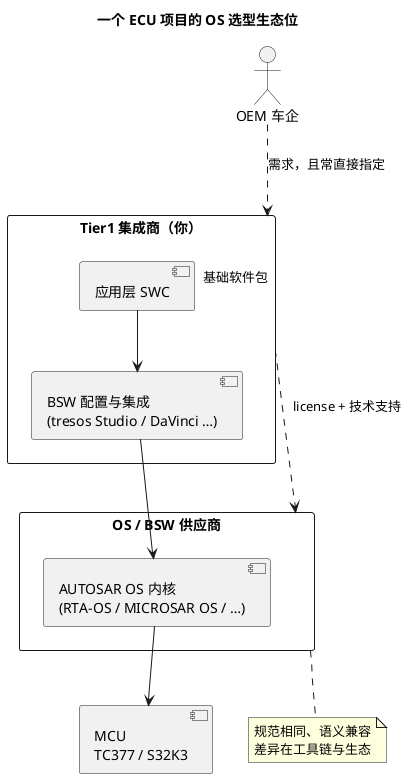

# 03-商业实现对比

> 一句话定位：OSEK/AUTOSAR OS 是一份规范文本，EB tresos、Vector MICROSAR、ETAS RTA-CAR 各自把它做成商品——内核语义跟着标准走、大同小异，真正决定日常体验与选型的是工具链、认证资质与 OEM 生态绑定。
> 等级：L2 ｜ 前置：[02-AUTOSAR-OS扩展](02-AUTOSAR-OS扩展.md)

## 核心概念

学的是标准，用的是产品。AUTOSAR OS 的 SWS（软件规范）定义了 API、语义与一致性等级，任何厂商都可以按规范实现并送认证——于是市面上存在多家"API 语义层兼容、配置工具层互不兼容"的商业内核。两个直接推论：

1. **换 OS 供应商 ≠ 重学一遍 OS**：`GetResource`/`SetRelAlarm`/`ActivateTask` 的语义跟着标准走；
2. **换 OS 供应商 = 重学一遍工具链**：配置界面、生成代码组织、Hook 默认行为、与编译器/MCAL 的集成方式一家一个方言——这才是集成工程师日常疼痛的来源。

## 详解

### 1. 三大主力一句话定位

| 产品 | 一句话定位 | 记忆点 |
|---|---|---|
| ETAS RTA-CAR（内核 RTA-OS） | 以 RTA-OS 为核心的整套 AUTOSAR 基础软件套件；RTA-OS 源自 OSEK 时代最老牌的实时内核脉络，主打极小 footprint 与时序可分析 | 车规 OS 的"学院派+极简风"；S32K1 时代 NXP 官方 AUTOSAR 路线就是它 |
| Vector MICROSAR | Vector 的 AUTOSAR 全家桶（BSW + 工具链），OS 只是其中一员，胜在 CANoe/DaVinci 工具生态闭环 | 买的不只是 OS，是一整套开发-仿真-测试-标定工作流 |
| EB tresos | Elektrobit 的 AUTOSAR 解决方案；tresos Studio 是业界事实标准的 BSW 配置 IDE，与 Infineon/NXP 合作深 | 配置工具出圈：不少项目 OS 用别家，配置界面仍是 tresos Studio |

**一个流传的记忆混淆要澄清**：偶尔有人把"SymmetricRTA"当第四家商业 OS——查无此产品，多半是 **SymTA/Symtavision 系调度分析工具**（做调度链/WCET 分析，后被 Luxoft 收购）与 **ETAS RTA** 的拼接记忆。同类值得认识名字的还有 SYSGO **PikeOS**（分区微内核/虚拟化管理程序，航电 ARINC 653 路线，不是 AUTOSAR OS）。

### 2. 选型考量：什么真正决定用谁

- **OEM 指定**：第一大因素。车企与 BSW 供应商的框架合同决定了选项集，Tier1 的"技术选型"常常只是走确认流程；
- **认证资质**：ISO 26262 各 ASIL 等级、已有认证与 proven-in-use 历史——三家主力的 OS 组件都能做到 ASIL D，差异在多核与安全岛场景的认证证据完整度；
- **芯片支持矩阵**：TC377/AURIX 上 EB tresos + AURIX MCAL 是 Infineon 官方主推组合，Vector MICROSAR 亦成熟支持；S32K3 上 NXP 官方 RTD 驱动 + EB tresos / Vector 两条集成路线并存（S32K1 时代官方方案是 ETAS RTA-CAR）；
- **工具链契合度**：项目重度使用 CANoe 做仿真测试 → Vector 加分；团队熟 tresos Studio → EB 加分；调度分析要求高（曲轴同步、端到端时序）→ ETAS 的时序分析传统加分；
- **footprint 与裁剪**：小 ECU（RAM 以 KB 计）上 RTA-OS 极简风优势明显；域控大内存下各家差异被稀释；
- **多核与安全岛**：域控多核项目重点核对——lockstep 核对、跨核 SpinLock/IOC 支持成熟度，以及安全岛（TC377 的 Lockstep 核、S32K3 的 HSE）场景下的认证证据完整度；
- **版本与生命周期**：AUTOSAR 版本（R19-11/R20-11/R22-11…）的跟进节奏、老工具链与新 MCU 支持的匹配、车型 10 年+生命周期内的维护承诺；
- **商务与支持**：license 计价模式（按项目/车型/ECU 数量）、本地 FAE 响应、长期维护承诺。

### 3. 工程师视角：换栈时迁移什么、重学什么

把"换 OS"拆开看是三层：概念层跟标准、工具层跟厂商、协作层跟团队——成本分布正好与直觉相反，最贵的不是概念。

**可迁移（跟标准走）**：任务/事件/资源/Alarm/ScheduleTable 语义、天花板协议行为、SC1~SC4 档位、错误码（E_OS_LIMIT 一类）。
**要重学（跟产品走）**：配置工具操作流（tresos Studio 的插件体系 vs DaVinci 的图形化配置器）、生成代码的目录与文件名约定、Hook 的默认实现与可定制点、多核启动顺序的配置项、编译与链接集成方式。
**正确姿势**：简历与面试讲"我按 OSEK/AUTOSAR OS 标准配过任务调度、资源与 Alarm"，补一句"用的是 XX 工具链，换家主要重学配置层"——展示标准理解+工具适应力，而不是背某家菜单。

### 4. 与 07 区的分工

本目录讲"内核原理与标准本质"；"在具体工具链里把 Os 配出来"（任务/Alarm/Hook/多核/启动流的实操）在 [07 区 Os](../../../07-AUTOSAR架构/2-L2进阶/系统服务栈/Os/README.md)——那边才是商业工具的实操现场，两区互链不重复。

## 易错点与陷阱

1. **现象：把 tresos Studio 当成 OS 本体。原因：配置工具太出圈**——tresos Studio 是配置 IDE，被配置的 BSW/OS 可以是别家组件。对策：分清"工具/内核/BSW 包"三层，看项目里各层 license 各属谁。
2. **现象：以为换 OS 供应商要重学调度与资源概念。原因：把标准与实现混为一谈**——对策：记住"API 语义跟标准、配置体验跟厂商"，迁移成本集中在工具链层。
3. **现象：选型只比功能表，落地后天天难受。原因：忽略 OEM 指定与团队工具存量**——对策：选型清单第一行写"OEM 框架合同允许谁"，第二行写"团队既有技能与 license"。
4. **现象：认证过的 OS 上线后仍出调度问题。原因：认证覆盖内核在符合规范配置下的行为，不背书你的配置正确性**——天花板没配照样反转。对策：配置评审 + 调度分析（响应时间/WCET）自己做，别把"产品认证"当"项目安全"。
5. **现象：把 PikeOS、QNX 一类与 AUTOSAR OS 混为同类。原因：都挂着"高安全等级 RTOS"标签**——对策：AUTOSAR OS 是规范+多家实现；PikeOS/QNX 是独立产品（常以 hypervisor/POSIX 形态出现在座舱），生态位不同。
6. **现象：小 ECU 选了全家桶方案后 Flash/RAM 吃紧。原因：套件默认组件全开，没按 SC 档位裁剪**——对策：按一致性等级与模块需求最小化配置，footprint 以目标芯片实测为准，不信宣传页数字。

## 面试高频题

**Q：AUTOSAR OS 有哪几家主流商业实现？各自什么特点？**
答：三大主力——ETAS RTA-CAR（内核 RTA-OS，OSEK 时代老牌脉络，极小 footprint、时序可分析传统强）；Vector MICROSAR（全家桶路线，OS 与 CANoe/DaVinci 工具生态绑定深）；EB tresos（tresos Studio 是事实标准配置 IDE，与 Infineon/NXP 合作紧）。实际选型中 OEM 指定、认证资质与团队工具存量的权重，往往高于内核功能表差异。

**Q：既然有标准，为什么换 OS 供应商还有成本？**
答：标准统一的是 API 与语义（任务/事件/资源/Alarm 行为、错误码、SC 档位），这部分可迁移；但配置工具操作流、生成代码组织、Hook 默认行为、多核启动配置、编译器与 MCAL 集成方式都是各家方言——集成工程师的迁移成本集中在工具链层，所以项目上"换 OS"被视为伤筋动骨的事。

**Q：商业 AUTOSAR OS 都认证过了，项目还需要自己做调度分析吗？**
答：需要。认证声明"内核在符合规范的配置下行为正确"，不背书你的配置（优先级、天花板、周期）与你的应用负载——优先级反转照样能在认证内核上发生。项目时序安全要靠响应时间分析、WCET 测量与配置评审；认证是地基，不是房子。

**Q：在 S32K 或 TC377 项目上，OS 生态怎么落位？**
答：S32K3：NXP 官方 RTD 驱动 + 商业 BSW（EB tresos 或 Vector 两条主流路线）；S32K1 时代官方 AUTOSAR 方案是 ETAS RTA-CAR。TC377/AURIX：EB tresos + AURIX MCAL 是 Infineon 主推组合，Vector MICROSAR 亦成熟。原则：跟着芯片厂官方支持矩阵与 OEM 指定走，自选空间通常不大。

## 延伸

- [02-AUTOSAR-OS扩展](02-AUTOSAR-OS扩展.md)：被这些产品实现的那个标准长什么样；
- [Os 区导读（07区）](../../../07-AUTOSAR架构/2-L2进阶/系统服务栈/Os/README.md)：集成工具里的配置实操专篇；
- [01-OSEK内核](01-OSEK内核.md)：所有这些产品的共同祖先语义；
- [RTX 概览](../../1-L1基础/RTX/01-RTX概览.md)：ARM 官方参考实现——另一种"标准+实现"关系；
- [VxWorks 概览](../VxWorks/01-VxWorks概览.md)：非 AUTOSAR 阵营的商业 RTOS 门牌。
