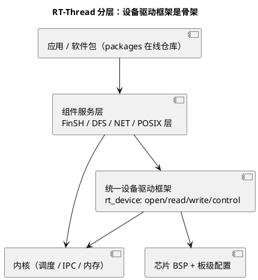

# 01-RT-Thread概览

> 一句话定位：国产开源 RTOS 的事实标准——内核中规中矩，真正的护城河是"设备驱动框架 + 软件包仓库 + 中文社区"这一整层生态；对 AUTOSAR 工程师的价值是看懂"一个嵌入式 OS 生态是怎么长出来的"。
> 等级：L2 ｜ 前置：[从前后台到RTOS-操作系统全景](../../00-入门导读/01-从前后台到RTOS-操作系统全景.md)

## 核心概念

RT-Thread 起于 2006 年，如今是国内 IoT/工控领域事实标准级的开源 RTOS。拆成两半看：

- **内核半**：固定优先级抢占 + 同优先级轮转调度，线程/信号量/互斥量（带优先级继承）/事件集/消息队列/邮箱/软件定时器/内存池——与 FreeRTOS 同一代价档位，无惊喜；
- **生态半（真正的差异）**：统一设备驱动框架、DFS 虚拟文件系统、FinSH 交互 shell、在线软件包仓库、RT-Thread Studio IDE、POSIX 适配层——**这套"内核之上的世界"才是它对标 Linux 生态叙事的本钱**。

## 详解

### 1. 设备驱动框架的直觉：把外设当文件用

核心一句话：**任何设备都是 `rt_device`，操作只有 open/read/write/close/control 五板斧**。`rt_device_find("uart1")` 拿到句柄，read/write 收发数据，control 下发波特率这类配置——与 Linux"一切皆文件"的直觉同宗，只是体量砍到 RTOS 级。

框架分三层，**换芯片只动最底层**：

| 层 | 干什么 | 例：串口 |
|---|---|---|
| 设备驱动框架层 | 通用逻辑、对应用的统一接口 | serial 框架：缓冲管理、轮询/中断/DMA 模式 |
| 芯片驱动层 | 对接具体外设寄存器 | 某 MCU 的 UART 驱动 |
| 板级配置 | 引脚、时钟、外设实例 | board.h 里启用哪个串口 |

对 AUTOSAR 工程师：这是 MCAL 之外的另一种"硬件抽象"答案——**用运行时对象模型而不是生成代码**做抽象；对照理解两种流派的取舍（灵活 vs 静态可分析），比背 API 有用。

### 2. 与 FreeRTOS 对比

| 维度 | RT-Thread | FreeRTOS |
|---|---|---|
| 定位 | "小 Linux"式生态型 RTOS | 纯内核，生态靠社区拼装 |
| 内核对象 | 动态/静态皆可，对象带名字可 find | 句柄式，动态为主（可全静态） |
| 设备框架 | 官方统一设备驱动框架 | 无（各芯片 SDK 自带简化封装） |
| 文件系统/网络 | 官方组件（DFS/LwIP/USB） | 无，自行集成 |
| shell | FinSH 交互命令行 | 无 |
| 工具链 | RT-Thread Studio + env/scons 裁剪 | CubeMX 类第三方 |
| 文档社区 | 中文一手资料 | 英文为主 |
| 车规存在感 | 弱（IoT/工控主场） | 强（含 SafeRTOS 商业姊妹线） |

### 3. 在汽车工程师知识版图上的位置

车规主业（TC377/S32K + AUTOSAR）的生产链路上没有 RT-Thread；读它的三个理由：①国产供应链语境下的备选认知；②设备驱动框架是理解"生态型 OS"的最小样本；③中文一手文档，有些 RTOS 概念在它的文档里反而最先看明白。点到即止，不深挖。

## 易错点与陷阱

1. **现象：按 FreeRTOS 心智平移使用，处处别扭。原因：对象模型不同**——设备/线程有名字、有注册表，find 出来的是框架对象不是裸句柄。对策：先接受"设备框架"世界观再动手。
2. **现象：裁剪配置改完不生效。原因：env/menuconfig 配置与 scons 构建缓存不同步**——对策：重新生成工程并确认 rtconfig.h 真的变了。
3. **现象：中断里调用会睡眠的 API 导致死机。原因：ISR 上下文限制同所有 RTOS**——对策：中断里只调"不睡眠"子集，数据经队列/事件交线程处理。
4. **现象：以为设备框架自动带来实时性与确定性。原因：框架层有缓冲与锁**——对策：硬实时路径（如曲轴同步）不走通用设备框架，直连驱动或裸寄存器。

## 面试高频题

**Q：RT-Thread 和 FreeRTOS 怎么选？**
答：纯内核能力两者同档（固定优先级抢占+轮转、IPC 家族齐全）；分水岭在生态与场景——需要设备驱动框架、文件系统、shell、软件包仓库、中文文档快速起步的 IoT/工控产品选 RT-Thread；需要最广芯片移植面、社区资源、安全认证路径（SafeRTOS 一脉）或团队已熟的自由组合选 FreeRTOS。汽车 AUTOSAR 项目里两者都属工具与认知属性。

**Q：RT-Thread 设备驱动框架的三层是什么？价值在哪？**
答：设备驱动框架层（rt_device 统一接口+通用逻辑）、芯片驱动层（具体外设寄存器对接）、板级配置层（引脚/时钟/实例）。价值是应用与芯片解耦：换 MCU 只替换底层，应用层 find/read/write 不动——用运行时对象模型实现了 Linux 风格的硬件抽象；代价是不如生成代码式抽象（AUTOSAR MCAL）静态可分析。

**Q：RT-Thread 的互斥量怎么处理优先级问题？**
答：互斥量带优先级继承——低优先级线程持锁时若高优先级线程来竞争，持有者临时抬升到竞争者优先级，堵住中优先级任务插队造成的反转；互斥量有持有计数、禁止在 ISR 中使用。这些设计与 FreeRTOS/AUTOSAR 同源，可对照记忆（AUTOSAR 更进一步用天花板协议连死锁一起防）。

## 延伸

- [FreeRTOS 区导读](../FreeRTOS/README.md)：对比表的另一半，开源主力；
- [01-OSEK内核](../OSEK与AUTOSAR-OS/01-OSEK内核.md)：车规静态流派的对照；
- [04-消息队列](../../1-L1基础/RTOS通用原理/同步与互斥/04-消息队列.md)：各家 RTOS 共用的 IPC 概念底座；
- [嵌入式Linux 区导读](../../3-L3高级/嵌入式Linux/README.md)：设备框架思想的"完全体"在 Linux 世界。
