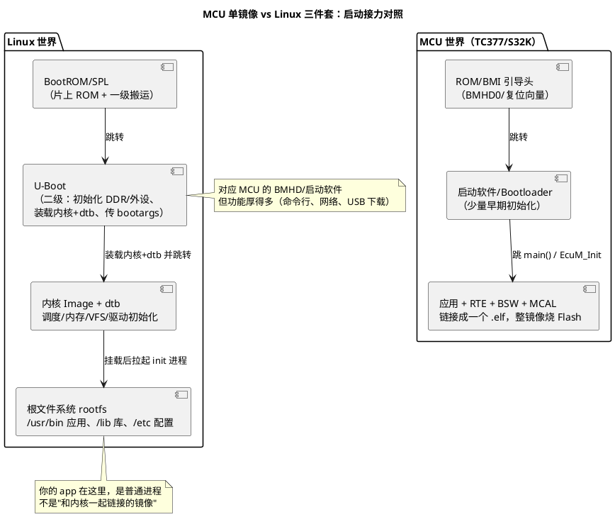

# 01-Linux基础

> 一句话定位：从 MCU"单镜像裸跑"世界跨进 Linux"内核 + 根文件系统 + 用户态"三件套世界——启动流程、host/target、交叉工具链与最小实操清单，一次建立坐标系。
> 等级：L2→L3 ｜ 前置：[从前后台到RTOS-操作系统全景](../../00-入门导读/01-从前后台到RTOS-操作系统全景.md)

## 太长不看

- Linux 系统不是"一个 bin"，而是 **BootLoader + 内核（Image + 设备树 dtb）+ 根文件系统（rootfs）** 三件套；你的应用只是 rootfs 里 `/usr/bin` 下的一个普通进程。
- 启动三段式：**U-Boot（两阶段搬运）→ 内核（自解压、初始化、挂载 rootfs）→ init/systemd（拉起用户态服务）**——和 MCU"复位 → BMI/启动软件 → EcuM → BswM→应用"是同构的分段接力，只是 Linux 的每一段都胖得多。
- **host/target 分离**：在 x86_64 开发机上交叉编译，产物到 aarch64 目标板运行——和你用 HighTec/GHS 编 TC377、用 S32DS 编 S32K 是同一件事，只是 Linux 把"工具链 + 目标库 + 头文件"打包成 sysroot。
- 用户态不能直接碰寄存器（MMU 隔离），硬件访问一律走 `/dev` 设备文件或驱动——MCU 里"想读就读"的直觉，在这里换一个 Segmentation fault。
- 实操三板斧：`ssh` 上板、`dmesg` 看内核打印、`ls /sys/class` 看驱动视角的硬件拓扑。
- **工程深入场景**：只有真正接手座舱/网关类 Linux 平台的 BSP 或驱动任务，才需要深入内核源码与构建细节；本篇只需建立"世界长什么样、命令会敲"的地盘感。

## 核心概念

MCU 与 Linux 的软件形态对照——你在 MCU 里熟悉的"一个 elf 烧进 Flash"，在 Linux 里被拆成三级接力：

## 详解

### 启动三段式，逐段对照 MCU

| 阶段 | Linux 干什么 | MCU（TC377/S32K）对应物 | 关键差异 |
|---|---|---|---|
| ① BootLoader | SPL 先初始化 DDR；U-Boot 再初始化关键外设、从 eMMC/SD/网络取内核镜像与 dtb，设好 `bootargs` 后跳内核 | BMI/BMHD 查启动源 → 启动软件（或 SBL）做少量初始化后跳应用 | U-Boot 有交互命令行与多种下载通道；MCU 引导只为"最快把控制权交出去" |
| ② 内核 | 自解压 → 架构初始化 → MMU/调度器/内存管理起来 → 按设备树 probe 驱动 → 挂载 rootfs | EcuM_Init：驱动各模块 init，OS 起，调度开始 | Linux 内核是"一个通用 OS"；MCU 侧"内核"只是静态配置的 AUTOSAR OS |
| ③ 用户态 | 执行第一个进程 init/systemd，按 target/服务依赖拉起守护进程，最后给你登录 shell | BswM 按 EcuM 状态机逐档点灯（RUN/POST_RUN），RTE 起来后应用 Runnable 被调度 | systemd 是"用户态的 BswM"——但它管的是进程树，不是 SWC |

一条主干记住：**U-Boot 负责把内核搬进 RAM，内核负责把世界建起来，init 负责把服务拉起来**——每一段只做"刚好能交给下一段"的事。

### host/target 与 sysroot

- host：你的 x86_64 开发机，跑编译器、构建系统；target：aarch64 目标板，跑产物。
- 交叉工具链命名即架构：`aarch64-linux-gnu-gcc`——"给 aarch64 Linux 目标用的 GNU C 编译器"，与 `tricore-gcc`、`powerpc-eabi-gcc` 同一套命名法。
- sysroot = "目标板的根目录快照"（目标架构的 libc、头文件、.so），链接器 `-Lsysroot/usr/lib`、头文件 `-Isysroot/usr/include` 都从里面找——相当于把 TC377 工程里"Infra/编译器自带库 + Mcal lib"的目录结构标准化了。
- 最小闭环：`aarch64-linux-gnu-gcc hello.c -o hello` → `scp hello root@板IP:~` → 板上 `./hello`。

### 目录速查（rootfs 一张图装下）

| 目录 | 放什么 | MCU 世界对应 |
|---|---|---|
| `/dev` | 设备文件（访问硬件的入口） | "外设实例表"，但按需创建/可动态增减（udev） |
| `/sys` | 设备/驱动的属性视图（sysfs） | 配置工具生成的"参数导出"，运行时可读可写 |
| `/etc` | 配置文件（文本） | 编译期写死的配置宏，这里改成"启动时读文件" |
| `/usr/bin`、`/lib` | 应用与库 | 你的应用 elf 与链接库，但按需加载、可单独替换 |
| `/proc` | 内核与进程状态 | 类似调试器看内核对象，但以文本文件形式 |

### 实操三板斧

1. `ssh root@<板IP>`——上板，等价于"接上调试器"，但不用停机；
2. `dmesg | tail -50`——内核环形缓冲区打印，驱动 probe 失败、设备树不匹配全在这看，等价于"看调试串口输出"；
3. `ls /sys/class/`、`lsmod`、`cat /proc/interrupts`——分别看设备拓扑、已装模块、中断占用——把"硬件在不在、驱动认没认"变成三条命令的事。

## 易错点与陷阱

1. **现象：交叉编译的应用上板运行报 `-sh: ./hello: not found`。原因：动态链接器路径是 host 的（或目标板缺 libc.so）**。对策：用 `file hello` 看解释器路径，确认板上存在该 `ld-linux-aarch64.so`；快速规避用 `-static` 静态链接。
2. **现象：用户态代码直接 `*(volatile uint32_t*)0xFE410000 = 1` 段错误。原因：MMU 下用户态对该物理地址无映射且无权限**——这不是"volatile 忘加"。对策：硬件访问走 `/dev/mem` + `mmap`（调试用）或正经驱动；生产代码必须走驱动。
3. **现象：改了设备树/内核没生效。原因：U-Boot 加载的是旧 dtb/镜像，或 bootargs 指向的分区不对**。对策：启动时按住任意键停在 U-Boot 命令行，`printenv` 看 `bootcmd/bootargs` 确认加载源；改完记得保存环境变量 `saveenv`。
4. **现象：把 Linux 当 RTOS 用，应用直接 while(1) 硬轮询 GPIO。原因：默认 Linux 是分时系统，普通进程随时被抢占且非实时**。对策：点即止——知道 PREEMPT_RT 补丁与 `SCHED_FIFO` 存在即可，硬实时任务的正确归处是 MCU（这就是域控"MCU+SoC"分家的原因）。
5. **现象：板起不来，串口一片空白。原因：串口波特率不匹配或看的不是 console 口**。对策：`bootargs` 里 `console=ttyS0,115200` 决定内核打印走哪；U-Boot 阶段打印由其自身配置决定——排查从"物理串口对不对"开始。
6. **现象：rootfs 挂载失败内核 panic（"not syncing: VFS"）。原因：bootargs 的 `root=` 指向与实际不符，或 rootfs 里没有对应文件系统驱动**。对策：先在 U-Boot 里 `ls mmc 0:2 /` 验证分区内容；内核 config 确认开了对应 fs（ext4/squashfs）。

## 面试高频题

**Q：Linux 启动流程简述，并类比 MCU 启动。**
答：上电 → 片上 BootROM（读启动介质）→ SPL/U-Boot（初始化 DDR 与外设，装载内核 Image+dtb，设 bootargs）→ 内核（架构/MMU/调度/驱动初始化，挂载 rootfs）→ init/systemd（拉起服务与 shell）。对应 MCU：复位 → BMI/BMHD 查启动源 → 启动软件/SBL → EcuM_Init 起 OS → BswM 点亮应用。两者都是"接力棒"结构，差别在每棒厚度：Linux 每棒都是可独立替换的组件，MCU 则最终汇成一个静态链接镜像。

**Q：为什么嵌入式 Linux 要用设备树，而不是像 MCU 那样把引脚配置写进代码？**
答：Linux 内核是"一份二进制跑所有板子"的通用内核，板级差异（哪个 I2C 接了什么器件、内存多大）必须以数据形式在启动时传给内核——这就是 dtb；MCU 的 AUTOSAR/裸机工程是"一个工程一个镜像"，配置编译期定死即可（Tresos/EB tresos 生成的静态配置）。设备树 = 把"编译期静态配置"挪到"启动期数据描述"，换取内核二进制的板级通用性。

**Q：用户空间和内核空间为什么要隔离？对驱动开发意味着什么？**
答：MMU 给内核与每个进程独立地址空间与权限位，用户态错误不会直接打崩内核，安全与稳定都靠这层隔离。对驱动意味着：应用与驱动之间数据传递必须显式跨界（copy_to_user/copy_from_user），不能直接传指针——这与 MCU"全系统一个平坦地址空间、指针随便传"是根本差异，也是移植 MCU 驱动逻辑到 Linux 时最容易踩的坑。

**Q：交叉编译时 sysroot 是什么，没有它会怎样？**
答：sysroot 是"目标架构根文件系统"的最小集合（libc、启动文件、头文件、库），交叉链接器把它当作查找根，保证链接到的是目标架构库而非 host 库。没有它：要么链接到 x86 库直接报架构错误，要么运行时找不到目标板的动态链接器；BSP 提供的工具链（如 Yocto 生成的 SDK）会自带正确 sysroot。

## 延伸

- [02-设备树](02-设备树.md)：bootargs 旁边那颗 dtb，节点与属性怎么读；
- [03-字符设备驱动](03-字符设备驱动.md)：`/dev` 入口后面的 file_operations 框架；
- [RTOS通用原理](../../1-L1基础/RTOS通用原理/README.md)：内核态调度/中断的通用理论，读 Linux 内核前的地基；
- [OSEK与AUTOSAR-OS](../../2-L2进阶/OSEK与AUTOSAR-OS/README.md)：MCU 侧"EcuM/OS"这条对照轴的另一半；
- [图表规范与模板](../../../00-总览/图表规范与模板.md)：本篇及后续 PlantUML 的画法规范。
