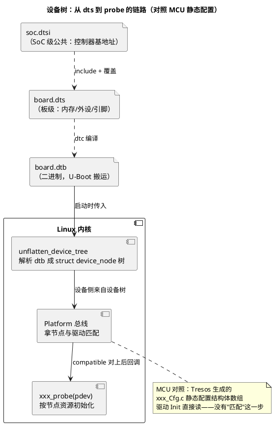

# 02-设备树

> 一句话定位：描述"这块板上有什么硬件、接在哪、参数几何"的启动期数据文件——Linux 用它把板级配置从内核代码里剥离，本质是"可编译的硬件 BOM 清单"，对应 MCU 世界的静态配置工具（Tresos/EB）生成的那一坨配置。
> 等级：L2→L3 ｜ 前置：[01-Linux基础](01-Linux基础.md)

## 太长不看

- 设备树 = **树形文本（dts/dtsi）→ 编译成二进制（dtb）→ 启动时随内核一起被 U-Boot 搬进内存交给内核**；内核据此决定"probe 哪些驱动、传什么参数"。
- 两大件：**节点**（硬件对象，如一个 I2C 控制器、挂在它下面的传感器）与**属性**（key = value，如 `compatible`、`reg`、`interrupts`、`clocks`）；节点间的父子关系 ≈ 总线的挂载关系（谁挂在谁的下面）。
- 匹配规则一句话：**驱动的 `of_match_table` 里的 compatible 字符串与设备树节点的 `compatible` 属性一致 → 该节点的驱动 probe 被调用**——"报暗号对上才握手"。
- dts/dtsi/dtb 关系：`.dtsi` 是公共片段（SoC 级）被 `.dts`（板级）`/include/` 或 `#include` 引入并覆盖，`dtc` 编译成 `.dtb`——和"公共配置被具体工程覆盖"一个思路。
- **工程深入场景**：接手 BSP/驱动任务才需要手写节点与 `of_` API；本篇目标是"拿到一块板的 dts 能看懂结构、能判断一个外设为什么没被识别"。

## 核心概念



## 详解

### 节点与属性：一段 dts 拆开看

```dts
&i2c1 {                      /* 引用 SoC dtsi 里已定义的 i2c1 控制器节点 */
    status = "okay";         /* 打开它（dtsi 里默认常是 "disabled"） */
    clock-frequency = <400000>;

    temp_sensor@48 {         /* 子节点：挂在 i2c1 上的器件，@后是总线地址 */
        compatible = "ti,tmp102";   /* 暗号：驱动靠它认领本节点 */
        reg = <0x48>;               /* I2C 从机地址（总线上下文不同含义不同） */
    };
};
```

高频属性一张表：

| 属性 | 含义 | MCU 世界对应 |
|---|---|---|
| `compatible` | "谁认领我"的暗号（厂商,型号） | 模块实例与驱动代码的绑定（一个 Mcal 模块一份配置） |
| `reg` | 地址资源：总线地址或 `<起始 地址长度>` | 外设基地址定义（如 `_TC020_GTM_BASE`） |
| `interrupts` | 中断号 + 触发类型 | IRQ 宏 + 优先级/极性配置 |
| `clocks` / `pinctrl-0` | 引用的时钟/引脚控制器节点 | Mcal 的 Clock/Port 初始化配置 |
| `status` | "okay"/"disabled"——开关这个节点 | 配置工具里勾/不勾该模块 |

### compatible 匹配：驱动侧的另一半

设备树只是"自报家门"，认领发生在驱动里：

```c
static const struct of_device_id tmp102_of_match[] = {
    { .compatible = "ti,tmp102" },
    { }
};
MODULE_DEVICE_TABLE(of, tmp102_of_match);

static struct i2c_driver tmp102_driver = {
    .probe_new = tmp102_probe,
    .id_table  = tmp102_ids,
    .driver    = { .of_match_table = tmp102_of_match, ... },
};
```

匹配顺序直觉：**节点 compatible 从前往后、与驱动表从前往后，第一个对上的组合生效**；同一 compatible 被多个驱动声明时会撞车（dmesg 里能看到谁赢了）。

### dts / dtsi / dtb 与覆盖语法

- `.dtsi`：SoC 厂商提供，描述 SoC 自带控制器（地址、中断号），板上未必全用——所以默认很多 `status = "disabled"`；
- `.dts`：板厂/你写的板级文件，include dtsi 后做三件事：**开节点（status）、挂子器件（新节点）、改参数（覆盖属性）**；
- 引用与覆盖：`&i2c1 { ... }` 表示"找到 i2c1 那个节点，往里面追加/覆盖"——这就是设备树的"继承 + 重载"；
- `.dtb`：`dtc -I dts -O dtb board.dts -o board.dtb`，二进制紧凑格式，U-Boot 搬运、内核解析；
- 反查工具：`fdtdump`/`dtc -I dtb -O dts` 把板上正在用的 dtb 反编译回 dts——**排障第一步永远是"看内核实际收到的树"，而不是看你以为的那份 dts**。

### 与 MCU 静态配置的哲学差异

| 维度 | 设备树 | MCU 静态配置（Tresos/EB 生成） |
|---|---|---|
| 形态 | 数据文件，与内核二进制分离 | C 代码/结构体，与应用一起编译 |
| 生效时机 | 每次启动由内核解析 | 编译期固化，上电即定 |
| 换板成本 | 同一内核 + 换 dtb | 换工程重新生成配置、整体重编 |
| 检错方式 | 启动时 dmesg / `make dtbs W=1` 警告 | 编译期类型检查 + 配置工具校验 |
| 本质动机 | 内核通用化（一份 zImage 走天下） | 极致确定性（车规不需要运行时解析） |

## 易错点与陷阱

1. **现象：驱动编好了、器件也在，probe 死活不进。原因：节点 `status = "disabled"` 没打开，或 compatible 拼写与驱动表不一致**。对策：`ls /proc/device-tree/i2c1/` 看内核收到的节点与属性值；对照驱动 `of_match_table` 逐字符比 compatible（大小写、横线下划线）。
2. **现象：改了 dts 重新编译，板上行为不变。原因：U-Boot 加载的还是旧 dtb 分区内容，或没更新 boot 分区**。对策：确认写入了正确分区/路径；上板 `fdtdump` 反查正在用的 dtb 验证——"以板上为准，不以工程目录为准"。
3. **现象：两个不同 i2c 器件的节点都写了 `reg = <0x48>`，后写的不生效。原因：同一总线控制器下从机地址冲突，内核只认先到的**。对策：改硬件地址或排查器件实际接线；这是"软件树与硬件实际不符"类问题，dmesg 常有 `failed` 提示。
4. **现象：节点里 `reg = <0x48>` 编译报错。原因：`reg` 的含义由父节点 `#address-cells/#size-cells` 决定**——I2C 子节点是 1 个 cell（地址），平台设备常是 `<起始 长度>` 2 个 cell。对策：看父节点的 cells 声明再写 reg；这是新手最常翻车的语法点。
5. **现象：同 SoC 两个板，dtsi 里改的属性把另一个板也改了。原因：直接改了公共 dtsi 而不是在板级 dts 里覆盖**。对策：SoC 公共内容进 dtsi，板级差异一律在自己 dts 里用 `&节点 {}` 覆盖——改公共文件前问一句"这真是 SoC 属性吗"。
6. **现象：pinctrl 都配了，GPIO 还是读不到。原因：引脚复用节点没被引用（`pinctrl-names/pinctrl-0` 缺失）或被别的功能占了**。对策：`cat /sys/kernel/debug/pinctrl/pinctrl-handles` 看引脚占用；对照 pinmux 表确认复用值。

## 面试高频题

**Q：设备树解决什么问题？没有它之前 Linux 是什么样子？**
答：解决"板级硬件描述硬编码进内核"的问题。早期 ARM Linux 每块板在内核里堆一大坨 `machine_init` 板文件，内核膨胀且无法通用；设备树把"板长什么样"变成与内核分离的启动期数据（dtb），同一内核配不同 dtb 即可跑不同板。代价是引入一层间接性与运行时解析——这正是 MCU 车规软件宁可静态配置也要避免的东西，两边是各自的场景最优解。

**Q：dts、dtsi、dtb 三者关系？**
答：dtsi 是公共片段（SoC 级控制器描述），dts 是板级文件，通过 include 引入 dtsi 并用 `&label {}` 覆盖/追加板级差异；dtc 把 dts 编译为二进制 dtb，由 U-Boot 加载并传给内核解析成 struct device_node 树。类比：dtsi ≈ 平台基础配置包，dts ≈ 具体工程对其的差异化覆盖，dtb ≈ 编译产物（像 elf 之于源码）。

**Q：compatible 匹配的完整链路是什么？**
答：内核解析 dtb 得到设备节点（含 compatible 属性）→ 总线（platform/i2c/spi）把节点包装成 struct device 挂到自己的设备链 → 与已注册驱动的 of_match_table 里的 compatible 逐一比对 → 命中则调用驱动 probe，节点资源（reg/interrupts/clocks）转为 platform_resource 传给驱动使用。一句话：**设备树声明"我是什么"，驱动表声明"我认领什么"，总线做撮合**。

**Q：为什么排障要反编译板上的 dtb 而不是看 dts 源码？**
答：板上实际生效的 dtb 取决于分区内容、U-Boot 加载路径、以及编译时的 include/覆盖链，任何一环出错都会让"源码与实物"不一致；`dtc -I dtb -O dts` 或 `/proc/device-tree` 反映的是内核真实拿到的树，是唯一可信的事实源——这和 MCU 上"以寄存器实际值为准，别信配置工具界面"是同一条纪律。

## 延伸

- [03-字符设备驱动](03-字符设备驱动.md)：节点被认领之后，驱动怎么长出 `/dev` 入口；
- [04-Platform驱动](04-Platform驱动.md)：platform 总线与 probe 时序的完整展开；
- [01-Linux基础](01-Linux基础.md)：dtb 在启动三段式中的位置与传递方式；
- [MCAL与外设驱动](../../../04-MCAL与外设驱动/README.md)：MCU 侧"静态配置生成代码"的做法，两边对照看哲学差异；
- [图表规范与模板](../../../00-总览/图表规范与模板.md)：本篇 PlantUML 的画法规范。
