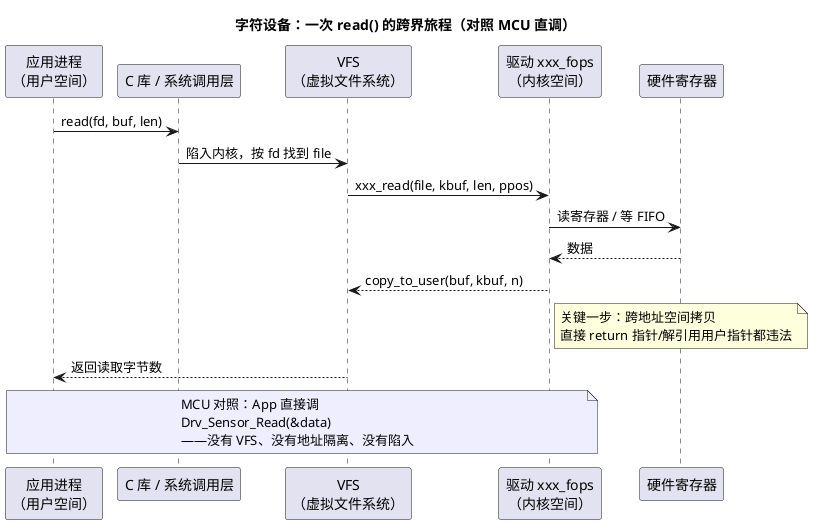

# 03-字符设备驱动

> 一句话定位：Linux 驱动最经典的骨架——把一个硬件包装成 `/dev/xxx` 字节流设备，应用用 open/read/write/ioctl 访问；对照 MCU"外设驱动 + 应用直调"，差异全在"中间隔了一个内核与一个文件接口"。
> 等级：L2→L3 ｜ 前置：[02-设备树](02-设备树.md)

## 太长不看

- 字符设备 = **按字节流访问的设备**（串口、传感器、按键、LCD），与之相对的是块设备（按扇区、可随机访问，如 eMMC）；大部分自研驱动从字符设备起步。
- 骨架四步：**注册设备号（alloc_chrdev_region）→ 绑定 file_operations（cdev_init/add）→ 创建 /dev 节点（class_create + device_create，udev 自动出文件）→ 实现 open/read/write/ioctl/release**。
- 主次设备号：主号认驱动（一类设备一个），次号区分同类下的具体实例——像"模块号 + 实例号"，驱动里用 `MINOR(inode->i_rdev)` 区分多个同类器件。
- **跨界铁律：用户指针不能直接解引用**，内核与用户地址空间隔离，数据交换必须 `copy_to_user/copy_from_user`——MCU 里"指针传进驱动直接用"的习惯在这里就是事故现场。
- 用户态 ↔ 内核态三条路：**syscall 读写（常规数据）、ioctl（命令+参数，配置/控制类）、sysfs 属性（参数暴露成文件）**——选型口诀"数据走读写，控制走 ioctl，状态进 sysfs"。
- **工程深入场景**：真要写产品级驱动还涉及并发、中断下半部、DMA；本篇目标就是看懂一个最小驱动的全貌与边界纪律。

## 核心概念



## 详解

### 最小骨架代码（读懂比会写重要）

```c
static dev_t devno;                 /* 设备号：主+次 */
static struct cdev  mycdev;         /* 内核字符设备对象 */
static struct class *myclass;

static const struct file_operations my_fops = {
    .owner   = THIS_MODULE,
    .open    = my_open,
    .read    = my_read,
    .write   = my_write,
    .unlocked_ioctl = my_ioctl,
    .release = my_release,
};

static int __init my_init(void)
{
    alloc_chrdev_region(&devno, 0, 2, "mysensor"); /* 要 2 个次设备号 */
    cdev_init(&mycdev, &my_fops);                  /* 绑定操作表 */
    cdev_add(&mycdev, devno, 2);                   /* 挂入内核 */
    myclass = class_create("mysensor");            /* /sys/class/mysensor */
    device_create(myclass, NULL, devno, NULL, "mysensor0"); /* udev 出 /dev/mysensor0 */
    device_create(myclass, NULL, devno + 1, NULL, "mysensor1");
    return 0;
}
```

应用侧的样子（这就是"驱动即文件"）：

```c
int fd = open("/dev/mysensor0", O_RDWR);
read(fd, &val, sizeof(val));
ioctl(fd, MY_IOCTL_SET_RATE, 100);
close(fd);
```

### 主次设备号：模块号 + 实例号

- `dev_t` 高 12 位主号、低 20 位次号（MAJOR()/MINOR() 宏拆装）；
- 主号对应驱动（`cat /proc/devices` 查看），次号由驱动自己解释——一个驱动管 N 个同型器件时，`MINOR(inode->i_rdev)` 就是"这是第几个器件"；
- 这与 AUTOSAR 里"一个 Can 模块配置、多个 CanHardwareObject 实例"的"驱动+实例"结构同构，只是 Linux 把实例编号做进了设备号体系。

### file_operations 各回调的调用时机

| 回调 | 何时被调 | 典型活 |
|---|---|---|
| open | 应用 open() | 上电器件、初始化状态、清"已打开"标志 |
| read/write | 应用读/写 | 与硬件交互 + copy_to/from_user |
| unlocked_ioctl | 应用 ioctl() | 配置命令、小参数传递（速率、模式） |
| release | 应用 close()（引用计数归零） | 释放资源、断电 |
| llseek/poll/mmap | 应用 lseek/select/mmap | 按需实现（点即止） |

`inode` 与 `file` 的分工一句话：**inode 代表"设备这个客观存在"（一次注册一个），file 代表"一次打开会话"（open 一次一个）**——次设备号从 inode 取，私有状态挂 file->private_data。

### 用户态 ↔ 内核态：三条路对比表

| 通道 | 方向与形态 | 适用 | MCU 对照 |
|---|---|---|---|
| read/write（syscall） | 数据流，可大量 | 采样数据、日志流 | 应用周期调 Drv_Read 拿数据 |
| ioctl | 命令 + 小参数（`_IO/_IOR/_IOW` 宏编号） | 配置/控制/触发动作 | 调 Drv_SetBaudrate() 这类配置 API |
| sysfs 属性 | show/store 回调 + `/sys/.../xxx` 文件 | 状态查询、低频参数、给脚本/上层用 | 编译期配置参数，这里变成运行时可读写文件 |

ioctl 命令号规范：`_IOR(type, nr, size)` 把方向/类型/序号/参数大小编进一个 32 位命令字——避免"各家命令号撞车"，驱动与应用共享同一头文件定义。

### 与 MCU 外设驱动的结构性差异

| 维度 | MCU 外设驱动 | Linux 字符设备驱动 |
|---|---|---|
| 调用方式 | 应用/BSW 直接函数调用 | 经 VFS 的 open/read/ioctl 间接调用 |
| 地址空间 | 全系统平坦，指针直通 | 用户/内核隔离，copy_to_user 过界 |
| 实例管理 | 静态配置数组 | 设备号 + device 模型动态管理 |
| 并发保护 | 关中断 / 资源天花板 | mutex/spinlock/信号量（本篇不展开） |
| 出错影响 | 一个错全系统陪葬 | 最坏oops/复位该进程，多数错误可隔离 |

## 易错点与陷阱

1. **现象：驱动里直接把用户指针传给 `memcpy`（或 printk %s 打印它），偶发内核 oops 或数据错乱。原因：用户指针在内核地址空间不保证有效映射，且可能是恶意/失效地址**。对策：一律 `copy_from_user/copy_to_user`，这两个函数会做合法性检查并可缺页处理；ioctl 的参数用 `_IOR/_IOW` 带尺寸大小也是为了这一层安全。
2. **现象：驱动重复加载报 `File exists` 或设备号冲突。原因：上一次 rmmod 失败/没做出口清理，设备号与 class 没释放**。对策：init 里每步失败都要 goto 出口做逆序清理；exit 里 `cdev_del/unregister_chrdev_region/device_destroy/class_destroy` 成对出现——和 MCU"初始化失败要回滚已初始化模块"是同一条纪律。
3. **现象：`/dev/mysensor0` 出现了，open 却报 ENODEV/ENXIO。原因：设备号与 cdev 没对上，或 device_create 用的 devno 与 cdev_add 注册的不一致**。对策：`cat /proc/devices` 对主号，`ls -l /dev/mysensor0` 对主次号，逐位核对。
4. **现象：多个进程同时 read，数据偶发交错。原因：字符设备默认没有互斥，回调是并发重入的**——MCU 里靠"单任务调用"掩盖的问题在这里会暴露。对策：驱动内加 mutex（可睡眠路径）/ 自旋锁（原子上下文）；open 时 `test_and_set_bit` 实现单实例独占。
5. **现象：read 返回 0 或 -EFAULT。原因：copy_to_user 目标地址非法返回未拷贝字节数，被当成了成功值**。对策：检查返回值，非 0 转 `-EFAULT`；返回值语义要区分"正常读到 n 字节"与"错误码负值"。
6. **现象：应用 printf 能打出数据，`cat /dev/xxx` 却死循环。原因：read 对 EOF 语义没处理，cat 一直读到返回 0 才停**。对策：在 `*ppos` 越界或无数据场景下按语义返回 0（EOF）或 `-EAGAIN`（非阻塞）；理解 `cat` 这类通用工具对驱动的隐含契约。

## 面试高频题

**Q：字符设备和块设备的本质区别？**
答：访问粒度与寻址方式——字符设备按字节流顺序访问，不可随机寻址（串口、传感器、输入设备）；块设备按固定大小块随机访问，带缓存（eMMC、SD、磁盘）。内核侧两条独立框架：字符设备走 cdev/file_operations，块设备走 gendisk/bio。面试补一句：网络接口是第三类，不走文件接口，走协议栈收发。

**Q：copy_to_user 和 memcpy 有什么区别？为什么必须用它？**
答：三点——①地址空间：用户指针位于用户空间映射，内核态直接解引用可能缺页/非法，copy_to_user 通过显式异常表机制安全处理；②权限：它能捕获用户传入的坏地址并返回错误而不是 panic；③架构：某些架构需要特殊指令序列处理缓存一致性。本质是"跨 MMU 边界的数据搬运必须走受控通道"，与 MCU 无 MMU、指针全系统通吃的世界正好相反。

**Q：ioctl、sysfs、read/write 各适合传什么？举例说明。**
答：read/write 传数据流（传感器采样值、串口数据）；ioctl 传"命令+小参数"的控制语义（设置采样率、触发一次校准，`_IOW('t',1,int)`）；sysfs 暴露状态与低频配置为文本文件（`/sys/class/mysensor/mysensor0/sampling_rate`，shell 能直接 echo/cat）。选型口诀：数据走读写、控制走 ioctl、状态进 sysfs——三者对应 MCU 里"数据 API、配置 API、参数标定"三种用法。

**Q：file_operations 里 inode 和 file 两个参数各代表什么？**
答：inode 代表设备实体（注册时与设备号绑定，每个设备一份，次设备号从 `inode->i_rdev` 取）；file 代表一次打开会话（每次 open 一份，`file->private_data` 挂会话私有状态，引用计数归零才调 release）。类比：inode ≈ "这个硬件对象"，file ≈ "谁正拿着它的一次会话"——MCU 世界没有这层区分，因为那里"永远只有一个调用者"。

## 延伸

- [04-Platform驱动](04-Platform驱动.md)：把字符设备挂到 platform 总线，接上设备树匹配的完整形态；
- [05-内核模块](05-内核模块.md)：这段骨架代码如何编译成 .ko、动态装卸；
- [中断管理（通用原理）](../../1-L1基础/RTOS通用原理/中断管理/README.md)：read 里"等数据"背后的中断/同步理论；
- [MCAL与外设驱动](../../../04-MCAL与外设驱动/README.md)：MCU 侧驱动分层（Det/SchM/回调）与这里的 fops 分层对照；
- [图表规范与模板](../../../00-总览/图表规范与模板.md)：本篇 PlantUML 的画法规范。
