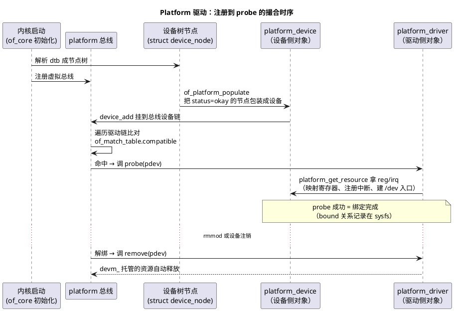

# 04-Platform驱动

> 一句话定位：Linux 驱动模型的枢纽——"总线-设备-驱动"三件套的撮合机制：设备（通常来自设备树）与驱动各自注册到 platform 虚拟总线，compatible 对上就调 probe——相当于把 MCU"配置表驱动的模块初始化"升级成"运行时自动撮合的组件装配"。
> 等级：L2→L3 ｜ 前置：[03-字符设备驱动](03-字符设备驱动.md)

## 太长不看

- 三角关系：**设备（struct device，"这块板上有什么"）+ 驱动（struct platform_driver，"我能操作什么"）+ 总线（撮合与生命周期管理）**；platform 总线是给"内存映射外设"准备的虚拟总线（非物理总线），设备树节点默认都挂它。
- 匹配主链路：**设备树节点 → platform_device → 总线拿 compatible 与驱动的 of_match_table 比对 → 命中调 driver.probe(pdev)**——probe 就是"装配车间"：映射寄存器、注册中断、建字符设备入口，一口气做完。
- probe 的资源全由 pdev 带来（`platform_get_resource` 取地址/中断，`devm_*` 系列托管释放）——**谁获取谁自动释放，rmmod/解绑不漏**，这是 Linux 版的"资源 RAII"。
- init 与 probe 的分工：init 只做"注册驱动本体"，probe 才做"绑上具体器件后的活"——类比 MCU：模块 Init 通用骨架 vs 通道级初始化，只是 Linux 把"哪个通道存在"交给设备树数据决定。
- **工程深入场景**：多实例器件、电源管理（runtime PM）、deferred probe 机制是产品级深水区；本篇目标看懂时序与 probe/remove 配对即可。

## 核心概念



## 详解

### 三角：总线为什么必须在场

物理总线（I2C/SPI/USB）天然回答"谁挂在谁下面"，但 SoC 内部外设（定时器、看门狗、内存映射控制器）没挂任何物理总线——Linux 造一个 **platform 虚拟总线**统一管理它们。总线在三角里的职责：

1. **撮合**：设备链与驱动链两两比对（compatible/id 表/name）；
2. **生命周期**：绑定/解绑回调（probe/remove）、引用计数、sysfs 拓扑呈现（`/sys/bus/platform/devices/`）；
3. **解耦**：同一驱动无需知道"有几个器件实例"，实例数量由设备侧决定——**改器件数量不用改驱动代码，改设备树即可**。

### 驱动侧最小骨架

```c
static int my_probe(struct platform_device *pdev)
{
    struct resource *res;
    void __iomem *regs;
    int irq;

    regs = devm_platform_ioremap_resource(pdev, 0);      /* 取 reg 并映射，remove 自动取消 */
    irq  = platform_get_irq(pdev, 0);                    /* 取 interrupts 第 0 个 */
    devm_request_irq(&pdev->dev, irq, my_isr, 0, "mydev", priv);
    /* ...初始化器件、注册字符设备入口（衔接 03 篇）... */
    return 0;   /* 失败返回负错误码，总线保留可重试机会 */
}

static int my_remove(struct platform_device *pdev)
{
    /* devm_ 拿的资源不用手工还；只清理自己 malloc 的东西 */
    return 0;
}

static struct platform_driver my_driver = {
    .probe  = my_probe,
    .remove = my_remove,
    .driver = {
        .name           = "my-driver",
        .of_match_table = my_of_match,   /* compatible 表，02 篇 */
    },
};
module_platform_driver(my_driver);       /* 一行替代 init/exit 注册样板 */
```

### probe 时序在整条启动链里的位置

设备树解析后（early），`of_platform_populate` 把顶层节点逐一实例化成 platform_device → 各驱动模块（内建或 insmod）注册到总线 → 匹配即 probe。所以**"probe 有没有跑"取决于三件事齐：节点 okay、compatible 对上、驱动已注册**——排查"器件没起来"就沿这三条查。

deferred probe 一句话：probe 里依赖的外设（时钟、 regulators）还没就绪时返回 `-EPROBE_DEFER`，总线记下稍后重试——解决"初始化顺序"问题，对应 MCU 世界"初始化顺序人工排序"的自动化版本。

### devm_：Linux 版资源托管

`devm_kzalloc/devm_ioremap_resource/devm_request_irq` 等函数把资源挂在 device 生命周期上：probe 失败或 remove 时**逆序自动释放**。对照 MCU：AUTOSAR 里 DeInit 全靠人工按依赖逆序调用、漏一个就泄漏或踩已释放内存——devm_ 用"设备对象析构"机制消灭这类手工配对。

### 与 MCU"配置驱动初始化"的对照

| 维度 | AUTOSAR/MCU 初始化 | Linux platform 模型 |
|---|---|---|
| 谁决定有哪些实例 | 配置工具生成静态数组 | 设备树节点（运行期数据） |
| 谁做初始化 | 各模块 Xxx_Init 按序调用 | 总线撮合后调 probe |
| 顺序问题 | 人工排 Init 次序 | 依赖声明 + deferred probe 自动重试 |
| 资源释放 | Xxx_DeInit 人工配对 | devm_ 自动托管 |
| 失败处理 | Det 报错继续跑 | probe 返回错误码，设备不绑定 |

## 易错点与陷阱

1. **现象：probe 没被调，`/sys/bus/platform/drivers/xxx/` 下没有设备绑定。原因：三缺一——节点 disabled、compatible 不匹配、驱动没编进/没 insmod**。对策：`dmesg | grep -i xxx`、`ls /proc/device-tree/` 查节点、`lsmod` 查驱动，沿三条链逐一排除。
2. **现象：probe 里 `platform_get_irq` 返回错误，但设备树里明明写了 interrupts。原因：父中断控制器节点没 okay，或 interrupts 的格式与父节点的 #interrupt-cells 不匹配**。对策：检查中断控制器链（GIC/pinctrl）各级 status 与 cells 声明；`cat /proc/interrupts` 看中断号是否已注册。
3. **现象：remove 时 oops 或资源泄漏。原因：probe 失败路径里手工获取的资源没释放，或混用 devm_ 与手工接口（先手工 request_irq 又 devm 释放）**。对策：统一 devm_ 家族；probe 内每步失败直接 return 负值，让总线+devm 处理善后；手工获取的资源自己 goto 逆序清理。
4. **现象：多个同型器件只 probe 了一个。原因：设备树节点都在，但驱动的 `of_match_table` 只写了一个 compatible 变体，或两个节点用了同一节点名+同地址被 dtc 合并**。对策：核对每个节点的 compatible 与单元地址（`@后面的数字`）唯一性；`ls /sys/bus/platform/devices/` 数设备个数。
5. **现象：驱动先于设备树节点可用就加载（如 initcall 早期），probe 空跑。原因：加载时序早于设备枚举**。对策：正常按 module_platform_driver 默认时序即可；自写 init 时确认注册时机在 of_platform_populate 之后；卡顺序的依赖用 `-EPROBE_DEFER` 表达而不是 sleep 硬等。
6. **现象：sysfs 里能看到设备但 `/dev` 入口没出现。原因：platform 驱动只做了硬件初始化，没建字符设备（没调 device_create/class_create）**。对策：回看 03 篇——platform 负责"撮合与资源"，`/dev` 入口仍需字符设备框架那一步，两者是叠加关系不是二选一。

## 面试高频题

**Q：platform 总线存在的意义？和 I2C/SPI 总线驱动的区别？**
答：platform 是给非物理总线设备（SoC 内部内存映射外设）的虚拟总线，统一享受"设备-驱动撮合、probe/remove 生命周期、sysfs 拓扑"的驱动模型红利；I2C/SPI 总线则既描述真实物理拓扑（谁挂谁），又有自己的 client/driver 结构——但它们的控制器本身也是 platform 设备。一句话：platform 是"根"，物理总线驱动是长在根上的枝。

**Q：probe 和 init 什么区别？为什么不把所有初始化都放 module init？**
答：module init 只负责"把驱动注册到总线"（声明我能干什么）；probe 是"驱动与具体设备绑定后"的初始化（针对这个实例映射寄存器、申请中断、建设备入口）。分开的收益：一份驱动管多个实例、实例数量由设备侧决定、未匹配的器件不消耗资源。对应 MCU：init≈模块通用骨架初始化，probe≈针对具体通道/器件的配置——Linux 把"实例"从代码里抽到了设备树数据里。

**Q：deferred probe 是怎么解决问题的？**
答：驱动间有依赖（先有时钟/电源/引脚配置，才有本器件）时，probe 若发现依赖未就绪返回 -EPROBE_DEFER，总线把设备挂入待重试列表，依赖方注册或就绪时统一重跑。它把 MCU 世界"人工排序 init 表"变成"声明式依赖 + 自动重试"，代价是启动时序不再严格线性（debug 时要知道这个语义）。

**Q：devm_ 系列函数解决了什么问题？举两个例子。**
答：解决资源获取/释放的人工配对问题：devm_platform_ioremap_resource（映射寄存器，remove 自动 iounmap）、devm_request_irq（申请中断，解绑自动 free_irq）。资源挂在 device 对象上，probe 失败或设备注销时逆序自动释放——把"忘了 DeInit"这类 MCU 常见泄漏从机制上消灭，代价是必须统一用 devm_ 家族、不能与手工接口混搭。

## 延伸

- [03-字符设备驱动](03-字符设备驱动.md)：probe 最后一步"建 /dev 入口"用的正是这篇的前置；
- [02-设备树](02-设备树.md)：platform_device 的数据源头，compatible 匹配细节；
- [05-内核模块](05-内核模块.md)：驱动如何以模块形态动态装卸、probe/remove 与 insmod/rmmod 的对应；
- [同步与互斥（通用原理）](../../1-L1基础/RTOS通用原理/同步与互斥/README.md)：probe 后运行期并发保护的地基；
- [图表规范与模板](../../../00-总览/图表规范与模板.md)：本篇 PlantUML 的画法规范。
