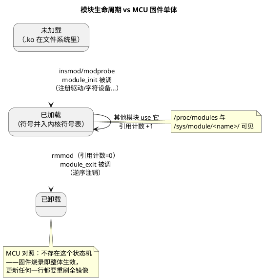

# 05-内核模块

> 一句话定位：Linux"运行时可插拔的内核功能件"——.ko 文件装进运行中的内核即生效，卸载即消失；与 MCU"整镜像编译烧录"相比，它把"改一个驱动要重刷全系统"变成"热插拔一个文件"，代价是内核态编程的所有限制都要背。
> 等级：L2→L3 ｜ 前置：[04-Platform驱动](04-Platform驱动.md)

## 太长不看

- 模块 = **带入口/出口的内核态代码包**：`module_init(xxx_init)` 加载时跑、`module_exit(xxx_exit)` 卸载时跑；`insmod`/`rmmod` 装卸，`modprobe` 会**自动带依赖**（先看 `modules.dep`），日常一律用 modprobe。
- 依赖声明：`EXPORT_SYMBOL(xxx)` 导出符号给别的模块用——内核没有动态链接器的全自动解析，符号表是显式导出制；这与 MCU"全部静态链接进一个 elf、符号天然全可见"完全两个世界。
- 模块参数 `module_param(name, int, 0644)`：insmod 时可传 `insmod xxx.ko rate=100`，并出现在 `/sys/module/xxx/parameters/`——**把"编译期宏配置"变成"加载期+运行期参数"**。
- 内核态编程三条军规：**没有 libc（只能用内核导出的函数）、栈很小（约 8~16KB，别放大数组）、出错不是 return 而可能是整机 oops**——调试期常配 panic_on_oops=0 换条命。
- 与 MCU 固件对照一句话：**MCU 是"一个不可分的固件单体"，Linux 是"内核 + 一堆可装卸模块"**——升级一个驱动不重刷内核，这是座舱 OTA 按"最小更新单元"拆包的底层支撑。
- **工程深入场景**：模块签名、版本魔数（vermagic）、GPL 许可与符号导出限制属于发布级问题；本篇目标会装卸、会传参、懂纪律。

## 核心概念



## 详解

### Hello World 最小模块

```c
#include <linux/module.h>
#include <linux/init.h>

static int rate = 10;
module_param(rate, int, 0644);              /* 0644=sysfs 可见可写（root） */
MODULE_PARM_DESC(rate, "sampling rate in Hz");

static int __init hello_init(void)
{
    pr_info("hello: loaded, rate=%d\n", rate);
    return 0;                               /* 非 0 = 加载失败，模块被丢弃 */
}
static void __exit hello_exit(void)
{
    pr_info("hello: unloaded\n");
}
module_init(hello_init);
module_exit(hello_exit);
MODULE_LICENSE("GPL");                       /* 不写则污染内核+失去 GPL 符号 */
```

加载与观察：

```
insmod hello.ko rate=100     # 或 modprobe hello rate=100（自动解依赖）
dmesg | tail                 # 看 pr_info 输出
lsmod                        # 已加载模块与引用计数
cat /sys/module/hello/parameters/rate
rmmod hello
```

### Makefile 与"两头编译"清单

```make
obj-m += hello.o             # obj-m=编成模块；obj-y=编进内核镜像
all:
	make -C /lib/modules/$(shell uname -r)/build M=$(PWD) modules
```

关键认知：**模块必须用"目标内核自己的构建树 + 配置"编译**——内核 ABI（结构体布局/内联函数）随版本与 config 变，vermagic 不符会拒绝加载。这与 MCU"驱动库必须用同一编译器版本与预编译库配套"同源，但 Linux 把检查自动化了。

### 依赖与符号：EXPORT_SYMBOL 制

- 模块 A 用模块 B 的函数：B 里 `EXPORT_SYMBOL(func)`（GPL 符号用 `EXPORT_SYMBOL_GPL`），A 正常声明并调用；
- `depmod` 扫描生成 `modules.dep`，`modprobe A` 时自动先装 B；`insmod A` 不会——依赖缺失直接报 `Unknown symbol`；
- 内核自身所有可导出符号在 `/proc/kallsyms`（root 可见真实地址）。

### 与 MCU 固件单体的结构性对照

| 维度 | MCU 固件（TC377/S32K） | Linux 内核模块 |
|---|---|---|
| 形态 | 全部静态链接成一个 elf | 内核镜像 + N 个 .ko 运行时拼装 |
| 更新粒度 | 整镜像重刷 | 单模块替换（甚至在线） |
| 符号可见性 | 全局符号天然互相可见 | 显式 EXPORT_SYMBOL 才可见 |
| 配置入口 | 编译期宏/配置工具 | module_param 加载期+sysfs |
| 失败代价 | 一个 bug 全系统陪葬 | oops 可能只死当前上下文（但常波及整机） |
| 版本耦合 | 编译器/库版本纪律 | vermagic/符号版本强校验 |

### 内核态编程军规（对照习惯差异）

1. **无 libc**：printf→pr_info printk、malloc→kmalloc/kzalloc、memcpy 可用但注意用户指针边界（03 篇）；
2. **小栈**：默认内核线程栈 KB 级，大缓冲进堆（kmalloc）或静态区；递归基本禁用；
3. **睡眠纪律**：持自旋锁/原子上下文（中断里）绝不能睡眠；能睡眠的路径用 mutex；
4. **出错哲学**：非法指针访问=oops（常带整机 panic），必须防御一切来自用户态的输入；
5. **许可证**：MODULE_LICENSE 不写或专有，将无法使用大量 `_GPL` 导出符号。

## 易错点与陷阱

1. **现象：insmod 报 `Invalid module format`。原因：vermagic（内核版本/config）不匹配——用了别的内核构建树编的 .ko**。对策：`modinfo hello.ko` 看 vermagic，与 `uname -r` 比对；开发板 BSP 源码树重编，别拿发行版内核头文件硬凑。
2. **现象：insmod 报 `Unknown symbol in module`。原因：依赖的模块没先装（其符号还没进内核符号表）**。对策：先 `depmod -a` 再 `modprobe`；确认提供方模块里有 EXPORT_SYMBOL，且许可证允许（专有模块拿不到 `_GPL` 符号）。
3. **现象：rmmod 报 `Module xxx is in use`。原因：引用计数非 0——别的模块依赖它或字符设备还被 open 着**。对策：`lsmod` 看 Used by 列；先关占用进程（`lsof /dev/xxx`）再卸；自己在 open/release 里做独占计数才可控。
4. **现象：模块里调 printf/sprintf 直接编译报错。原因：内核态没有 libc**。对策：打印用 `pr_info/pr_err/pr_debug`（ printk 系）；格式化用内核自带 `snprintf/kvasprintf`；不要 include 用户态头文件。
5. **现象：模块加载后整机偶发重启/卡死，且难以复现。原因：内核态小栈上放了 KB 级局部数组，或中断上下文里睡眠**。对策：大对象改 kmalloc；梳理睡眠路径（持锁范围）；开 `DEBUG_STACKOVERFLOW`/KASAN 类选项复现。
6. **现象：module_exit 里没清理，反复装卸几轮后系统资源耗尽。原因：出口函数只写了 pr_info，忘了注销字符设备/释放内存/中断**。对策：init 做过的每件事在 exit 逆序撤销；用 devm_（04 篇）能少一半手工配对。

## 面试高频题

**Q：insmod 和 modprobe 的区别？**
答：insmod 只做"把指定 .ko 塞进内核"，依赖模块缺失时报 Unknown symbol；modprobe 先查 modules.dep 依赖表，递归自动加载所有前置模块，还知道去标准目录（/lib/modules/`uname -r`/）按名字找文件。日常运维用 modprobe，内核启动期的内建模块则由配置 obj-y 直接编进镜像（不存在装卸问题）。

**Q：为什么模块必须用目标内核的构建树编译？vermagic 是什么？**
答：内核不保证 ABI 稳定：结构体布局、配置项（CONFIG_* 影响内联与结构大小）、导出符号都随内核版本与 config 变化；模块加载时校验 vermagic（版本号+架构+关键 config 串），不匹配拒绝加载，防止"看起来能跑实则内存踩踏"。这本质是把 MCU 工程"编译器/预编译库版本必须配套"的纪律自动化了。

**Q：module_param 机制和 MCU 的编译期配置宏相比，优劣各是什么？**
答：优点：不改代码不重编即可调参（insmod 传参/sysfs 运行时改，0644 权限控制），一份 .ko 适配多场景；缺点：参数是运行期状态，确定性与可追溯性弱于编译期定死的宏——出问题时必须确认"当时加载用了什么参数"（/sys/module/*/parameters 可查），车规场景更偏静态固化，这也解释了为什么 AUTOSAR 世界选择编译期配置。

**Q：内核模块编程和用户态编程最大的三点不同？**
答：①无 libc：只能调用内核导出的函数（k 系列接口），头文件与构建体系完全不同；②执行上下文危险：默认可能在中断/持锁等原子上下文，睡眠纪律严格，栈很小，错误代价是 oops/整机崩溃而非进程退出；③与内核强耦合：符号显式导出、vermagic 校验、许可证影响可用符号——模块是"住进内核房子里的客人"，要守主人的规矩。

## 延伸

- [06-系统移植](06-系统移植.md)：模块编进内核（obj-y）还是留 .ko（obj-m），是移植期的重要决策；
- [03-字符设备驱动](03-字符设备驱动.md)：最常见的模块内容形态——fops 框架；
- [任务调度原理（通用原理）](../../1-L1基础/RTOS通用原理/任务调度原理/README.md)：模块里的 kthread/工作队列背后的调度理论；
- [VxWorks](../../2-L2进阶/VxWorks/README.md)：另一个"内核可加载模块"（RTP/LKM）传统的对照样本；
- [图表规范与模板](../../../00-总览/图表规范与模板.md)：本篇 PlantUML 的画法规范。
