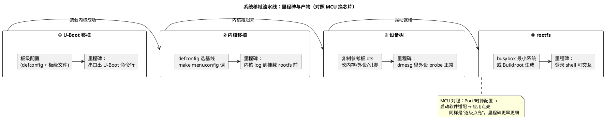

# 06-系统移植

> 一句话定位：把"U-Boot + 内核 + 设备树 + rootfs"三件套搬到一块新板上的标准流程——选参考板、改板级差异、逐级点亮（串口→DDR→Flash→内核→rootfs）；本质与 MCU"换一颗芯片重新配 Port/时钟、调启动软件"同构，只是每级都更厚、调试链更长。
> 等级：L2→L3 ｜ 前置：[05-内核模块](05-内核模块.md)

## 太长不看

- 移植四步流水线：**①Bootloader（U-Boot 适配 DDR/启动介质）→ ②内核（defconfig 选基线 + 驱动开关）→ ③设备树（板级 dts：内存/外设/引脚）→ ④rootfs（busybox 最小系统能登录）**——每步都有一条"里程碑输出"验证再走下一步。
- 黄金法则：**不要从零写，永远找最接近的参考板（同 SoC 或同家族）复制后改差异**——Linux 世界几乎每种主流板都有现成 dts/defconfig，"改"远快于"写"。
- 逐级点亮顺序：**串口打印 → U-Boot 命令行 → 内核启动 log → rootfs 登录 shell**——每一级的输出就是下一级的"示波器"，跳级调试等于盲飞。
- 与 MCU 移植对照：MCU 改的是"配置工具重新生成静态配置 + 启动软件适配"，Linux 改的是"dts 数据 + 内核 config + bootloader 板级文件"——哲学相同（改数据不改核心），粒度差三个数量级。
- **工程深入场景**：真做移植需要啃 SoC 手册、DDR 初始化与内存布局；本篇目标是理解流程与排障地图，知道每级"卡住了去哪看"。

## 核心概念

## 详解

### ① U-Boot：先把"串口 + DDR + 启动介质"点亮

- 输入是 SoC 厂商 BSP 里现成的 U-Boot；选 `make <板名>_defconfig` 后 `make menuconfig` 微调；
- 板级差异集中处：DDR 参数（时序/容量，厂商工具生成）、启动介质驱动（eMMC/SPI-NOR/NAND/网络）、串口 console 选择；
- 里程碑：串口看到 U-Boot 倒计时，按任意键进命令行——**能进 U-Boot 命令行，你就有了最强的调试工具**（`md/mm` 读写内存、`tftp` 网络下载、`fatls` 看分区、`bootm` 手动启动）；
- 关键环境变量：`bootcmd`（自动启动做什么：从哪搬内核+dtb、怎么跳）、`bootargs`（传给内核的命令行：`console=`、`root=`、`rootfstype=`）——移植排障一半时间花在 printenv/setenv 上。

### ② 内核：defconfig 基线 + config 裁剪

- `make ARCH=arm64 <参考板>_defconfig` 建立基线 → `make menuconfig` 增删（串口驱动、文件系统、网络、你的外设驱动）；
- 三种形态选择：驱动编进镜像（`obj-y`，启动即 probe）/ 编成模块（`obj-m`，rootfs 起来后 modprobe）/ 不编——**根文件系统所在介质的驱动必须编进镜像**（否则挂不了 rootfs，这是新手经典坑）；
- 里程碑：内核 log 滚动到 `VFS: Mounted root ...` 附近——卡在 `Starting kernel...` 说明镜像/入口地址/bootargs 问题，卡在挂 rootfs 前说明介质驱动或 root= 配置问题。

### ③ 设备树：板级 dts 逐项落地

- 复制同 SoC 参考板 dts，改四处：**内存大小（memory 节点）、启动介质分区、console 串口、你板上的外设（I2C/SPI 器件节点）**；
- 验证不是"编译过了"而是**板上 dmesg 里每个外设 probe 成功**（02 篇的反编译法在这里用上）；
- 里程碑：`ls /dev`、`ls /sys/bus/*/devices/` 与板上硬件一一对应。

### ④ rootfs：busybox 最小系统起步

- 最小 rootfs = busybox（提供 init/sh/常用命令的静态链接瑞士军刀）+ `/dev /etc /lib /proc /sys` 目录骨架 + 目标架构 libc；
- 先跑通 init=/bin/sh 或 busybox init；再上 systemd 或换 Buildroot/Yocto 生成的完整 rootfs（07 篇）；
- 里程碑：串口/ssh 登录 shell，`ps`、`ls`、`cat /proc/cpuinfo` 都活着——到这一步，移植闭环完成。

### 调试地图：卡在哪一级，看哪里

| 卡点 | 现象 | 首查 |
|---|---|---|
| 串口无输出 | 什么都没有 | 波特率/串口号/物理接线；JTAG 看 PC 指针 |
| SPL 后黑屏 | 串口出几个字符后停 | DDR 初始化参数；SPL 阶段打印 |
| U-Boot 死循环 | 反复重启 | bootcmd 指向的镜像不存在/损坏；`printenv` 排查 |
| 停在 Starting kernel... | 内核没起来 | 内核镜像格式（uImage/Image）与 bootm/booti 命令不匹配；dtb 加载地址；console= 参数 |
| 挂 rootfs panic | VFS not syncing | root= 设备号、文件系统驱动是否编进内核、分区内容 |
| probe 失败 | 某外设没起来 | dmesg 错误码；设备树 compatible/status（02/04 篇） |

### 与 MCU 移植的对照总结

| 维度 | MCU（TC377/S32K） | Linux 移植 |
|---|---|---|
| 配置主体 | Tresos/EB 静态配置 + Port/Clock 手册值 | dts 数据 + Kconfig 开关 |
| 启动适配 | BMI/BMHD + 启动软件/SBL | U-Boot 板级文件 + 环境变量 |
| 点亮顺序 | 串口打印 → 时钟/Port → 应用 | 串口 → U-Boot → 内核 → rootfs |
| 迭代周期 | 编译+烧录（秒~分钟） | 编译+网络/USB 烧写（分钟级，可只更新单件） |
| 排障手段 | 调试器断点/寄存器 | 串口 log + U-Boot 命令行 + dmesg |

## 易错点与陷阱

1. **现象：`Starting kernel...` 后彻底安静。原因：内核镜像类型与加载命令不匹配（uImage 要 bootm、纯 Image 要 booti、gzip 压缩镜像未解压流程不符），或 dtb/内核地址重叠互相踩**。对策：用 U-Boot 的 `booti`/`bootm` 对应正确镜像格式；检查 `bootcmd` 里 kernel/dtb/fdt 的加载地址不与 DDR 使用区冲突。
2. **现象：内核起来了但 `VFS: Unable to mount root fs` panic。原因：rootfs 所在介质（如 eMMC 的 ext4）驱动编成了模块或压根没开**——rootfs 都没挂上，模块自然没人加载。对策：menuconfig 把对应存储控制器与文件系统改成内建（`*` 不是 `M`）。
3. **现象：内核起来了但 console 无输出，板上其他都正常（心跳灯闪）。原因：bootargs 的 console= 串口节点或波特率与实际不符**。对策：设备树 chosen 节点与 bootargs 双处都要核对；用另一个已通的外设（如网口/LED）验证内核确实活着。
4. **现象：改了 dts 重新编译，现象纹丝不动。原因：烧写脚本写错了分区/地址，或 bootcmd 从别处加载 dtb**。对策：U-Boot 命令行手动 `fdt addr` + `fdt print` 看真正加载的 dtb 内容——先证明"新的没上去"再怀疑"新的是错的"。
5. **现象：换内存更大的板型后内核启动到一半随机崩溃。原因：memory 节点没改，内核只认识旧容量，越过声明区域踩到未映射地址**。对策：dts 的 memory 节点如实声明；DDR 初始化参数同步更新（U-Boot 与内核两处都要一致）。
6. **现象：rootfs 用开发机的文件直接复制，起来后大量命令 not found。原因：rootfs 里的二进制是 x86 架构或 glibc 路径不匹配**。对策：rootfs 全部内容必须来自交叉工具链 sysroot/目标架构构建产物；用 `file` 抽查 busybox 与 libc 架构。

## 面试高频题

**Q：把 Linux 移到一块新板，你的步骤是什么？**
答：先找同 SoC/同家族参考板做底子，然后逐级点亮：①U-Boot——适配 DDR 与启动介质，串口能进命令行；②内核——参考板 defconfig 起步，menuconfig 打开必需驱动（存储/console 内建），内核 log 能滚到挂 rootfs；③设备树——复制改板级差异（内存/外设/引脚），dmesg 验证 probe；④rootfs——busybox 最小系统能登录，再换完整构建产物。原则：每级用里程碑验证，绝不跳级；U-Boot 命令行是最重要的调试工具。

**Q：bootargs 里最关键的参数有哪些？各管什么？**
答：`console=ttyS0,115200` 定内核打印与登录终端；`root=/dev/mmcblk0p2 rootwait` 定根文件系统在哪（rootwait 等慢速介质就绪）；`rootfstype=ext4` 告知文件系统类型（对 ubifs/nfs 等非自识别类型尤其关键）；`init=/sbin/init`（或指定 bash）定第一个用户进程。对照 MCU：bootargs ≈ 启动软件传给应用的"启动配置参数块"，只是 Linux 把它标准化成了命令行字符串。

**Q：移植时驱动该编进内核还是做成模块？判断依据？**
答：判据是"rootfs 挂载前需不需要它"与"更新频率"：根文件系统介质驱动、console、内核跑起来的前置依赖必须内建（obj-y）；易变的外设驱动、实验性功能做成 .ko（obj-m），可在线装卸、替换不需重启。折中常见形态：核心链路内建 + 业务外设模块化——这也是车载 OTA"最小更新单元"的常见拆法。

**Q：为什么说 U-Boot 命令行是最重要的调试工具？举三个用法。**
答：它运行在"硬件已初始化、软件世界未建立"的位置，两头都能摸：①`md/mm` 直接读写物理内存/寄存器（类似连着调试器看外设寄存器，不用起内核）；②`fatls/fatload/tftp` 检查与更新启动介质内容，验证"烧写是否真的到位"；③`printenv/bootm` 手动控制启动参数与流程，逐项试错定位 bootcmd 问题——串口+U-Boot 就是 Linux 移植期的"调试器"。

## 延伸

- [07-Buildroot与Yocto](07-Buildroot与Yocto.md)：手工拼三件套满足不了量产，构建系统接管全流程；
- [01-Linux基础](01-Linux基础.md)：三件套与启动接力的底层图景；
- [02-设备树](02-设备树.md)：③ 阶段设备树改写的具体语法与验证方法；
- [MCAL与外设驱动](../../../04-MCAL与外设驱动/README.md)：MCU 侧"换芯片"移植的配置工作量对照；
- [图表规范与模板](../../../00-总览/图表规范与模板.md)：本篇 PlantUML 的画法规范。
