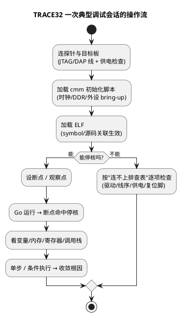

# 01-TRACE32

> 一句话定位：Lauterbach 的硬件调试器——经 JTAG/DAP 直连 MCU，断点、变量、内存、脚本一把抓，ECU 软件调试的"引擎盖扳手"。
> 等级：L1→L2 ｜ 前置：[从一个坏掉的ECU说起-调试全景](../../00-入门导读/01-从一个坏掉的ECU说起-调试全景.md)

## 原理

TRACE32 = PC 端 PowerView 软件 + Lauterbach 硬件探针（PowerDebug/Powertap）+ 目标板调试口。探针经 JTAG（传统）/DAP（AURIX 家族）把 PC 的命令翻译成对 MCU 的在线访问：**停核、读写寄存器/内存、设断点**。它看到的是"芯片此刻的真实状态"，不是软件仿真。

## 详解

### 1. 基础操作表（先会这七个就能干活）

| 操作 | 菜单/快捷键 | 干什么 |
|---|---|---|
| 断点 | Break.Set（双击源码行） | 停在指定行；软件断点改指令，硬件断点用 OCR/DSU 资源 |
| 单步 | Step / StepOver | 逐行/逐函数执行，看分支走向 |
| 看变量 | Var.View（鼠标悬停） | 查看/修改变量值，可加格式 `%x` `%d` |
| 看内存 | Data.dump 地址 | 按字节/字 dump 一段内存，找内存踩踏 |
| 看寄存器 | Register / Peripherals.cpu | 核心寄存器 + 外设寄存器 SFR 视图 |
| 调用栈 | Var.Frame / 栈回溯窗口 | 看谁调进来的，跑飞后第一现场 |
| 运行/停止 | Go / Break | 放核跑 / 手动停核 |

### 2. 常用命令清单（命令栏直接敲，脚本同款）

| 命令 | 用途 |
|---|---|
| `Break.Set 地址` | 设断点（加 `/ACCESS` 变读写观察点） |
| `Go` / `Break` | 运行 / 停核 |
| `Step` / `StepOver` | 单步进入 / 单步跳过 |
| `Var.Watch 变量` | 变量加入观察窗口 |
| `Var.Set 变量=值` | 强制改写变量（注入测试场景） |
| `Data.dump 地址` | 查看内存；`Data.Set 地址 %L 值` 改写 |
| `Data.LOAD.Elf xxx.elf` | 加载符号/源码关联 |
| `Data.SAVE.Binary 文件 地址++长度` | 导出内存镜像（喂脚本后处理） |
| `Map.Browse` | 看符号表/工程文件结构 |
| `Sys.Mode Attach` | 附加到已运行目标（不复位） |
| `Menu.print 文件.md` | 把窗口内容导出归档 |

### 3. 脚本化：*.cmm

同样这些命令写进 `.cmm` 文本就是脚本——TRACE32 的"自动化接口"。典型用法：

- **初始化脚本**：板上电后先跑 `flash.cmm`/`init_tc3xx.cmm`，完成时钟与调试接口 bring-up（Lauterbach demo 目录有各芯片模板，项目里改参数即可）；
- **批量采集**：循环 `Go` → 停核 → `Data.SAVE` 导一段内存，等效"低频逻辑分析仪"，抓偶发内存踩踏；
- **产线/自动化测试**：PRACTICE 脚本 + `ENTER` 自动化模式，与测试框架对接。

### 4. 多核调试一句

TC377 是三核（CPU0/1/2）：命令栏 `SYStem.CPU` 或窗口顶部的 core 选择框切换当前核；`MULTIcore` 视图可同时看多核状态、同步停核（对查核间共享内存竞争很关键）。

### 5. TRACE32 vs IDE 自带调试器

| 维度 | TRACE32 | IDE 调试器（AURIX Dev/Eclipse） |
|---|---|---|
| 资源占用 | 独立探针，几乎不占目标资源 | 走板载调试器/仿真器，偶有带宽限制 |
| 侵入性 | 硬件断点+停核，最小侵入；观察点不占 CPU | 断点同样停核，高级观察点支持弱一些 |
| 脚本化 | cmm/PRACTICE 成熟，产线标配 | 脚本能力弱或依赖 IDE 插件 |
| 崩溃现场 | 停核即现场，配合 Trap 定位是标配 | 现场保留能力一般 |
| 价格/门槛 | 商业授权贵、命令行门槛高 | 免费、上手快 |

日常分工直觉：**开发期用 IDE 快速迭代，疑难杂症/量产问题上 TRACE32**。

### 6. 常见"连不上"排查表

| # | 现象 | 优先查 | 对策 |
|---|---|---|---|
| 1 | 探针完全无应答 | **驱动/USB** | 设备管理器看 PowerDebug；重装 Lauterbach 驱动 |
| 2 | 能连探针，目标无响应 | **线序/接插件** | 对照原理图核对 TCK/TMS/TDI/TDO/TRST 顺序；杜邦线是否松动 |
| 3 | 目标供电不足 | **外部供电** | 探针一般不给目标供电，确认板子独立供电、电压档与探针设置一致 |
| 4 | 复位脚电平异常 | **复位脚/复位策略** | 冷启动被其他外设拉住；`SYStem.Mode Attach` 或改复位策略再试 |
| 5 | 偶尔能连、跑起来断 | **时钟/速率** | 降低 JTAG/DAP 速率；时钟未初始化前用低速连接 |

## 配置层/工程关联

- **三件套配套**：`hex/elf + map + cmm` 与软件版本严格对应——换一版软件必换一版 ELF，否则变量地址全错还"看起来能跑"；
- **cmm 入库**：初始化脚本、内存导出脚本随工程 Git 管理，新人克隆即可复现调试环境；
- **AUTOSAR 工程接入**：AUTOSAR 编译产物（ELF）里 RTE/BSW 符号齐全，TRACE32 可直接按模块名设断点（如 `Can_Write`、`PduR_CanIfTxConfirmation`），查通讯链路比加打印快；
- 与 [Trap定位方法](../../../02-芯片与体系结构/3-L3高级/异常与Trap/02-Trap定位方法.md) 配合：Trap 后停核，调用栈+寄存器现场就是定位的起点。

## 易错点与陷阱

1. **现象：变量值"明显不对"或地址飘。原因：ELF 与板上固件版本不匹配。对策：重新烧写+重载同一版本 ELF，map 文件核对地址。**
2. **现象：断点设不上或运行就丢。原因：Flash 里只能设硬件断点（数量有限），软件断点不可用。对策：删旧断点省 OCR 资源，或用 `Break.Set` 查硬件断点占用。**
3. **现象：停核后总线类问题反而"好了"。原因：停核改变了时序（报文超时、喂狗暂停）。对策：用观察点/条件断点代替频繁停核；跑飞类问题用 Trace 功能记录而非反复停。**
4. **现象：脚本换台电脑跑不动。原因：cmm 里写死绝对路径/盘符。对策：路径用 `%P`（脚本目录）相对化。**
5. **现象：多核下断点"不命中"。原因：断点设在 CPU0，代码跑在 CPU1。对策：先确认代码所在核（map/链接段），core 选择框切过去再设。**
6. **现象：修改变量"没生效"。原因：编译器优化把变量放寄存器，改的是内存旧副本。对策：volatile 化被测变量，或直接改寄存器值。**

## 面试高频题

**Q1：TRACE32 和 IDE 调试器怎么选？**
A：看三个维度——侵入性（硬件断点/观察点能力）、现场保留（停核即现场，配合 Trap）、脚本化（cmm 自动化、产线复用）。开发迭代用 IDE，疑难/量产问题用 TRACE32。

**Q2：软件断点和硬件断点的区别？**
A：软件断点替换指令（RAM 代码可用，数量不限，Flash 不可写所以不可用）；硬件断点用 OCR/DSU 地址比较器（数量有限但不改代码）。Flash 里的代码只能硬件断点。

**Q3：怎么用 TRACE32 抓偶发内存被改写？**
A：`Break.Set 变量 /ACCESS WRITE` 设写观察点，谁写谁停核，调用栈直接给出凶手；高频场景配合 `Data.SAVE` 批量导内存 + 脚本 diff。

**Q4：连不上目标板，你的排查顺序？**
A：一驱动（探针认不认）、二线序（JTAG/DAP 接对没）、三供电（目标板独立供电）、四复位脚（被拉住/策略）、五时钟与速率（降速连接）。由物理层往芯片层排。

## 延伸

- [DAP-JTAG-SWD](02-DAP-JTAG-SWD.md)——探针到芯片之间那几根线到底怎么工作；
- [串口与RTT](03-串口与RTT.md)——不停核的"旁路日志"，与 TRACE32 互补；
- [Trap定位方法](../../../02-芯片与体系结构/3-L3高级/异常与Trap/02-Trap定位方法.md)——停核之后怎么从 Trap 现场反推代码行；
- [CANoe](../../2-L2进阶/总线工具/01-CANoe.md)——调试器看程序内部，总线工具看线上报文，两把刀配合用。
